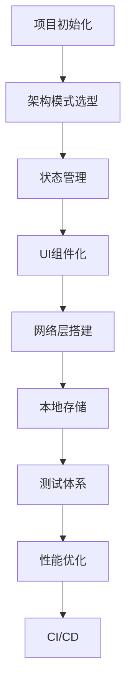
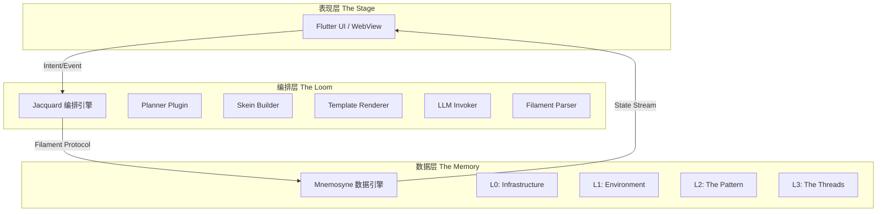
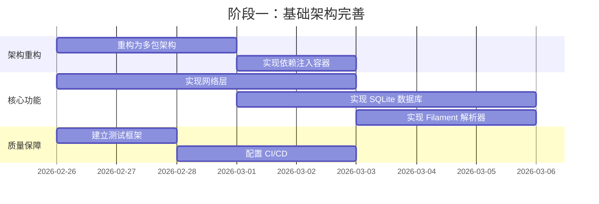
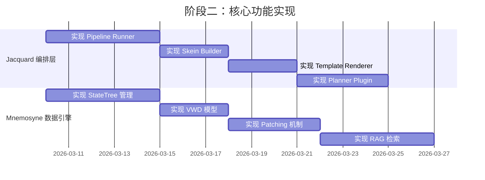
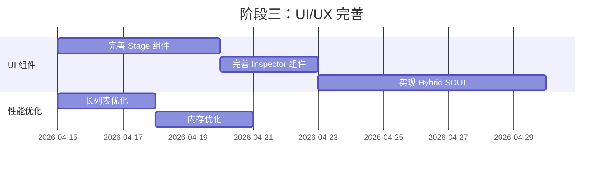
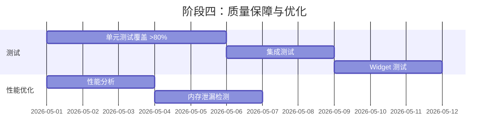

# Flutter 开发流程与 Clotho 项目实施方案

**版本**: 1.0.0
**日期**: 2026-02-26
**状态**: Draft
**作者**: Clotho 架构团队

---

## 一、Flutter 标准开发全流程

### 1.1 项目初始化

| 阶段 | 标准实践 | 工具/命令 |
|------|---------|----------|
| 创建项目 | flutter create | `flutter create --org com.clotho --project-name clotho_app` |
| 依赖管理 | pubspec.yaml | `flutter pub add <package>` |
| 代码规范 | flutter_lints | 默认集成 |
| 多平台支持 | platform channels | iOS/Android/Web/Windows/Linux |

### 1.2 架构模式选型

| 方案 | 适用场景 | 复杂度 | Clotho 当前状态 |
|------|---------|--------|----------------|
| BLoC | 复杂业务逻辑 | 中高 | ❌ 未使用 |
| **Riverpod** | **通用场景** | **中** | **✅ 已使用** |
| Provider | 简单场景 | 低 | ❌ 未使用 |
| GetX | 快速开发 | 低 | ❌ 未使用 |

### 1.3 核心开发阶段



---

## 二、Clotho 项目架构分析

### 2.1 项目规格文档体系

基于 `00_active_specs/` 目录下的核心文档：

| 文档 | 内容 | 状态 |
|------|------|------|
| [vision-and-philosophy.md](../00_active_specs/vision-and-philosophy.md) | 愿景与哲学（凯撒原则） | Draft |
| [architecture-principles.md](../00_active_specs/architecture-principles.md) | 架构原则 | Draft |
| [metaphor-glossary.md](../00_active_specs/metaphor-glossary.md) | 术语表与隐喻体系 | Active |
| [jacquard/README.md](../00_active_specs/jacquard/README.md) | 编排层设计 | Draft |
| [mnemosyne/README.md](../00_active_specs/mnemosyne/README.md) | 数据引擎设计 | Draft |
| [presentation/README.md](../00_active_specs/presentation/README.md) | 表现层设计 | Draft |
| [layered-runtime-architecture.md](../00_active_specs/runtime/layered-runtime-architecture.md) | 分层运行时架构 | Draft |

### 2.2 三层物理隔离架构



### 2.3 运行时分层模型

| 层级 | 隐喻 | 名称 | 职责 | 读写权限 |
|------|------|------|------|----------|
| L0 | 骨架 | Infrastructure | Prompt Template, API Config | Read-Only |
| L1 | 环境 | Environment | User Persona, Global Lorebooks | Read-Only |
| L2 | 织谱 | The Pattern | 静态角色设定（Character Card） | Read-Only |
| L3 | 丝络 | The Threads | 状态补丁、历史记录 | **Read-Write** |

---

## 三、项目开发进度评估

### 3.1 已完成模块

| 模块 | 进度 | 说明 |
|------|------|------|
| **规格文档** | 🟢 高 | 完整的架构设计文档体系 |
| **数据模型** | 🟢 高 | `04_prototype/mnemosyne_models/` 核心实体已定义 |
| **UI 主题** | 🟢 高 | Material 3 主题系统已实现 |
| **基础组件** | 🔵 中 | 消息气泡、输入区、导航栏等基础组件 |
| **状态管理** | 🔵 中 | flutter_riverpod 集成 |

### 3.2 进行中模块

| 模块 | 进度 | 说明 |
|------|------|------|
| **Jacquard 编排层** | 🔵 初级 | 文档完善，代码未实现 |
| **Filament 协议** | 🟢 高 | 规范定义完善（v2.3.0） |
| **Mnemosyne 数据引擎** | 🔵 中 | 模型已定义，SQLite 层未实现 |
| **Hybrid SDUI** | 🟡 初级 | 规范定义，RFW/WebView 未实现 |

### 3.3 未实现模块

| 模块 | 说明 |
|------|------|
| **网络层** | LLM API 调用、WebSocket 流式传输 |
| **本地存储** | SQLite 数据库实现、文件系统抽象 |
| **依赖注入** | DI 容器、服务注册 |
| **测试体系** | 单元测试、集成测试、Widget 测试 |
| **CI/CD** | 自动化构建、测试、发布流程 |

---

## 四、技术债务与瓶颈

### 4.1 技术债务清单

| 类别 | 债务项 | 优先级 | 影响范围 |
|------|--------|--------|----------|
| **架构** | 缺乏依赖注入容器 | 🔴 高 | 可测试性、可维护性 |
| **架构** | 单体应用结构 | 🟡 中 | 模块解耦、团队协作 |
| **实现** | 网络层未实现 | 🔴 高 | LLM 调用、流式传输 |
| **实现** | SQLite 数据库未实现 | 🔴 高 | 数据持久化、状态管理 |
| **实现** | Filament 解析器未实现 | 🔴 高 | LLM 输出处理 |
| **实现** | Hybrid SDUI 未实现 | 🟡 中 | 动态 UI 渲染 |
| **质量** | 无测试覆盖 | 🔴 高 | 代码质量、重构风险 |
| **质量** | 无 CI/CD 流程 | 🟡 中 | 自动化、发布效率 |
| **质量** | 无性能监控 | 🟡 中 | 性能优化、问题定位 |

---

## 五、定制化实施方案

### 5.1 阶段一：基础架构完善

**目标**：建立可扩展的架构基础，实现核心依赖

**时间**：2-3周

#### 任务分解



#### 5.1.1 架构重构：多包结构

推荐的 monorepo 结构：

```yaml
clotho/
├── packages/
│   ├── clotho_core/              # 核心库（接口定义、常量）
│   ├── clotho_infrastructure/    # 基础设施（DI、日志、错误处理）
│   ├── clotho_data/              # 数据层（Mnemosyne、Repository）
│   ├── clotho_domain/            # 领域层（实体、用例）
│   ├── clotho_jacquard/          # 编排层（Jacquard、Plugin）
│   ├── clotho_presentation/      # 表现层（UI 组件）
│   └── clotho_app/              # 应用入口
├── packages_dev/
│   ├── lint_rules/              # 代码规范
│   └── build_runner/            # 代码生成配置
└── melos.yaml                   # Melos 配置
```

依赖注入方案：使用 `get_it` + `injectable`

#### 5.1.2 网络层实现

推荐使用 `dio` 库：

```dart
import 'package:dio/dio.dart';

@injectable
class LLMClient {
  final Dio _dio;
  
  LLMClient(this._dio);
  
  /// 流式调用 LLM API
  Stream<String> streamChat({
    required String prompt,
    required String model,
  }) async* {
    final response = await _dio.post(
      '/chat/completions',
      data: {
        'model': model,
        'messages': [{'role': 'user', 'content': prompt}],
        'stream': true,
      },
      options: Options(responseType: ResponseType.stream),
    );
    
    // 流式处理响应
    await for (final data in response.data) {
      // 解析 SSE 格式
      yield* _parseSSE(data);
    }
  }
}
```

#### 5.1.3 SQLite 数据库实现

```dart
import 'package:sqflite/sqflite.dart';

@injectable
class MnemosyneDatabase {
  late final Database _db;
  
  static Future<Database> _init() async {
    final dbPath = await getDatabasesPath();
    final path = join(dbPath, 'clotho.db');
    
    return await openDatabase(
      path,
      version: 1,
      onCreate: _onCreate,
    );
  }
  
  static Future<void> _onCreate(Database db, int version) async {
    // sessions 表
    await db.execute('''
      CREATE TABLE sessions (
        id TEXT PRIMARY KEY,
        pattern_id TEXT NOT NULL,
        created_at INTEGER NOT NULL,
        updated_at INTEGER NOT NULL,
        metadata TEXT
      )
    ''');
    
    // turns 表（Turn-Centric 架构）
    await db.execute('''
      CREATE TABLE turns (
        id TEXT PRIMARY KEY,
        session_id TEXT NOT NULL,
        turn_index INTEGER NOT NULL,
        summary TEXT,
        vector_id TEXT,
        created_at INTEGER NOT NULL,
        FOREIGN KEY (session_id) REFERENCES sessions(id) ON DELETE CASCADE
      )
    ''');
    
    // messages 表
    await db.execute('''
      CREATE TABLE messages (
        id TEXT PRIMARY KEY,
        turn_id TEXT NOT NULL,
        role TEXT NOT NULL,
        type TEXT NOT NULL,
        content TEXT NOT NULL,
        created_at INTEGER NOT NULL,
        FOREIGN KEY (turn_id) REFERENCES turns(id) ON DELETE CASCADE
      )
    ''');
    
    // state_trees 表（VWD 状态树）
    await db.execute('''
      CREATE TABLE state_trees (
        id TEXT PRIMARY KEY,
        session_id TEXT NOT NULL,
        turn_id TEXT NOT NULL,
        state_json TEXT NOT NULL,
        created_at INTEGER NOT NULL
      )
    ''');
  }
}
```

#### 5.1.4 Filament 协议解析器

```dart
import 'package:xml/xml.dart';

@injectable
class FilamentParser {
  FilamentDocument parse(String rawOutput) {
    final document = XmlDocument.parse(rawOutput);
    final root = document.rootElement;
    
    return FilamentDocument(
      thought: _extractThought(root),
      content: _extractContent(root),
      stateUpdates: _extractStateUpdates(root),
      commands: _extractCommands(root),
    );
  }
  
  String? _extractThought(XmlElement root) {
    return root.findElements('thought').firstOrNull?.innerText.trim();
  }
  
  String _extractContent(XmlElement root) {
    return root.findElements('content').firstOrNull?.innerText.trim() ?? '';
  }
  
  List<StateUpdate> _extractStateUpdates(XmlElement root) {
    final updates = <StateUpdate>[];
    for (final updateElement in root.findElements('state_update')) {
      final json = jsonDecode(updateElement.innerText.trim()) as List;
      for (final item in json) {
        updates.add(StateUpdate.fromJson(item as Map<String, dynamic>));
      }
    }
    return updates;
  }
}
```

#### 5.1.5 CI/CD 配置

```yaml
# .github/workflows/flutter.yml
name: Flutter CI/CD

on:
  push:
    branches: [main, develop]
  pull_request:
    branches: [main]

jobs:
  test:
    runs-on: ubuntu-latest
    steps:
      - uses: actions/checkout@v3
      - uses: subosito/flutter-action@v2
        with:
          flutter-version: '3.16.0'
      - run: flutter pub get
      - run: flutter analyze
      - run: flutter test --coverage
  
  build-android:
    needs: test
    runs-on: ubuntu-latest
    if: github.event_name == 'push' && github.ref == 'refs/heads/main'
    steps:
      - uses: actions/checkout@v3
      - uses: subosito/flutter-action@v2
      - run: flutter build apk --release
      - uses: actions/upload-artifact@v3
        with:
          name: release-apk
          path: build/app/outputs/flutter-apk/app-release.apk
```

---

### 5.2 阶段二：核心功能实现

**目标**：实现 Jacquard 编排层和 Mnemosyne 数据引擎的核心功能

**时间**：4-6周

#### 任务分解



#### 5.2.1 Jacquard Pipeline Runner

```dart
@injectable
class JacquardPipeline {
  final List<Plugin> _plugins;
  
  Future<PipelineResult> execute(PipelineContext context) async {
    // 执行各阶段插件
    await _executePhase(PluginPhase.decision, context);
    await _executePhase(PluginPhase.preparation, context);
    await _executePhase(PluginPhase.construction, context);
    
    // 渲染 Skein
    final renderedSkein = await _renderer.render(context.skein);
    
    // 调用 LLM
    final llmOutput = await _llmClient.streamChat(prompt: renderedSkein).toList();
    
    // 解析输出
    final filamentDoc = _parser.parse(llmOutput.join());
    
    await _executePhase(PluginPhase.processing, context);
    
    return PipelineResult(
      content: filamentDoc.content,
      thought: filamentDoc.thought,
      stateUpdates: filamentDoc.stateUpdates,
    );
  }
}
```

#### 5.2.2 StateTree 与 Patching 机制

```dart
@injectable
class StateTreeRepository {
  final MnemosyneDatabase _db;
  
  /// 应用 Patch 到状态树（核心算法）
  Future<void> applyPatch(String sessionId, StatePatch patch) async {
    final currentState = await getLatestState(sessionId);
    final newState = _deepMerge(currentState, patch);
    
    await _db.insert('state_trees', {
      'id': const Uuid().v4(),
      'session_id': sessionId,
      'turn_id': patch.turnId,
      'state_json': jsonEncode(newState.toJson()),
      'created_at': DateTime.now().millisecondsSinceEpoch,
    });
  }
  
  /// 深度合并算法
  StateTree _deepMerge(StateTree base, StatePatch patch) {
    final result = Map<String, dynamic>.from(base.toJson());
    for (final entry in patch.patches.entries) {
      _applyPathValue(result, entry.key.split('.'), entry.value);
    }
    return StateTree.fromJson(result);
  }
}
```

---

### 5.3 阶段三：UI/UX 完善

**目标**：完善表现层组件，实现 Hybrid SDUI

**时间**：3-4周



---

### 5.4 阶段四：质量保障与优化

**目标**：建立完整的质量保障体系，优化性能

**时间**：2-3周



---

## 六、优化建议

### 6.1 架构优化

#### Feature-First 结构

```dart
lib/
├── core/
│   ├── constants/
│   ├── theme/
│   └── utils/
├── features/
│   ├── chat/
│   │   ├── data/
│   │   ├── domain/
│   │   └── presentation/
│   ├── pattern/
│   │   └── ...
│   └── tapestry/
│       └── ...
└── shared/
    ├── widgets/
    └── services/
```

### 6.2 性能优化

#### 长列表优化

```dart
ListView.builder(
  itemCount: messages.length,
  itemExtent: 80, // 固定高度提升性能
  itemBuilder: (context, index) {
    return MessageBubble(message: messages[index]);
  },
)
```

#### 内存优化

```dart
// 使用 Image.network 的缓存参数
Image.network(
  url,
  cacheWidth: 300,
  cacheHeight: 300,
)

// 及时释放资源
@override
void dispose() {
  _controller.dispose();
  _subscription.cancel();
  super.dispose();
}
```

### 6.3 技术选型建议

| 领域 | 推荐方案 | 理由 |
|------|----------|------|
| 状态管理 | Riverpod | 已集成，类型安全 |
| 依赖注入 | get_it + injectable | 社区成熟 |
| 网络 | dio | 功能完善 |
| 数据库 | sqflite | 官方推荐 |
| 序列化 | freezed + json_serializable | 不可变数据 |
| 日志 | logger | 结构化日志 |
| 错误追踪 | sentry_flutter | 生产监控 |

---

## 七、总结

### 7.1 关键路径

```
架构重构 → 依赖注入 → 网络层 → SQLite 数据库 → Filament 解析器
→ Jacquard Pipeline → Mnemosyne 数据引擎 → UI 集成 → 测试与优化
```

### 7.2 优先级建议

| 优先级 | 任务 | 工期 | 依赖 |
|--------|------|------|------|
| 🔴 P0 | 架构重构（多包 + DI） | 1周 | 无 |
| 🔴 P0 | 网络层实现 | 1周 | 架构重构 |
| 🔴 P0 | SQLite 数据库 | 1周 | 架构重构 |
| 🔴 P0 | Filament 解析器 | 3天 | 网络层 |
| 🟡 P1 | Jacquard Pipeline | 2周 | Filament 解析器 |
| 🟡 P1 | Mnemosyne 数据引擎 | 2周 | SQLite 数据库 |
| 🟢 P2 | Hybrid SDUI | 1周 | Jacquard Pipeline |
| 🟢 P2 | 测试体系 | 1周 | 所有核心功能 |

### 7.3 风险提示

1. **架构重构风险**：重构过程中可能引入破坏性变更，建议分步进行
2. **性能风险**：长对话场景下的内存管理需要重点关注
3. **协议兼容性**：Filament 协议版本演进需要保持向后兼容
4. **跨平台差异**：Windows 和 Android 平台的文件系统、存储 API 差异

---

## 八、关联文档

- [愿景与哲学](../00_active_specs/vision-and-philosophy.md)
- [架构原则](../00_active_specs/architecture-principles.md)
- [术语表](../00_active_specs/metaphor-glossary.md)
- [Jacquard 编排层](../00_active_specs/jacquard/README.md)
- [Mnemosyne 数据引擎](../00_active_specs/mnemosyne/README.md)
- [表现层设计](../00_active_specs/presentation/README.md)
- [分层运行时架构](../00_active_specs/runtime/layered-runtime-architecture.md)
- [Filament 协议](../00_active_specs/protocols/filament-protocol-overview.md)

---

*文档状态：Draft*
*最后更新：2026-02-26*