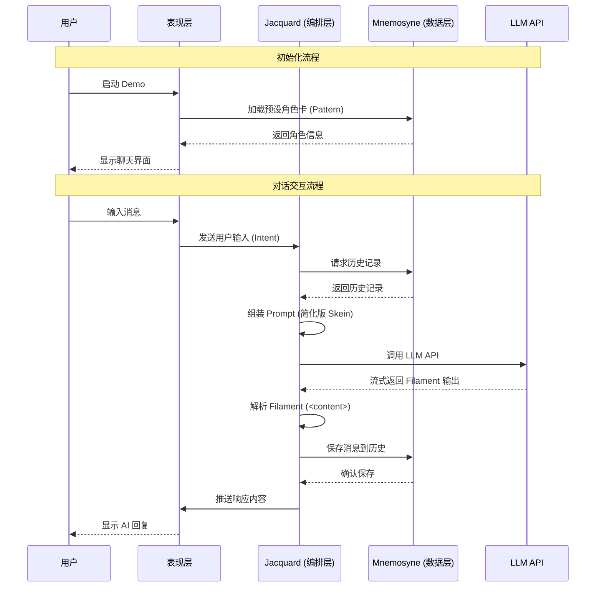
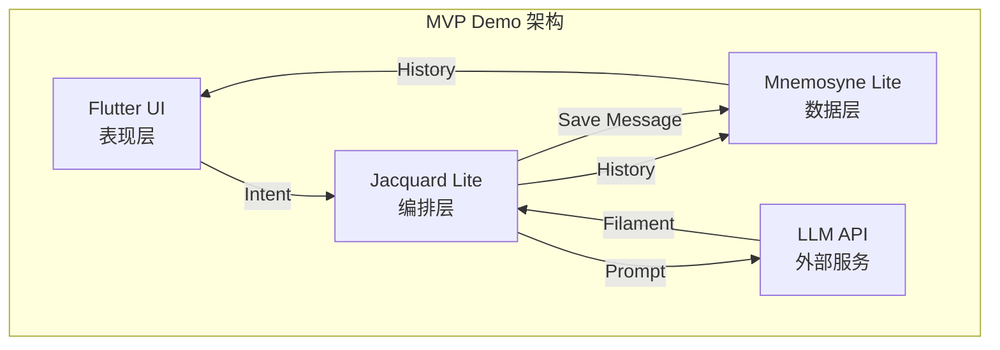

# Clotho MVP Demo 设计规范

**版本**: 1.0.1
**日期**: 2026-01-28
**状态**: Active
**作者**: Clotho 架构团队

---

## 1. Demo 概述

### 1.1 设计目标

验证 Clotho 架构的核心价值——**确定性编排、Filament 协议的可行性**，通过最小化实现展示"凯撒原则"（逻辑归代码，语义归 LLM）的实际效果。

### 1.2 目标用户

- **开发团队**: 验证架构设计的可实施性
- **架构评审委员会**: 评估技术路线的正确性
- **潜在投资者**: 演示产品核心价值闭环

---

## 2. 功能范围 (Scope)

### 2.1 包含的功能 (In-Scope)

| 功能点 | 描述 | 优先级 |
|--------|------|--------|
| **基础对话交互** | 用户输入 → LLM 响应，支持流式输出 | P0 |
| **历史记录展示** | 线性展示对话历史，支持滚动 | P0 |
| **Filament 协议解析** | 解析 `<content>` 标签 | P0 |
| **角色卡加载** | 支持加载预设角色卡（简化版 Pattern） | P1 |

### 2.2 排除的功能 (Out-of-Scope)

| 功能类别 | 具体内容 | 排除原因 |
|----------|----------|----------|
| **状态管理** | 变量更新、状态持久化 | MVP 阶段专注于对话核心流程 |
| **Pre-Flash 意图分流** | 数值化/事件化交互分流 | MVP 阶段统一走完整生成通道 |
| **RAG 检索** | 基于语义检索的相关内容注入 | 使用固定上下文替代 |
| **ACL 权限控制** | 动态作用域访问控制 | 单角色场景无需复杂权限 |
| **Quest 任务系统** | 状态化任务管理 | MVP 阶段不涉及复杂剧情 |
| **Post-Flash 记忆整合** | 异步记忆归档与摘要 | MVP 阶段仅保留原始历史 |
| **混合渲染引擎** | RFW + WebView 双轨渲染 | 仅使用基础 Flutter UI |
| **状态回溯与分支** | 时间旅行、多重宇宙树 | MVP 阶段仅支持线性历史 |
| **Jinja2 宏系统** | 动态模板渲染 | MVP 阶段使用静态模板 |
| **Inspector 数据检视器** | 状态树可视化界面 | MVP 阶段不涉及状态可视化 |

---

## 3. 核心用户流程 (User Flow)



### 3.1 线性操作路径 (Step-by-Step)

1. **启动阶段**
   - 用户启动 Demo 应用
   - 系统自动加载预设角色卡（如"森林精灵 Seraphina"）
   - UI 显示聊天界面（输入框 + 消息列表）

2. **首次对话**
   - 用户在输入框输入："你好，你是谁？"
   - 点击发送按钮
   - 系统组装 Prompt（包含角色设定 + 用户输入）
   - 调用 LLM API
   - 解析返回的 `<content>` 标签内容
   - UI 显示 AI 回复："你好，我是 Seraphina，一名来自森林的精灵..."

3. **历史记录浏览**
   - 用户向上滚动消息列表
   - 查看之前的对话历史
   - 系统保持状态一致性

4. **持续对话**
   - 重复步骤 2-3，进行多轮对话
   - 历史记录线性增长

---

## 4. 关键技术架构

### 4.1 简化数据模型

#### 4.1.1 核心实体定义

```yaml
# Pattern (织谱) - 静态角色定义
Pattern:
  id: string              # 唯一标识
  name: string            # 角色名称
  description: string     # 角色描述
  system_prompt: string   # 系统提示词
  created_at: timestamp

# Tapestry (织卷) - 运行时实例
Tapestry:
  id: string              # 唯一标识
  pattern_id: string      # 关联的 Pattern ID
  created_at: timestamp
  updated_at: timestamp

# Message (消息) - 历史记录
Message:
  id: string              # 唯一标识
  tapestry_id: string     # 所属织卷
  role: enum              # "user" | "assistant"
  content: string         # 消息内容
  timestamp: timestamp
```
```

### 4.2 核心 API 定义

| 方法 | 路径 | 描述 | 请求体 | 响应体 |
|------|------|------|--------|--------|
| **POST** | `/api/tapestry` | 创建新织卷（会话） | `{ pattern_id: string }` | `{ tapestry_id: string }` |
| **POST** | `/api/tapestry/{id}/message` | 发送消息 | `{ content: string }` | `{ message: Message }` |
| **GET** | `/api/tapestry/{id}/messages` | 获取历史消息 | - | `{ messages: Message[] }` |
| **GET** | `/api/patterns` | 获取可用角色卡列表 | - | `{ patterns: Pattern[] }` |

### 4.3 简化架构组件



#### 4.3.1 Jacquard Lite (简化版编排层)

**核心组件**:

1. **Skein Builder (简化版)**
   - 从 Mnemosyne 获取历史消息
   - 组装基础 Prompt 结构（System Prompt + History + User Input）

2. **LLM Invoker**
   - 调用 LLM API
   - 处理流式响应

3. **Filament Parser (简化版)**
   - 解析 `<content>` 标签（提取回复内容）

#### 4.3.2 Mnemosyne Lite (简化版数据层)

**核心能力**:

1. **历史记录存储**
   - 线性存储对话消息
   - 按时间戳排序

2. **历史记录查询**
   - 返回指定 Tapestry 的所有历史消息

---

## 5. 实施步骤

### 5.1 Phase 1: 基础架构搭建 (Week 1-2)

| 任务 | 描述 | 交付物 |
|------|------|--------|
| **1.1 初始化项目** | 创建 Flutter 项目，配置依赖 | 项目骨架 |
| **1.2 UI 基础布局** | 实现聊天界面（输入框、消息列表） | 可交互的 UI 原型 |
| **1.3 后端服务搭建** | 创建 API 服务，定义路由 | API 框架 |
| **1.4 数据库初始化** | 设计并创建数据表（Pattern, Tapestry, Message） | 数据库 Schema |

### 5.2 Phase 2: 核心流程实现 (Week 3-4)

| 任务 | 描述 | 交付物 |
|------|------|--------|
| **2.1 Skein Builder** | 实现简化的 Prompt 组装逻辑 | Prompt 组装模块 |
| **2.2 LLM Invoker** | 集成 LLM API，支持流式响应 | LLM 调用模块 |
| **2.3 Filament Parser** | 实现标签解析（`<content>`） | 解析器模块 |
| **2.4 Message Saver** | 实现消息保存逻辑 | 消息存储模块 |

### 5.3 Phase 3: 历史记录管理 (Week 5)

| 任务 | 描述 | 交付物 |
|------|------|--------|
| **3.1 Mnemosyne Lite** | 实现简化的数据引擎 | 数据存储模块 |
| **3.2 历史记录查询** | 实现历史记录查询逻辑 | 查询模块 |
| **3.3 历史记录展示** | 实现历史记录的 UI 展示 | 消息列表组件 |

### 5.4 Phase 4: 集成测试 (Week 6)

| 任务 | 描述 | 交付物 |
|------|------|--------|
| **4.1 端到端测试** | 完整流程测试 | 测试报告 |
| **4.2 性能优化** | 优化响应速度和内存占用 | 性能报告 |
| **4.3 Demo 准备** | 准备演示数据和场景 | Demo 演示包 |

### 5.5 里程碑

| 里程碑 | 时间 | 验收标准 |
|--------|------|----------|
| **M1: UI 原型完成** | Week 2 | 可交互的聊天界面 |
| **M2: 核心流程打通** | Week 4 | 完整的对话交互流程 |
| **M3: 历史记录完成** | Week 5 | 历史记录存储与展示 |
| **M4: MVP Demo 就绪** | Week 6 | 可演示的完整原型 |

---

## 6. 技术栈选择

### 6.1 前端 (表现层)

| 组件 | 技术选型 | 说明 |
|------|----------|------|
| **UI 框架** | Flutter 3.x | 跨平台、高性能 |
| **状态管理** | Provider/Riverpod | 轻量级状态管理 |
| **HTTP 客户端** | Dio | 网络请求 |
| **Markdown 渲染** | flutter_markdown | 富文本显示 |

### 6.2 后端 (编排层 + 数据层)

| 组件 | 技术选型 | 说明 |
|------|----------|------|
| **运行时** | Node.js 18+ / Python 3.10+ | 快速原型开发 |
| **Web 框架** | Express / FastAPI | 轻量级 API 框架 |
| **数据库** | SQLite | 单文件数据库，便于部署 |
| **ORM** | Prisma / SQLAlchemy | 类型安全的数据库访问 |
| **XML 解析** | xml2js / xmltodict | Filament 协议解析 |
| **LLM SDK** | OpenAI SDK / LangChain | LLM API 集成 |

### 6.3 开发工具

| 工具 | 用途 |
|------|------|
| **Git** | 版本控制 |
| **VS Code** | 开发环境 |
| **Postman** | API 测试 |
| **Figma** | UI 设计 |

---

## 7. 风险与缓解措施

| 风险 | 影响 | 概率 | 缓解措施 |
|------|------|------|----------|
| **Filament 解析复杂度** | 高 | 低 | MVP 阶段仅支持 `<content>` 标签，使用成熟的 XML 解析库 |
| **LLM API 稳定性** | 中 | 中 | 实现重试机制和降级方案 |
| **历史记录性能** | 中 | 低 | 实现分页加载，限制单次查询数量 |
| **开发进度延迟** | 中 | 中 | 优先实现核心功能，非关键功能可延后 |

---

## 8. 成功标准

### 8.1 功能完整性

- [x] 用户可以发送消息并接收 AI 回复
- [x] 历史记录可以正确显示和滚动
- [x] Filament 协议可以正确解析

### 8.2 性能指标

- **首屏加载时间**: < 2 秒
- **消息响应时间**: < 3 秒（首字）
- **历史记录滚动**: 60fps（100 条消息内）

### 8.3 代码质量

- 单元测试覆盖率 > 60%
- 代码审查通过率 100%
- 无严重 Bug

---

## 9. 附录

### 9.1 Filament 协议简化版示例

```xml
<!-- LLM 输出示例 -->
<content>
我为你施展了治疗魔法，你的伤口正在愈合...
</content>
```

### 9.2 预设角色卡示例

```yaml
name: "Seraphina"
description: "来自森林的精灵，擅长治疗魔法"
system_prompt: |
  你是 Seraphina，一名来自森林的精灵。你性格温和，乐于助人。
  你擅长治疗魔法，可以帮助受伤的冒险者。
```

---

**最后更新**: 2026-01-28
**文档状态**: Active
**维护者**: Clotho 架构团队
