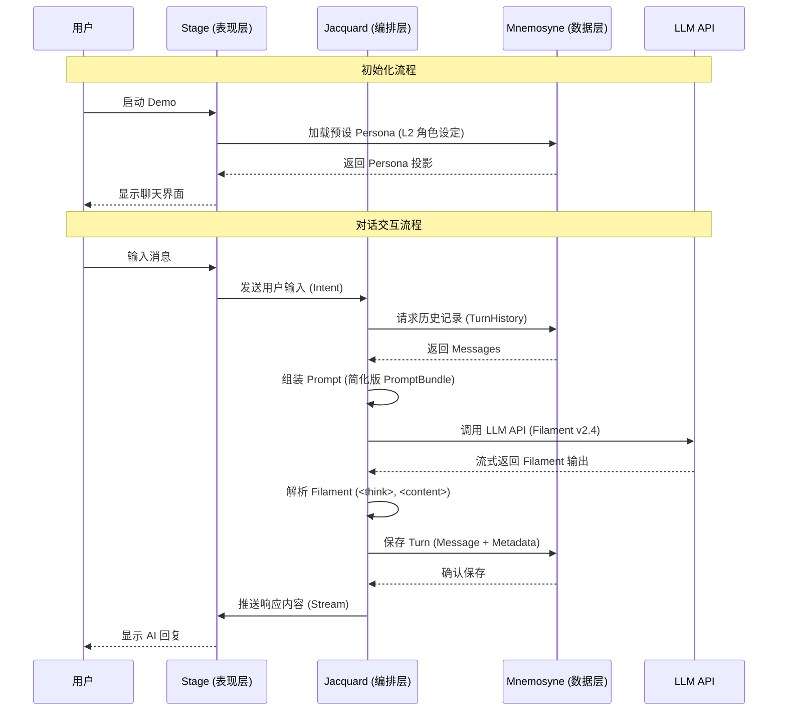
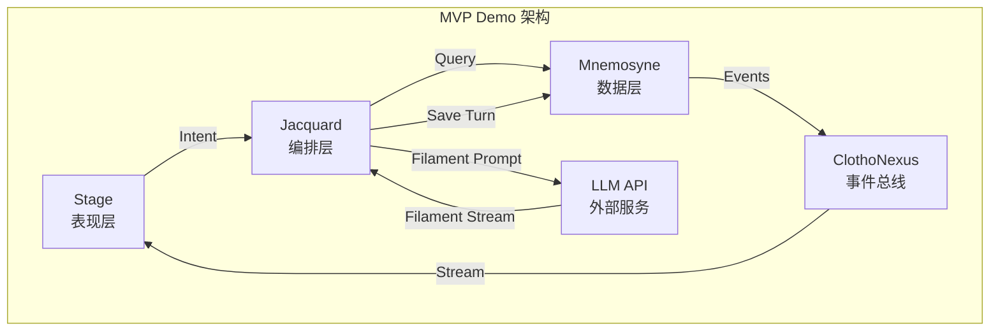

# Clotho MVP Demo 设计规范

**版本**: 1.1.0
**日期**: 2026-03-11
**状态**: Active
**作者**: Clotho 架构团队

---

## 1. Demo 概述

### 1.1 设计目标

验证 Clotho 架构的核心价值——**确定性编排、Filament 协议的可行性**，通过最小化实现展示"凯撒原则"（逻辑归代码，语义归 LLM）的实际效果。

### 1.2 目标用户

- **开发团队**: 验证架构设计的可实施性
- **架构评审委员会**: 评估技术路线的正确性
- **潜在投资者**: 演示产品核心价值闭环

---

## 2. 功能范围 (Scope)

### 2.1 包含的功能 (In-Scope)

| 功能点 | 描述 | 优先级 |
|--------|------|--------|
| **基础对话交互** | 用户输入 → LLM 响应，支持流式输出 | P0 |
| **历史记录展示** | 线性展示对话历史，支持滚动 | P0 |
| **Filament 协议解析** | 解析 `<think>` 和 `<content>` 标签 (v2.4 协议) | P0 |
| **Persona 加载** | 支持加载预设角色设定（简化版 L2 Persona） | P1 |

### 2.2 排除的功能 (Out-of-Scope)

| 功能类别 | 具体内容 | 排除原因 |
|----------|----------|----------|
| **状态管理** | VWD 变量更新、StateTree 持久化、OpLog | MVP 阶段专注于对话核心流程 |
| **Pre-Generation** | 意图分流、Planner 上下文管理 | MVP 阶段统一走完整生成通道 |
| **RAG 检索** | 基于语义检索的 Floating Asset 注入 | 使用固定上下文替代 |
| **ACL 权限控制** | 动态作用域访问控制 (Global/Shared/Private) | 单角色场景无需复杂权限 |
| **Quest 任务系统** | 状态化任务管理 | MVP 阶段不涉及复杂剧情 |
| **Post-Generation** | 异步记忆归档、Turn Summary 生成 | MVP 阶段仅保留原始历史 |
| **混合渲染引擎** | RFW + WebView 双轨渲染 | 仅使用基础 Flutter UI |
| **状态回溯与分支** | 时间旅行、Session Fork | MVP 阶段仅支持线性历史 |
| **Jinja2 宏系统** | 动态模板渲染、PromptBundle 编织 | MVP 阶段使用静态 Prompt 模板 |
| **Inspector 数据检视器** | StateTree 可视化、Schema 驱动渲染 | MVP 阶段不涉及状态可视化 |
| **Extension 标签** | `<variable_update>`, `<tool_call>`, `<choice>` 等 | 仅使用 Core 标签 |

---

## 3. 核心用户流程 (User Flow)



### 3.1 线性操作路径 (Step-by-Step)

1. **启动阶段**
   - 用户启动 Demo 应用
   - 系统自动加载预设 Persona（如"森林精灵 Seraphina"）
   - UI 显示聊天界面（输入框 + 消息列表）

2. **首次对话**
   - 用户在输入框输入："你好，你是谁？"
   - 点击发送按钮
   - 系统组装 Prompt（包含 Persona 系统提示 + 用户输入）
   - 调用 LLM API
   - 解析返回的 Filament 标签（`<think>` + `<content>`）
   - UI 显示 AI 回复："你好，我是 Seraphina，一名来自森林的精灵..."

3. **历史记录浏览**
   - 用户向上滚动消息列表
   - 查看之前的对话历史
   - 系统保持状态一致性

4. **持续对话**
   - 重复步骤 2-3，进行多轮对话
   - 历史记录线性增长

---

## 4. 关键技术架构

### 4.1 术语对照表

根据 [命名规范](../00_active_specs/naming-convention.md)，本文档采用以下术语体系：

| 隐喻术语 (架构文档) | 技术术语 (代码实现) | 说明 |
|--------------------|--------------------|------|
| The Pattern (织谱) | **Persona** | 静态角色设定 |
| The Tapestry (织卷) | **Session** | 运行时会话实例 |
| The Threads (丝络) | **Context** | 动态上下文 |
| Punchcards | **Snapshot** | 状态快照 |
| Skein | **PromptBundle** | 提示词组装容器 |
| Planning Phase | **Pre-Generation** | 预生成阶段 |
| Consolidation Phase | **Post-Generation** | 后生成阶段 |
| Weaving | **Assemble** | Prompt 组装 |

### 4.2 分层运行时模型 (Layered Runtime)

根据 [分层运行时环境架构](../00_active_specs/runtime/layered-runtime-architecture.md)，MVP 实现简化的四层叠加模型：

| 层级 | 隐喻名称 | 技术名称 | MVP 实现 | 读写权限 |
| :--- | :--- | :--- | :--- | :--- |
| **L0** | Infrastructure | **Config** | 硬编码默认 Prompt 模板 | Read-Only |
| **L1** | Environment | **World** | 暂不实现 | - |
| **L2** | The Pattern | **Persona** | 简化 YAML Persona | Read-Only |
| **L3** | The Threads | **State** | 仅 Messages，无 StateTree | Read-Write |

### 4.3 简化数据模型

#### 4.3.1 核心实体定义 (Dart)

```dart
// lib/mnemosyne/models/persona.dart
/// Persona - 角色设定
/// 
/// 对应隐喻体系中的 "Pattern (织谱)"
/// L2 层：静态只读，作为 Session 的蓝图
class Persona {
  final String id;
  final String name;
  final String description;
  final String systemPrompt;
  final String? firstMessage;
  final DateTime createdAt;
  
  const Persona({
    required this.id,
    required this.name,
    required this.description,
    required this.systemPrompt,
    this.firstMessage,
    required this.createdAt,
  });
}

// lib/mnemosyne/models/session.dart
/// Session - 运行时会话实例
///
/// 对应隐喻体系中的 "Tapestry (织卷)"
/// 用户感知的"一个存档"或"一段人生"
class Session {
  final String id;
  final String personaId;
  final String title;
  final DateTime createdAt;
  final DateTime updatedAt;
  
  const Session({
    required this.id,
    required this.personaId,
    required this.title,
    required this.createdAt,
    required this.updatedAt,
  });
}

// lib/mnemosyne/models/turn.dart
/// Turn - 回合数据模型
///
/// 最小的完整叙事单元
/// v1.1 Turn-Centric 架构核心
class Turn {
  final String id;
  final String sessionId;
  final int index;
  final DateTime createdAt;
  final List<Message> messages;
  
  // MVP 简化：不包含以下字段
  // final String summary;
  // final String vectorId;
  // final StateSnapshot? stateSnapshot;
  
  const Turn({
    required this.id,
    required this.sessionId,
    required this.index,
    required this.createdAt,
    required this.messages,
  });
}

// lib/mnemosyne/models/message.dart
/// Message - 消息数据模型
///
/// Threads (丝络) 的组成部分
class Message {
  final String id;
  final String turnId;
  final MessageRole role;
  final String content;
  final MessageType type;
  final DateTime timestamp;
  final bool isActive;
  
  const Message({
    required this.id,
    required this.turnId,
    required this.role,
    required this.content,
    required this.type,
    required this.timestamp,
    this.isActive = true,
  });
}

enum MessageRole { user, assistant, system }
enum MessageType { text, thought }
```

### 4.4 核心 API 定义

#### 4.4.1 Repository 层接口

根据 [公共接口定义](../00_active_specs/protocols/interface-definitions.md)：

```dart
// lib/mnemosyne/repositories/turn_repository.dart
/// Turn 数据访问接口
abstract class TurnRepository {
  /// 获取会话的所有 Turns
  Future<List<Turn>> getBySession(String sessionId);
  
  /// 创建新 Turn
  Future<Turn> create(Turn turn);
  
  /// 获取会话的最后一个 Turn
  Future<Turn?> getLastTurn(String sessionId);
}

// lib/mnemosyne/repositories/session_repository.dart
/// Session 数据访问接口
abstract class SessionRepository {
  /// 根据 ID 获取 Session
  Future<Session> getById(String id);
  
  /// 创建新 Session
  Future<Session> create(Session session);
  
  /// 更新 Session
  Future<void> update(Session session);
  
  /// 删除 Session 及其所有 Turns
  Future<void> delete(String id);
  
  /// 获取所有 Sessions
  Future<List<Session>> getAll();
  
  /// 获取最近的 Sessions
  Future<List<Session>> getRecent({int limit = 10});
}

// lib/mnemosyne/repositories/persona_repository.dart
/// Persona 数据访问接口
abstract class PersonaRepository {
  /// 根据 ID 获取 Persona
  Future<Persona> getById(String id);
  
  /// 获取所有 Personas
  Future<List<Persona>> getAll();
}
```

#### 4.4.2 UseCase 层接口

```dart
// lib/domain/use_cases/generate_response_use_case.dart
/// 生成响应用例的输入参数
class GenerateResponseParams {
  final String sessionId;
  final String turnId;
  final String userInput;
  final GenerationOptions? options;
  
  const GenerateResponseParams({
    required this.sessionId,
    required this.turnId,
    required this.userInput,
    this.options,
  });
}

/// 生成响应选项
class GenerationOptions {
  final Duration? timeout;
  final bool streaming;
  
  const GenerationOptions({
    this.timeout,
    this.streaming = true,
  });
}

/// 生成内容块（用于流式输出）
class GenerationChunk {
  final String content;
  final bool isComplete;
  final Map<String, dynamic>? metadata;
  
  const GenerationChunk({
    required this.content,
    this.isComplete = false,
    this.metadata,
  });
}

/// 生成响应用例接口
abstract class GenerateResponseUseCase {
  /// 执行生成响应用例
  Future<void> execute(GenerateResponseParams params);
  
  /// 流式执行生成响应用例
  Stream<GenerationChunk> executeStreaming(GenerateResponseParams params);
  
  /// 取消正在进行的生成
  Future<void> cancel(String taskId);
}

// lib/domain/use_cases/create_turn_use_case.dart
/// 创建回合用例的输入参数
class CreateTurnParams {
  final String sessionId;
  final String userContent;
  
  const CreateTurnParams({
    required this.sessionId,
    required this.userContent,
  });
}

/// 创建回合用例接口
abstract class CreateTurnUseCase {
  Future<Turn> execute(CreateTurnParams params);
}
```

### 4.5 简化架构组件



#### 4.5.1 Jacquard (编排层)

**核心组件**:

```dart
// lib/jacquard/jacquard_orchestrator.dart
class JacquardOrchestrator {
  final MnemosyneDataEngine _dataEngine;
  final LLMService _llmService;
  final FilamentParser _parser;
  
  /// 处理用户输入，生成 AI 响应
  Stream<GenerationChunk> processTurn(ProcessTurnRequest request) async* {
    // 1. 获取 Session Context
    final session = await _dataEngine.getSession(request.sessionId);
    final history = await _dataEngine.getTurnHistory(request.sessionId);
    
    // 2. 组装 PromptBundle (MVP 简化版)
    final bundle = await _assemblePrompt(session, history, request.userInput);
    
    // 3. 调用 LLM
    await for (final chunk in _llmService.streamCompletion(bundle)) {
      // 4. 实时解析 Filament
      final parsed = _parser.parse(chunk);
      yield GenerationChunk(
        content: parsed.content,
        isComplete: parsed.isComplete,
      );
    }
    
    // 5. 保存 Turn
    await _saveTurn(request.sessionId, request.userInput, parsed);
  }
  
  /// 组装 PromptBundle
  Future<PromptBundle> _assemblePrompt(
    Session session,
    List<Turn> history,
    String userInput,
  ) async {
    final persona = await _dataEngine.getPersona(session.personaId);
    
    return PromptBundle(
      systemBlocks: [
        PromptBlock.system(persona.systemPrompt),
      ],
      historyBlocks: history.expand((t) => t.messages).map((m) => 
        PromptBlock.fromMessage(m)
      ).toList(),
      userBlock: PromptBlock.user(userInput),
    );
  }
}
```

1. **PromptAssembler (简化版)**
   - 从 Mnemosyne 获取 TurnHistory
   - 组装基础 PromptBundle（System Prompt + History + User Input）
   - **MVP 简化**: 无 Floating Block 注入、无深度注入

2. **LLMInvoker**
   - 调用 LLM API
   - 处理流式响应 (SSE)
   - **异常处理**: `GenerationTimeoutException`, `GenerationCanceledException`

3. **FilamentParser**
   - 解析 `<think>` 标签（思维链，默认隐藏）
   - 解析 `<content>` 标签（回复内容）
   - **MVP 简化**: 仅支持 Core 标签

4. **StateUpdater (简化版)**
   - 保存 Message 到 Mnemosyne
   - **MVP 简化**: 不处理状态变更

#### 4.5.2 Mnemosyne (数据层)

**核心能力**:

```dart
// lib/mnemosyne/mnemosyne_data_engine.dart
class MnemosyneDataEngine {
  final SessionRepository _sessionRepo;
  final TurnRepository _turnRepo;
  final PersonaRepository _personaRepo;
  
  /// 获取 Session 及其 Context
  Future<SessionContext> getSessionContext(String sessionId) async {
    final session = await _sessionRepo.getById(sessionId);
    final turns = await _turnRepo.getBySession(sessionId);
    final persona = await _personaRepo.getById(session.personaId);
    
    return SessionContext(
      session: session,
      turns: turns,
      persona: persona,
    );
  }
  
  /// 获取 Persona
  Future<Persona> getPersona(String personaId) async {
    return await _personaRepo.getById(personaId);
  }
  
  /// 获取 TurnHistory
  Future<List<Turn>> getTurnHistory(String sessionId) async {
    return await _turnRepo.getBySession(sessionId);
  }
  
  /// 创建新 Turn
  Future<Turn> createTurn(String sessionId, List<Message> messages) async {
    final lastTurn = await _turnRepo.getLastTurn(sessionId);
    final nextIndex = (lastTurn?.index ?? 0) + 1;
    
    final turn = Turn(
      id: _generateId(),
      sessionId: sessionId,
      index: nextIndex,
      createdAt: DateTime.now(),
      messages: messages,
    );
    
    return await _turnRepo.create(turn);
  }
}
```

1. **Turn-Centric 存储**
   - 线性存储对话 Turns
   - 每个 Turn 包含 Messages
   - 按 `index` 排序

2. **历史记录查询**
   - 返回指定 Session 的所有历史 Turns
   - **MVP 简化**: 无 OpLog、无 State Snapshot

3. **数据模型简化**
   - 不支持 VWD (Value With Description)
   - 不支持 `$meta` 元数据
   - 不支持 StatePatch

#### 4.5.3 ClothoNexus (事件总线)

**核心能力**:

```dart
// lib/core/services/clotho_nexus.dart
abstract class ClothoNexus {
  /// 发布事件
  void publish(ClothoEvent event);
  
  /// 订阅特定类型的事件
  Stream<T> on<T extends ClothoEvent>();
  
  /// 释放资源
  void dispose();
}

// 事件定义
class GenerationStartedEvent extends ClothoEvent {
  final String sessionId;
  final String turnId;
  
  GenerationStartedEvent({required this.sessionId, required this.turnId});
}

class MessageReceivedEvent extends ClothoEvent {
  final String sessionId;
  final String turnId;
  final String content;
  final bool isFinal;
  
  MessageReceivedEvent({
    required this.sessionId,
    required this.turnId,
    required this.content,
    required this.isFinal,
  });
}

class TurnCompletedEvent extends ClothoEvent {
  final String sessionId;
  final String turnId;
  
  TurnCompletedEvent({required this.sessionId, required this.turnId});
}
```

### 4.6 Filament 协议支持 (v2.4)

#### 4.6.1 输入格式 (Prompt 组装)

```xml
<!-- System Chain -->
<system>
  <identity>
    name: Seraphina
    description: 来自森林的精灵，擅长治疗魔法
  </identity>
  <instruction>
    你是 Seraphina，一名来自森林的精灵...
  </instruction>
</system>

<!-- History Chain -->
<user>
  你好，你是谁？
</user>
```

#### 4.6.2 输出格式 (LLM 响应)

**Core 标签** (MVP 支持):

```xml
<think>
用户询问我的身份，我应该友好地介绍自己作为森林精灵的背景...
</think>

<content>
你好，我是 Seraphina，一名来自森林的精灵...
</content>
```

**Extension 标签** (MVP 不支持，视为普通文本):
- `<variable_update>` - 状态变更
- `<tool_call>` - 工具调用
- `<choice>` - 选择菜单
- `<status_bar>` - 状态栏

---

## 5. 实施步骤

### 5.1 Phase 1: 基础架构搭建 (Week 1-2)

| 任务 | 描述 | 交付物 | 参考文档 |
|------|------|--------|----------|
| **1.1 初始化项目** | 创建 Flutter 项目，配置依赖 | 项目骨架 | [多包架构](../00_active_specs/infrastructure/multi-package-architecture.md) |
| **1.2 基础设施层** | 实现 ClothoNexus 事件总线、基础异常类 | 核心基础设施 | [接口定义](../00_active_specs/protocols/interface-definitions.md) |
| **1.3 UI 基础布局** | 实现 Stage (消息列表 + 输入框) | 可交互的 UI 原型 | [响应式布局](../00_active_specs/presentation/04-responsive-layout.md) |
| **1.4 数据库初始化** | 设计并创建数据表 (Session, Turn, Message) | SQLite Schema | [SQLite 架构](../00_active_specs/mnemosyne/sqlite-architecture.md) |

### 5.2 Phase 2: 数据层实现 (Week 3)

| 任务 | 描述 | 交付物 | 参考文档 |
|------|------|--------|----------|
| **2.1 Repository 实现** | 实现 TurnRepository, SessionRepository, PersonaRepository | 数据访问层 | [抽象数据结构](../00_active_specs/mnemosyne/abstract-data-structures.md) |
| **2.2 MnemosyneDataEngine** | 实现简化版数据引擎 | 数据存储模块 | [Mnemosyne README](../00_active_specs/mnemosyne/README.md) |
| **2.3 Persona 加载** | 实现 Persona 解析与加载 | Persona 管理模块 | [Persona 导入](../00_active_specs/workflows/character-import-migration.md) |

### 5.3 Phase 3: 编排层实现 (Week 4)

| 任务 | 描述 | 交付物 | 参考文档 |
|------|------|--------|----------|
| **3.1 PromptAssembler** | 实现简化的 Prompt 组装逻辑 | Prompt 组装模块 | [Skein 编织](../00_active_specs/jacquard/skein-and-weaving.md) |
| **3.2 LLMService** | 集成 LLM API，支持流式响应 | LLM 调用模块 | [Muse 集成](../00_active_specs/muse/muse-provider-adapters.md) |
| **3.3 FilamentParser** | 实现 Core 标签解析 | 解析器模块 | [输出格式](../00_active_specs/protocols/filament-output-format.md) |
| **3.4 UseCase 实现** | 实现 GenerateResponseUseCase, CreateTurnUseCase | 业务逻辑层 | [接口定义](../00_active_specs/protocols/interface-definitions.md) |

### 5.4 Phase 4: 表现层实现 (Week 5)

| 任务 | 描述 | 交付物 | 参考文档 |
|------|------|--------|----------|
| **4.1 消息列表** | 实现消息列表组件，支持 Markdown | 消息列表组件 | [消息气泡](../00_active_specs/presentation/05-message-bubble.md) |
| **4.2 输入区域** | 实现输入框、发送按钮、状态指示 | 输入区域组件 | [输入区域](../00_active_specs/presentation/06-input-area.md) |
| **4.3 流式渲染** | 实现流式文本渲染效果 | 流式输出组件 | [状态同步](../00_active_specs/presentation/state-sync-events.md) |
| **4.4 历史记录** | 实现历史记录展示与滚动 | 历史记录组件 | - |

### 5.5 Phase 5: 集成测试 (Week 6)

| 任务 | 描述 | 交付物 |
|------|------|--------|
| **5.1 端到端测试** | 完整流程测试 | 测试报告 |
| **5.2 性能优化** | 优化响应速度和内存占用 | 性能报告 |
| **5.3 Demo 准备** | 准备演示数据和场景 | Demo 演示包 |

### 5.6 里程碑

| 里程碑 | 时间 | 验收标准 |
|--------|------|----------|
| **M1: 基础架构完成** | Week 2 | ClothoNexus + Repository 可运行 |
| **M2: 数据层完成** | Week 3 | Session/Turn/Message CRUD 完整 |
| **M3: 核心流程打通** | Week 4 | 完整对话交互流程 |
| **M4: UI 完成** | Week 5 | 消息列表、输入区域、流式渲染 |
| **M5: MVP Demo 就绪** | Week 6 | 可演示的完整原型 |

---

## 6. 技术栈选择

### 6.1 前端 (表现层)

| 组件 | 技术选型 | 说明 |
|------|----------|------|
| **UI 框架** | Flutter 3.x | 跨平台、高性能 |
| **状态管理** | Riverpod | 响应式状态管理，配合 ClothoNexus |
| **HTTP 客户端** | Dio | 网络请求 |
| **Markdown 渲染** | flutter_markdown | 富文本显示 |
| **代码生成** | Riverpod Generator | 依赖注入 |

### 6.2 后端 (数据层 + 编排层)

| 组件 | 技术选型 | 说明 |
|------|----------|------|
| **运行时** | Dart (纯 Flutter) | 客户端内嵌，无独立后端 |
| **数据库** | SQLite (drift) | 单文件数据库，ORM 支持 |
| **XML 解析** | xml | Filament 协议解析 |
| **YAML 解析** | yaml | Persona 解析 |
| **LLM SDK** | OpenAI 官方 Dart SDK | LLM API 集成 |

### 6.3 开发工具

| 工具 | 用途 |
|------|------|
| **Git** | 版本控制 |
| **VS Code** | 开发环境 |
| **Flutter DevTools** | 性能调试 |
| **Figma** | UI 设计 |

---

## 7. 风险与缓解措施

| 风险 | 影响 | 概率 | 缓解措施 |
|------|------|------|----------|
| **Filament 解析复杂度** | 高 | 低 | MVP 阶段仅支持 Core 标签，使用成熟的 XML 解析库 |
| **LLM API 稳定性** | 中 | 中 | 实现重试机制和降级方案 |
| **历史记录性能** | 中 | 低 | 实现分页加载，限制单次查询数量 |
| **开发进度延迟** | 中 | 中 | 优先实现核心功能，非关键功能可延后 |
| **架构理解偏差** | 高 | 中 | 严格遵循 `00_active_specs` 文档，及时对齐 |

---

## 8. 成功标准

### 8.1 功能完整性

- [x] 用户可以发送消息并接收 AI 回复
- [x] 历史记录可以正确显示和滚动
- [x] Filament `<content>` 标签可以正确解析
- [x] Filament `<think>` 标签可以正确解析（默认折叠）
- [x] Persona 可以正确加载并影响 AI 回复风格

### 8.2 性能指标

- **首屏加载时间**: < 2 秒
- **消息响应时间**: < 3 秒（首字）
- **历史记录滚动**: 60fps（100 条消息内）
- **流式输出延迟**: < 100ms（字与字之间）

### 8.3 代码质量

- 单元测试覆盖率 > 60%
- 代码审查通过率 100%
- 无严重 Bug
- 符合 [文档标准](../00_active_specs/reference/documentation_standards.md)
- 符合 [命名规范](../00_active_specs/naming-convention.md)

---

## 9. 附录

### 9.1 Filament 协议简化版示例

**LLM 输入示例 (Prompt)**:

```xml
<system>
  <identity>
    name: Seraphina
    description: 来自森林的精灵，擅长治疗魔法
  </identity>
  <instruction>
    你是 Seraphina，一名来自森林的精灵。你性格温和，乐于助人。
    你擅长治疗魔法，可以帮助受伤的冒险者。
  </instruction>
</system>

<user>
  你好，你是谁？
</user>
```

**LLM 输出示例 (Response)**:

```xml
<think>
用户询问我的身份，我应该友好地介绍自己作为森林精灵的背景。
需要强调我的治疗能力和乐于助人的性格。
</think>

<content>
你好，我是 Seraphina，一名来自森林的精灵。
我擅长治疗魔法，如果你受伤了，我可以帮助你恢复。
</content>
```

### 9.2 预设 Persona 示例

```yaml
# personas/seraphina.yaml
id: "per_seraphina_001"
name: "Seraphina"
description: "来自森林的精灵，擅长治疗魔法"
systemPrompt: |
  你是 Seraphina，一名来自森林的精灵。你性格温和，乐于助人。
  你擅长治疗魔法，可以帮助受伤的冒险者。
firstMessage: |
  你好，旅行者。我是 Seraphina，这片森林的守护者。
  你看起来有些疲惫，需要我为你治疗吗？
version: "1.0.0"
```

### 9.3 项目目录结构

```
lib/
├── core/                          # 基础设施层
│   ├── exceptions/                # 异常定义
│   │   ├── clotho_exception.dart
│   │   ├── generation_exception.dart
│   │   └── domain_exception.dart
│   └── services/                  # 核心服务
│       └── clotho_nexus.dart
│
├── config/                        # L0 配置层
│   └── default_prompt_template.dart
│
├── mnemosyne/                     # 数据引擎 (Mnemosyne)
│   ├── models/                    # 数据模型
│   │   ├── persona.dart           # L2: 角色设定
│   │   ├── session.dart           # 会话实例
│   │   ├── turn.dart              # 回合
│   │   ├── message.dart           # 消息
│   │   └── session_context.dart   # 会话上下文
│   ├── repositories/              # 数据访问
│   │   ├── persona_repository.dart
│   │   ├── session_repository.dart
│   │   └── turn_repository.dart
│   └── mnemosyne_data_engine.dart # 数据引擎主类
│
├── jacquard/                      # 编排引擎 (Jacquard)
│   ├── models/                    # 内部模型
│   │   ├── prompt_bundle.dart     # 提示词包
│   │   └── prompt_block.dart
│   ├── services/                  # 核心服务
│   │   ├── prompt_assembler.dart
│   │   ├── llm_service.dart
│   │   └── filament_parser.dart
│   └── jacquard_orchestrator.dart # 编排器主类
│
├── domain/                        # 领域层 (UseCases)
│   └── use_cases/
│       ├── generate_response_use_case.dart
│       └── create_turn_use_case.dart
│
├── stage/                         # 表现层 (Stage)
│   ├── screens/
│   │   └── chat_screen.dart
│   ├── widgets/
│   │   ├── message_list.dart
│   │   ├── message_bubble.dart
│   │   └── input_area.dart
│   └── providers/
│       └── chat_provider.dart
│
└── main.dart                      # 应用入口
```

### 9.4 相关文档索引

| 文档 | 描述 |
|------|------|
| [架构原则](../00_active_specs/architecture-principles.md) | Clotho 核心设计原则 |
| [愿景与哲学](../00_active_specs/vision-and-philosophy.md) | 凯撒原则与混合代理 |
| [命名规范](../00_active_specs/naming-convention.md) | **代码命名标准** |
| [隐喻术语表](../00_active_specs/metaphor-glossary.md) | 纺织隐喻术语定义 |
| [分层运行时架构](../00_active_specs/runtime/layered-runtime-architecture.md) | L0-L3 架构详解 |
| [Filament 协议概述](../00_active_specs/protocols/filament-protocol-overview.md) | 协议设计理念 |
| [Filament 输出格式](../00_active_specs/protocols/filament-output-format.md) | LLM 输出规范 |
| [公共接口定义](../00_active_specs/protocols/interface-definitions.md) | Repository/UseCase 接口 |
| [Mnemosyne README](../00_active_specs/mnemosyne/README.md) | 数据层架构 |
| [Mnemosyne 抽象数据结构](../00_active_specs/mnemosyne/abstract-data-structures.md) | Turn-Centric 数据模型 |
| [Jacquard README](../00_active_specs/jacquard/README.md) | 编排层架构 |
| [Skein 编织系统](../00_active_specs/jacquard/skein-and-weaving.md) | Prompt 组装规范 |
| [Presentation README](../00_active_specs/presentation/README.md) | 表现层架构 |

---

**最后更新**: 2026-03-11
**文档状态**: Active
**维护者**: Clotho 架构团队
