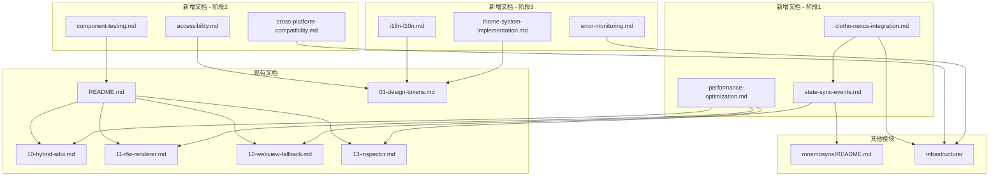

# 表现层文档补充与完善计划 (Presentation Layer Documentation Completion Plan)

**版本**: 1.0.0
**日期**: 2026-02-24
**状态**: Draft
**类型**: Documentation Plan
**作者**: Clotho 架构团队

---

## 1. 概述 (Overview)

本计划旨在补充和完善 Clotho 表现层 (`00_active_specs/presentation/`) 的设计文档，确保文档覆盖集成、测试、部署和维护等关键领域，为开发团队提供完整的实现指导。

### 1.1 背景

表现层文档在**架构设计和组件规范**方面已经相当完整，但缺少以下关键领域的实现细节：
- 状态同步与事件流处理
- ClothoNexus 事件总线集成
- 性能优化策略与监控
- 组件测试策略
- 跨平台兼容性
- 国际化与本地化
- 主题系统实现
- 错误监控与日志

### 1.2 目标

- **完整性**: 覆盖表现层的所有关键实现领域
- **可操作性**: 提供清晰的实施步骤和代码示例
- **一致性**: 与现有文档风格和术语保持一致
- **可维护性**: 建立文档更新和维护流程

---

## 2. 现有文档评估 (Existing Documentation Assessment)

### 2.1 现有文档清单

| 文档 | 行数 | 状态 | 评估 |
|------|------|------|------|
| `README.md` | 315 | Draft | ✅ 总览完整 |
| `01-design-tokens.md` ~ `17-animation.md` | - | Active | ✅ UI 设计规范完整 |
| `07-message-status-slot.md` | 440 | Draft | ✅ 组件设计完整 |
| `10-hybrid-sdui.md` | 486 | Draft | ✅ 架构设计完整 |
| `11-rfw-renderer.md` | 470 | Draft | ✅ 渲染器设计完整 |
| `12-webview-fallback.md` | 488 | Draft | ✅ 降级机制完整 |
| `13-inspector.md` | 492 | Draft | ✅ Inspector 设计完整 |
| `14-state-tree-viewer.md` | 412 | Draft | ✅ 状态树查看器完整 |
| `15-input-draft-controller.md` | - | Draft | ✅ 控制器设计完整 |
| `webview-bridge-api.md` | 147 | Active | ✅ API 规范完整 |
| `sdui-rfw-protocol.md` | 179 | Active | ✅ 协议规范完整 |

### 2.2 评估结论

**优势**:
- 架构设计文档完整且详细
- 组件规范清晰，包含代码示例
- API 和协议定义明确
- 安全考虑和性能优化已有基础

**不足**:
- 缺少集成层面的实现细节
- 缺少测试策略和验证方法
- 缺少跨平台兼容性指导
- 缺少部署和维护相关规范

---

## 3. 缺失文档清单 (Missing Documentation)

### 阶段 1: 集成与状态管理 (Integration & State Management)

#### 3.1 状态同步与事件流 (State Sync & Events)

| 属性 | 值 |
|------|-----|
| **文件名** | `presentation/state-sync-events.md` |
| **优先级** | P0 (阻塞性) |
| **预估篇幅** | 500-600 行 |
| **依赖文档** | `presentation/README.md`, `infrastructure/clotho-nexus-events.md`, `mnemosyne/README.md` |

**核心内容**:
- 状态同步机制
- Mnemosyne 状态流订阅
- 状态变更传播
- 状态回溯与恢复
- 事件流处理
- 用户意图事件
- 系统响应事件
- 错误与异常事件
- ClothoNexus 集成
- 事件发布
- 事件订阅
- 事件过滤与路由
- 性能优化
- 状态节流与防抖
- 增量更新策略
- 内存管理

#### 3.2 ClothoNexus 集成 (ClothoNexus Integration)

| 属性 | 值 |
|------|-----|
| **文件名** | `presentation/clotho-nexus-integration.md` |
| **优先级** | P0 (阻塞性) |
| **预估篇幅** | 400-500 行 |
| **依赖文档** | `infrastructure/clotho-nexus-events.md`, `presentation/state-sync-events.md` |

**核心内容**:
- 事件总线架构
- ClothoNexus 事件模型
- 表现层事件适配器
- 表现层事件定义
- UI 事件
- 导航事件
- 业务事件
- 事件处理流程
- 事件发布
- 事件订阅
- 事件处理
- 错误处理与重试

#### 3.3 性能优化策略 (Performance Optimization)

| 属性 | 值 |
|------|-----|
| **文件名** | `presentation/performance-optimization.md` |
| **优先级** | P1 (功能性) |
| **预估篇幅** | 500-600 行 |
| **依赖文档** | `presentation/10-hybrid-sdui.md`, `presentation/16-performance.md` |

**核心内容**:
- 性能指标
- 首屏加载时间
- 帧率 (FPS)
- 内存占用
- 交互响应时间
- 优化策略
- 惰性构建
- 图片缓存
- WebView 池化
- RFW 缓存
- 性能监控
- 性能分析器
- 性能日志
- 性能报告
- 性能问题排查

---

### 阶段 2: 测试与验证 (Testing & Validation)

#### 3.4 组件测试策略 (Component Testing)

| 属性 | 值 |
|------|-----|
| **文件名** | `presentation/component-testing.md` |
| **优先级** | P1 (功能性) |
| **预估篇幅** | 400-500 行 |
| **依赖文档** | `presentation/README.md`, `08_demo/` |

**核心内容**:
- 测试策略概述
- 单元测试
- Widget 测试
- 集成测试
- 测试覆盖率
- Mock 与 Stub
- 测试工具
- 测试最佳实践
- 持续集成

#### 3.5 跨平台兼容性 (Cross-Platform Compatibility)

| 属性 | 值 |
|------|-----|
| **文件名** | `presentation/cross-platform-compatibility.md` |
| **优先级** | P1 (功能性) |
| **预估篇幅** | 350-450 行 |
| **依赖文档** | `infrastructure/file-system-abstraction.md` |

**核心内容**:
- 平台支持概述
- Windows 平台特性
- Android 平台特性
- Web 平台特性
- 平台差异处理
- 条件编译
- 平台特定代码
- 兼容性测试
- 降级策略

#### 3.6 可访问性规范 (Accessibility)

| 属性 | 值 |
|------|-----|
| **文件名** | `presentation/accessibility.md` |
| **优先级** | P2 (优化性) |
| **预估篇幅** | 300-400 行 |
| **依赖文档** | `presentation/01-design-tokens.md` |

**核心内容**:
- 可访问性概述
- 屏幕阅读器支持
- 键盘导航
- 语义标签
- 颜色对比度
- 字体缩放
- 可访问性测试

---

### 阶段 3: 部署与维护 (Deployment & Maintenance)

#### 3.7 国际化与本地化 (i18n & l10n)

| 属性 | 值 |
|------|-----|
| **文件名** | `presentation/i18n-l10n.md` |
| **优先级** | P2 (优化性) |
| **预估篇幅** | 350-450 行 |
| **依赖文档** | `presentation/03-typography.md` |

**核心内容**:
- 国际化概述
- 多语言支持
- 文本提取
- 翻译管理
- 日期与时间格式
- 数字格式
- RTL 支持
- 本地化测试

#### 3.8 主题系统实现 (Theme System Implementation)

| 属性 | 值 |
|------|-----|
| **文件名** | `presentation/theme-system-implementation.md` |
| **优先级** | P2 (优化性) |
| **预估篇幅** | 400-500 行 |
| **依赖文档** | `presentation/02-color-theme.md` |

**核心内容**:
- 主题系统概述
- Material 3 主题
- 暗黑模式
- 主题切换
- 自定义主题
- 主题持久化
- 主题动画

#### 3.9 错误监控与日志 (Error Monitoring & Logging)

| 属性 | 值 |
|------|-----|
| **文件名** | `presentation/error-monitoring.md` |
| **优先级** | P3 (优化性) |
| **预估篇幅** | 300-400 行 |
| **依赖文档** | `infrastructure/logging-standards.md`, `infrastructure/error-handling-and-cancellation.md` |

**核心内容**:
- 错误监控概述
- 错误捕获
- 错误上报
- 崩溃分析
- 日志策略
- 日志级别
- 日志格式
- 日志过滤
- 性能日志

---

## 4. 文档结构规范 (Documentation Structure Standards)

### 4.1 标准头部元数据

```markdown
# 文档标题

**版本**: x.x.x
**日期**: YYYY-MM-DD
**状态**: Draft/Active/Deprecated
**作者**: 作者名称
**类型**: Architecture Spec/Implementation Guide/Reference
```

### 4.2 标准章节结构

```markdown
## 1. 概述 (Overview)
## 2. 核心概念 (Core Concepts)
## 3. 实现细节 (Implementation Details)
## 4. API 参考 (API Reference)
## 5. 代码示例 (Code Examples)
## 6. 性能考虑 (Performance Considerations)
## 7. 安全考虑 (Security Considerations)
## 8. 测试策略 (Testing Strategy)
## 9. 迁移指南 (Migration Guide)
## 10. 关联文档 (Related Documents)
```

### 4.3 代码示例规范

- 使用 Dart 语言
- 包含完整可运行的示例
- 添加必要的注释
- 遵循 Flutter 最佳实践

### 4.4 Mermaid 图表规范

- 使用标准 Mermaid 语法
- 避免在 `[]` 内使用双引号 `""` 或括号 `()`
- 图表应有清晰的标题和说明

---

## 5. 实施计划 (Implementation Plan)

### 5.1 时间线

| 阶段 | 时间 | 文档 | 优先级 |
|------|------|------|--------|
| **第 1 周** | Week 1 | `state-sync-events.md` | P0 |
| **第 1 周** | Week 1 | `clotho-nexus-integration.md` | P0 |
| **第 2 周** | Week 2 | `performance-optimization.md` | P1 |
| **第 3 周** | Week 3 | `component-testing.md` | P1 |
| **第 4 周** | Week 4 | `cross-platform-compatibility.md` | P1 |
| **第 5 周** | Week 5 | `accessibility.md` | P2 |
| **第 6 周** | Week 6 | `i18n-l10n.md` | P2 |
| **第 7 周** | Week 7 | `theme-system-implementation.md` | P2 |
| **第 8 周** | Week 8 | `error-monitoring.md` | P3 |

### 5.2 里程碑

| 里程碑 | 时间 | 交付物 |
|--------|------|--------|
| **M1: 集成完成** | Week 2 | 状态同步、ClothoNexus 集成、性能优化文档 |
| **M2: 测试完成** | Week 4 | 组件测试、跨平台兼容性文档 |
| **M3: 部署完成** | Week 8 | 所有剩余文档完成 |

### 5.3 责任分配

| 角色 | 职责 |
|------|------|
| **架构师** | 负责文档架构设计和技术评审 |
| **文档工程师** | 负责文档撰写和维护 |
| **开发工程师** | 负责提供代码示例和技术细节 |
| **QA 工程师** | 负责测试策略和验证方法 |

---

## 6. 文档关系图 (Documentation Relationship Diagram)



---

## 7. 质量保证 (Quality Assurance)

### 7.1 文档审查清单

在提交任何文档之前，必须执行以下检查：

- [ ] **SSOT 检查**: 内容是否与 `00_active_specs/` 中的规范冲突？
- [ ] **重复性检查**: 内容是否已在其他文件中存在？
- [ ] **链接有效性**: 所有新增的 `[Link](path)` 相对路径是否正确？
- [ ] **术语一致性**: 是否使用了 "Pattern", "Tapestry", "Jacquard" 等标准术语？
- [ ] **代码示例**: 所有代码示例是否可运行？
- [ ] **Mermaid 图表**: 图表是否正确渲染？
- [ ] **格式规范**: 是否遵循文档结构规范？

### 7.2 文档更新流程

1. **草稿**: 创建文档，状态设为 `Draft`
2. **评审**: 提交架构评审委员会审查
3. **修订**: 根据反馈进行修改
4. **批准**: 评审通过后，状态设为 `Active`
5. **发布**: 文档正式发布

### 7.3 文档维护

- **定期审查**: 每季度审查一次文档的准确性
- **版本管理**: 使用语义化版本号
- **变更日志**: 记录所有重要变更
- **归档**: 过时文档移至 `99_archive/`

---

## 8. 风险与缓解 (Risks & Mitigation)

| 风险 | 影响 | 概率 | 缓解措施 |
|------|------|------|----------|
| **文档不一致** | 高 | 中 | 建立文档审查流程 |
| **技术变更** | 中 | 高 | 定期更新文档 |
| **资源不足** | 高 | 低 | 合理分配资源 |
| **优先级冲突** | 中 | 中 | 明确优先级定义 |

---

## 9. 成功标准 (Success Criteria)

本计划的成功标准：

- [ ] 所有 P0 和 P1 优先级文档完成
- [ ] 文档通过架构评审委员会审查
- [ ] 文档与现有文档风格一致
- [ ] 代码示例可运行
- [ ] 文档被开发团队采用

---

## 10. 关联文档 (Related Documents)

- [`00_active_specs/presentation/README.md`](../00_active_specs/presentation/README.md) - 表现层总览
- [`00_active_specs/infrastructure/clotho-nexus-events.md`](../00_active_specs/infrastructure/clotho-nexus-events.md) - ClothoNexus 事件总线
- [`00_active_specs/mnemosyne/README.md`](../00_active_specs/mnemosyne/README.md) - Mnemosyne 数据引擎
- [`00_active_specs/reference/documentation_standards.md`](../00_active_specs/reference/documentation_standards.md) - 文档编写规范

---

**最后更新**: 2026-02-24  
**文档状态**: 草案，待架构评审委员会审议
