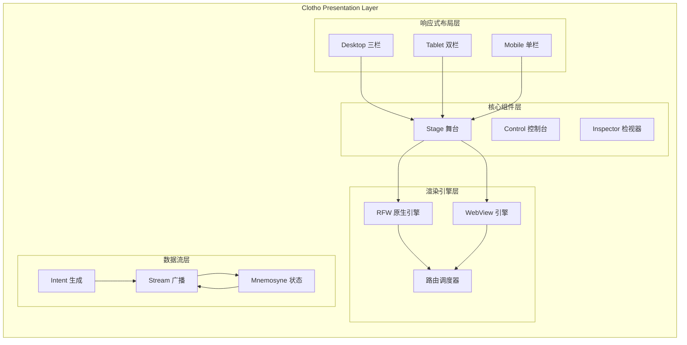
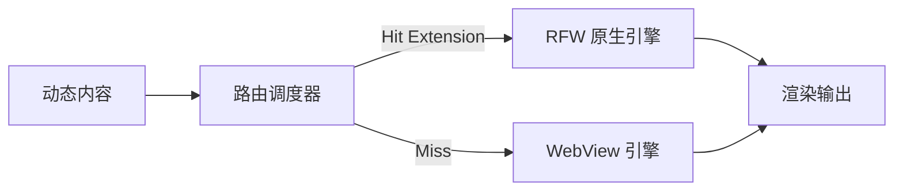
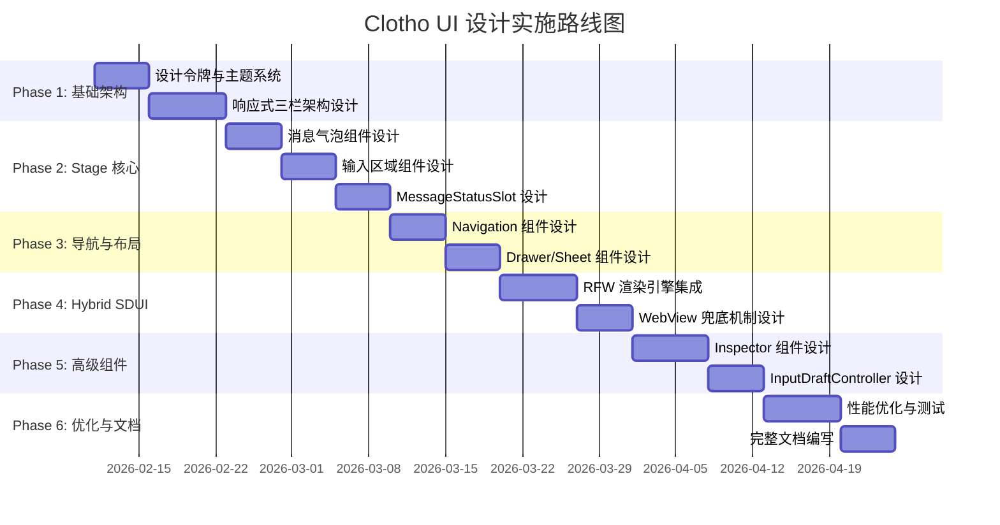

# Clotho 表现层 UI 设计路线图 (Presentation Layer UI Design Roadmap)

**版本**: 1.0.0
**日期**: 2026-02-11
**状态**: Draft
**基于**: Clotho v2.x Architecture, Flutter Material 3, Hybrid SDUI
**参考**: `00_active_specs/presentation/README.md`, `99_archive/legacy_ui/`

---

## 1. 背景与目标 (Background & Objectives)

### 1.1 背景

Clotho 项目采用全新的架构设计，与原有的 SillyTavern 风格 UI 存在根本性差异：

| 维度 | 旧 UI (SillyTavern) | 新 UI (Clotho) |
| :--- | :--- | :--- |
| **技术栈** | HTML/CSS/JavaScript | Flutter Material 3 |
| **渲染方式** | 单一 Web 渲染 | Hybrid SDUI (RFW + WebView) |
| **布局架构** | 单栏固定布局 | 响应式三栏架构 |
| **数据流** | 直接 DOM 操作 | 单向 Intent 流 |
| **状态管理** | 分散式状态 | Mnemosyne 统一权威 |

### 1.2 核心目标

1. **架构对齐**: UI 设计必须符合 Clotho 的三层物理隔离架构原则
2. **跨平台一致性**: 确保 Windows 桌面端与 Android 移动端拥有统一的视觉语言
3. **高性能**: 实现 60fps+ 的流畅渲染，响应时间 < 100ms
4. **可扩展性**: 支持 Hybrid SDUI 双轨渲染，兼顾原生性能与生态兼容性
5. **用户体验**: 遵循 Stage & Control 布局哲学，区分沉浸区与控制区

---

## 2. 旧 UI 资产分析 (Legacy UI Asset Analysis)

### 2.1 可继承的设计理念

| 资产类别 | 来源文件 | 可继承内容 | 迁移策略 |
| :--- | :--- | :--- | :--- |
| **颜色系统** | `02-颜色系统.md` | 深色主题、语义化颜色概念 | 转换为 Flutter ColorScheme |
| **排版系统** | `03-排版系统.md` | 字号层级、行高规范 | 转换为 Flutter TextTheme |
| **消息气泡** | `12-聊天界面.md` | 圆角、最大宽度、对齐方式 | 适配 Flutter Container/Align |
| **消息状态** | `12-聊天界面.md` | Sending、Error、Editing 等状态分类 | 转换为 Flutter 状态管理 |
| **微交互** | `10-动画与过渡.md` | 动画时长、缓动函数 | 转换为 Flutter Animation API |
| **间距系统** | `01-设计令牌.md` | 间距规范 | 转换为 Flutter EdgeInsets |

### 2.2 需要重新设计的部分

| 资产类别 | 原因 | 新设计方向 |
| :--- | :--- | :--- |
| **布局结构** | 单栏 → 响应式三栏 | AdaptiveScaffold + Stage & Control |
| **组件实现** | HTML/CSS → Flutter Widget | Material 3 组件体系 |
| **状态管理** | 直接 DOM 操作 → 单向 Intent 流 | Stream + Intent 机制 |
| **渲染引擎** | 单一 Web → Hybrid SDUI | RFW 优先，WebView 兜底 |
| **导航系统** | 固定导航 → 响应式导航 | Desktop/Tablet/Mobile 自适应 |

### 2.3 旧 UI 文档映射表

| 旧 UI 文档 | 新文档对应章节 | 迁移优先级 |
| :--- | :--- | :--- |
| `01-设计令牌.md` | 3.2 设计令牌系统 | P0 (高) |
| `02-颜色系统.md` | 3.3 颜色与主题系统 | P0 (高) |
| `03-排版系统.md` | 3.4 排版系统 | P0 (高) |
| `04-按钮组件.md` | 4.2 交互组件 | P1 (中) |
| `05-表单控件.md` | 4.3 表单组件 | P1 (中) |
| `06-卡片组件.md` | 4.4 容器组件 | P1 (中) |
| `07-导航系统.md` | 3.5 导航与布局 | P0 (高) |
| `08-布局网格.md` | 3.5 导航与布局 | P0 (高) |
| `09-弹窗系统.md` | 4.5 弹窗与抽屉 | P1 (中) |
| `10-动画与过渡.md` | 3.6 动画与过渡 | P2 (低) |
| `11-响应式设计.md` | 3.5 导航与布局 | P0 (高) |
| `12-聊天界面.md` | 4.1 Stage 核心组件 | P0 (高) |

---

## 3. 新 UI 架构设计 (New UI Architecture)

### 3.1 整体架构



### 3.2 响应式三栏架构

基于 [`presentation/README.md`](../00_active_specs/presentation/README.md:34-43)：

| 模式 | 宽度 (dp) | 布局策略 | 组件可见性 |
| :--- | :--- | :--- | :--- |
| **Desktop** | > 1200 | **三栏全开** | Nav (左) - Stage (中) - Inspector (右) |
| **Tablet** | 600 - 1200 | **双栏/抽屉** | Nav 收起为 Rail，Inspector 默认隐藏 |
| **Mobile** | <= 600 | **单栏流式** | 仅显示 Stage，其他通过 Drawer/Sheet 呼出 |

### 3.3 Stage & Control 布局哲学

- **Stage (舞台)**: 核心对话区域，最大化展示空间，减少视觉干扰
- **Control (控制台)**: 参数配置与辅助信息，需要时触手可及

### 3.4 Hybrid SDUI 引擎



**渲染优先级**:
1. **Extension Check**: 查询 UI 扩展包注册表
2. **Native Track (优先)**: 若存在匹配的 `.rfw` 包，加载并注入数据
3. **Web Track (兜底)**: 若无匹配包，降级使用 WebView 渲染

---

## 4. 核心组件设计 (Core Components)

### 4.1 Stage 核心组件

| 组件 | 职责 | 参考 | 优先级 |
| :--- | :--- | :--- | :--- |
| **MessageBubble** | 消息气泡渲染 | `12-聊天界面.md` | P0 |
| **MessageStatusSlot** | 消息底部动态容器 | `presentation/README.md` | P0 |
| **ChatInputArea** | 输入区域 | `12-聊天界面.md` | P0 |
| **InputDraftController** | 输入草稿控制器 | `presentation/README.md` | P0 |
| **GenerationIndicator** | 生成状态指示器 | `12-聊天界面.md` | P1 |

### 4.2 Navigation 组件

| 组件 | 职责 | 参考 | 优先级 |
| :--- | :--- | :--- | :--- |
| **NavigationRail** | 桌面端侧边导航 | `07-导航系统.md` | P0 |
| **NavigationDrawer** | 移动端抽屉导航 | `07-导航系统.md` | P0 |
| **BottomSheet** | 移动端底部面板 | `09-弹窗系统.md` | P1 |

### 4.3 Inspector 组件

| 组件 | 职责 | 参考 | 优先级 |
| :--- | :--- | :--- | :--- |
| **StateTreeViewer** | 状态树可视化 | `presentation/README.md` | P1 |
| **SchemaDrivenRenderer** | Schema 驱动渲染器 | `presentation/README.md` | P1 |
| **LorebookViewer** | 世界书查看器 | `06-卡片组件.md` | P2 |

---

## 5. 实施路线图 (Implementation Roadmap)

### 5.1 阶段概览



### 5.2 Phase 1: 基础架构

**目标**: 建立设计令牌系统和响应式布局架构

**任务清单**:
- [ ] 设计令牌系统迁移（参考 `01-设计令牌.md`）
- [ ] 颜色系统转换为 Flutter ColorScheme
- [ ] 排版系统转换为 Flutter TextTheme
- [ ] 响应式三栏架构设计（Desktop/Tablet/Mobile）
- [ ] Stage & Control 布局哲学实现

**交付物**:
- `00_active_specs/presentation/01-design-tokens.md`
- `00_active_specs/presentation/02-color-theme.md`
- `00_active_specs/presentation/03-typography.md`
- `00_active_specs/presentation/04-responsive-layout.md`

**参考旧 UI**:
- `01-设计令牌.md`: CSS 变量 → Flutter 设计令牌
- `02-颜色系统.md`: 语义化颜色 → ColorScheme
- `03-排版系统.md`: 字号层级 → TextTheme
- `11-响应式设计.md`: 断点定义 → Flutter 断点

### 5.3 Phase 2: Stage 核心

**目标**: 设计核心对话区域组件

**任务清单**:
- [ ] 消息气泡组件设计（参考 `12-聊天界面.md`）
- [ ] 输入区域组件设计
- [ ] MessageStatusSlot 设计
- [ ] 生成状态指示器设计
- [ ] 消息状态管理（Sending、Error、Editing 等）

**交付物**:
- `00_active_specs/presentation/05-message-bubble.md`
- `00_active_specs/presentation/06-input-area.md`
- `00_active_specs/presentation/07-message-status-slot.md`

**参考旧 UI**:
- `12-聊天界面.md`: 消息气泡样式、状态分类
- `05-表单控件.md`: 输入框设计

### 5.4 Phase 3: 导航与布局

**目标**: 设计导航系统和布局组件

**任务清单**:
- [ ] NavigationRail 设计
- [ ] NavigationDrawer 设计
- [ ] BottomSheet 设计
- [ ] 响应式布局转换逻辑

**交付物**:
- `00_active_specs/presentation/08-navigation.md`
- `00_active_specs/presentation/09-drawers-sheets.md`

**参考旧 UI**:
- `07-导航系统.md`: 导航组件设计
- `09-弹窗系统.md`: 抽屉和弹窗设计
- `08-布局网格.md`: 布局网格系统

### 5.5 Phase 4: Hybrid SDUI

**目标**: 设计混合渲染引擎

**任务清单**:
- [ ] RFW 渲染引擎集成设计
- [ ] WebView 兜底机制设计
- [ ] 路由调度器设计
- [ ] UI 扩展包注册表设计

**交付物**:
- `00_active_specs/presentation/10-hybrid-sdui.md`
- `00_active_specs/presentation/11-rfw-renderer.md`
- `00_active_specs/presentation/12-webview-fallback.md`

**参考旧 UI**:
- 无直接参考，全新设计

### 5.6 Phase 5: 高级组件

**目标**: 设计 Inspector 和高级交互组件

**任务清单**:
- [ ] Inspector 组件设计
- [ ] StateTreeViewer 设计
- [ ] SchemaDrivenRenderer 设计
- [ ] InputDraftController 设计

**交付物**:
- `00_active_specs/presentation/13-inspector.md`
- `00_active_specs/presentation/14-state-tree-viewer.md`
- `00_active_specs/presentation/15-input-draft-controller.md`

**参考旧 UI**:
- `06-卡片组件.md`: 卡片组件设计
- `04-按钮组件.md`: 按钮交互设计

### 5.7 Phase 6: 优化与文档

**目标**: 性能优化和完整文档

**任务清单**:
- [ ] 性能优化设计（60fps 目标）
- [ ] 动画与过渡设计
- [ ] 完整组件文档编写
- [ ] 设计规范索引更新

**交付物**:
- `00_active_specs/presentation/16-performance.md`
- `00_active_specs/presentation/17-animation.md`
- `00_active_specs/presentation/README.md` (更新)

**参考旧 UI**:
- `10-动画与过渡.md`: 动画设计

---

## 6. 参考旧 UI 的指导原则 (Legacy UI Reference Guidelines)

### 6.1 设计理念迁移

| 旧 UI 概念 | 新 UI 对应概念 | 迁移方式 |
| :--- | :--- | :--- |
| **CSS 变量** | Flutter 设计令牌 | 转换语义，保持数值 |
| **语义化颜色** | Material 3 ColorScheme | 映射到 Material 3 语义 |
| **响应式断点** | Flutter 断点 | 调整为 Material 3 标准 |
| **组件状态** | Flutter 状态管理 | 转换为 Stream/Intent |
| **动画时长** | Flutter Animation | 转换为 Duration 常量 |

### 6.2 迁移检查清单

对于每个旧 UI 文档，执行以下检查：

- [ ] **技术栈转换**: HTML/CSS → Flutter Widget
- [ ] **状态管理**: 直接操作 → 单向数据流
- [ ] **布局适配**: 固定布局 → 响应式布局
- [ ] **性能考虑**: 无明确要求 → 60fps 目标
- [ ] **架构对齐**: 独立组件 → 符合三层架构

### 6.3 迁移示例

#### 示例 1: 消息气泡颜色

**旧 UI (CSS)**:
```css
.mes[is_user="true"] .mes_text {
  background-color: rgba(0, 120, 255, 0.15);
  color: var(--SmartThemeBodyColor);
}
```

**新 UI (Flutter)**:
```dart
Container(
  decoration: BoxDecoration(
    color: Theme.of(context).colorScheme.primaryContainer.withOpacity(0.15),
  ),
  child: Text(
    message.content,
    style: Theme.of(context).textTheme.bodyMedium?.copyWith(
      color: Theme.of(context).colorScheme.onPrimaryContainer,
    ),
  ),
)
```

#### 示例 2: 响应式断点

**旧 UI**:
```css
@media (max-width: 600px) {
  /* Mobile styles */
}
```

**新 UI**:
```dart
final isMobile = MediaQuery.of(context).size.width <= 600;
final isTablet = MediaQuery.of(context).size.width > 600 && 
                 MediaQuery.of(context).size.width <= 1200;
final isDesktop = MediaQuery.of(context).size.width > 1200;
```

---

## 7. 交付物清单 (Deliverables Checklist)

### 7.1 设计规范文档

- [ ] `00_active_specs/presentation/01-design-tokens.md`
- [ ] `00_active_specs/presentation/02-color-theme.md`
- [ ] `00_active_specs/presentation/03-typography.md`
- [ ] `00_active_specs/presentation/04-responsive-layout.md`
- [ ] `00_active_specs/presentation/05-message-bubble.md`
- [ ] `00_active_specs/presentation/06-input-area.md`
- [ ] `00_active_specs/presentation/07-message-status-slot.md`
- [ ] `00_active_specs/presentation/08-navigation.md`
- [ ] `00_active_specs/presentation/09-drawers-sheets.md`
- [ ] `00_active_specs/presentation/10-hybrid-sdui.md`
- [ ] `00_active_specs/presentation/11-rfw-renderer.md`
- [ ] `00_active_specs/presentation/12-webview-fallback.md`
- [ ] `00_active_specs/presentation/13-inspector.md`
- [ ] `00_active_specs/presentation/14-state-tree-viewer.md`
- [ ] `00_active_specs/presentation/15-input-draft-controller.md`
- [ ] `00_active_specs/presentation/16-performance.md`
- [ ] `00_active_specs/presentation/17-animation.md`

### 7.2 更新文档

- [ ] `00_active_specs/presentation/README.md` (更新索引)

---

## 8. 风险与缓解 (Risks & Mitigations)

| 风险 | 影响 | 缓解措施 |
| :--- | :--- | :--- |
| **技术栈差异过大** | 迁移成本高 | 分阶段实施，优先级驱动 |
| **性能目标难以达成** | 用户体验差 | 早期性能测试，优化关键路径 |
| **Hybrid SDUI 复杂度高** | 开发周期长 | 先实现 Webview 兜底，再优化 RFW |
| **旧 UI 资产丢失** | 设计经验浪费 | 建立迁移检查清单，确保可继承内容 |

---

## 9. 关联文档 (Related Documents)

- **[表现层概览](../00_active_specs/presentation/README.md)**: 表现层架构规范
- **[架构原则](../00_active_specs/architecture-principles.md)**: 系统架构原则
- **[分层运行时架构](../00_active_specs/runtime/layered-runtime-architecture.md)**: 运行时架构
- **[Filament 协议](../00_active_specs/protocols/filament-protocol-overview.md)**: 协议规范
- **[旧 UI 索引](../99_archive/legacy_ui/00-索引.md)**: 旧 UI 设计规范索引

---

**最后更新**: 2026-02-11
**文档状态**: 草案，待架构评审委员会审议
