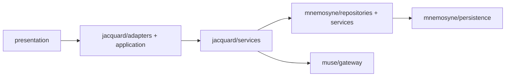

# Clotho V1 实现目录建议 (11_v1_app)

**版本**: 0.1.0
**日期**: 2026-04-08
**状态**: Draft
**作者**: Codex

---

## 1. 文档目的

本文档定义 `11_v1_app/` 的推荐目录结构。

它回答的问题不是“完整 Clotho 最终会长成什么样”，而是：

**为了交付 V1，可执行实现主干应该如何组织，才能既遵守现有架构，又避免继承旧 demo 的原型债。**

本文档与 [`../../00_active_specs/`](../../00_active_specs/README.md) 的关系如下：

- `00_active_specs/` 定义长期架构原则与边界
- `02_active_plans/v1_release/` 定义 V1 裁剪与交付策略
- `11_v1_app/` 是面向 V1 的正式实现目录

## 2. 总体原则

### 2.1 新主干，不直接继承旧 demo

`11_v1_app/` 应视为 **新的正式实现主干**，而不是 `08_demo/` 或 `09_mvp/` 的继续改名。

允许复用旧目录中的以下内容：

- 表现层视觉资产
- 低耦合纯展示组件
- 原型中已验证过的命名、数据对象轮廓与测试思路

不应直接继承以下内容：

- 页面内 mock 状态驱动方式
- in-memory 持久层实现
- 原型期的 provider 装配方式
- 已与当前规格漂移的协议解析与状态写入逻辑

### 2.2 目录结构必须服务于架构边界

V1 的目录结构必须直接体现以下边界：

- Presentation 不直接读写 Mnemosyne 状态树
- Jacquard 负责主编排链路
- Mnemosyne 是唯一状态与持久化权威源
- Muse 只作为模型访问边界
- Persona 资源加载与会话运行态分离

### 2.3 先组织骨架，再迁移内容

在迁移任何旧文件之前，应先建立目标目录、模块职责和依赖方向。
不得先整体复制旧 demo，再在新目录里边跑边拆。

## 3. 推荐顶层结构

建议 `11_v1_app/` 采用如下结构：

```text
11_v1_app/
  README.md
  pubspec.yaml
  analysis_options.yaml
  assets/
    personas/
    presets/
    themes/
  lib/
    main.dart
    bootstrap/
    app/
    shared/
    presentation/
    jacquard/
    mnemosyne/
    muse/
    persona/
    diagnostics/
  test/
    shared/
    presentation/
    jacquard/
    mnemosyne/
    muse/
    integration/
  tool/
```

## 4. lib 目录建议

### 4.1 `lib/main.dart`

职责：

- 应用启动入口
- 初始化 bootstrap
- 启动根应用

不应承担：

- Repository 装配细节
- 数据库 schema 定义
- 业务流程代码

### 4.2 `lib/bootstrap/`

职责：

- 启动时依赖装配
- 环境配置加载
- 数据库初始化
- 调试开关与运行时模式选择

建议文件：

```text
bootstrap/
  app_bootstrap.dart
  service_registry.dart
  environment_config.dart
```

### 4.3 `lib/app/`

职责：

- 应用壳层
- 路由与导航骨架
- 全局主题注册
- 根级 provider / state container 挂载

建议文件：

```text
app/
  clotho_app.dart
  app_router.dart
  app_providers.dart
```

### 4.4 `lib/shared/`

职责：

- 跨模块共享且无业务归属的通用能力
- 设计令牌、主题、基础控件、通用错误类型、结果对象

建议文件夹：

```text
shared/
  theme/
  widgets/
  models/
  utils/
  errors/
  result/
```

复用优先来源：

- `08_demo/lib/theme/`
- `08_demo/lib/widgets/` 中纯展示、无业务耦合部分

### 4.5 `lib/presentation/`

职责：

- Session 列表页
- 聊天主界面
- 输入区
- 消息流式显示
- 只读状态查看器
- 设置页

建议文件夹：

```text
presentation/
  session_list/
  chat/
  state_inspector/
  settings/
```

约束：

- 只调用适配器或应用层用例
- 不直接操作 SQLite
- 不直接操作状态树 patch

### 4.6 `lib/jacquard/`

职责：

- V1 主编排链路
- Context 装载
- PromptBundle 构建
- Filament 输入输出处理
- 与 Muse、Mnemosyne 的边界协作

建议文件夹：

```text
jacquard/
  application/
  adapters/
  domain/
  services/
```

建议职责分布：

- `application/`: 发送消息、恢复会话、提交状态更新等用例
- `adapters/`: 面向 UI 的代理接口与实现
- `domain/`: PromptBundle、FilamentOutput、TurnDraft 等对象
- `services/`: Prompt 渲染、Filament 解析、流水线编排

### 4.7 `lib/mnemosyne/`

职责：

- Session / Turn / Message / ActiveState 的领域对象
- Repository 抽象
- SQLite 持久化实现
- State Updater 与 OpLog 写入

建议文件夹：

```text
mnemosyne/
  domain/
  repositories/
  services/
  persistence/
```

建议职责分布：

- `domain/`: `Session`、`Turn`、`Message`、`StateOperation`
- `repositories/`: 仓库接口
- `services/`: `MnemosyneDataEngine`、`StateUpdater`
- `persistence/`: SQLite 数据源、mapper、repository 实现

### 4.8 `lib/muse/`

职责：

- Provider 配置
- 原始模型调用
- 流式响应适配
- 模型层错误映射

建议文件夹：

```text
muse/
  config/
  gateway/
  models/
```

V1 只保留 Raw Gateway，不实现 Agent Host。

### 4.9 `lib/persona/`

职责：

- Persona 资源发现
- Persona 解析与加载
- Persona 与 Session 启动绑定

建议文件夹：

```text
persona/
  domain/
  repositories/
  loaders/
```

### 4.10 `lib/diagnostics/`

职责：

- 日志
- 调试面板开关
- 开发期诊断输出

建议文件夹：

```text
diagnostics/
  logging/
  debug_views/
```

## 5. test 目录建议

`test/` 应镜像 `lib/` 的主结构，而不是按“开发者临时想到的名字”散放。

建议结构：

```text
test/
  presentation/
  jacquard/
  mnemosyne/
  muse/
  integration/
```

V1 至少应包含：

- `FilamentParser` 单测
- `StateUpdater` 单测
- SQLite repository 单测
- 主对话链路集成测试
- 重启恢复链路集成测试

## 6. 依赖方向

推荐依赖方向如下：



目录级红线：

- `presentation/` 不得依赖 `mnemosyne/persistence/`
- `presentation/` 不得直接依赖 SQLite 包装层
- `muse/` 不得反向依赖 `presentation/`
- `mnemosyne/persistence/` 不得依赖 `presentation/`

## 7. 推荐的最小起步文件

在真正开发功能前，建议先让以下文件存在：

```text
11_v1_app/
  README.md
  pubspec.yaml
  lib/main.dart
  lib/bootstrap/app_bootstrap.dart
  lib/app/clotho_app.dart
  lib/shared/theme/
  test/integration/
```

这样可以先建立“可启动、可继续扩展”的骨架，再逐步补齐实现。

## 8. 不建议采用的结构

以下组织方式不建议在 `11_v1_app/` 中采用：

- 直接把 `08_demo/lib/` 整体复制进来后再慢慢删
- 直接把 `09_mvp/lib/` 作为基座继续演进
- 用单一 `providers/` 目录承载所有跨层职责
- 把协议解析、数据库写入、UI 事件发布混在同一个 service 内

## 9. 与旧目录的关系

建议保留以下目录，但明确其定位：

- `08_demo/`: UI 原型与视觉资产来源
- `09_mvp/`: 架构验证样本与早期实验来源
- `11_v1_app/`: V1 正式实现主干

旧目录不应再承担“继续长成正式产品”的职责。

## 10. 关联文档

- [`./scope-in-out.md`](./scope-in-out.md)
- [`./architecture-slice.md`](./architecture-slice.md)
- [`./frozen-contracts.md`](./frozen-contracts.md)
- [`./milestones.md`](./milestones.md)
- [`./migration-sequence.md`](./migration-sequence.md)

