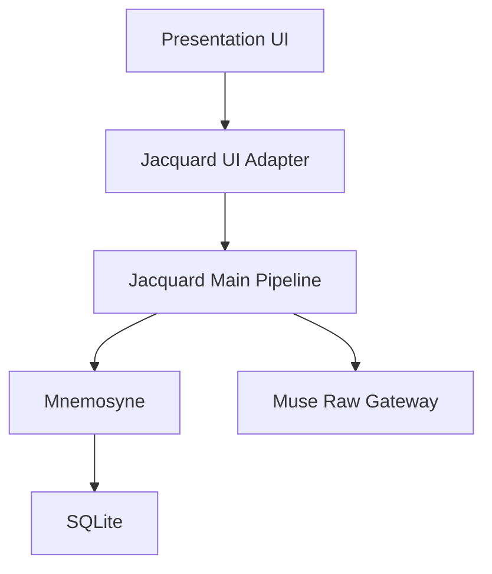

# Clotho V1 架构切片 (Architecture Slice)

**版本**: 0.1.0
**日期**: 2026-04-03
**状态**: Draft
**作者**: Codex

---

## 1. 文档目的

本文档用于回答一个单一问题：

**在完整 Clotho 架构中，V1 实际启用哪一段切片？**

它不重复定义完整系统，而是将 [`00_active_specs/`](../../00_active_specs/README.md) 中的长期设计，裁剪为可交付的 V1 最小架构。

## 2. 切片原则

### 2.1 保留的原则

V1 仍然必须遵守以下核心架构原则：

- UI 不承载业务逻辑
- Mnemosyne 是唯一状态权威源
- Jacquard 负责上下文构建与 LLM 边界编排
- Filament 仅用于 Clotho 与 LLM 的边界协议

参考：

- [`../../00_active_specs/architecture-principles.md`](../../00_active_specs/architecture-principles.md)
- [`../../00_active_specs/runtime/layered-runtime-architecture.md`](../../00_active_specs/runtime/layered-runtime-architecture.md)

### 2.2 主动裁剪的能力

V1 明确裁掉以下复杂度来源：

- 多阶段智能编排
- 多链长期记忆检索
- 双轨 SDUI 渲染生态
- 任务系统与世界模型
- 分支回溯与时间旅行

## 3. V1 模块切片

### 3.1 Presentation

V1 仅启用表现层中的最小主链路：

- Session 列表
- 聊天主界面
- 输入区域
- 消息列表与流式渲染
- 可选的只读状态检视面板

V1 不启用：

- Hybrid SDUI 路由器
- RFW 扩展包
- WebView Fallback
- MessageStatusSlot 外部内容生态

### 3.2 Jacquard

V1 的 Jacquard 不是完整插件矩阵，而是一个 **收缩后的主流水线**：

1. **Load Context**
2. **Build Skein**
3. **Render Prompt**
4. **Invoke LLM**
5. **Parse Filament**
6. **Apply State Update**
7. **Publish UI Events**

V1 暂不启用以下插件：

- Planner
- Scheduler
- Rag Retriever
- Consolidation Worker
- Maintenance Pipeline
- Schema Injector

### 3.3 Mnemosyne

V1 启用 Mnemosyne 的最小持久化骨架：

- `sessions`
- `turns`
- `messages`
- `active_states`
- `state_oplogs`

V1 延后以下数据链：

- `state_snapshots`
- `events`
- `macro_narratives`
- 向量表
- World Model 相关命名空间

### 3.4 Muse

V1 仅保留 **Raw Gateway** 能力：

- Provider 连接
- 流式响应
- 基础错误映射

V1 不启用：

- Muse Agent Host
- Skill Registry
- ReAct / Tool Loop

## 4. V1 运行时切片

### 4.1 保留的层



### 4.2 V1 的运行时层语义

| 层级 | V1 状态 |
|------|---------|
| **L0 Infrastructure** | 保留 |
| **L1 Global Context** | 极简，仅保留必要配置 |
| **L2 Pattern** | 保留 Persona / Pattern 基底 |
| **L3 Threads** | 保留线性 Session + 最小状态树 |

### 4.3 V1 的最小上下文对象

V1 中返回给 Jacquard 的上下文建议收敛为：

```text
V1Context {
  infrastructure: {
    preset
    apiConfig
  }
  world: {
    activeCharacter
    user
  }
  session: {
    id
    history
    state
  }
}
```

以下字段延后：

- planner
- quests
- scheduler
- ragAssets
- macroNarratives

## 5. V1 Filament 切片

V1 只支持以下核心标签：

- `<thought>`
- `<content>`
- `<state_update>`

V1 不支持以下标签族进入正式范围：

- `<tool_call>`
- `<choice>`
- `<ui_component>`
- `<live>`
- 任何扩展 Schema 动态注入标签

## 6. V1 状态切片

### 6.1 最小状态树

建议 V1 状态树仅允许以下根节点：

```text
/character
/session
```

示例：

```json
{
  "character": {
    "name": "Seraphina",
    "mood": "calm",
    "hp": 100
  },
  "session": {
    "turnCount": 12,
    "lastModel": "gpt-4.1"
  }
}
```

### 6.2 最小 OpLog

V1 仅支持以下操作：

- `add`
- `replace`
- `remove`

以下操作延后：

- `move`
- `copy`
- `test`

## 7. V1 接口切片

### 7.1 必须实现的接口边界

| 边界 | V1 要求 |
|------|---------|
| **Presentation → Jacquard** | 使用 `JacquardUIAdapter` 风格代理接口 |
| **Jacquard → Muse** | 使用 Raw Gateway 风格调用接口 |
| **Jacquard → Mnemosyne** | 使用最小上下文加载与状态提交接口 |
| **Mnemosyne → SQLite** | 使用单事务提交 Turn + Message + OpLog |

### 7.2 暂不实现的接口边界

| 边界 | 延后原因 |
|------|----------|
| Schema Injector → Parser | V1 不启用动态协议注入 |
| Muse Agent Host → UI | V1 不启用 Agent 模式 |
| Scheduler → Blackboard | V1 不启用调度器 |

## 8. V1 架构红线

以下行为即使在 V1 中也不得发生：

- UI 直接访问 Mnemosyne 状态树
- LLM 输出未经校验直接写入状态
- 在 Prompt 中承载业务计算逻辑
- 将 RAG / Planner / Hybrid SDUI 混入首条主链路

## 9. V1 之后的自然演进方向

当 V1 主链路稳定后，可按以下顺序扩展：

1. Planner
2. Quest
3. Consolidation
4. RAG
5. Hybrid SDUI
6. Branching / Time Travel
7. Muse Agent Host

## 10. 关联文档

- [`./scope-in-out.md`](./scope-in-out.md)
- [`./frozen-contracts.md`](./frozen-contracts.md)
- [`../../00_active_specs/jacquard/README.md`](../../00_active_specs/jacquard/README.md)
- [`../../00_active_specs/mnemosyne/sqlite-architecture.md`](../../00_active_specs/mnemosyne/sqlite-architecture.md)
- [`../../00_active_specs/protocols/filament-protocol-overview.md`](../../00_active_specs/protocols/filament-protocol-overview.md)
