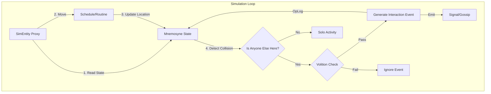

# Clotho 组件设计: Narrative Director (叙事导演)

**版本**: 1.3.0 (Mnemosyne Integrated)
**日期**: 2026-01-14
**状态**: Draft
**类型**: Architecture Spec

---

## 1. 核心理念 (Core Philosophy)

**Narrative Director** 是 Clotho 的宏观仿真引擎。

基于 "Agent-Centric" (以人员为核心) 的设计原则，我们将系统简化为一个 **"生活模拟器" (Life Simulator)**。系统不再上帝视角地操控“谁和谁发生关系”，而是模拟每个独立的 Agent 在做什么。

**原则**:
1.  **自下而上 (Bottom-Up)**: 剧情是 Agent 个人行为的涌现，而非导演的剧本。
2.  **懒加载交互 (Lazy Interaction)**: 只有当两个 Agent 在物理时空发生 **"碰撞 (Collision)"** 时，才推演多人的交互。
3.  **意志优先 (Volition First)**: 即使发生了碰撞，Agent 也有权选择“无视”或“拒绝”，这取决于他们的性格和当前状态。
4.  **动静分离 (Data-Logic Separation)**: Director 是逻辑引擎 (Logic)，Mnemosyne 是状态存储 (Data)。Director 不持有任何持久化状态。

---

## 2. 抽象架构 (Abstract Architecture)

### 2.1 仿真内核 (The Kernel)

内核只关注 **实体 (Entity)** 的状态流转。



### 2.2 运行循环 (Simulation Loop)

1.  **Tick**: 时间流逝。
2.  **State Update**: 遍历所有 Agent，从 Mnemosyne 读取并更新 `SocialBattery`, `Mood`, `Activity`。
3.  **Movement**: 根据日程表 (Schedule) 计算新位置，生成 OpLog 更新 Mnemosyne。
4.  **Collision Detection**: 查询 Mnemosyne 中同一 `location` 的 Agent。
5.  **Resolution**:
    *   **Solo**: 只有一个人 -> 执行独处逻辑 (读书、发呆、睡觉)。
    *   **Group**: 多人 -> 触发 **"社交检定"**。

### 2.3 Mnemosyne 集成 (Data Integration)

Director 不维护自己的数据库，而是直接读写 Mnemosyne 的 **Standard RPG Schema**。

| Director 属性 | Mnemosyne L3 State 路径 (JSON Path) | 类型 (VWD) | 说明 |
| :--- | :--- | :--- | :--- |
| **Entity ID** | `characters.{id}` | Object | 角色根节点 |
| **Location** | `characters.{id}.status.location` | String | 当前物理位置 |
| **Activity** | `characters.{id}.status.activity` | String | 当前行为状态 |
| **Social Battery** | `characters.{id}.status.social_battery` | Number (0-100) | 社交能量 |
| **Mood** | `characters.{id}.status.mood` | Number (0-100) | 情绪值 |
| **Routine** | `characters.{id}.metadata.routine` | Object | 日程配置 (Read-Only) |
| **Traits** | `characters.{id}.traits` | List | 性格标签 |
| **Relationships** | `relationships.{id}.{target_id}` | Object | 关系数据 (v1.2 新增) |

---

## 3. Schema 扩展 (Schema Extensions)

需要在 `mnemosyne/abstract-data-structures.md` 定义的标准 Schema 中增加以下字段。

### 3.1 角色状态扩展 (Character Status Extension)

```json
// Path: characters.{id}.status
{
  "location": ["library", "Library"],
  "activity": ["reading", "Deep Reading"],
  "social_battery": [20, "Low Energy"],
  "mood": [60, "Calm"]
}
```

### 3.2 日程表定义 (Routine Definition)

```json
// Path: characters.{id}.metadata.routine
{
  "default": {
    "08:00": "classroom_2b",
    "12:00": "cafeteria",
    "16:00": "club_room",
    "20:00": "dormitory"
  },
  "weekend": {
    "10:00": "shopping_mall"
  }
}
```

### 3.3 仿真信号/事件 (SimSignal)

仅当交互真正发生时生成，并不持久化存储，而是转化为 `Event Log` 或 `Rumor` 注入上下文。

```typescript
interface SimSignal {
  id: string;
  type: string;        // "interaction", "observation", "rumor"
  participants: string[]; 
  locationId: string;
  result: string;      
  relationChanges: { target: string, value: number }[];
}
```

---

## 4. 关键机制：碰撞与意志 (Collision & Volition)

这是本设计的核心，用于解决“独行侠被强行社交”的问题。

### 4.1 碰撞 (Collision)

物理层面的相遇。
*   `Alice` @ `Library` (from `characters.alice.status.location`)
*   `Bob` @ `Library` (from `characters.bob.status.location`)
*   -> **Collision Detected**.

### 4.2 意志检定 (Volition Check)

心理层面的相遇。

Director 会计算每个参与者的 **Initiative Score (主动分)** 和 **Receptivity Score (接受分)**。

*   **Alice (Loner)**:
    *   `Trait: Loner` (from `characters.alice.traits`) -> -50 Initiative
    *   `Activity: Reading` (from `characters.alice.status.activity`) -> -30 Receptivity
    *   `SocialBattery: Low` (from `characters.alice.status.social_battery`) -> -20 Receptivity
    *   **Total**: 极低主动性，极低接受度。

*   **Bob (Extrovert)**:
    *   `Trait: Chatty` -> +50 Initiative
    *   `Relation: Crush on Alice` (from `relationships.bob.alice.affinity`) -> +30 Initiative
    *   **Total**: 高主动性。

### 4.3 结果推演 (Resolution)

1.  **Bob 尝试发起 (Initiate)**: Bob 试图搭话。
2.  **Alice 判定 (React)**: Alice 的接受度太低 -> **Reject**。
3.  **生成 OpLogs**:
    *   `OpLog`: `characters.bob.status.mood` -= 10 (Frustrated)
    *   `OpLog`: `characters.alice.status.activity` = "Ignoring Bob"
    *   `Log`: "Bob 试图和 Alice 说话，但 Alice 戴着耳机没理他。"

---

## 5. 具体应用模式 (Application Patterns)

### 模式 A: 校园日常 (Slice of Life)

*   **Entity**: 学生/老师。
*   **Routine**: 上课 -> 社团 -> 回家。
*   **Volition**: 取决于性格 (E人/I人) 和当前是不是在赶作业。
*   **Collision**: 发生在 走廊、食堂、社团教室。
*   **结果**: 自然涌现的“偶遇”、“小团体聚会”或“孤独的放学路”。

### 模式 B: 生存恐惧 (Survival Horror)

*   **Entity**: 幸存者/感染者。
*   **Routine**: 搜刮 -> 躲藏 -> 睡觉。
*   **Volition**: 取决于 `Sanity` (理智) 和 `Fear` (恐惧)。
*   **Collision**: 发生在 废墟、补给点。
*   **结果**:
    *   如果两个幸存者相遇，且资源充足 -> **合作**。
    *   如果资源匮乏且理智低 -> **互相攻击/抢夺**。

### 模式 C: 宫廷权谋 (Court Intrigue)

*   **Entity**: 贵族/大臣。
*   **Routine**: 上朝 -> 宴会 -> 密谋。
*   **Volition**: 取决于 `Ambition` (野心) 和 `Caution` (谨慎)。
*   **Collision**: 发生在 走廊、花园、密室。
*   **结果**: 并非每次相遇都产生阴谋，更多时候只是虚与委蛇的寒暄 (Solo masking as Social)。

---

## 6. 总结

通过 **Data-Logic Separation (动静分离)**，Narrative Director 成为 Mnemosyne 的一个轻量级“驱动程序”。

*   **Mnemosyne** 负责“记住”每个人在哪里、心情如何。
*   **Director** 负责“推演”他们下一步去哪里、遇到人会说什么。

这种架构保证了数据的一致性，使得 UI 层可以通过监听 Mnemosyne 的状态变化，实时展示整个世界的动态。
