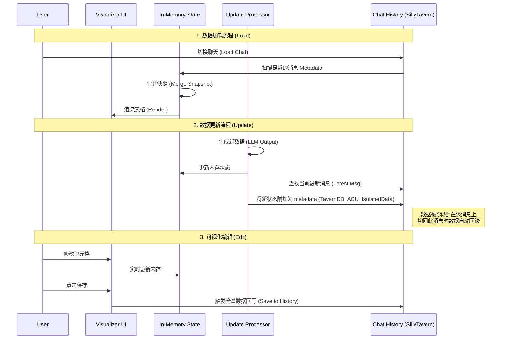
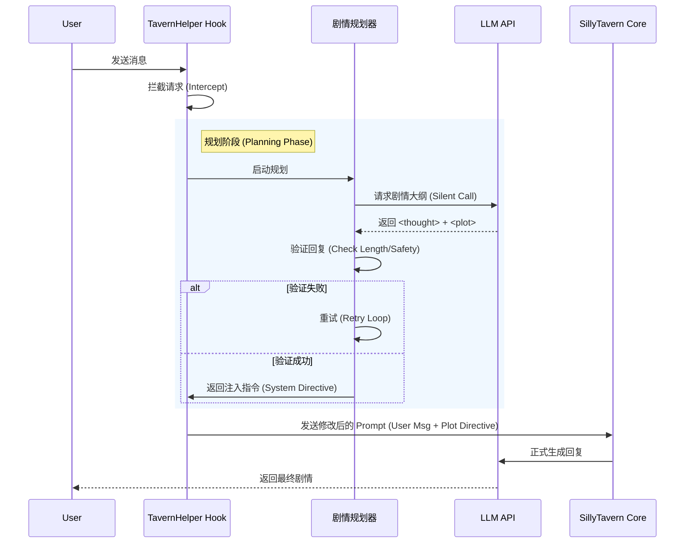

# js-split-merged 插件架构分析图表

## 1. 系统宏观架构图 (System Architecture Panorama)

```mermaid
graph TD
    subgraph Host[SillyTavern Host Environment]
        HostEvents[事件系统 (Event Source)]
        HostAPI[SillyTavern API]
        HostDOM[DOM (Input/Toastr)]
        HostHistory[聊天记录 (Chat History)]
    end

    subgraph Plugin[js-split-merged Plugin]
        Core[核心控制器 (main-initialize.js)]
        
        subgraph DataLayer[数据层 (Data Layer)]
            MemStore[内存状态 (currentJsonTableData_ACU)]
            StorageAdapter[存储适配器 (storage.js)]
            SchemaDef[Schema 定义 (template.js)]
        end
        
        subgraph LogicLayer[逻辑层 (Logic Layer)]
            Planner[剧情规划器 (optimization.js)]
            Updater[自动更新流水线 (processor.js)]
            LoopEngine[时钟循环 (loop.js)]
        end
        
        subgraph ViewLayer[表现层 (View Layer)]
            Visualizer[可视化编辑器 (Visualizer)]
            ToastMgr[消息提示 (Toastr Wrapper)]
        end
    end

    HostEvents -- "CHAT_CHANGED / GENERATION_ENDED" --> Core
    Core -- 调度 --> Planner
    Core -- 调度 --> Updater
    
    Planner -- 读取 --> MemStore
    Updater -- 读取/写入 --> MemStore
    
    Updater -- "Metadata Update" --> HostHistory
    HostHistory -- "Load Snapshot" --> MemStore
    
    Visualizer -- "Render" --> HostDOM
    Visualizer -- "Edit" --> MemStore
    
    LoopEngine -- "Trigger Generate" --> HostAPI
```

## 2. 数据流向与状态同步 (Data Flow & Synchronization)

该图展示了插件如何利用 Chat History 实现数据的"时间旅行"式持久化。



## 3. 剧情推进流水线 (Plot Orchestration Pipeline)

展示 MCTS-like 的规划与执行流程。


