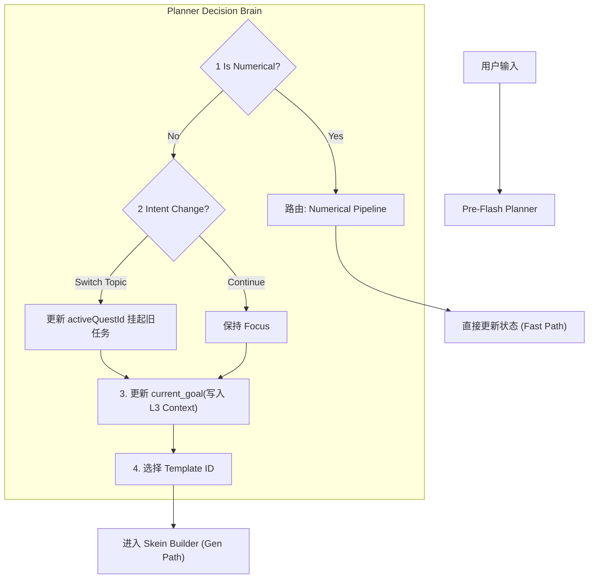
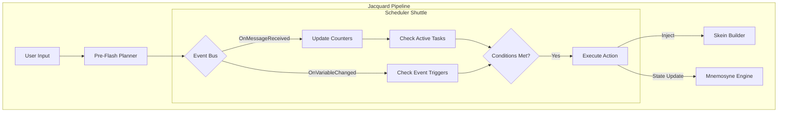
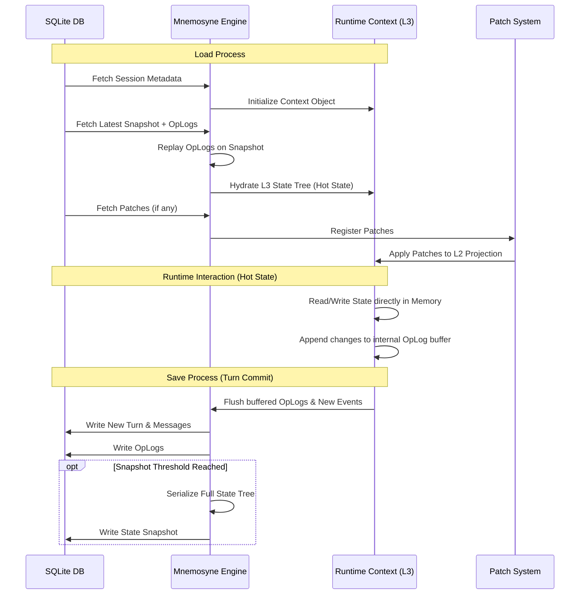
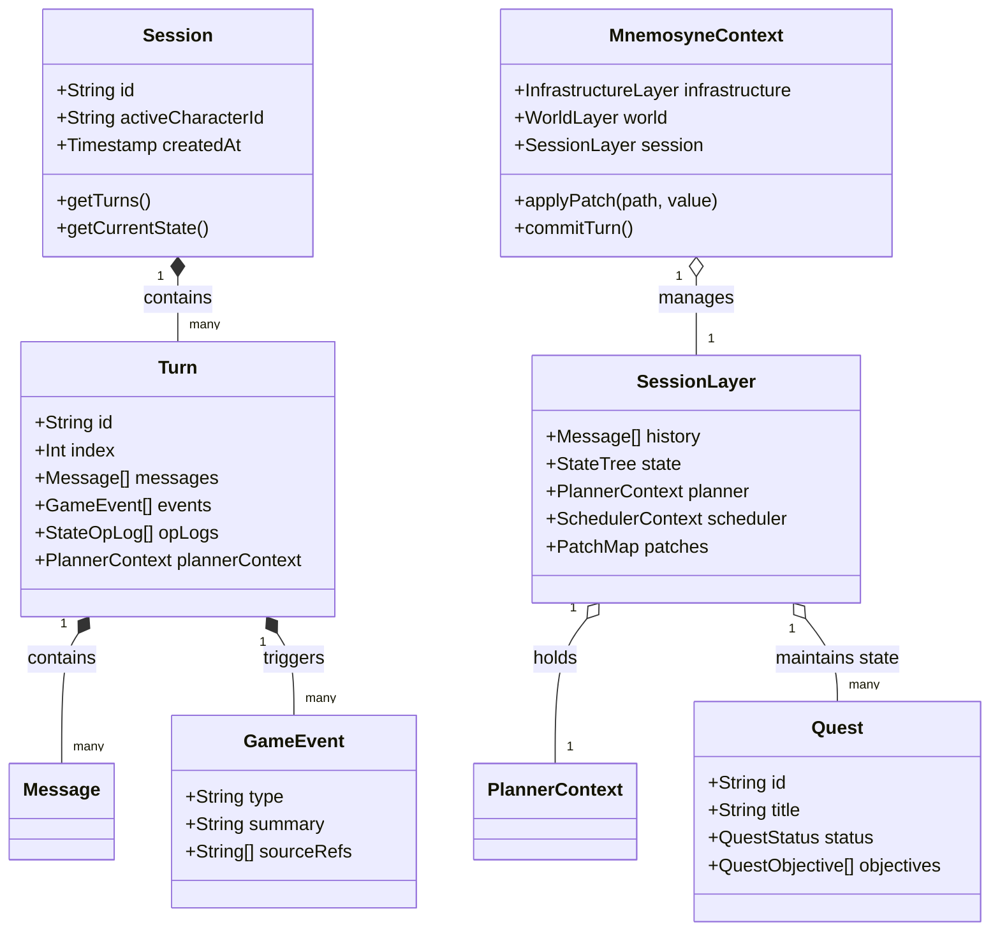

# 项目设计现状与详细介绍文档

**版本**: 1.0.0  
**日期**: 2026-01-10  
**状态**: Generated  
**基准**: `@/00_active_specs/` (Single Source of Truth)

---


## 1. 项目概览 (Executive Summary)

### 1.1 背景与痛点

Clotho 项目的诞生旨在解决当前 AI 角色扮演（RPG）客户端（以 SillyTavern 为代表）面临的根本性挑战。现有方案普遍存在以下痛点：

* **性能瓶颈**：基于 Web 技术栈，在长文本渲染和内存管理上存在先天劣势，随着对话长度增加，性能呈指数级衰减。
* **逻辑混沌**：逻辑处理（Scripting）与界面表现（UI）高度耦合，且过度依赖不稳定的 LLM 进行逻辑判断。
* **时空错乱**：在频繁的回溯（Undo）、重绘（Reroll）与分支（Branching）操作中，上下文状态容易失去一致性。

### 1.2 核心愿景与定位

Clotho 定位为一个**高性能、跨平台、确定性与沉浸感并存**的次世代 AI RPG 客户端。

* **技术栈**：摒弃 Web 架构，拥抱 **Flutter** 生态，实现 Windows、Android 等多端的原生高性能体验。
* **核心价值**：通过严格的架构分层，实现“逻辑升级不破坏界面，界面重构不影响逻辑”的稳健系统。

### 1.3 设计哲学：凯撒原则 (The Caesar Principle)

项目遵循核心设计哲学 **"Hybrid Agency"（混合代理）**，具体体现为 **凯撒原则**：

> **"Render unto Caesar the things that are Caesar's, and unto God the things that are God's."**
> **(凯撒的归凯撒，上帝的归上帝)**

* **凯撒的归凯撒 (Code's Domain)**：逻辑判断、数值计算、状态管理、流程控制。这些必须由确定性的代码（Jacquard/Mnemosyne）严密掌控，**绝不外包给 LLM**。
* **上帝的归上帝 (LLM's Domain)**：语义理解、情感演绎、剧情生成、文本润色。这是 LLM 的“神性”所在，系统应让其专注于此，不被琐碎的计算任务干扰。

---

## 2. 系统架构与设计理念 (System Architecture & Design Philosophy)

### 2.1 整体架构图景

Clotho 采用严格的三层物理隔离架构，各层通过明确的协议交互：

* **表现层 (The Stage)**：负责可视化的像素渲染与用户交互，**无业务逻辑**。
* **编排层 (The Loom - Jacquard)**：系统的“大脑”，负责确定性的流程编排与 Prompt 组装。
* **数据层 (The Memory - Mnemosyne)**：系统的“海马体”，负责数据的存储、检索与动态快照生成。
* **基础设施 (Infrastructure)**：基于依赖倒置 (DIP) 的跨平台底座，提供统一的硬件访问与总线服务 (ClothoNexus)。

### 2.2 运行时架构：织卷模型 (The Tapestry)

运行时环境被解构为 **"织卷编织模型 (Tapestry Weaving Model)"**，包含四个逻辑层次（L0-L3）：

1. **L0 Infrastructure (骨架)**：Prompt Template (ChatML/Alpaca)、API 配置。
2. **L1 Environment (环境)**：用户 Persona、全局 Lorebook。
3. **L2 The Pattern (织谱)**：即传统的“角色卡”，定义角色的初始静态设定（只读）。
4. **L3 The Threads (丝络)**：记录角色的成长、记忆与状态变更（读写）。

**核心机制：Patching (写时复制)**
L3 层通过 **Patching** 机制对 L2 层进行非破坏性修改。角色的成长（如属性提升、设定变更）存储为 L3 的补丁，而不修改 L2 的原始文件，从而支持基于同一角色的无限“平行宇宙”存档。

---

## 3. 功能模块与详细规格 (Functional Modules & Specifications)

### 3.1 Jacquard 编排层 (The Loom)

Jacquard 是一个插件化的流水线执行器 (Pipeline Runner)。

* **流水线机制**：包含 Planner (意图规划)、Skein Builder (上下文构建)、Template Renderer (Jinja2 渲染)、Invoker (LLM 调用)、Parser (协议解析) 等标准插件。
* **Skein (绞纱)**：一种异构容器，取代传统的字符串拼接。它模块化地管理 System Prompt、History、Lore 等内容，支持动态裁剪与排序。
* **Jinja2 宏系统**：集成 Jinja2 引擎，支持在 Prompt 组装阶段进行安全的逻辑控制（如条件渲染），实现了“晚期绑定 (Late Binding)”。

### 3.2 Mnemosyne 数据引擎

Mnemosyne 超越了静态存储，是一个**动态上下文生成引擎**。

* **多维上下文链**：
  * **History Chain**：线性对话记录。
  * **State Chain**：基于 **VWD (Value with Description)** 模型的 RPG 状态树，支持 `[Value, Description]` 结构，兼顾程序计算与 LLM 理解。
  * **Event Chain**：关键剧情节点。
* **快照机制 (Punchcards)**：根据时间指针 (Time Pointer) 瞬间生成任意时刻的世界状态快照，支持无损的时间回溯 (Undo/Redo)。
* **元数据控制 ($meta)**：支持多级模板继承、细粒度删除保护和访问控制 (ACL)。

### 3.3 Muse 智能服务

MuseService 是系统的智能中枢，采用分层治理模型：

* **Layer 1: Raw Gateway (透明网关)**：为 Jacquard 提供直通底层的 LLM 访问，不做任何处理，确保编排层的绝对控制权。
* **Layer 2: Agent Host (Agent 宿主)**：为 UI 组件、导入向导等提供开箱即用的 Agent 能力，内置上下文管理和技能系统（如代码转换、联网搜索）。

### 3.4 The Stage 表现层

* **Hybrid SDUI (混合驱动 UI)**：
  * **Native Track**：使用 Flutter/RFW 渲染高性能官方组件。
  * **Web Track**：使用 WebView 渲染复杂的第三方动态内容（如 HTML 状态栏），确保生态兼容性。
* **Stage & Control 布局**：区分沉浸式对话区 (Stage) 与控制台 (Control)，采用响应式三栏设计适配 Desktop/Mobile。
* **Inspector**：提供基于 Schema 的数据可视化调试工具。

### 3.5 Filament 协议体系

Filament 是系统的通用交互语言，消除了自然语言与机器指令的模糊地带。

* **设计原则**：**非对称交互**。
  * **Input (Prompt)**: **XML + YAML**。利用 XML 构建骨架，YAML 描述数据，降低 Token 消耗。
  * **Output (Instruction)**: **XML + JSON**。利用 XML 标识意图（如 `<thought>`, `<content>`），JSON 描述严格参数（如 `<variable_update>`, `<tool_call>`）。
* **标签体系**：包含 `<status_bar>`, `<choice>`, `<ui_component>` 等标签，支持富交互。

### 3.6 工作流：织谱导入与迁移

* **策略**：深度分析 -> 双重分诊 -> 专用通道。
* **分诊机制**：将世界书分为基础/指令/代码三类，将正则脚本分为替换/清洗/UI注入三类。
* **处理**：EJS 代码自动转换为 Jinja2，复杂 HTML 脚本封装至 WebView 沙箱。

---

## 4. 具体展示
### 4.1. jacquard 
#### 4.1.1. 核心组件：规划器 (Planner)
##### 4.1.1.1. 概述 (Overview)

**Pre-Flash (Planner) Plugin** 是 Jacquard 编排流水线中的第一道关卡，也是整个 Clotho 系统的“副官 (Adjutant)”。它的核心使命是在主生成模型 (Main LLM) 介入之前，对当前的对话上下文进行**战术分析**和**聚焦管理**。

它不负责生成最终的回复文本，而是负责回答三个关键问题：
1.  **Intent**: 用户现在想做什么？（闲聊？推进剧情？还是查数值？）
2.  **Focus**: 我们应该聚焦于哪个任务？（继续当前话题？还是响应打断？）
3.  **Strategy**: 我们该用什么模板和策略来生成回复？

---

##### 4.1.1.2. 核心职责 (The 4 Pillars)

Planner 的功能构建在四大支柱之上，确保 AI 的行为既具有长期的连贯性，又具备短期的灵活性。

##### 4.1.1.2.1 意图分流 (Triage)

识别用户输入的性质，决定将其路由到哪个处理管线。这是系统的“快速反应机制”。

*   **数值化交互 (Numerical Route)**:
    *   **特征**: 短文本、高频、重复性强、无复杂语义（如“摸摸头”、“每日签到”）。
    *   **处理**: 绕过 Skein Builder 和 Main LLM，直接调用 `State Updater` 修改数值，并返回预设的反馈（如 `*affinity +1*`）。
    *   **价值**: 节省 Token 成本，防止无意义文本污染 Context Window。
*   **剧情化交互 (Narrative Route)**:
    *   **特征**: 需要理解、需要生成、涉及复杂逻辑。
    *   **处理**: 进入标准的 Jacquard 生成流水线。

##### 4.1.1.2.2 聚焦管理 (Focus Management)

这是 v1.3 引入的 **"聚光灯 (Spotlight)"** 机制。Planner 负责管理 L3 State 中的 `activeQuestId` 指针。

*   **背景**: 系统中可能同时存在多个 `active` 状态的任务（如“主线”、“支线A”、“支线B”）。
*   **逻辑**:
    1.  **检测切换**: 分析用户输入是否包含“打断”、“切换话题”或“启动新任务”的意图。
    2.  **更新指针**:
        *   **保持 (Keep)**: 如果用户仍在聊当前话题，保持 `activeQuestId` 不变。
        *   **切换 (Switch)**: 如果用户明显转向（如“先别管这个了，快看那只猫！”），将 `activeQuestId` 指向新的任务 ID（或创建新任务）。
        *   **挂起 (Suspend)**: 旧任务的状态保留在后台，等待未来被唤醒。

##### 4.1.1.2.3 目标规划 (Goal Planning)

在确定了“焦点”之后，Planner 需要为 Main LLM 设定具体的战术目标。

*   **操作**: Planner 直接修改 L3 Session State 中的 `planner_context` 对象。
*   **写入内容**:
    *   `current_goal`: 当前回合的显式目标（如“引导玩家发现受伤的猫”）。
    *   `pending_subtasks`: 待解决的子问题列表。
*   **意义**: Main LLM 在随后的 Prompt 中会直接看到这个 `current_goal`，从而生成高度聚焦的内容，避免“不知所措”。

##### 4.1.1.2.4 策略选型 (Strategy Selection)

决定使用哪个 **Skein Template** 来构建 Prompt。

*   **场景示例**:
    *   **日常对话**: 使用标准 `Chat Template`。
    *   **战斗遭遇**: 使用 `Combat Encounter Template` (强调数值、回合制逻辑)。
    *   **回忆模式**: 使用 `Flashback Template` (强调叙事、弱化当前状态)。
*   **产出**: `PlanContext.templateId`。

---

##### 4.1.1.3. 决策工作流 (Decision Workflow)



---

##### 4.1.1.4. 数据权限与交互 (Data Interactions)

Planner 拥有系统中最特殊的权限集，因为它处于“生成前 (Pre-Generation)”的上帝视角。

##### 4.1.1.4.1 Read Access (读权限)
*   **History Chain**: 读取最近的 N 条对话，用于判断上下文连贯性。
*   **Active Quests**: 读取 `state.quests` 中所有活跃任务的状态，以便决定切换目标。
*   **Lorebook Metadata**: 读取世界书目录，辅助策略选择。

##### 4.1.1.4.2 Write Access (写权限)
*   **Planner Context**:
    *   **对象**: `state.planner_context`
    *   **时机**: **Before** Prompt Generation (在 Skein Builder 运行之前)。
    *   **性质**: 这是 **Hard Write**（直接修改内存对象），而非 Soft Suggestion。
*   **Quest Pointers**:
    *   **对象**: `state.planner_context.activeQuestId`
    *   **作用**: 改变系统关注的焦点任务。

---

##### 4.1.1.5. 与其他组件的关系

| 组件 | 关系 |
| :--- | :--- |
| **Skein Builder** | 下游消费者。Builder 根据 Planner 指定的 `templateId` 和 `planner_context` 来组装 Prompt。 |
| **Main LLM** | 执行者。LLM 不需要猜测“我要做什么”，而是直接执行 `planner_context.current_goal`。 |
| **State Updater** | 后处理者。Updater 负责解析 LLM 执行后的结果，并更新 Quest 的具体进度（如 1/3 -> 2/3）。 |

##### 4.1.2. 调度穿梭机 (Scheduler Shuttle) 

##### 4.1.2.1. 组件概述

**Scheduler Shuttle** 是 Jacquard 编排层中的一个核心插件（Plugin），负责执行**基于时间和事件的自动化任务**。它实现了 LittleWhiteBox (LWB) 风格的精细化调度逻辑，遵循 **"凯撒原则"**，即调度逻辑属于确定性的代码领域，必须由系统精确控制。

##### 4.1.2.1.1 核心职责

1.  **事件监听 (Event Listening)**: 订阅系统生命周期事件（如 `OnMessageReceived`, `OnVariableChanged`）。
2.  **计数器维护 (Counter Maintenance)**: 自动更新 Mnemosyne 中的 `scheduler_context`（楼层计数、时间戳）。
3.  **规则评估 (Rule Evaluation)**: 检查活跃的调度任务（Scheduler Tasks），判断是否满足触发条件。
4.  **动作执行 (Action Execution)**: 执行满足条件的任务动作，如注入 Prompt、更新状态或强制回复。

---

##### 4.1.2.2. 架构集成

Scheduler Shuttle 作为 Jacquard 流水线的一环，与 Event Bus 和 Mnemosyne 紧密交互。



---

##### 4.1.2.3. 调度逻辑 (Scheduling Logic)

##### 4.1.2.3.1 计数器系统 (Counters)

Scheduler 维护以下核心计数器，存储于 Mnemosyne 的 `scheduler_context.counters` 中：

| 计数器 | 定义 | 更新时机 |
| :--- | :--- | :--- |
| **total_floor** | 总消息数 | 任意角色 (User/Model) 发送消息后 +1 |
| **user_floor** | 用户消息数 | 仅 User 发送消息后 +1 |
| **model_floor** | 模型回复数 | 仅 Model 发送回复后 +1 |
| **last_interaction_ts**| 最后交互时间 | 任意消息发送后的 Unix 时间戳 |

##### 4.1.2.3.2 触发类型 (Trigger Types)

调度任务支持以下触发器：

##### 4.1.2.3.2.1 间隔触发 (Interval)
基于楼层计数的模运算触发。
- **参数**: `counter` (计数器名), `mod` (模数)
- **逻辑**: `state.counters[counter] % mod == 0`
- **示例**: 每 10 楼触发一次环境描写。

##### 4.1.2.3.2.2 事件触发 (Event)
基于系统事件或变量变更触发。
- **参数**: `event` (事件名), `condition` (条件表达式)
- **逻辑**: 当事件发生且条件为真时触发。
- **示例**: 当 `character.health < 20` 时触发受伤状态。

##### 4.1.2.3.2.3 时间触发 (Time) - *Planned*
基于真实世界时间或游戏内时间流逝触发。
- **参数**: `interval` (时间间隔)
- **逻辑**: `current_ts - last_triggered_ts >= interval`

##### 4.1.2.3.3 冷却机制 (Cooldown)

为了防止任务过于频繁触发，每个任务可以定义 `cooldown`（冷却回合数）。
- **检查**: `current_floor - task.last_triggered_floor >= task.cooldown`
- **更新**: 任务触发后，更新 `last_triggered_floor`。

---

##### 4.1.2.4. 配置规范 (Configuration Spec)

调度规则作为 **元数据 (Metadata)** 存在于 `World Info` 或 `Character Card` 中。

**JSON 结构**:

```json
{
  "scheduler_rules": [
    {
      "id": "unique_task_id",
      "type": "interval | event | time",
      "trigger": {
        // Interval
        "counter": "total_floor",
        "mod": 10,
        
        // Event
        "event": "OnVariableChanged",
        "path": "character.hp",
        "operator": "<",
        "value": 20
      },
      "action": [
        {
          "type": "inject_system | force_thought | update_state",
          "content": "String content or JSON value",
          "probability": 1.0 // 0.0 - 1.0
        }
      ],
      "conditions": ["world.location != 'home'"], // 额外前置条件
      "cooldown": 5,
      "enabled": true
    }
  ]
}
```

---

##### 4.1.2.5. 动作系统 (Action System)

当任务触发时，Scheduler 可以执行以下动作：

1.  **Inject System/User**: 向当前回合的 Skein 中注入临时的 System 或 User 指令（不存入历史）。
2.  **Force Thought**: 强制模型输出一段思维链（Thought Block），常用于引导剧情走向。
3.  **Update State**: 直接修改 Mnemosyne 中的状态变量（如减少金币、给予物品）。
4.  **Suspend/Resume Task**: 动态控制其他调度任务的启用状态。

---

##### 4.1.2.6. 安全与限制 (Safety & Limits)

为了防止死循环和资源滥用，Scheduler 实施以下限制：

1.  **Max Recursion Depth**: 单次 Pipeline 执行中，`OnVariableChanged` 触发链的最大深度限制为 3。
2.  **Unique Trigger**: 同一回合内，同一 Task ID 只能触发一次。
3.  **Sandboxed Evaluation**: 条件表达式必须在受限沙箱中执行，禁止访问文件系统或网络。


#### 4.2. Mnemosyne 
##### 4.2.1.抽象数据结构设计 (Abstract Data Structures)

---

##### 4.2.1.1. 设计概述 (Design Overview)

本文档定义了 Mnemosyne 引擎在 **内存中** (In-Memory) 和 **应用层** (Application Layer) 交互时使用的核心数据结构。这些结构充当了 SQLite 物理存储与运行时逻辑之间的桥梁。

设计遵循以下原则：
- **平台无关性 (Platform Agnostic)**: 仅使用标准数据类型，不依赖特定语言（如 TypeScript/Python）的特性，便于移植。
- **不可变性 (Immutability)**: 鼓励使用不可变对象，特别是在 Snapshot 和 History 链的处理中。
- **分层清晰**: 明确区分 `PersistedEntity` (持久化实体) 和 `RuntimeContext` (运行时上下文)。
- **VWD 原生支持**: 状态管理深度集成 Value-With-Description 模型。

---

##### 4.2.1.2. 核心实体 (Core Entities)

这些实体直接映射到数据库表结构，但在应用层可能包含额外的便利方法或展开的 JSON 字段。

##### 4.2.1.2.1 会话 (Session)

`Session` 是存档的根节点，代表一个独立的时间线。

- **id**: String (UUID)
- **title**: String
- **activeCharacterId**: String
- **createdAt**: Timestamp (Unix ms)
- **updatedAt**: Timestamp (Unix ms)
- **meta**: Dictionary<String, Any> (扩展元数据)

##### 4.2.1.2.2 回合 (Turn)

`Turn` 是时间的基本单位，是原子性的事务边界。在持久化层（数据库）中，Turn 尽可能的存储增量（Messages, Events, OpLogs）以节省空间。

- **id**: String (UUID)
- **sessionId**: String (Session ID)
- **index**: Integer (全局递增序列号)
- **createdAt**: Timestamp
- **messages**: List<Message> (可选，懒加载)
- **events**: List<GameEvent> (可选，懒加载)
- **stateSnapshot**: StateSnapshot (可选，仅当此 Turn 触发快照时存在)
- **opLogs**: List<StateOpLog> (可选)
- **plannerContext**: PlannerContext (可选，用于持久化当前 Turn 的规划上下文)

##### 4.2.1.2.2.1 活跃回合 (Active Turn)

在 **运行时内存** 中，Mnemosyne 维护一个特殊的 `ActiveTurn` 概念。它不直接对应数据库表，而是当前会话的"热端点" (Hot Endpoint)。

- **目的**: 维护当前全量的状态树 (State Tree) 和上下文，避免每次交互都重新计算。
- **生命周期**:
    1. **Session Load**: 基于最近快照 + OpLogs 重建，生成初始的 Active Turn。
    2. **Runtime**: 所有的读取操作直接访问内存中的 `state`。所有的写入操作先更新内存 `state`，同时追加到 `opLogs` 缓冲区。
    3. **Turn Commit**: 当回合结束时，将缓冲区内的 `messages`, `events`, `opLogs` 刷入数据库，并根据策略决定是否生成 `stateSnapshot`。
    4. **Context Switch**: 仅在切换 Session 时或者是回滚的时候销毁当前 Active Turn 并重新执行 Load。

##### 4.2.1.2.3 消息 (Message)

`Message` 记录了对话和交互的原始内容。

- **id**: String (UUID)
- **turnId**: String (Turn ID)
- **role**: Enum { user, assistant, system, pre_flash, post_flash }
- **content**: String
- **type**: Enum { text, thought, command }
- **isActive**: Boolean (支持软删除/隐藏)
- **meta**: Dictionary<String, Any> (Token 消耗, 模型名称等)

##### 4.2.1.2.4 事件 (Event)

`GameEvent` 是结构化的事实记录，用于逻辑判断和 RAG。

- **id**: String (UUID)
- **turnId**: String (Turn ID)
- **type**: Enum { plot_point, item_get, location_change, relationship_change, quest_update }
- **summary**: String (简短描述)
- **participants**: List<String> (涉及的角色 ID 列表)
- **location**: String (可选)
- **payload**: Dictionary<String, Any> (灵活的事件数据, e.g. `{ itemId: "sword_01", count: 1 }`)
- **sourceRefs**: List<String> (关联的原始 Message ID)

##### 4.2.1.2.5 叙事日志 (Narrative Log)

`NarrativeLog` 用于长时记忆和 RAG 检索。

- **id**: String (UUID)
- **turnId**: String (Turn ID)
- **level**: Enum { micro, macro }
- **content**: String
- **scope**: Enum { global, shared, private }
- **ownerId**: String (可选, if scope is private)
- **vectorId**: String (关联向量库 ID)

##### 4.2.1.2.6 规划上下文 (Planner Context)

v1.2 新增，用于长线目标管理。PlannerContext 随 Turn 变化，是 Turn 的一部分。它充当了 "Attention Mechanism" (注意力机制)，决定了当前回合 LLM 聚焦于哪个 Active Quest。

- **currentGoal**: String (当前回合的战术目标，如 "Pick the lock")
- **activeQuestId**: String (当前聚焦的 Quest ID, 指向 `state.quests` 中的条目)
- **currentObjectiveId**: String (当前聚焦的 Quest Objective ID)
- **pendingSubtasks**: List<String> (待办子任务列表 - 仅限当前战术层面的小步骤)
- **lastThought**: String (上一轮的思维链残留)
- **archivedGoals**: List<String> (已完成目标, 可选)

##### 4.2.1.2.7 调度上下文 (Scheduler Context)

v1.4 新增，用于支持 LittleWhiteBox 风格的精细化间隔控制和事件触发。

- **counters**: Dictionary<String, Integer> (全局计数器)
    - **total_floor**: 总消息数
    - **user_floor**: 用户发送数
    - **model_floor**: 模型回复数
    - **last_interaction_ts**: 最后交互时间戳 (Unix ms)
- **tasks**: Dictionary<String, SchedulerTaskState> (任务状态追踪)

##### 4.2.1.2.7.1 调度任务状态 (SchedulerTaskState)

- **last_triggered_floor**: Integer (上次触发时的 total_floor)
- **last_triggered_ts**: Timestamp (上次触发的时间戳)
- **trigger_count**: Integer (触发次数)
- **status**: Enum { active, suspended, completed }
- **cooldown_remaining**: Integer (剩余冷却回合数)

##### 4.2.1.2.8 任务与长线剧情 (Quest & Macro-Event)

v1.3 新增，用于管理 **状态化 (Stateful)** 的长线剧情。与 `GameEvent` (只读日志) 不同，Quest 驻留在 L3 的 `state.quests` 中，拥有生命周期。

##### 4.2.1.2.8.1 Quest (任务/宏观事件)

- **id**: String (UUID or Unique Slug, e.g., "quest_escape_dungeon")
- **title**: String
- **description**: String (任务背景描述)
- **status**: Enum { inactive, active, completed, failed, paused }
- **objectives**: List<QuestObjective> (子目标列表)
- **variables**: Dictionary<String, Any> (任务局部变量, e.g. `{ "keys_found": 2 }`)
- **parentQuestId**: String (可选，用于嵌套子任务)
- **startTurn**: Integer
- **endTurn**: Integer (可选)

##### 4.2.1.2.7.2 QuestObjective (任务目标/微观事件)

- **id**: String (Unique Slug within Quest, e.g., "find_key")
- **description**: String
- **status**: Enum { active, completed, failed }
- **isOptional**: Boolean (默认 false)
- **isHidden**: Boolean (默认 false, 隐藏目标)

##### 4.2.1.2.8 世界书条目 (Lorebook Entry)

`LorebookEntry` 是 RAG 的静态知识库源，存储关于世界观、历史、魔法系统等非叙事性知识。

v1.2 引入了 **4-Quadrant Static Taxonomy** 分类法，以支持差异化的注入策略。

- **id**: String (UUID)
- **keys**: List<String> (触发关键词，用于关键词匹配)
- **content**: String (实际内容)
- **category**: Enum { axiom, agent, encyclopedia, directive } (标准化分类)
    - **axiom**: 法则与公理 (注入 System Chain)
    - **agent**: 角色与代理 (注入 Floating Chain 高优先级/浅层)
    - **encyclopedia**: 博物与百科 (注入 Floating Chain 标准/深层)
    - **directive**: 风格与元指令 (注入 Instruction Block/User 附近)
- **activeStatus**: Enum { active, inactive } (是否启用)
- **vectorId**: String (关联向量库 ID, 指向 `vec_lorebook` 表)
- **metadata**: Dictionary<String, Any> (扩展元数据)
    - **injection_policy**: Dictionary<String, Any> (可选，覆盖默认策略)
        - **scope**: Enum { global, session }
        - **position**: Enum { system, floating_head, floating_tail, user_instruction }
        - **priority**: Integer (0-100)

---

##### 4.2.1.3. 状态管理结构 (State Management Structures)

这是 Mnemosyne 最复杂的部分，涉及 VWD 模型、状态树和 Patching 机制。

##### 4.2.1.3.1 VWD 模型 (Value With Description)

为了让 LLM 理解数值的含义，任何状态节点都可以是一个 `[Value, Description]` 元组。

- **结构**: `Value` OR `[Value, String]`
- **Value 类型**: String | Number | Boolean | Null
- **说明**: 在 JSON 中存储为 `[80, "Health Point"]` 或仅仅是 `80`。

##### 4.2.1.3.2 状态元数据 ($meta)

用于定义权限、模板和 UI 呈现。

- **template**: Dictionary<String, Any> (子节点默认模板)
- **required**: List<String> (必填字段)
- **extensible**: Boolean (是否允许 LLM 添加新字段)
- **updatable**: Boolean (是否只读)
- **necessary**: Enum { self, children, all } (删除保护)
- **description**: String (节点本身的描述)
- **uiSchema**: UISchema (v1.2, 定义 Inspector 如何渲染)

**UISchema 结构**:
- **viewType**: Enum { table, list, card, raw }
- **columns**: List<{ key: String, label: String, width: String }> (用于表格视图)
- **icon**: String
- **color**: String

##### 4.2.1.3.3 状态树 (State Tree)

完整的状态树是一个嵌套的字典，包含普通数据和 `$meta` 字段。

- **$meta**: StateMeta (可选)
- **[key]**: Any | StateTree (递归定义)

##### 4.2.1.3.4 操作日志 (OpLog)

基于 JSON Patch (RFC 6902) 标准的变更记录。

- **op**: Enum { add, remove, replace, move, copy, test }
- **path**: String (JSON Pointer, e.g., "/character/hp")
- **value**: Any (新值)
- **from**: String (仅用于 move/copy 操作)
- **turnId**: String (Turn ID)
- **reason**: String (变更原因，调试用)

---

##### 4.2.1.4. 运行时上下文 (Runtime Context)

这是 Jacquard 在执行推理时持有的聚合对象，对应 "Layered Runtime Architecture"。

##### 4.2.1.4.1 Mnemosyne Context (聚合根)

- **infrastructure**: InfrastructureLayer (Read-Only)
  - **preset**: PromptTemplate
  - **apiConfig**: ApiConfiguration

- **world**: WorldLayer (Read-Only Source, patched by L3)
  - **activeCharacter**: ProjectedCharacter (L2 + L3 Patch)
  - **globalLore**: List<LorebookEntry> (L1 + L3 Status)
  - **user**: PersonaData (L1)

- **session**: SessionLayer (Read-Write)
  - **id**: String (Session ID)
  - **turnIndex**: Integer
  - **history**: List<Message> (历史窗口)
  - **state**: StateTree (完整的状态树视图)
  - **planner**: PlannerContext (当前活跃的规划上下文，源自 Turn)
  - **patches**: PatchMap (持久化变更集)

##### 4.2.1.4.2 投影角色 (Projected Character)

L2 静态资源与 L3 Patch 合并后的结果。

- **name**: String
- **description**: String
- **personality**: String
- **firstMessage**: String
- **status**: Dictionary<String, Any> (hp, mp, mood, etc.)
- **inventory**: Dictionary<String, Any>
- **relationships**: Dictionary<String, Any>

##### 4.2.1.4.3 补丁映射 (Patch Map)

L3 层用于存储对 L2/Global 数据的修改。

- **类型**: Dictionary<String, Any>
- **Key**: JSON Path (e.g., "character.description")
- **Value**: The new value

---

##### 4.2.1.5. 数据流转与操作 (Data Flow & Operations)

##### 4.2.1.5.1 数据流转 (Data Flow)

描述数据如何在 SQLite 持久化层与运行时内存层之间转换。



##### 4.2.1.5.2 操作接口 (Operations)

抽象定义了对这些数据结构的核心操作。

##### 4.2.1.5.2.1 状态树操作 (State Tree Operations)

- `getValue(path: String) -> VWDNode | Any`: 获取指定路径的值。
- `setValue(path: String, value: Any, reason: String) -> StateOpLog`: 更新值并生成 OpLog。
- `deleteNode(path: String) -> StateOpLog`: 删除节点（需检查 `$meta.necessary`）。
- `mergeTemplate(path: String) -> void`: 强制应用 `$meta.template` 到当前节点。

##### 4.2.1.5.2.2 补丁操作 (Patch Operations)

- `applyPatch(path: String, value: Any) -> void`: 在内存投影中应用补丁。
- `commitPatches() -> void`: 将内存中的补丁变更持久化到 L3 Session 数据中。

##### 4.2.1.5.2.3 时间旅行操作 (Time Travel Operations)

- `rollback(targetTurnIndex: Integer) -> void`:
    1. 查找 `index <= targetTurnIndex` 的最近快照。
    2. 清除当前内存状态。
    3. 加载快照。
    4. 重放 OpLogs 直到 `targetTurnIndex`。
    5. 截断 `targetTurnIndex` 之后的 History 和 Events。

##### 4.2.1.5.2.4 RAG 检索操作 (RAG Retrieval Operations)

- `search(query: RetrievalQuery) -> List<RetrievalResult>`:
    执行混合检索（向量相似度 + 关键词/元数据过滤）。

**检索请求 (RetrievalQuery)**:
- **text**: String (查询文本)
- **embedding**: List<Float> (查询向量，可选)
- **topK**: Integer (返回数量，默认 5)
- **threshold**: Float (相似度阈值，默认 0.7)
- **filters**: Dictionary<String, Any> (混合检索过滤器, e.g., `{ "turnId": { "$gt": 10 } }`)
- **sources**: List<Enum> { narrative, event, lore } (指定检索源)

**检索结果 (RetrievalResult)**:
- **score**: Float (相似度分数/距离)
- **sourceType**: Enum { narrative, event, lore }
- **content**: String
- **originalId**: String (原始实体的 ID)
- **metadata**: Dictionary<String, Any> (额外上下文，如 Turn ID)

##### 4.2.1.5.3 聚合存储与分支切换 (Aggregated Storage & Branching)

为了支持“时间旅行”和“分支切换”，Mnemosyne 采用了 **Turn-Centric (以回合为中心)** 的存储策略。

##### 4.2.1.5.3.1 Turn 作为聚合根

所有的持久化数据都严格关联到特定的 `Turn ID`。这确保了只要我们能定位到一个 `Turn`，就能检索到该时间点所有的上下文。

*   **关联性**: `Messages`, `Events`, `OpLogs`, `StateSnapshots`, `NarrativeLogs`, `PlannerContext` 都有一个非空的 `turnId` 字段（或直接作为 Turn 的一部分）。
*   **原子性**: 在 SQLite 中，一个 Turn 及其所有附属数据的写入必须在一个数据库事务 (Transaction) 中完成。要么全部写入，要么全部不写入。

##### 4.2.1.5.3.2 分支切换逻辑 (Branch Switching Logic)

当用户决定“从这里重新开始”或切换到一个平行的故事线时，Mnemosyne 执行以下操作：

1.  **Target Identification**: 确定目标切入点 `Target Turn T`.
2.  **Full Context Reconstruction (Rollback/Forward)**:
    *   **State Tree**: 找到 `T` 之前的最近快照 `S`，重放 OpLogs，生成 `T` 时刻的精确 VWD 状态树。
    *   **Event Chain**: 重新加载并索引 `T` 之前的所有关键 `Events` (用于逻辑判断，如 "HasMetKeyNPC")。
    *   **Narrative Chain**: 重新加载 `T` 之前的 `NarrativeLogs` (用于 RAG 上下文注入)。
    *   **Planner Context**: 直接从 `Target Turn T` 加载 `PlannerContext` 对象 (Goals, Subtasks, Thought)。
3.  **Context Pruning (Memory Only)**:
    *   清空内存中的 `ActiveTurn` 缓冲区。
    *   加载 `T` 之前的最后 N 条消息到 `history` 窗口。
    *   将重构后的 State, Events, NarrativeLogs 设置为当前上下文。
4.  **New Timeline Creation (Optional)**:
    *   如果是“分支”，系统可能会创建一个新的 `Session ID` (Fork)，并将 `T` 作为新 Session 的起点（复制一份初始状态）。
    *   如果是“重试” (Retry)，则直接丢弃 `T` 之后的所有 Turns（级联删除），并从 `T` 继续。

##### 4.2.1.5.3.3 级联删除与外键

依赖 SQLite 的 `ON DELETE CASCADE` 特性：

```sql
-- 当删除一个 Turn 时...
DELETE FROM turns WHERE id = 'turn_xyz';

-- 自动删除所有关联数据：
-- - messages WHERE turn_id = 'turn_xyz'
-- - events WHERE turn_id = 'turn_xyz'
-- - state_oplogs WHERE turn_id = 'turn_xyz'
```

---

##### 4.2.1.6. JSON 数据示例 (JSON Examples)

##### 4.2.1.6.1 复合 VWD 状态树

```json
{
  "character": {
    "hp": [85, "Current Health Points"],
    "inventory": {
      "$meta": {
        "uiSchema": { "viewType": "table", "columns": [{"key": "name", "label": "Item"}, {"key": "count", "label": "Qty"}] }
      },
      "potion_01": { "name": "Health Potion", "count": 3, "effect": "Heal 50 HP" }
    }
  }
}
```

##### 4.2.1.6.2 规划上下文 (Planner Context)

```json
{
  "planner_context": {
    "currentGoal": "Infiltrate the Dark Castle",
    "pendingSubtasks": ["Find the sewers entrance", "Obtain a disguise"],
    "lastThought": "The guard mentioned a shift change at midnight.",
    "archivedGoals": ["Cross the Silent River"]
  }
}
```

##### 4.2.1.6.3 调度上下文 (Scheduler Context)

```json
{
  "scheduler_context": {
    "counters": {
      "total_floor": 42,
      "user_floor": 21,
      "model_floor": 21,
      "last_interaction_ts": 1704350000000
    },
    "tasks": {
      "daily_greeting": {
        "last_triggered_floor": 10,
        "trigger_count": 1,
        "status": "active"
      }
    }
  }
}
```

##### 4.2.1.6.4 显式叙事链接 (Event with Source Refs)

```json
{
  "event_id": "evt_12345",
  "type": "item_get",
  "summary": "Obtained the Ancient Key from the Old Man.",
  "timestamp": 1704350000000,
  "sourceRefs": ["msg_turn_10_user", "msg_turn_10_assistant"],
  "payload": { "itemId": "key_ancient", "count": 1 }
}
```

---

##### 4.2.1.7. 类图概览 (Class Diagram)


##### 4.2.2. Mnemosyne 混合资源管理规范 (Hybrid Resource Management Specification)

##### 4.2.2.1. 核心理念与架构 (Core Philosophy & Architecture)

Mnemosyne 的存储架构遵循 **“动静分离，逻辑聚合 (Separate Physically, Aggregate Logically)”** 的核心原则。我们严格区分“只读资产”与“读写状态”，以解决长期运行导致的数据库膨胀和资源复用问题。

##### 4.2.2.1.1 三大存储支柱 (Three Pillars of Storage)

系统将数据存储划分为三个物理隔离的区域，以满足不同的生命周期和管理需求：

1.  **Library (L2 Static)**: 存放 **织谱 (Patterns)**。
    *   **隐喻**: “游戏卡带”或“安装目录”。
    *   **特性**: 只读、可替换、版本化、易于分享。
    *   **内容**: 角色卡元数据、默认立绘、背景音乐、世界观设定 (Lorebook)。
2.  **Session Data (L3 Dynamic)**: 存放 **会话 (Sessions/Tapestries)**。
    *   **隐喻**: “游戏存档”。
    *   **特性**: 读写频繁、私有、依赖 L2 但不包含 L2。
    *   **内容**: 聊天记录、变量状态 (State Tree)、用户上传的图片 (Diff)、Schema 快照。
3.  **The Vault (Global Cache)**: 存放 **共享资源 (Blobs)**。
    *   **隐喻**: “系统动态链接库”或“Steam 公共资源库”。
    *   **特性**: 内容寻址 (Content-Addressable)、去重、惰性加载。
    *   **内容**: 网络图片缓存、跨 Pattern 复用的大型多媒体文件。

##### 4.2.2.1.2 架构全景图

```mermaid
graph TD
    subgraph "Application Layer"
        UI[Presentation Layer]
        L3Session[Session Context (L3)]
    end

    subgraph "Infrastructure Layer: Resource Manager"
        Resolver[Asset Resolver]
        Index[Vault Index (SQLite)]
    end

    subgraph "File System"
        direction TB
        
        subgraph "L2: Library (Read-Only)"
            PatternA[Pattern A (v1.0)]
            PatternB[Pattern B (v2.0)]
        end

        subgraph "L3: User Data (Read-Write)"
            SessionDB[session.db (SQLite)]
            SessionAssets[session_assets/]
        end

        subgraph "The Vault (Global Cache)"
            BlobStore[blobs/]
            CacheIndex[index.db]
        end
    end

    UI -->|Request asset://| Resolver
    L3Session -->|Refers| PatternA
    
    Resolver -->|1. Check| PatternA
    Resolver -->|2. Check| SessionAssets
    Resolver -->|3. Check| BlobStore
    
    BlobStore -.->|Dedup| PatternA
    BlobStore -.->|Dedup| PatternB
```

---

##### 4.2.2.2. 统一引用协议 (URI Scheme)

为了实现物理分离但逻辑透明，系统内部（数据库、内存状态）统一使用 `asset://` 协议引用资源。UI 层无需关心资源实际在何处。

**格式**: `asset://{scope}/{identifier}/{path}`

| Scope | Identifier | Path | 说明 | 物理路径映射示例 |
| :--- | :--- | :--- | :--- | :--- |
| **pattern** | `{uuid}` / `current` | `assets/bgm.mp3` | 引用 L2 织谱包内的资源 | `library/{uuid}/assets/bgm.mp3` |
| **session** | `{uuid}` / `current` | `uploads/img1.png` | 引用 L3 会话私有的资源 | `userdata/sessions/{uuid}/assets/uploads/img1.png` |
| **vault** | `N/A` | `{hash}` | 引用全局去重库的资源 | `cache/vault/blobs/{hash}` |
| **remote** | `N/A` | `{base64_url}` | 引用远程资源 (自动缓存到 Vault) | `cache/vault/blobs/{hash_of_url}` |
| **system** | `N/A` | `icons/user.png` | 引用 App 内置资源 | `FlutterAsset('assets/icons/user.png')` |

---

##### 4.2.2.3. L2: 织谱库设计 (Library Structure)

L2 层的资源被封装为 **Pattern (织谱)**。它是 Mnemosyne 的基本分发单位。

### 3.1 目录结构
建议路径: `app_data/library/`

```text
/app_data/library/
  └── {pattern_uuid}/         # 织谱根目录
      ├── manifest.yaml       # [元数据] 名称, 版本, 作者, 依赖
      ├── pattern.yaml        # [核心定义] Initial State, Prompts, Scripts
      ├── assets/             # [多媒体] 随包分发的资源
      │   ├── default_avatar.png
      │   └── theme.mp3
      ├── lorebook/           # [世界书] 静态源文件
      │   └── main_world.yaml
      └── schemas/            # [可选] 复杂的独立 Schema 定义
```

### 3.2 关键文件职责
*   **`manifest.yaml`**: 定义包的身份。如果资源太大（如 100MB 的背景音乐包），可以在此声明引用远程资源，安装时由管理器下载到 Vault。
*   **`pattern.yaml`**: 定义 `initial_state`。引用的资源通常使用相对路径（解析为 `asset://pattern/current/...`）。

---

## 4. The Vault: 全局资源缓存 (Global Asset Cache)

为了解决多媒体资源在不同织谱和会话之间的高频复用问题，以及网络下载的不确定性，引入 "藏宝阁 (The Vault)"。

### 4.1 设计原则
1.  **只存一份 (Single Instance Storage)**: 无论多少个角色卡引用同一张图，磁盘上只存一份。
2.  **惰性加载 (Lazy Loading)**: 仅在渲染时下载/加载。
3.  **内容寻址**: 文件名即内容的 SHA-256 哈希。

### 4.2 物理结构
建议路径: `app_data/cache/vault/`

*   `blobs/`: 存放实际文件，无扩展名（或作为前缀）。
    *   例如: `e3b0c44298fc1c149afbf4c8996fb92427ae41e4649b934ca495991b7852b855`
*   `index.db`: SQLite 索引，维护 URL -> Hash 的映射。

### 4.3 索引 Schema (`asset_index.db`)

```sql
CREATE TABLE assets (
    url_hash TEXT PRIMARY KEY,      -- 原始 URL 的 Hash
    original_url TEXT,              -- 原始 URL (用于重新下载)
    content_hash TEXT,              -- 文件内容的 SHA-256 (指向 blobs/)
    mime_type TEXT,
    size_bytes INTEGER,
    last_accessed INTEGER,          -- 用于手动清理分析
    etag TEXT                       -- HTTP 缓存校验
);
```

### 4.4 垃圾回收策略 (Garbage Collection)
由于 Vault 存储的是全局共享资源，数据量相对可控。为了避免误删仍在使用中的资源（例如某个极少打开的历史会话引用了该资源），系统 **不自动执行** 基于 LRU 的自动删除。

*   **策略**: **手动清理 (Manual GC)**。
*   **机制**: 用户可以在设置中点击“清理缓存”，此时系统会：
    1.  扫描所有本地 Sessions 和 Library Patterns。
    2.  构建“活跃 Hash 集合” (Active Hash Set)。
    3.  对比 Vault 索引，删除不在集合中的 Blobs。

### 4.5 解析流程 (Resolve Flow)
当 UI 请求 `asset://remote/{base64_url}` 或普通 HTTP URL 时：
1.  **Check**: 查询 `index.db`。
2.  **Hit**: 如果存在且文件完整 -> 返回 `blobs/{content_hash}` 流。
3.  **Miss**:
    *   下载文件到临时区。
    *   计算 SHA-256。
    *   移动到 `blobs/` (如果同名文件已存在则直接删除临时文件)。
    *   更新 `index.db`。
    *   返回流。

---

## 5. L3: 会话数据存储 (Session Storage)

L3 层专注于存储“差异”和“状态”。

### 5.1 物理结构
建议路径: `app_data/userdata/sessions/`

```text
/app_data/userdata/sessions/
  └── {session_uuid}/
      ├── session.db          # [核心] SQLite 数据库
      └── assets/             # [私有资源] 用户上传的图片等
          └── 20260110_upload.png
```

### 5.2 数据库与资源的关系
*   **严禁**将图片、音频存入 `session.db` 的 BLOB 字段。
*   数据库中仅存储 URI，例如: `asset://session/current/assets/20260110_upload.png`。

### 5.3 引用 L2
L3 会话不包含 L2 数据，而是包含一个 **引用指针** (在 `session.db` 的元数据表中)。
*   `pattern_ref`: `{uuid}`
*   `pattern_version`: `1.0.0`

当加载会话时，系统根据指针去 `app_data/library/` 寻找对应的 L2 包。

### 5.4 资源丢失处理 (Dangling References)
如果用户删除了 L2 Pattern，或者 L2 更新后移除了某些资源，导致 `asset://pattern/...` 解析失败：
1.  **UI 表现**: 显示标准占位符（如 "Broken Image" 图标），点击可查看原始 URI。
2.  **修复机制**: 提供 "Asset Repair Wizard"，允许用户重新指定 Pattern 路径，或从 Vault 中查找历史缓存（如果曾经缓存过）。

### 5.5 导出与导入策略 (Export/Import)
为了平衡便携性和完整性，系统支持两种导出模式：

1.  **轻量导出 (Reference Only)**:
    *   **格式**: `.ctp` (Clotho Tapestry Protocol) - 仅包含 `session.db` 和 `session_assets/`。
    *   **场景**: 在同一设备备份，或对方已安装相同 L2 Pattern。
    *   **大小**: 小 (KB ~ MB 级)。

2.  **完整导出 (Self-Contained Bundle)**:
    *   **格式**: `.ctpb` (Clotho Tapestry Bundle) - ZIP 压缩包。
    *   **结构**: 包含 `.ctp` + `dependencies/` (L2 Pattern 的精简副本)。
    *   **场景**: 跨设备分享，确保“开箱即用”。
    *   **导入逻辑**: 导入时，如果本地缺失该 L2 Pattern，则自动将 `dependencies/` 下的内容安装到临时 Library 或提示用户安装。

---

## 6. 总结 (Summary)

| 场景 | 推荐存储位置 | 推荐 URI 协议 | 物理生命周期 |
| :--- | :--- | :--- | :--- |
| **角色立绘 (开发者提供)** | L2 Library (`assets/`) | `asset://pattern/...` | 随 Pattern 安装/卸载 |
| **背景音乐 (大文件/通用)** | The Vault | `asset://vault/...` 或 HTTP | 手动 GC 清理 |
| **用户发送的图片** | L3 Session (`assets/`) | `asset://session/...` | 随会话删除 |
| **App 内置图标** | App Binary | `asset://system/...` | 随 App 更新 |