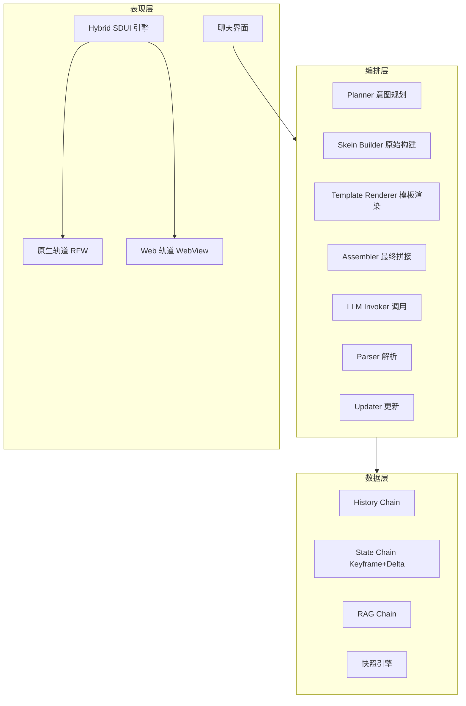
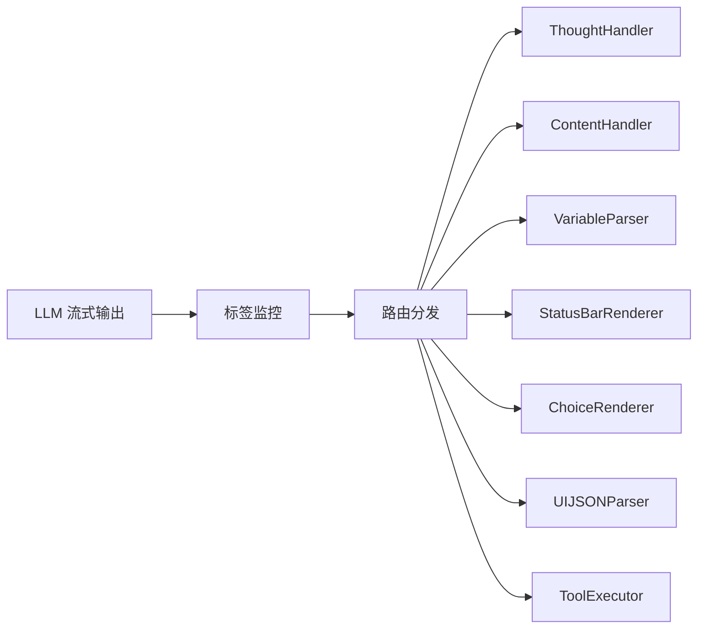
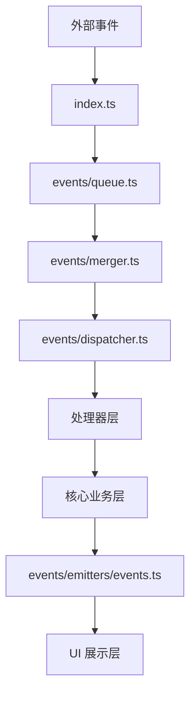
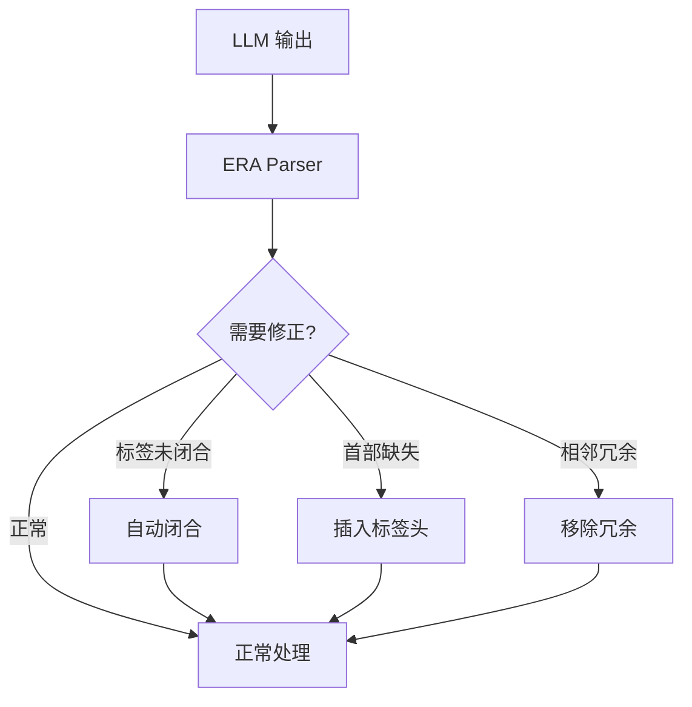

# Clotho 与 ERA 架构对比分析报告

**版本**: 1.0.0
**日期**: 2025-12-28
**状态**: Draft
**作者**: Architect Mode

---

## 文档概述

本报告基于 Clotho 系统架构全景文档和 ERA 插件综合技术文档，深入分析两个系统的设计理念、架构差异，并提出可互相借鉴的设计模式。

**参考文档**：
- Clotho 架构：`doc/architecture/00_architecture_panorama.md`
- ERA 插件：`plans/era-plugin-comprehensive-document.md`

---

## 目录

- [一、核心设计理念对比](#一核心设计理念对比)
- [二、架构分层对比](#二架构分层对比)
- [三、变量操作机制对比](#三变量操作机制对比)
- [四、状态管理对比](#四状态管理对比)
- [五、事件与通信机制对比](#五事件与通信机制对比)
- [六、ERA 可借鉴到 Clotho 的设计](#六era-可借鉴到-clotho-的设计)
- [七、Clotho 可借鉴到 ERA 的设计](#七clotho-可借鉴到-era-的设计)
- [八、综合建议](#八综合建议)

---

## 一、核心设计理念对比

### 1.1 Clotho 设计哲学

#### 凯撒原则 (The Caesar Principle)
```
Render unto Caesar the things that are Caesar's,
and unto God the things that are God's
```

| 领域 | 负责方 | 内容 |
|------|--------|------|
| **Code's Domain** | 确定性代码 | 逻辑判断、数值计算、状态管理、流程控制 |
| **LLM's Domain** | 大语言模型 | 语义理解、情感演绎、剧情生成、文本润色 |

#### 非对称交互策略

| 方向 | 格式 | 用途 |
|------|------|------|
| **输入端** | XML + YAML | 结构（XML）+ 数据（YAML），Token 效率高 |
| **输出端** | XML + JSON | 意图（XML）+ 参数（JSON），解析鲁棒性强 |

#### 混合扩展策略
- **核心严格性**：影响系统逻辑的关键指令采用严格 Schema 验证
- **边缘灵活性**：展示层和辅助信息允许灵活的自定义标签结构

### 1.2 ERA 设计哲学

#### 事件驱动架构
- 所有外部交互通过事件系统进行
- 实现完全的模块解耦
- 支持灵活的事件监听和响应

#### 语义化操作
- 使用明确的标签表达操作意图
- `<VariableInsert>`：非破坏性插入
- `<VariableEdit>`：破坏性更新
- `<VariableDelete>`：删除操作

#### 模板驱动
- 通过 `$template` 定义默认结构
- 支持多级继承和覆盖
- 减少重复定义，确保数据一致性

### 1.3 设计理念对比总结

| 维度 | Clotho | ERA | 评价 |
|------|--------|-----|------|
| **职责分离** | 凯撒原则（代码 vs LLM） | 事件驱动（模块解耦） | 各有侧重 |
| **数据格式** | 非对称（输入 XML+YAML，输出 XML+JSON） | 统一 XML 标签 | Clotho 更灵活 |
| **操作语义** | OpCode（SET/ADD/SUB） | 语义化标签（Insert/Edit/Delete） | ERA 更直观 |
| **扩展策略** | 混合扩展（核心严格，边缘灵活） | 模板继承 | ERA 更系统 |
| **通信机制** | Filament 协议 | 事件总线 | ERA 更解耦 |

---

## 二、架构分层对比

### 2.1 Clotho 三层架构



### 2.2 ERA 分层架构

```mermaid
graph TB
    subgraph External [外部交互层]
        API[API 事件调用]
        ST[SillyTavern 事件]
    end
    
    subgraph Entry [入口层]
        Index[index.ts 事件入口]
    end
    
    subgraph Queue [队列层]
        Queue[events/queue.ts 事件队列]
        Merger[events/merger.ts 事件合并器]
    end
    
    subgraph Dispatch [分发层]
        Dispatcher[events/dispatcher.ts 事件分发器]
    end
    
    subgraph Handler [处理器层]
        Sync[handlers/sync.ts 同步处理器]
        Write[handlers/write.ts 写入处理器]
        APIHandler[handlers/api/handler.ts API 处理器]
    end
    
    subgraph Core [核心业务层]
        SyncCore[core/sync.ts 状态同步]
        Snapshot[core/snapshot.ts 快照管理]
        MK[core/key/mk.ts MK 管理]
        CRUD[core/crud/ CRUD 操作]
        Template[core/crud/insert/template.ts 模板系统]
    end
    
    subgraph Emitter [事件发射层]
        Emitter[events/emitters/events.ts]
    end
    
    subgraph UI [UI 展示层]
        Store[ui/store.ts 状态管理]
        App[ui/App.vue 主组件]
    end
    
    API --> Index
    ST --> Index
    Index --> Queue
    Queue --> Merger
    Merger --> Dispatcher
    Dispatcher --> Sync
    Dispatcher --> Write
    Dispatcher --> APIHandler
    Sync --> SyncCore
    Write --> CRUD
    APIHandler --> CRUD
    SyncCore --> Snapshot
    SyncCore --> MK
    CRUD --> Template
    CRUD --> Emitter
    Emitter --> Store
    Store --> App
```

### 2.3 架构对比总结

| 维度 | Clotho | ERA | 评价 |
|------|--------|-----|------|
| **分层方式** | 三层架构（表现/编排/数据） | 七层架构（外部/入口/队列/分发/处理器/核心/发射） | ERA 更细致 |
| **编排机制** | 流水线模式 | 事件驱动模式 | ERA 更解耦 |
| **数据管理** | Mnemosyne 快照引擎 | EditLogs + SelectedMks | 各有优势 |
| **UI 渲染** | Hybrid SDUI（双轨道） | Vue.js 组件 | Clotho 更高性能 |
| **跨平台** | Flutter 原生 | SillyTavern 插件 | Clotho 更独立 |

---

## 三、变量操作机制对比

### 3.1 Clotho 变量操作

#### Filament 协议 v2.3
```xml
<variable_update>
  <analysis>
    角色受到伤害
  </analysis>
  [
    ["SUB", "player.hp", 20],
    ["SET", "player.mood", "injured"],
    ["PUSH", "player.inventory", "potion"]
  ]
</variable_update>
```

#### OpCode 列表

| OpCode | 含义 | 参数 | 说明 |
|--------|------|------|------|
| `SET` | 设置值 | `["SET", "path", value]` | 覆盖指定路径 |
| `ADD` | 加法 | `["ADD", "path", number]` | 数值相加 |
| `SUB` | 减法 | `["SUB", "path", number]` | 数值相减 |
| `MUL` | 乘法 | `["MUL", "path", number]` | 数值相乘 |
| `DIV` | 除法 | `["DIV", "path", number]` | 数值相除 |
| `PUSH` | 追加 | `["PUSH", "array_path", value]` | 数组末尾添加 |
| `POP` | 弹出 | `["POP", "array_path"]` | 移除数组末尾 |
| `DELETE` | 删除 | `["DELETE", "path"]` | 删除字段 |

### 3.2 ERA 变量操作

#### 语义化标签
```xml
<VariableInsert>
{
  "guild": {
    "$template": {
      "rank": "Rookie",
      "contribution": 0
    }
  }
}
</VariableInsert>

<VariableEdit>
{
  "player": {
    "hp": 80,
    "mood": "anxious"
  }
}
</VariableEdit>

<VariableDelete>
{
  "player": {
    "inventory": {
      "broken_item": {}
    }
  }
}
</VariableDelete>
```

#### 操作行为对比

| 操作类型 | 标签 | 行为 | 特点 |
|---------|------|------|------|
| 插入 | `<VariableInsert>` | 只增不改，跳过已存在路径 | 非破坏性，支持模板应用 |
| 更新 | `<VariableEdit>` | 只改不增，跳过不存在路径 | 破坏性，支持 `$meta.updatable` 保护 |
| 删除 | `<VariableDelete>` | 删除指定节点 | 支持 `$meta.necessary` 保护 |

#### 数学表达式支持
```javascript
// ERA 支持表达式语法
"hp": "+=10"
"hp": "-=10"
"hp": "*=2"
"hp": "/=2"
"hp": "max_hp * 0.5"
```

### 3.3 变量操作对比总结

| 维度 | Clotho | ERA | 评价 |
|------|--------|-----|------|
| **语义清晰度** | 中（OpCode） | 高（Insert/Edit/Delete） | ERA 更直观 |
| **操作原子性** | 单指令单操作 | 单标签批量操作 | ERA 支持批量 |
| **数学表达式** | 仅支持 OpCode | 支持 `+=10` 等语法 | ERA 更便捷 |
| **可解释性** | `<analysis>` 子标签 | `<VariableThink>` 标签 | 两者都支持 |
| **Token 效率** | JSON 数组紧凑 | XML 标签冗长 | Clotho 更高效 |

---

## 四、状态管理对比

### 4.1 Clotho 状态管理

#### VWD 数据模型
```json
{
  "health": [80, "当前生命值，0为死亡"],
  "mood": ["happy", "角色当前心情"],
  "location": ["Dark Forest", "当前所在位置"]
}
```

#### Schema 约束
```json
{
  "character": {
    "$meta": {
      "extensible": false,
      "required": ["health", "mood"],
      "template": {
        "level": 1,
        "hp": 100
      }
    }
  }
}
```

#### 多维上下文链
- **History Chain**: 线性投影的对话记录
- **State Chain**: Keyframe + Delta 存储，支持无损回溯
- **RAG Chain**: 基于向量检索的动态知识注入

### 4.2 ERA 状态管理

#### 模板继承机制
```json
{
  "characters": {
    "$template": {
      "level": 1,
      "hp": 10,
      "inventory": [],
      "$meta": { "necessary": "self" }
    },
    "npcs": {
      "$template": {
        "faction": "neutral",
        "dialogue": []
      },
      "guard_001": {
        "class": "Warrior"
        // 继承：level=1, hp=10 (来自 characters)
        // 继承：faction="neutral", dialogue=[] (来自 npcs)
        // 覆盖：class="Warrior" (来自指令)
      }
    }
  }
}
```

#### 保护机制
```json
{
  "player": {
    "$meta": {
      "updatable": true,
      "necessary": "all"  // "self" | "children" | "all"
    },
    "hp": 100
  }
}
```

#### 状态同步机制
- **逆序回滚**：从最新状态回滚到分歧点
- **顺序重算**：从分歧点重新计算变量
- **快速同步**：仅删除无变量变更的消息时，只更新 SelectedMks

### 4.3 状态管理对比总结

| 维度 | Clotho | ERA | 评价 |
|------|--------|-----|------|
| **模板继承** | 仅单级模板 | 支持多级嵌套继承 | ERA 更强大 |
| **语义描述** | 支持 VWD | 无内置 VWD | Clotho 更优 |
| **删除保护** | 无专门删除保护 | 三级粒度（self/children/all） | ERA 更完善 |
| **Schema 验证** | 完整 Schema（extensible/required） | 基础约束 | Clotho 更系统 |
| **回溯机制** | Keyframe + Delta | EditLogs + 逆序回滚 | 各有优势 |

---

## 五、事件与通信机制对比

### 5.1 Clotho 通信机制

#### Filament 协议流式解析


#### 输出标签体系
- **认知与表达**: `<thought>`, `<content>`
- **逻辑与状态**: `<variable_update>`, `<tool_call>`
- **表现与交互**: `<status_bar>`, `<details>`, `<choice>`, `<ui_component>`, `<media>`

### 5.2 ERA 事件机制

#### 事件系统架构


#### 事件分组
| 分组 | 事件类型 | 说明 |
|------|---------|------|
| **INIT** | `APP_READY` | 应用初始化 |
| **SYNC** | `MESSAGE_RECEIVED`, `MESSAGE_DELETED`, `MESSAGE_SWIPED` | 同步相关 |
| **API** | `era:insertByObject`, `era:updateByObject` | 外部 API 调用 |
| **COLLISION_DETECTORS** | `GENERATION_STARTED` | 对冲检测 |
| **COMBO_STARTERS** | `MESSAGE_UPDATED` | 组合事件起始 |

#### 事件合并机制
- **编辑并继续**: `MESSAGE_UPDATED` + `GENERATION_STARTED` → `combo_edit_and_continue`
- **滑动并重新生成**: `MESSAGE_SWIPED` + `GENERATION_STARTED` → `combo_swipe_and_regenerate`

#### 防循环机制
```javascript
eventOn('era:writeDone', (detail) => {
  // 防止无限循环
  if (detail.actions.apiWrite) {
    return;
  }
  updateUI(detail.statWithoutMeta);
});
```

### 5.3 事件与通信对比总结

| 维度 | Clotho | ERA | 评价 |
|------|--------|-----|------|
| **通信方式** | Filament 协议（标签流式解析） | 事件总线（统一事件接口） | ERA 更解耦 |
| **事件合并** | 无 | 支持事件组合和对冲检测 | ERA 更智能 |
| **防循环** | 无 | `apiWrite` 标识 | ERA 更完善 |
| **流式处理** | 支持（标签监控） | 支持（队列防抖） | 各有优势 |
| **UI 更新** | UIEventBus | `writeDone` 事件 | ERA 更成熟 |

---

## 六、ERA 可借鉴到 Clotho 的设计

### 6.1 语义化操作标签

#### 现状
Clotho 使用 OpCode（SET/ADD/SUB），语义不够直观。

#### 建议增加
```xml
<!-- 作为 OpCode 的补充，提供更直观的语义表达 -->
<variable_insert>
  <path>player.inventory</path>
  <value>
    "potion": {
      "name": "治疗药水",
      "quantity": 3
    }
  </value>
  <analysis>购买治疗药水</analysis>
</variable_insert>

<variable_edit>
  <path>player.hp</path>
  <value>80</value>
  <analysis>受到伤害</analysis>
</variable_edit>

<variable_delete>
  <path>player.inventory.broken_item</path>
  <analysis>物品损坏</analysis>
</variable_delete>
```

#### 优势
- 更直观的语义表达
- 降低用户学习成本
- 与 ERA 生态兼容

### 6.2 多级模板继承

#### 现状
Clotho 仅支持单级模板。

#### 建议实现
```json
{
  "characters": {
    "$template": {
      "level": 1,
      "hp": 100,
      "inventory": []
    },
    "npcs": {
      "$template": {
        "faction": "neutral",
        "dialogue": []
      },
      "guard_001": {
        "class": "Warrior"
        // 继承 characters 和 npcs 的模板
      }
    }
  }
}
```

#### 优势
- 支持更复杂的默认值结构
- 减少重复定义
- 提高模板复用性

### 6.3 删除保护机制

#### 现状
Clotho 无专门的删除保护。

#### 建议增加
```json
{
  "player": {
    "$meta": {
      "necessary": "all"  // "self" | "children" | "all"
    },
    "hp": 100
  }
}
```

#### 保护级别
| 级别 | 行为 |
|------|------|
| `"self"` | 仅保护自身，子节点可删除 |
| `"children"` | 保护所有直属子节点 |
| `"all"` | 保护自身及所有子孙节点 |

#### 优势
- 防止误删关键数据
- 细粒度权限控制
- 与 ERA 兼容

### 6.4 数学表达式支持

#### 现状
Clotho 仅支持数值 OpCode。

#### 建议增加
```xml
<variable_update>
  <analysis>治疗恢复生命值</analysis>
  [
    ["SET", "player.hp", "player.max_hp * 0.5"],
    ["ADD", "player.gold", "+=50"],
    ["SET", "player.exp", "player.exp + 100"]
  ]
</variable_update>
```

#### 优势
- 更灵活的数值计算
- 简化常见操作
- 提高可读性

### 6.5 快照查询 API

#### 现状
Clotho 快照功能未充分暴露。

#### 建议增加
```dart
/// 获取当前状态
Future<QueryResultItem> getCurrentVars();

/// 获取指定消息密钥的快照
Future<QueryResultItem> getSnapshotAtMk(String mk);

/// 获取两个消息之间的所有快照
Future<List<QueryResultItem>> getSnapshotsBetweenMks({
  String? startMk,
  String? endMk,
});

/// 获取指定消息 ID 的快照
Future<QueryResultItem> getSnapshotAtMId(int messageId);
```

#### 优势
- 支持历史状态回溯
- 便于调试和分析
- 与 ERA API 兼容

### 6.6 事件驱动架构

#### 现状
Clotho 使用 Filament 协议进行流式解析，但缺乏统一的事件总线。

#### 建议增加
```dart
/// 统一事件总线
class EventBus {
  /// 发射事件
  void emit(String eventName, dynamic payload);

  /// 监听事件
  StreamSubscription on(String eventName, EventHandler handler);
}

/// 事件类型定义
class ClothoEvents {
  static const String writeDone = 'clotho:writeDone';
  static const String snapshotChanged = 'clotho:snapshotChanged';
  static const String variableUpdated = 'clotho:variableUpdated';
}

/// 事件负载
class WriteDonePayload {
  final String mk;
  final int messageId;
  final bool isUser;
  final WriteActions actions;
  final List<String?> selectedMks;
  final Map<String, List<EditLog>> editLogs;
  final dynamic stat;
  final dynamic statWithoutMeta;
}

class WriteActions {
  final bool rollback;
  final bool apply;
  final bool resync;
  final bool api;
  final bool apiWrite;
}
```

#### 优势
- 统一的事件接口
- 完全的模块解耦
- 支持灵活的事件监听

### 6.7 事件合并与防抖

#### 现状
Clotho 无事件合并机制。

#### 建议增加
```dart
/// 事件队列
class EventQueue {
  final List<EventJob> _queue = [];
  bool _isProcessing = false;

  /// 推入事件
  void push(EventJob job);

  /// 处理队列（防抖 + 批处理）
  Future<void> process();
}

/// 事件合并器
class EventMerger {
  /// 合并事件
  List<EventJob> merge(List<EventJob> jobs);

  /// 检测组合事件
  ComboEvent? detectCombo(List<EventJob> jobs);
}

/// 组合事件类型
enum ComboEvent {
  editAndContinue,  // 编辑并继续
  swipeAndRegenerate,  // 滑动并重新生成
}
```

#### 优势
- 减少处理次数
- 提高效率
- 防止状态竞争

### 6.8 消息密钥系统

#### 现状
Clotho 使用 Time Pointer，但未明确消息锚点机制。

#### 建议增加
```dart
/// 消息密钥管理
class MessageKeyManager {
  /// 确保消息有密钥
  String ensureMessageKey(Message message);

  /// 读取消息密钥
  String? readMessageKey(Message message);

  /// 更新最新选择的密钥
  void updateLatestSelectedMk(String mk);
}

/// 消息密钥格式
/// <clotho_data>{"clotho-message-key":"clotho_mk_1759246942209_xxxxx","clotho-message-type":"assistant"}</clotho_data>
```

#### 优势
- 解决消息变量错位问题
- 完全解耦变量状态与消息变量
- 支持精确的历史追溯

---

## 七、Clotho 可借鉴到 ERA 的设计

### 7.1 VWD 数据模型

#### 现状
ERA 无内置语义描述。

#### 建议增加
```json
{
  "hp": [80, "当前生命值，0为死亡"],
  "mood": ["happy", "角色当前心情"],
  "location": ["Dark Forest", "当前所在位置"]
}
```

#### 优势
- 增强对 LLM 的语义支持
- 自动生成文档
- 提高可维护性

### 7.2 流式模糊修正器

#### 现状
ERA 依赖 LLM 严格遵循格式。

#### 建议增加


#### 优势
- 提高鲁棒性
- 减少因格式错误导致的失败
- 更好的用户体验

### 7.3 混合扩展策略

#### 现状
ERA 状态栏格式相对固定。

#### 建议增加
```xml
<!-- 核心严格性：影响系统逻辑的关键指令 -->
<variable_update>
  <analysis>状态变更</analysis>
  [
    ["SET", "player.hp", 80]
  ]
</variable_update>

<!-- 边缘灵活性：展示层和辅助信息 -->
<custom_status>
  <weather>Stormy</weather>
  <time>Midnight</time>
  <danger_level>High</danger_level>
</custom_status>

<details>
  <summary>角色状态摘要</summary>
  <content>...</content>
</details>
```

#### 优势
- 更灵活的自定义
- 支持多样化的需求
- 降低 Schema 依赖

### 7.4 深度注入机制

#### 现状
ERA 注入位置相对固定。

#### 建议增加
```json
{
  "injection": {
    "position": "relativeToEnd",
    "depth": -3,
    "priority": "high"
  }
}
```

#### 优势
- 更精确的内容控制
- 支持复杂的 Prompt 工程
- 与 Clotho 兼容

### 7.5 Hybrid SDUI 架构

#### 现状
ERA 使用 Vue.js 组件，性能受限。

#### 建议增加
```dart
/// 混合 SDUI 引擎
class HybridSDUIEngine {
  /// 路由调度：自动决策渲染轨道
  RenderTrack decideTrack(String contentId);

  /// 原生轨道：RFW 渲染
  Widget renderNativeTrack(RFWComponent component);

  /// Web 轨道：WebView 渲染
  Widget renderWebTrack(String htmlContent);
}

enum RenderTrack {
  native,  // 原生轨道
  web,     // Web 轨道
}
```

#### 优势
- 原生高性能
- 兼容第三方动态内容
- 更好的跨平台体验

---

## 八、综合建议

### 8.1 优先级排序

#### 高优先级（强烈建议）
1. **ERA → Clotho: 多级模板继承**
   - 显著提高代码复用性
   - 减少重复定义
   - 与 ERA 生态兼容

2. **ERA → Clotho: 删除保护机制**
   - 防止误删关键数据
   - 细粒度权限控制
   - 提高系统安全性

3. **Clotho → ERA: VWD 数据模型**
   - 增强对 LLM 的语义支持
   - 自动生成文档
   - 提高可维护性

#### 中优先级（建议考虑）
4. **ERA → Clotho: 语义化操作标签**
   - 更直观的语义表达
   - 降低用户学习成本
   - 与 ERA 生态兼容

5. **ERA → Clotho: 事件驱动架构**
   - 统一的事件接口
   - 完全的模块解耦
   - 支持灵活的事件监听

6. **Clotho → ERA: 流式模糊修正器**
   - 提高鲁棒性
   - 减少因格式错误导致的失败
   - 更好的用户体验

#### 低优先级（可选）
7. **ERA → Clotho: 数学表达式支持**
8. **ERA → Clotho: 快照查询 API**
9. **ERA → Clotho: 事件合并与防抖**
10. **ERA → Clotho: 消息密钥系统**
11. **Clotho → ERA: 混合扩展策略**
12. **Clotho → ERA: 深度注入机制**
13. **Clotho → ERA: Hybrid SDUI 架构**

### 8.2 实施路线图

#### 第一阶段：核心功能增强
- [ ] 实现 VWD 数据模型（Clotho）
- [ ] 实现多级模板继承（Clotho）
- [ ] 实现删除保护机制（Clotho）

#### 第二阶段：事件系统重构
- [ ] 实现统一事件总线（Clotho）
- [ ] 实现事件队列与防抖（Clotho）
- [ ] 实现事件合并机制（Clotho）

#### 第三阶段：用户体验优化
- [ ] 实现语义化操作标签（Clotho）
- [ ] 实现流式模糊修正器（ERA）
- [ ] 实现混合扩展策略（ERA）

#### 第四阶段：高级特性
- [ ] 实现数学表达式支持（Clotho）
- [ ] 实现快照查询 API（Clotho）
- [ ] 实现消息密钥系统（Clotho）
- [ ] 实现深度注入机制（ERA）
- [ ] 实现 Hybrid SDUI 架构（ERA）

### 8.3 架构融合建议

#### 统一 Filament 协议
建议在 Filament 协议中增加 ERA 兼容层：

```xml
<!-- ERA 兼容模式 -->
<filament protocol="era-compatible">
  <variable_insert>
    <path>player.inventory</path>
    <value>...</value>
  </variable_insert>
  
  <variable_edit>
    <path>player.hp</path>
    <value>80</value>
  </variable_edit>
</filament>

<!-- Clotho 原生模式 -->
<filament protocol="clotho-native">
  <variable_update>
    <analysis>...</analysis>
    [
      ["SET", "player.hp", 80]
    ]
  </variable_update>
</filament>
```

#### 统一数据模型
建议融合 VWD 和模板继承：

```json
{
  "player": {
    "$template": {
      "hp": [100, "当前生命值，0为死亡"],
      "mood": ["neutral", "角色当前心情"],
      "$meta": {
        "updatable": true,
        "necessary": "self"
      }
    },
    "hp": 80,
    "mood": "happy"
  }
}
```

---

## 附录

### A.1 术语对照表

| ERA 术语 | Clotho 术语 | 说明 |
|---------|-------------|------|
| MK (Message Key) | Time Pointer | 消息锚点机制 |
| EditLogs | State Chain (Delta) | 变更记录 |
| SelectedMks | History Chain | 消息序列 |
| `$template` | `$meta.template` | 模板定义 |
| `<VariableInsert>` | OpCode (部分) | 插入操作 |
| `<VariableEdit>` | OpCode (SET/ADD/SUB) | 更新操作 |
| `<VariableDelete>` | OpCode (DELETE) | 删除操作 |
| `eventEmit/eventOn` | EventBus | 事件通信 |
| `writeDone` | UIEventBus | 状态更新通知 |

### A.2 文档索引

| 文档名称 | 路径 |
|---------|------|
| Clotho 系统架构全景 | `doc/architecture/00_architecture_panorama.md` |
| ERA 插件综合技术文档 | `plans/era-plugin-comprehensive-document.md` |
| ERA 与 Clotho 架构对比 | `plans/era-clotho-comparative-analysis.md` |

---

## 版本历史

| 版本 | 日期 | 变更内容 |
|------|------|----------|
| 1.0.0 | 2025-12-28 | 初始版本，完成对比分析 |
