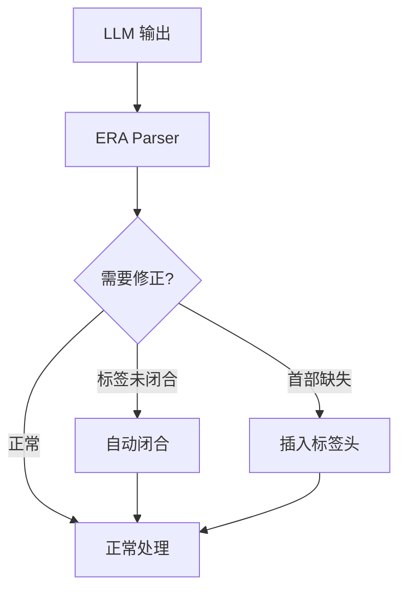
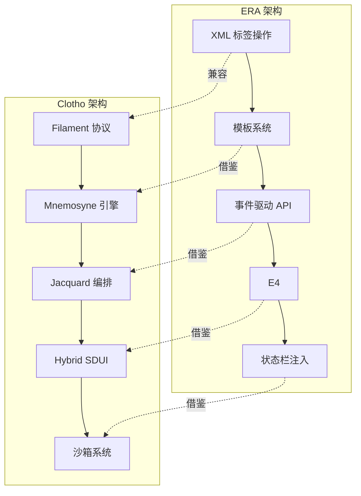

# ERA 与 Clotho 架构对比分析报告

**版本**: 1.1.0
**日期**: 2025-12-28
**状态**: Draft
**作者**: Architect Mode

---

## 目录

1. [概述](#概述)
2. [核心设计理念对比](#核心设计理念对比)
3. [变量操作机制对比](#变量操作机制对比)
4. [状态管理对比](#状态管理对比)
5. [UI 交互与事件系统对比](#ui-交互与事件系统对比)
6. [可借鉴的设计模式](#可借鉴的设计模式)
7. [建议的改进方案](#建议的改进方案)

---

## 概述

本报告对比分析了 ERA 变量框架（SillyTavern 插件）与 Clotho 系统（原生 Flutter 客户端）的核心架构设计，识别出可相互借鉴的设计模式和最佳实践。

### ERA 简介
- **定位**: SillyTavern 的变量管理插件
- **核心功能**: 通过 XML 标签实现变量增删改、模板继承、状态栏渲染
- **技术栈**: JavaScript/EJS（运行在浏览器环境）

### Clotho 简介
- **定位**: 原生 AI RPG 客户端
- **核心功能**: 混合代理架构、Filament 协议、Mnemosyne 数据引擎
- **技术栈**: Flutter/Dart、QuickJS/LuaJIT

---

## 核心设计理念对比

### ERA 设计理念
1. **语义化操作**: 使用 `<VariableInsert>`、`<VariableEdit>`、`<VariableDelete>` 明确表达操作意图
2. **模板驱动**: 通过 `$template` 定义默认结构，支持继承和覆盖
3. **保护机制**: 使用 `$meta` 字段实现细粒度的访问控制
4. **事件驱动**: 通过 `eventEmit`/`eventOn` 实现解耦的组件通信

### Clotho 设计理念
1. **非对称交互**: 输入用 XML+YAML，输出用 XML+JSON
2. **混合扩展**: 核心逻辑严格，展示层灵活
3. **确定性编排**: Jacquard 流水线确保可预测的执行流程
4. **时间旅行**: Keyframe+Delta 支持无损回溯

---

## 变量操作机制对比

### ERA 变量操作

| 操作类型 | 标签 | 行为 | 特点 |
|---------|------|------|------|
| 插入 | `<VariableInsert>` | 只增不改，跳过已存在路径 | 非破坏性，支持模板应用 |
| 更新 | `<VariableEdit>` | 只改不增，跳过不存在路径 | 破坏性，支持 `$meta.updatable` 保护 |
| 删除 | `<VariableDelete>` | 删除指定节点 | 支持 `$meta.necessary` 保护 |

**示例**:
```xml
<VariableInsert>
{
  "guild": {
    "$template": {
      "rank": "Rookie",
      "contribution": 0
    }
  }
}
</VariableInsert>
```

### Clotho 变量操作

| OpCode | 含义 | 参数 | 说明 |
|--------|------|------|------|
| `SET` | 设置值 | `["SET", "path", value]` | 覆盖指定路径 |
| `ADD` | 加法 | `["ADD", "path", number]` | 数值相加 |
| `SUB` | 减法 | `["SUB", "path", number]` | 数值相减 |
| `MUL` | 乘法 | `["MUL", "path", number]` | 数值相乘 |
| `DIV` | 除法 | `["DIV", "path", number]` | 数值相除 |
| `PUSH` | 追加 | `["PUSH", "array_path", value]` | 数组末尾添加 |
| `POP` | 弹出 | `["POP", "array_path"]` | 移除数组末尾 |
| `DELETE` | 删除 | `["DELETE", "path"]` | 删除字段 |

**示例**:
```xml
<variable_update>
  <analysis>
    角色受到伤害
  </analysis>
  [
    ["SUB", "player.hp", 20],
    ["SET", "player.mood", "injured"]
  ]
</variable_update>
```

### 对比分析

| 维度 | ERA | Clotho | 评价 |
|------|-----|--------|------|
| **语义清晰度** | 高（Insert/Edit/Delete） | 中（OpCode） | ERA 更直观 |
| **操作原子性** | 单标签批量操作 | 单指令单操作 | ERA 支持批量 |
| **保护机制** | `$meta.updatable`/`necessary` | Schema 约束 | ERA 更细粒度 |
| **可解释性** | `<VariableThink>` 标签 | `<analysis>` 子标签 | 两者都支持 |
| **数学表达式** | 支持 `+=10` 语法 | 仅支持 OpCode | ERA 更便捷 |

---

## 状态管理对比

### ERA 状态管理

#### 模板系统
```json
{
  "characters": {
    "$template": {
      "level": 1,
      "hp": 10,
      "inventory": [],
      "$meta": { "necessary": "self" }
    }
  }
}
```

**特点**:
- 支持模板继承（父模板应用于子节点）
- 子模板可覆盖父模板
- 模板优先级：变量中已有 > 继承 > 指令自带

#### 保护机制
- `$meta.updatable`: 控制是否可更新（默认 true）
- `$meta.necessary`: 控制删除保护
  - `"self"`: 保护自身，子节点可删除
  - `"children"`: 保护直属子节点
  - `"all"`: 保护所有子孙节点

### Clotho 状态管理

#### VWD 数据模型
```json
{
  "health": [80, "当前生命值，0为死亡"],
  "mood": ["happy", "角色当前心情"]
}
```

**特点**:
- 值与描述分离
- System Prompt 显示完整，UI 仅显示值

#### Schema 约束
```json
{
  "character": {
    "$meta": {
      "extensible": false,
      "required": ["health", "mood"]
    }
  }
}
```

**特点**:
- `extensible`: 是否允许扩展
- `required`: 必填字段列表
- `template`: 新增项目默认模板

### 对比分析

| 维度 | ERA | Clotho | 评价 |
|------|-----|--------|------|
| **模板继承** | 支持多级继承 | 仅单级模板 | ERA 更强大 |
| **删除保护** | 三级粒度 | 无专门删除保护 | ERA 更完善 |
| **语义描述** | 无内置 VWD | 支持 VWD | Clotho 更优 |
| **Schema 验证** | 基础约束 | 完整 Schema | Clotho 更系统 |

---

## UI 交互与事件系统对比

### ERA UI 交互

#### 宏系统
```
{{ERA:player.hp}} / {{ERA:player.max_hp}}
```

**特点**:
- 简单的路径语法
- 支持强制重载
- 通过正则替换注入状态栏

#### 事件驱动 API
```javascript
// 写入事件
eventEmit('era:updateByPath', {
  path: 'player.hp',
  value: '+=10'
});

// 监听事件
eventOn('era:writeDone', (detail) => {
  updateUI(detail.statWithoutMeta);
});
```

**特点**:
- 统一的事件接口
- `writeDone` 携带完整状态
- 支持快照查询 API

### Clotho UI 交互

#### Filament 协议输出
```xml
<status_bar>
  <SFW>safe</SFW>
  <mood>anxious</mood>
  <location>Dark Forest</location>
</status_bar>
```

**特点**:
- 自由结构的标签
- 动态渲染
- 混合扩展策略

#### Hybrid SDUI
- **原生轨道**: RFW 渲染官方组件
- **Web 轨道**: WebView 渲染第三方内容
- **路由调度**: 自动决策渲染轨道

### 对比分析

| 维度 | ERA | Clotho | 评价 |
|------|-----|--------|------|
| **宏语法** | 简单直观 | 无宏系统 | ERA 更易用 |
| **事件系统** | 统一事件总线 | 分散的事件处理 | ERA 更一致 |
| **状态栏** | 正则替换 | Filament 标签 | Clotho 更结构化 |
| **动态更新** | writeDone 事件 | UIEventBus | ERA 更成熟 |
| **快照查询** | 丰富 API | Mnemosyne 快照 | ERA 更完善 |

---

## 可借鉴的设计模式

### 1. ERA 可借鉴到 Clotho

#### 1.1 语义化操作标签
**现状**: Clotho 使用 OpCode（SET/ADD/SUB）
**建议**: 增加语义化标签作为 OpCode 的补充

```xml
<!-- 当前方式 -->
<variable_update>
  [
    ["SET", "player.hp", 80],
    ["ADD", "player.gold", 50]
  ]
</variable_update>

<!-- 建议增加 -->
<variable_insert>
  <path>player.inventory</path>
  <value>
    "potion": { "name": "治疗药水", "quantity": 3 }
  </value>
</variable_insert>

<variable_edit>
  <path>player.hp</path>
  <value>80</value>
</variable_edit>

<variable_delete>
  <path>player.inventory.broken_item</path>
</variable_delete>
```

**优势**:
- 更直观的语义表达
- 降低用户学习成本
- 与 ERA 生态兼容

#### 1.2 模板继承机制
**现状**: Clotho 仅支持单级模板
**建议**: 实现多级模板继承

```json
{
  "characters": {
    "$template": {
      "level": 1,
      "hp": 100,
      "inventory": []
    },
    "npcs": {
      "$template": {
        "faction": "neutral",
        "dialogue": []
      },
      "guard_001": {
        // 继承 characters 和 npcs 的模板
        "class": "Warrior"
      }
    }
  }
}
```

**优势**:
- 支持更复杂的默认值结构
- 减少重复定义
- 提高模板复用性

#### 1.3 删除保护机制
**现状**: Clotho 无专门的删除保护
**建议**: 增加 `$meta.necessary` 约束

```json
{
  "player": {
    "$meta": {
      "necessary": "all"  // 保护自身和所有子节点
    },
    "hp": 100
  }
}
```

**保护级别**:
- `"self"`: 仅保护自身
- `"children"`: 保护直属子节点
- `"all"`: 保护所有子孙节点

**优势**:
- 防止误删关键数据
- 细粒度权限控制
- 与 ERA 兼容

#### 1.4 数学表达式支持
**现状**: Clotho 仅支持数值 OpCode
**建议**: 支持表达式语法

```xml
<!-- 当前方式 -->
<variable_update>
  [
    ["ADD", "player.hp", 10],
    ["MUL", "player.gold", 2]
  ]
</variable_update>

<!-- 建议增加 -->
<variable_update>
  [
    ["SET", "player.hp", "player.max_hp * 0.5"],
    ["ADD", "player.gold", "+=50"]
  ]
</variable_update>
```

**优势**:
- 更灵活的数值计算
- 简化常见操作
- 提高可读性

#### 1.5 快照查询 API
**现状**: Clotho 快照功能未充分暴露
**建议**: 增加丰富的查询 API

```dart
// 获取当前状态
getCurrentVars()

// 获取指定消息密钥的快照
getSnapshotAtMk(String mk)

// 获取两个消息之间的所有快照
getSnapshotsBetweenMks({String? startMk, String? endMk})

// 获取指定消息 ID 的快照
getSnapshotAtMId(int messageId)

// 获取两个消息 ID 之间的所有快照
getSnapshotsBetweenMIds({int? startId, int? endId})
```

**优势**:
- 支持历史状态回溯
- 便于调试和分析
- 与 ERA API 兼容

#### 1.6 VariableThink 标签
**现状**: Clotho 使用 `<analysis>` 子标签
**建议**: 增加独立的 `<VariableThink>` 标签

```xml
<VariableThink>
  1. **意图分析**: 角色受到攻击，生命值减少
  2. **操作计划**:
     - 减少 player.hp
     - 更新 player.mood 为 injured
</VariableThink>
<variable_update>
  [
    ["SUB", "player.hp", 20],
    ["SET", "player.mood", "injured"]
  ]
</variable_update>
```

**优势**:
- 与 ERA 格式兼容
- 更清晰的结构分离
- 便于迁移

### 2. Clotho 可借鉴到 ERA

#### 2.1 VWD 数据模型
**现状**: ERA 无内置语义描述
**建议**: 增加值描述支持

```json
{
  "hp": [80, "当前生命值，0为死亡"],
  "mood": ["happy", "角色当前心情"]
}
```

**优势**:
- 增强对 LLM 的语义支持
- 自动生成文档
- 提高可维护性

#### 2.2 流式模糊修正器
**现状**: ERA 依赖 LLM 严格遵循格式
**建议**: 增加容错机制



**优势**:
- 提高鲁棒性
- 减少因格式错误导致的失败
- 更好的用户体验

#### 2.3 混合扩展策略
**现状**: ERA 状态栏格式固定
**建议**: 支持自由结构的标签

```xml
<custom_status>
  <weather>Stormy</weather>
  <time>Midnight</time>
  <danger_level>High</danger_level>
</custom_status>
```

**优势**:
- 更灵活的自定义
- 支持多样化的需求
- 降低 Schema 依赖

#### 2.4 深度注入机制
**现状**: ERA 注入位置相对固定
**建议**: 支持深度注入

```json
{
  "injection": {
    "position": "relativeToEnd",
    "depth": -3,
    "priority": "high"
  }
}
```

**优势**:
- 更精确的内容控制
- 支持复杂的 Prompt 工程
- 与 Clotho 兼容

---

## 建议的改进方案

### 优先级 1：核心兼容性（高优先级）

1. **增加语义化操作标签**
   - 在 Filament 协议中增加 `<variable_insert>`、`<variable_edit>`、`<variable_delete>`
   - 保持与现有 OpCode 的兼容
   - 为 ERA 迁移提供平滑过渡

2. **实现删除保护机制**
   - 在 Mnemosyne Schema 中增加 `$meta.necessary` 字段
   - 支持三级保护粒度
   - 增加保护解除机制

3. **增加快照查询 API**
   - 暴露 Mnemosyne 的快照功能
   - 提供与 ERA 兼容的接口
   - 支持历史状态回溯

### 优先级 2：功能增强（中优先级）

1. **实现模板继承**
   - 支持多级模板继承
   - 定义模板优先级规则
   - 提供模板调试工具

2. **增加数学表达式支持**
   - 支持基础表达式语法
   - 提供表达式求值器
   - 增加安全性验证

3. **增加 VariableThink 标签**
   - 独立的思考标签
   - 与 `<analysis>` 兼容
   - 支持格式化输出

### 优先级 3：体验优化（低优先级）


1. **优化事件系统**
   - 统一事件总线
   - 提供事件订阅机制
   - 支持事件过滤
2. **增加容错机制**
   - 实现流式模糊修正器
   - 提供降级策略
   - 增加错误提示

---

## 架构对比图



---

## 总结

### ERA 的优势
1. **语义清晰**: Insert/Edit/Delete 比 OpCode 更直观
2. **模板强大**: 支持多级继承和覆盖
3. **保护完善**: 细粒度的删除保护机制
4. **API 成熟**: 丰富的快照查询和事件系统
5. **易用性高**: 简单的宏语法和正则替换

### Clotho 的优势
1. **架构完整**: 混合代理架构，层次分明
2. **性能优异**: 原生 Flutter 渲染
3. **协议统一**: Filament 协议贯穿系统
4. **时间旅行**: Keyframe+Delta 支持无损回溯
5. **沙箱安全**: QuickJS/LuaJIT 严格隔离

### 建议的融合方向
1. **保持 Clotho 的核心架构**: 继续使用 Filament 协议和 Mnemosyne 引擎
2. **借鉴 ERA 的语义化设计**: 增加语义化操作标签和模板继承
3. **增强兼容性**: 支持 ERA 格式的导入和迁移

通过这种融合，Clotho 可以在保持自身架构优势的同时，吸收 ERA 的成熟设计，为用户提供更强大、更易用的 AI RPG 客户端。
