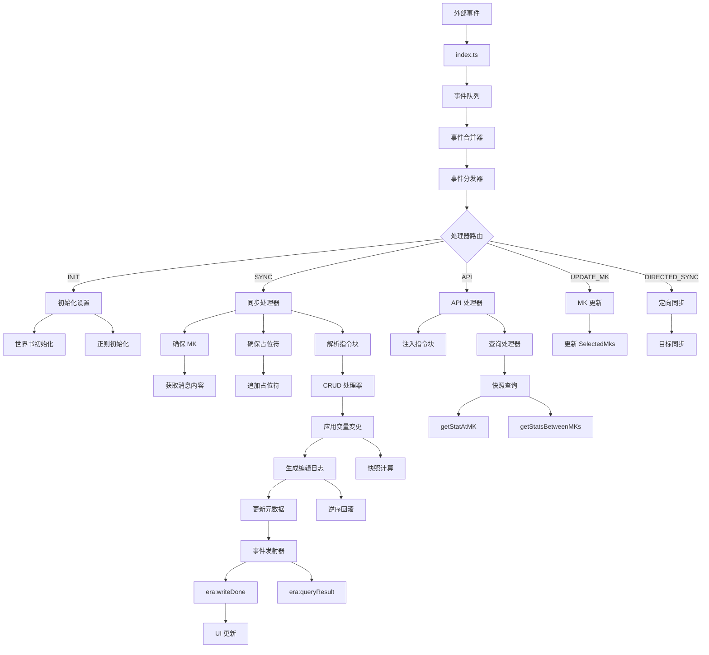

# ERA 变量框架技术架构文档

## 文档版本信息

- **文档标题**: ERA 变量框架技术架构分析
- **分析日期**: 2025-12-28
- **框架版本**: 基于源代码分析
- **分析范围**: 完整的源代码结构和实现机制

---

## 1. 引言

ERA 变量框架是一个为 SillyTavern（酒馆助手）设计的、用于管理角色扮演游戏中变量状态的事件驱动系统。该框架通过创新的**消息密钥（Message Key，MK）机制**，解决了酒馆原生消息变量系统的不稳定性问题，为角色卡作者提供了强大而灵活的变量管理能力。

框架的核心设计理念包括：

- **关注点分离**：事件监听、事件处理、变量操作、UI 展示各司其职
- **事件驱动架构**：所有外部交互通过事件系统进行，实现完全解耦
- **数据一致性保障**：通过逆序回滚和顺序重算机制确保状态准确性
- **原子性操作**：CRUD 操作保证数据结构的完整性
- **可扩展性**：模块化设计支持灵活扩展

---

## 2. 总体架构设计

### 2.1 架构概览

ERA 变量框架采用分层的事件驱动架构，整体结构如下：

```
┌─────────────────────────────────────────────────────────────────────┐
│                    外部交互层                              │
│  ┌──────────────┐  ┌──────────────┐                    │
│  │ API 事件调用  │  │ 酒馆事件    │                    │
│  └──────┬───────┘  └──────┬───────┘                    │
│         │                    │         │                            │
│         ▼                    ▼         ▼                            │
│  ┌──────────────────────────────────────────────────┐      │
│  │           index.ts (事件入口)              │      │
│  │  - 注册所有事件监听器                   │      │
│  │  - 统一推入事件队列                     │      │
│  └──────────────────┬───────────────────────┘      │
│                     │                                    │
│         ▼                                    │
│  ┌──────────────────────────────────────────┐      │
│  │         events/queue.ts              │      │
│  │  - 事件队列管理                        │      │
│  │  - 防抖与批处理                        │      │
│  │  - 单线程处理锁                          │      │
│  └──────────────────┬─────────────────────┘      │
│                     │                                    │
│         ▼                                    │
│  ┌──────────────────────────────────────────┐      │
│  │    events/merger.ts                 │      │
│  │  - 事件分组定义                          │      │
│  │  - 事件合并规则                          │      │
│  │  - 事件对冲检测                          │      │
│  │  - 同组事件覆盖                          │      │
│  └──────────────────┬─────────────────────┘      │
│                     │                                    │
│         ▼                                    │
│  ┌──────────────────────────────────────────┐      │
│  │   events/dispatcher.ts              │      │
│  │  - 任务分发逻辑                          │      │
│  │  - 前置保障（MK、占位符）              │      │
│  │  - 处理器路由                          │      │
│  └──────────────────┬─────────────────────┘      │
│                     │                                    │
│         ▼                                    │
│  ┌──────────────────────────────────────────┐      │
│  │  events/handlers/                   │      │
│  │  ├── sync.ts (同步处理器)            │      │
│  │  ├── write.ts (写入处理器)            │      │
│  │  └── api/handler.ts (API 处理器)  │      │
│  └──────────────────┬─────────────────────┘      │
│                     │                                    │
│         ▼                                    │
│  ┌──────────────────────────────────────────┐      │
│  │        core/ 核心业务逻辑           │      │
│  │  ├── sync.ts (状态同步)              │      │
│  │  ├── snapshot.ts (快照管理)          │      │
│  │  ├── key/mk.ts (MK 管理)             │      │
│  │  └── crud/ (CRUD 操作)            │      │
│  │      ├── insert/ (插入)               │      │
│  │      │   ├── insert.ts                │      │
│  │      │   └── template.ts (模板)     │      │
│  │      ├── update.ts (更新)               │      │
│  │      ├── delete.ts (删除)               │      │
│  │      └── patcher.ts (补丁应用)    │      │
│  └──────────────────┬─────────────────────┘      │
│                     │                                    │
│         ▼                                    │
│  ┌──────────────────────────────────────────┐      │
│  │  events/emitters/events.ts           │      │
│  │  - 事件发射（writeDone、queryResult） │      │
│  └──────────────────┬─────────────────────┘      │
│                     │                                    │
│         ▼                                    │
│  ┌──────────────────────────────────────────┐      │
│  │        ui/ UI 展示层               │      │
│  │  ├── store.ts (状态管理)              │      │
│  │  ├── App.vue (主组件)                │      │
│  │  └── components/ (子组件)            │      │
│  └───────────────────────────────────────┘      │
└─────────────────────────────────────────────────────────────┘
```

### 2.2 核心设计原则

1. **单一职责原则**：每个模块只负责一个明确的功能领域
2. **依赖倒置原则**：高层模块不依赖低层模块的具体实现
3. **开闭原则**：对扩展开放，对修改封闭
4. **接口隔离原则**：通过事件接口实现模块间解耦
5. **迪米特法则**：高层模块不依赖低层模块，只依赖抽象

---

## 3. 数据存储架构

### 3.1 数据结构

ERA 框架的数据存储在 SillyTavern 的 `chat` 变量下，分为两个主要部分：

```json
{
  "ERAMetaData": {
    "EditLogs": {
      "era_mk_1759246942209_jipmrj": [
        { "op": "insert", "path": "player", "value_new": { ... } },
        { "op": "update", "path": "player.hp", "value_old": 100, "value_new": 90 }
      ],
      "SelectedMks": ["era_mk_greeting", "era_mk_abc123", null, "era_mk_xyz789"]
    }
  },
  "stat_data": {
    "player": {
      "name": "勇者",
      "hp": 100,
      "max_hp": 100,
      "stats": { "strength": 10, "agility": 8 }
    },
    "world_state": {
      "location": "起始的村庄",
      "npcs": { "npc_001": { "name": "村民A" } }
    }
  }
}
```

### 3.2 核心数据组件

#### ERAMetaData（元数据）

元数据包含框架运行所需的核心信息：

- **EditLogs**：编辑日志对象，以 MK 为键，值为该 MK 引发的变量变更记录数组
- **SelectedMks**：已选择消息密钥链，稀疏数组，索引约等于消息 ID

#### stat_data（状态数据）

状态数据包含所有用户和 AI 管理的游戏/故事变量：

- **用户变量**：玩家属性、背包物品、游戏进度等
- **世界状态**：NPC 状态、场景信息、时间系统等
- **元字段**：以 `$` 开头的特殊字段，如 `$meta`、`$template`

### 3.3 关键常量定义

数据存储路径定义在 `utils/constants.ts` 中：

- `META_DATA_PATH = 'ERAMetaData'`：元数据根路径
- `STAT_DATA_PATH = 'stat_data'`：状态数据根路径
- `LOGS_PATH = 'EditLogs'`：编辑日志路径
- `SEL_PATH = 'SelectedMks'`：已选择消息密钥链路径

---

## 4. 事件系统详解

### 4.1 事件入口

`index.ts` 是整个框架的入口点，负责：

1. 定义所有需要监听的事件类型
2. 为每个事件注册统一的回调函数
3. 将事件推入事件队列进行统一处理

事件分为以下分组：

- **INIT**：应用初始化事件（`APP_READY`）
- **SYNC**：同步相关事件（消息接收、删除、滑动、手动同步等）
- **API**：外部 API 调用事件（插入、更新、删除、查询）
- **UPDATE_MK_ONLY**：仅更新 MK 的事件（消息发送）
- **COLLISION_DETECTORS**：用于对冲检测的事件（生成开始）
- **COMBO_STARTERS**：组合事件的起始事件（消息更新）
- **DIRECTED_SYNC**：定向同步事件（消息编辑、滑动并重新生成）

### 4.2 事件队列机制

`events/queue.ts` 实现了核心的事件队列处理机制：

#### 核心功能

1. **事件入队**：`pushToQueue()` 将事件封装为 `EventJob` 对象并推入队列
2. **防抖处理**：在处理前等待指定时间，收集连续触发的事件
3. **批处理**：一次性处理队列中的所有事件
4. **单线程锁**：`isProcessing` 标志确保同一时间只有一个处理循环运行
5. **排队等待**：当处理器忙碌时，新的调用进入等待状态，完成后自动继续

#### 防抖策略

- 默认防抖时间：100 毫秒
- 自定义防抖：通过 `EVENT_DEBOUNCE_MAP` 为特定事件设置不同的防抖时间
- 紧急组合检测：如果检测到需要立即处理的组合事件，提前结束防抖等待

### 4.3 事件合并机制

`events/merger.ts` 实现了智能的事件合并逻辑：

#### 事件组合规则

框架能够识别特定的事件模式并将其合并为单一事件：

1. **编辑并继续**：`MESSAGE_UPDATED` + `GENERATION_STARTED` → `combo_edit_and_continue`
   - 场景：用户编辑消息后立即开始生成
   - 时间窗口：1500 毫秒
   - 行为：合并为单一同步事件

2. **滑动并重新生成**：`MESSAGE_SWIPED` + `GENERATION_STARTED` → `combo_swipe_and_regenerate`
   - 场景：用户滑动消息后立即重新生成
   - 时间窗口：600 毫秒
   - 行为：合并为单一同步事件

#### 同组事件覆盖

SYNC 组内的事件遵循"新覆盖旧"的原则：

- 如果同一批次中存在多个 SYNC 事件，后一个事件会覆盖前一个
- 这确保了最终处理的是最新的状态变更

#### 未配对事件清理

处理完成后，清理以下类型的孤立事件：

- `COLLISION_DETECTORS`：仅用于检测的事件，未配对则忽略
- `COMBO_STARTERS`：组合事件的起始事件，未配对则忽略

### 4.4 事件分发机制

`events/dispatcher.ts` 负责将事件分发给对应的处理器：

#### 处理流程

1. **前置保障**：
   - 确保最新消息拥有 MK
   - 确保 AI 消息拥有占位符
   - 获取消息内容并验证

2. **处理器路由**：
   - INIT 事件 → 初始化设置 + 同步
   - SYNC 事件 → 同步处理器
   - API 事件 → API 处理器
   - UPDATE_MK_ONLY 事件 → 仅更新 MK
   - DIRECTED_SYNC 事件 → 定向同步（支持目标消息 ID）

3. **上下文传递**：
   - 创建 `DispatcherPayload` 对象
   - 包含 MK、消息 ID、用户标识、操作记录等核心上下文

4. **操作追踪**：
   - `ActionsTaken` 对象记录本轮执行的所有操作
   - 包括回滚、应用、同步、API 调用等标志

---

## 5. 核心业务逻辑

### 5.1 消息密钥（MK）管理

#### 核心概念

MK（Message Key）是 ERA 框架的核心创新，用于解决酒馆消息变量系统的根本缺陷：

- **问题**：酒馆的消息变量在删除、滑动等操作时会发生错位
- **解决方案**：将 MK 直接注入到消息内容中，作为不可变的锚点
- **格式**：使用自定义 XML 标签包裹，避免被注释清理脚本误删

#### MK 格式

```html
<era_data>{"era-message-key"="era_mk_1759246942209_jipmrj","era-message-type"="assistant"}</era_data>
```

使用非标准 JSON 格式（`=` 分隔符）以避免与 AI 生成的内容冲突。

#### 核心函数

1. **读取 MK**：`readMessageKey(msg)`
   - 从消息内容中解析 MK
   - 优先从当前激活的内容中读取
   - 确保与新消息的独立性

2. **确保 MK**：`ensureMessageKey(msg)`
   - 检查消息是否已有 MK
   - 不存在则生成新的 MK（格式：`era_mk_时间戳_随机字符串`）
   - 将 MK 注入到消息内容末尾
   - 返回 MK 和是否新建的标志

3. **更新最新 MK**：`updateLatestSelectedMk(mk)`
   - 更新 `SelectedMks` 数组中最新消息的 MK
   - 确保框架状态与实际消息同步

### 5.2 状态同步机制

#### 核心问题

酒馆在删除 swipe 时存在以下奇特行为：

1. 内容与变量错位：后一条 swipe 的内容"顶"到被删除位置，但变量保留了旧位置的值
2. 孤儿变量残留：被删除 swipe 的变量仍然残留在数据中
3. 孤儿变量继承：新 swipe 可能继承残留的孤儿变量

#### 解决方案：逆序回滚，顺序重算

`core/sync.ts` 中的 `resyncStateOnHistoryChange()` 函数实现了完整的同步逻辑：

#### 分歧点检测

1. 获取当前实际消息列表
2. 与历史 `SelectedMks` 进行比对
3. 找到第一个不一致的位置（分歧点）
4. 判断是否为"无害删除"（仅删除无变量变更的消息）

#### 逆序回滚

从最新状态开始，向前回滚到分歧点之前的状态：

1. 确定回滚目标：分歧点前一个消息的 MK
2. 调用 `rollbackStatToMK()` 逆序撤销所有不一致的变量修改
3. 回滚结果作为重算的起点状态

#### 顺序重算

从分歧点开始，根据实际消息内容重新计算变量：

1. 为每条消息创建正确的上下文元数据
2. 解析消息中的变量指令块
3. 应用变量变更，生成新的编辑日志
4. 构建新的 `SelectedMks` 数组
5. 一次性写入最终状态

#### 优化策略

- **快速同步**：如果仅删除无变量变更的消息，只更新 `SelectedMks` 数组
- **完全重算**：其他情况从分歧点开始完整重算
- **定向同步**：支持指定目标消息 ID，可停止在目标处

### 5.3 CRUD 操作实现

#### 5.3.1 插入操作

`core/crud/insert/insert.ts` 实现了非破坏性插入：

##### 核心规则

1. **只在路径不存在时写入**：路径已存在则跳过
2. **原子性插入**：基础路径不存在时，整个对象作为单元一次性插入
3. **递归补充**：基础路径存在时，递归深入补充子属性
4. **模板支持**：应用模板默认值

##### 执行策略

- **原子性插入**（路径不存在）：
  - 解析当前层级的模板内容
  - 将模板与补丁合并
  - 一次性写入整个对象
  - 记录一条 `insert` 日志

- **递归补充**（路径存在）：
  - 遍历补丁对象的键
  - 检查 `$meta.unInsertAble` 保护
  - 递归处理每个子节点
  - 传递继承的模板内容

##### 模板系统

`core/crud/insert/template.ts` 实现了模板继承机制：

###### 模板解析

- `resolveTemplate(inheritedContent, parentNodeData)`：
  - 从父节点变量中获取 `$template`
  - 按优先级合并：父节点变量 > 继承内容
  - 返回合并后的模板内容

###### 模板继承

- `getInheritedTemplateContent(parentTplContent, key)`：
  - 查找通用的原型规则（`$template`）
  - 查找特定键的特异性规则
  - 合并两者，特异性规则优先
  - 返回子节点应继承的模板内容

###### 模板应用

- `applyTemplateToPatch(tplContent, patchObj)`：
  - 补丁为空：完全使用模板内容
  - 补丁非空：模板作为默认值与补丁合并
  - 返回最终合成的数据对象

##### 保护机制

- `$meta.unInsertAble: 'all'`：阻止整个子树的插入
- `$meta.unInsertAble: 'self'`：阻止当前节点的直接子节点插入

#### 5.3.2 更新操作

`core/crud/update.ts` 实现了破坏性更新：

##### 核心规则

1. **只修改已存在的路径**：路径不存在则跳过
2. **精确的旧值查找**：在历史日志中追溯旧值
3. **叶子节点操作**：只在叶子节点执行实际修改
4. **权限检查**：检查 `$meta.updatable` 保护

##### 执行策略

- **权限检查**：
  - 读取 `$meta.updatable` 标志
  - 默认为 `true`（允许更新）
  - `false` 时阻止更新（包括所有子孙）
  - 豁免条件：指令明确将 `updatable` 从 `false` 改为 `true`

- **递归深入**：
  - 如果指令值是对象，继续向内递归
  - 如果指令值不是对象，执行更新操作

- **执行更新**：
  - 查找旧值：优先从历史日志追溯，找不到则从当前状态获取
  - 记录编辑意图：即使新旧值相同也记录日志
  - 写入新值：清理数组中的无效值
  - 生成 `update` 日志

#### 5.3.3 删除操作

`core/crud/delete.ts` 实现了删除操作：

##### 核心规则

1. **指令驱动行为**：空对象 `{}` 删除当前节点，非空对象递归删除子节点
2. **安全第一**：引入 `$meta.necessary` 权限机制防止误删
3. **原子性日志**：每次删除生成单一精确的日志

##### 执行策略

- **递归删除子节点**（指令为非空对象）：
  - 检查 `$meta.necessary` 保护
  - `'all'` 保护：阻止所有子节点删除
  - `'children'` 保护：阻止直属子节点删除
  - 豁免条件：删除 `$meta` 或 `$meta.necessary` 属性

- **删除当前节点**（指令为空对象）：
  - `'self'` 或 `'all'` 保护：阻止当前节点删除
  - 根节点保护：不允许删除根对象
  - 执行原子性删除
  - 生成 `delete` 日志

##### 保护机制详解

- `$meta.necessary: 'self'`：保护当前节点不被直接删除，但子节点可被删除
- `$meta.necessary: 'children'`：保护所有直属子节点不被删除
- `$meta.necessary: 'all'`：保护当前节点及其所有后代节点不被删除

---

## 6. 宏系统详解

### 6.1 宏解析

`macro/parser.ts` 实现了宏的解析和替换功能：

#### 宏格式

- `{{ERA:path.to.data}}`：查询不含 `$meta` 的纯净数据
- `{{ERA-withmeta:path.to.data}}`：查询包含 `$meta` 的原始数据
- `{{ERA:$ALLDATA}}`：获取完整数据

#### 解析机制

- 使用正则表达式匹配宏模式
- 从数据源中获取指定路径的值
- 对象类型返回 JSON 字符串
- 其他类型返回字符串
- 路径未找到返回空字符串

### 6.2 宏自动刷新

#### 监听机制

- 监听 `era:writeDone` 事件
- 检测消息内容中的宏
- 自动替换 DOM 中的宏

#### 刷新策略

- 跳过 `swipedRollback` 场景
- 检查消息内容和 HTML 中的宏
- 递归遍历 DOM 节点进行替换
- 支持通过 `SillyTavern.updateMessageBlock` 更新消息

### 6.3 占位符系统

`macro/placeholder.ts` 实现了占位符管理：

#### 核心功能

- 确保 AI 消息末尾存在占位符
- 占位符值可在设置中自定义
- 默认值：`<StatusPlaceHolderImpl/>`

#### 执行逻辑

- 仅处理 AI 消息（跳过用户消息）
- 检查消息是否已包含占位符
- 不存在则追加到消息末尾

---

## 7. 初始化机制

### 7.1 世界书初始化

`initer/manual/worldbook.ts` 实现了世界书条目初始化：

#### 初始化条目

1. **ERA 变量意图说明**：向 AI 说明变量系统
   - 使用 `{{ERA:$ALLDATA}}` 宏展示当前变量状态
   - 提供变量操作规则说明

2. **ERA 变量操作规则**：定义变量操作规则
   - 指导 AI 如何使用变量指令
   - 提供操作示例和最佳实践

#### 执行流程

1. 获取当前角色卡绑定的世界书
2. 不存在则创建并绑定新的主世界书
3. 注入两个世界书条目
4. 返回每个条目的注入状态

### 7.2 正则表达式初始化

`initer/manual/regex.ts` 实现了正则表达式的初始化：

#### 注入的正则表达式

1. **隐藏 ERA 数据块**：隐藏消息中的 `<era_data>` 标签
2. **隐藏 ERA 元数据**：隐藏 `$meta` 等内部字段
3. **隐藏 ERA 思考过程**：隐藏 AI 的思考标记
4. **替换占位符**：将占位符替换为实际内容

#### 执行流程

1. 检查角色卡是否开启局部正则
2. 遍历所有需要注入的正则表达式
3. 调用 `ensureCharacterRegex()` 注入
4. 返回每个正则表达式的注入状态

---

## 8. API 接口详解

### 8.1 写入类 API

#### era:insertByObject

- **功能**：通过对象非破坏性地插入变量
- **参数**：要插入的变量对象
- **行为**：只在路径不存在时写入，不会覆盖已存在数据

#### era:updateByObject

- **功能**：通过对象修改已存在的变量
- **参数**：要更新的变量对象
- **行为**：只修改已存在的路径，支持数学运算表达式（如 `'+=10'`）

#### era:insertByPath / era:updateByPath

- **功能**：通过路径和值进行插入/更新
- **参数**：
  - `path`：变量路径（点或方括号表示法）
  - `value`：要插入/更新的值

#### era:deleteByObject / era:deleteByPath

- **功能**：通过对象或路径删除变量
- **参数**：
  - 对象方式：描述要删除路径的结构，空对象 `{}` 表示删除节点
  - 路径方式：直接指定要删除的路径

### 8.2 查询类 API

#### era:getCurrentVars

- **功能**：获取当前最新的变量状态
- **返回**：`era:queryResult` 事件，包含：
  - `stat`：包含 `$meta` 的完整状态
  - `statWithoutMeta`：不含 `$meta` 的纯净状态

#### era:getSnapshotAtMk

- **功能**：获取指定 MK 时间点的历史快照
- **参数**：`mk`（目标消息密钥）
- **返回**：指定 MK 对应的变量状态

#### era:getSnapshotsBetweenMks

- **功能**：获取两个 MK 之间的所有历史快照
- **参数**：
  - `startMk`：起始 MK（可选）
  - `endMk`：结束 MK（可选）

#### era:getSnapshotAtMId / era:getSnapshotsBetweenMIds

- **功能**：通过消息 ID 获取历史快照
- **参数**：`message_id` 或 `startId`/`endId`

### 8.3 其他 API

#### era:requestWriteDone

- **功能**：请求重新广播最新的 `writeDone` 事件
- **用途**：UI 组件挂载时获取当前状态

#### era:forceSync

- **功能**：强制触发变量同步
- **参数**：
  - `mode`：同步模式（`'full'`、`'latest'`、`'auto'`、`'rollbackTo'`）
  - `message_id`：`'rollbackTo'` 模式下必须提供

---

## 9. 数据流转机制

### 9.1 完整数据流



### 9.2 写入流程详解

1. **API 调用**：外部脚本调用 `eventEmit('era:insertByObject', data)`
2. **事件入队**：事件被推入 `eventQueue`
3. **队列处理**：`processQueue()` 防抖后批处理事件
4. **事件合并**：`mergeEventBatch()` 智能合并事件
5. **任务分发**：`dispatchAndExecuteTask()` 路由到对应处理器
6. **API 处理**：`handleApiEvent()` 调用 `performApiWrite()`
7. **注入指令**：生成 `<VariableInsert>` 等指令块
8. **更新消息**：调用 `updateMessageContent()` 更新消息内容
9. **触发消息事件**：消息更新触发 `MESSAGE_RECEIVED` 事件
10. **正常处理**：进入同步处理流程
11. **确保 MK**：`ensureMkForLatestMessage()` 确保 MK 存在
12. **解析指令**：`ApplyVarChangeForMessage()` 解析并应用变量变更
13. **生成日志**：CRUD 处理器生成编辑日志
14. **更新状态**：`updateEraStatData()` 更新 `stat_data`
15. **更新元数据**：`updateEraMetaData()` 更新 `EditLogs` 和 `SelectedMks`
16. **广播事件**：`emitWriteDoneEvent()` 发送 `era:writeDone` 事件
17. **UI 更新**：UI 组件监听事件并更新界面

### 9.3 查询流程详解

1. **API 调用**：外部脚本调用 `eventEmit('era:getCurrentVars')`
2. **事件入队**：事件被推入 `eventQueue`
3. **队列处理**：`processQueue()` 处理事件
4. **任务分发**：`dispatchAndExecuteTask()` 路由到 API 处理器
5. **查询处理**：`handleGetCurrentVars()` 执行查询
6. **获取数据**：`getEraData()` 获取当前状态
7. **清理元数据**：`removeMetaFields()` 移除 `$` 前缀字段
8. **广播事件**：`emitQueryResultEvent()` 发送 `era:queryResult` 事件
9. **外部接收**：外部脚本监听 `era:queryResult` 事件获取结果

---

## 10. 技术总结

### 10.1 核心设计模式

1. **事件驱动架构**：
   - 所有外部交互通过事件系统进行
   - 实现了完全的模块解耦
   - 支持灵活的事件监听和响应

2. **命令模式**：
   - 变量操作通过指令对象描述
   - 支持嵌套的复杂操作
   - 易于解析和验证

3. **策略模式**：
   - 不同操作类型有不同的执行策略
   - 插入、更新、删除各有专门的处理器
   - 支持条件分支和优化

4. **模板方法模式**：
   - 模板继承实现数据复用
   - 支持多层嵌套和特异性规则
   - 优先级明确的覆盖机制

5. **观察者模式**：
   - `era:writeDone` 事件通知外部脚本
   - UI 组件监听事件进行更新
   - 支持多个监听器

6. **责任链模式**：
   - 事件合并器依次应用合并规则
   - 每个规则负责特定的合并逻辑
   - 易于扩展和维护

7. **单例模式**：
   - `Logger` 类实现统一日志记录
   - 提供一致的日志格式和级别

### 10.2 已解决的技术挑战

1. **消息变量错位问题**：
   - 通过 MK 系统实现与消息内容绑定的不可变锚点
   - 完全解耦变量状态与酒馆消息变量

2. **孤儿变量继承问题**：
   - MK 确保每个消息有独立的标识符
   - 避免新消息继承残留的旧变量

3. **并发状态竞争**：
   - 事件队列的单线程锁确保顺序处理
   - 排队等待机制防止状态竞争

4. **历史追溯复杂性**：
   - `EditLogs` 提供完整的变更历史
   - `findLatestNewValue()` 实现高效追溯

5. **模板继承链**：
   - 明确的优先级规则避免混淆
   - 支持嵌套模板和特异性规则

### 10.3 架构优势

1. **鲁棒性**：
   - 逆序回滚、顺序重算确保数据一致性
   - 自动修复历史变更导致的状态不一致

2. **可维护性**：
   - 清晰的模块划分和单一职责
   - 完善的类型定义和常量管理

3. **可扩展性**：
   - 事件驱动架构支持灵活扩展
   - 模块化设计便于添加新功能

4. **用户友好**：
   - 宏系统简化变量引用
   - API 接口清晰易用
   - 详细的文档和示例

5. **性能优化**：
   - 快速同步避免不必要的重算
   - 事件防抖减少处理次数
   - 批处理提高效率

---

## 11. 结论

ERA 变量框架是一个设计精良、架构清晰的事件驱动系统。通过创新的 MK 机制，成功解决了 SillyTavern 原生消息变量系统的不稳定性问题。框架的模块化设计、事件驱动架构、完善的保护机制和灵活的模板系统，为角色卡作者提供了强大而可靠的变量管理能力。

框架的核心优势在于：

- **数据一致性保障**：通过逆序回滚和顺序重算机制，确保任何历史变更都能被正确处理
- **完全解耦设计**：事件驱动架构实现了模块间的完全解耦，便于维护和扩展
- **用户友好接口**：宏系统和 API 接口简化了变量使用，降低了学习成本
- **强大的扩展能力**：模板系统和保护机制支持复杂的数据结构和业务规则

该框架为角色扮演游戏的变量管理提供了一个坚实的基础，能够满足从简单到复杂的各种需求场景。
