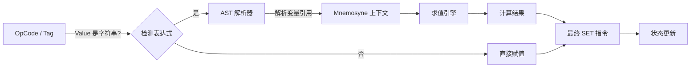
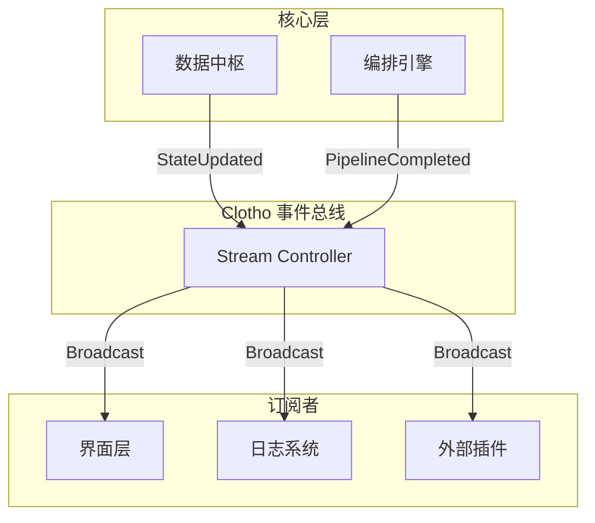

# Jacquard 增强规划：数学表达式与事件系统集成

**版本**: 1.0.0
**日期**: 2025-12-28
**状态**: Draft
**作者**: Architect Mode

---

## 一、 数学表达式支持 (Math Expression Support)

### 1.1 需求背景
ERA 插件允许使用 `+=10`, `max_hp * 0.5` 等表达式直接更新变量，极大地提高了 LLM 操作的灵活性。Clotho 目前的 OpCode (`ADD`, `SUB`) 虽然精确但不够直观。为了兼容 ERA 风格的 `<variable_edit>` 标签，Jacquard 的 `Updater` 模块需要集成数学表达式求值引擎。

### 1.2 技术方案

#### 1.2.1 引擎选型
考虑到 Clotho 的高性能和安全性要求，不使用 `eval()` 或完整的脚本引擎，而是实现一个 **受限的 AST 解析器 (Restricted AST Parser)** 或使用现成的 Dart 表达式库（如 `math_expressions`，需扩展变量上下文）。

**安全约束**:
- **禁止函数调用**: 只能使用预定义的数学函数 (`min`, `max`, `floor` 等)。
- **禁止副作用**: 表达式求值过程不能修改任何状态。
- **沙箱隔离**: 变量访问仅限于当前的 Mnemosyne 状态树。

#### 1.2.2 语法定义
支持以下语法结构：
- **相对运算**: `+=`, `-=`, `*=`, `/=`, `%=`
- **算术运算**: `+`, `-`, `*`, `/`, `^` (幂), `%` (模)
- **逻辑运算**: `min(a, b)`, `max(a, b)`, `clamp(val, min, max)`
- **变量引用**: 点分路径 `player.hp`, `character.stats.str`

#### 1.2.3 集成流程 (Updater Pipeline)



### 1.3 实现接口 (Dart 伪代码)

```dart
class ExpressionEvaluator {
  final Map<String, dynamic> context;
  
  ExpressionEvaluator(this.context);
  
  dynamic evaluate(String expression, dynamic currentValue) {
    // 1. 处理相对运算 (+=, -=)
    if (expression.startsWith('+=')) {
      var delta = _parse(expression.substring(2));
      return currentValue + delta;
    }
    
    // 2. 处理普通表达式
    return _parse(expression);
  }
  
  dynamic _parse(String expr) {
    // 解析并计算，自动从 context 中查找变量引用
  }
}
```

---

## 二、 事件系统集成 (Event System Integration)

### 2.1 需求背景
目前 Clotho 的各模块（Jacquard, Mnemosyne, UI）之间存在较强的直接耦合。为了实现类似 ERA 的 "WriteDone" 通知机制，并支持更灵活的插件扩展，需要引入一个统一的事件总线。

### 2.2 架构设计

采用 **发布-订阅 (Pub-Sub)** 模式，基于 Dart 的 `Stream` 实现。



### 2.3 核心事件定义

| 事件名 | 触发时机 | 负载 (Payload) | 用途 |
|--------|----------|----------------|------|
| `clotho:state_updated` | Mnemosyne 完成状态变更 | `diff`: 变更集, `mk`: 消息锚点 | UI 局部刷新，插件响应变量变化 |
| `clotho:snapshot_created` | 生成新快照 | `snapshot`: 完整快照对象 | 历史记录归档，回溯点标记 |
| `clotho:pipeline_step` | Jacquard 流水线步骤完成 | `step`: 步骤名, `result`: 中间结果 | 调试，进度条显示 |
| `clotho:filament_tag` | 解析到特定 Filament 标签 | `tag`: 标签名, `data`: 标签数据 | UI 渲染特殊组件 (如 `<choice>`) |
| `clotho:error` | 系统异常 | `code`: 错误码, `message`: 描述 | 统一错误处理，用户提示 |

### 2.4 实现接口 (Dart 伪代码)

```dart
enum ClothoEventType { stateUpdated, snapshotCreated, filamentTag, error }

class ClothoEvent {
  final ClothoEventType type;
  final dynamic payload;
  final DateTime timestamp;
  
  ClothoEvent(this.type, this.payload) : timestamp = DateTime.now();
}

class EventBus {
  final _controller = StreamController<ClothoEvent>.broadcast();
  
  // 发送事件
  void emit(ClothoEventType type, dynamic payload) {
    _controller.add(ClothoEvent(type, payload));
  }
  
  // 监听特定类型的事件
  Stream<ClothoEvent> on(ClothoEventType type) {
    return _controller.stream.where((e) => e.type == type);
  }
  
  // 监听所有事件
  Stream<ClothoEvent> get all => _controller.stream;
}
```

### 2.5 集成计划

1.  **基础设施层**: 在 `Infrastructure` 层实现 `EventBus` 单例。
2.  **数据层改造**: 在 `Mnemosyne` 的 `applyDelta` 方法中注入 `emit(state_updated)`。
3.  **编排层改造**: 在 `Jacquard` 的各个 Shuttle (如 Parser, Invoker) 中注入 `emit(pipeline_step)`。
4.  **UI 层改造**: 将 `Presentation` 层的数据获取逻辑改为监听 `state_updated` 事件，实现响应式更新。
