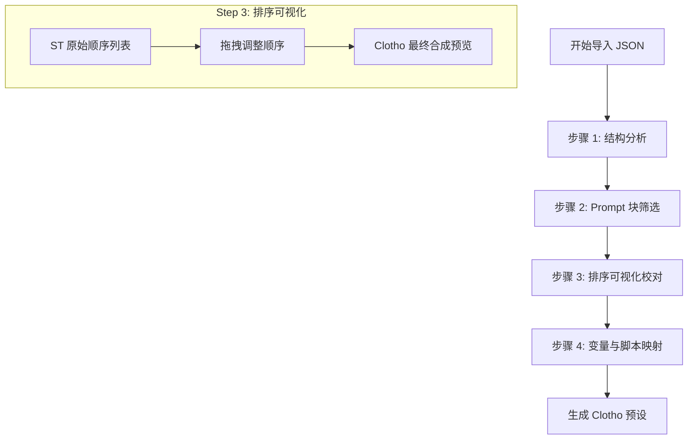
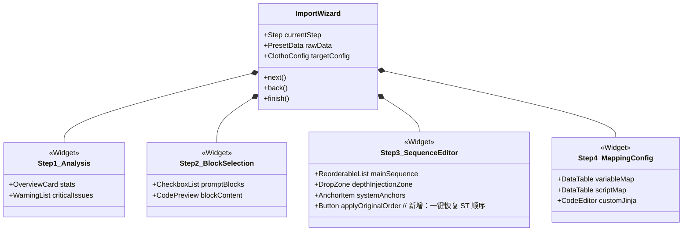

# Clotho 预设导入与 Prompt 排序映射设计 (Design Spec)

**版本**: 0.1.0  
**日期**: 2025-12-27  
**状态**: Draft  
**作者**: Roo (Architect Mode)

## 1. 概述

本设计旨在解决 SillyTavern 复杂预设（以 "GrayWill" 为例）导入 Clotho 系统时的 **Prompt 编排与排序映射** 问题。不同于简单的文本替换，Clotho 的 Jacquard 编排层是一个确定性的流水线，需要将 ST 的 `prompt_order` 逻辑精确映射到 Jacquard 的 `InjectionConfig` 中。

同时，我们设计了一个 **"预设导入向导" (Preset Import Wizard)**，引导用户完成这一复杂的配置映射过程，而不是依赖不透明的自动转换。

## 2. Prompt 排序逻辑分析与映射

### 2.1 源数据结构 (`预设导入.json`)

ST 的 Prompt 系统由两部分组成：
1.  **`prompts` 数组**: 定义了所有可用的 Prompt 块，包含内容、角色、启用状态以及 `injection_position` (虽名为 position，但在 ST 中更多依赖 order)。
2.  **`prompt_order` 数组**: 显式定义了特定角色 (Character ID) 下 Prompt 的**线性顺序**。

**关键发现**:
在提供的 `预设导入.json` 中，`prompt_order` 实际上定义了一个**绝对顺序**列表：
```json
"prompt_order": [
    {
        "character_id": 100001,
        "order": [
            { "identifier": "worldInfoBefore", "enabled": true },
            { "identifier": "740fdc64...", "enabled": true },
            { "identifier": "charDescription", "enabled": true },
            // ... 更多项
        ]
    }
]
```
这意味着 Jacquard 不需要复杂的相对计算，而是需要支持一种 **"基于列表的绝对排序策略" (List-based Absolute Ordering)**。

### 2.2 Jacquard 映射策略

Clotho 的 `Skein Builder` 支持多种注入策略。我们将引入一种新的策略适配器：**`SequenceInjectionStrategy`**。

#### 2.2.1 映射规则表

| ST 概念 | Clotho 概念 | 映射逻辑 |
| :--- | :--- | :--- |
| `prompts[i]` | `PromptBlock` | 内容转化为 Jinja2 模板，ID 保持一致。 |
| `prompt_order` | `InjectionConfig.sequence` | 导入时读取 Order 列表，生成一个全局的 Sequence Index。 |
| `injection_depth` | `InjectionConfig.depth` | 如果存在深度设置，转化为 Jacquard 的 `relativeToEnd` 偏移量。 |
| `role` | `BlockRole` | `system` -> `System`, `user` -> `User`, `assistant` -> `Assistant`。 |

#### 2.2.2 序列化处理流程

1.  **扁平化**: 读取 `prompt_order` 中的所有 identifier。
2.  **索引化**: 为每个 identifier 分配一个 `sequence_index` (0, 1, 2...)。
3.  **配置生成**: 在构建 `PromptBlock` 时，将 `sequence_index` 写入其元数据。
*   运行时排序: Jacquard 的 `Assembler` 阶段使用 `sequence_index` 作为主排序键。

### 2.3 手动分组功能 (Manual Grouping)

由于不同预设的命名规律差异巨大（如 "Yuan" 使用 Emoji，"GrayWill" 使用中文后缀），自动识别算法难以可靠工作。因此，我们提供**纯手动分组工具**。

#### 2.3.1 分组数据结构

```typescript
interface PromptGroup {
id: string;
title: string; // 用户自定义的分组名称，如 "思维链" 或 "模型选择"
icon?: string; // 用户可选择 Emoji 作为图标
items: string[]; // Prompt Block 的 identifier 列表
selectionMode: 'single' | 'multiple' | 'none'; // 用户手动设置
}
```

#### 2.3.2 UI 交互设计

在 **步骤 2: Prompt 块筛选** 中，增加分组管理功能：

```text
+-------------------------------------------------------+
|  Prompt Block Selection (Step 2/4)                     |
+-------------------------------------------------------+
|                                                       |
|  [+] 创建新分组                                      |
|                                                       |
|  分组: [思维链 ▼] (单选) [编辑] [删除]           |
|  +-------------------------------------------------+ |
|  | 🎐Thinking(Medium)     [x] [::] [x]           | |
|  | 💬简练思考           [ ] [::] [x]           | |
|  +-------------------------------------------------+ |
|                                                       |
|  分组: [输出模板 ▼] (多选) [编辑] [删除]           |
|  +-------------------------------------------------+ |
|  | 📗输出模板(有预填充) [x] [::] [x]         | |
|  | 📘小总结             [ ] [::] [x]           | |
|  +-------------------------------------------------+ |
|                                                       |
|  未分组:                                               |
|  +-------------------------------------------------+ |
|  | Main Prompt            [ ] [::] [x]           | |
|  | Auxiliary Prompt       [ ] [::] [x]           | |
|  +-------------------------------------------------+ |
|                                                       |
|  [::] = 从组中移除  [x] = 启用/禁用                |
|                                                       |
|  [< Back]                                   [Next >]  |
+-------------------------------------------------------+
```

#### 2.3.3 操作说明

1.  **创建分组**: 用户点击 `[+] 创建新分组`，输入名称和选择模式（单选/多选/无限制）。
2.  **添加到分组**: 用户可以拖拽未分组的 Prompt 到现有分组中。
3.  **从组中移除**: 点击 `[::]` 图标将 Prompt 移出分组。
4.  **编辑分组**: 修改分组名称或切换选择模式。
5.  **删除分组**: 删除分组后，组内所有 Prompt 回到"未分组"状态。

## 3. 预设导入向导 (Preset Import Wizard) UI/UX 设计

为了让用户直观地掌控这一过程，我们设计了一个分步向导。

### 3.1 流程图 (Mermaid)



### 3.2 界面交互细节

#### **步骤 1: 概览与分析 (Overview)**
*   **显示**: 检测到的 Prompt 数量、Regex 脚本数量、Quick Replies 等。
*   **警告**: 标出无法自动迁移的高风险脚本 (如 `cmd(eval)` )，提示用户需要手动干预。

#### **步骤 2: Prompt 块筛选与分组 (Block Selection & Grouping)**
*   **左侧**: ST 原有的 Prompt 列表 (如 "main", "nsfw", "jailbreak" 以及自定义的 "灰魂" 块)。
*   **右侧**: 详情编辑区。用户可以查看内容，并决定是否导入该块。
*   **分组功能**:
    *   **创建分组**: 用户可以自定义创建分组，设置分组名称和选择模式（单选/多选）。
    *   **拖拽管理**: 支持将 Prompt 拖入或拖出分组。
    *   **灵活配置**: 分组内的 Prompt 可以设置为互斥（单选）或非互斥（多选），完全由用户决定。
*   **功能**: 支持批量勾选/取消勾选。

#### **步骤 3: 排序编排 (Sequence Orchestration) [核心]**
这是最关键的一步。
*   **界面**: 一个垂直的、可拖拽的列表 (ReorderableListView)。
*   **数据源**: 初始化为 `prompt_order` 中的顺序。
*   **分组展示**: 在排序界面中，已分组的 Prompt 可以折叠显示，减少视觉混乱。
*   **特殊块**:
    *   将 `CharDesc` (角色描述), `WorldInfo` (世界书), `ChatHistory` (聊天记录) 作为**固定锚点 (Anchors)** 显示在列表中。
    *   用户可以将自定义 Prompt (如 "灰魂思维链") 拖拽到 "ChatHistory" 之前或之后。
*   **深度控制**: 对于需要插入到聊天记录末尾的 Prompt (Depth 注入)，提供一个单独的 "Depth Zone" 区域进行配置。

#### **步骤 4: 变量映射 (Variable Mapping)**
*   **自动识别**: 扫描内容中的 `{{user}}`, `{{char}}` 等 ST 宏。
*   **映射表**:
    *   `{{user}}` -> `{{ user_name }}`
    *   `{{char}}` -> `{{ char_name }}`
    *   `{{lastMessage}}` -> `{{ history.last }}`
*   **手动修正**: 对于无法识别的宏，允许用户手动输入对应的 Jinja2 表达式。

## 5. 高级迁移：Regex 脚本与 JS 干涉处理

针对 "GrayWill" 等高级预设中包含的 Regex UI 修改和 JS 脚本干涉，向导提供一套**半自动化的迁移策略**。

### 5.1 策略概览

| 源类型 (ST) | 典型用途 | 风险 | 目标类型 (Clotho Filament) | 迁移方式 |
| :--- | :--- | :--- | :--- | :--- |
| **Regex Script** | 替换 UI 文本、隐藏元素、注入 CSS | 低 (主要影响展示) | `<choice>` 标签 / Native Theme | **语义提取**: 识别 Regex 的意图（如“提供选项”），转换为结构化的 Filament 标签。 |
| **JS Script** | `alert()`, `shake()`, `cmd()` | 高 (任意代码执行) | `<ui_component>` / `<tool_call>` | **白名单映射**: 将安全的 DOM 操作映射为标准的 UI 组件指令；阻断不安全的 `eval`。 |

### 5.2 Regex -> Choice Tag 转换器

ST 常通过 Regex 匹配特定输出并在 UI 上渲染按钮。Clotho 原生支持这一功能。

**向导界面逻辑**:
1.  **扫描**: 检测 `script` 字段或 `regex_scripts` 数组。
2.  **识别**: 寻找类似 `/<(\d)>(.*?)<\/\1>/` 的模式（用于提取选项文本）。
3.  **建议**: 弹窗提示 "检测到模拟选项的正则脚本，是否转换为 Filament Choice 组件？"
4.  **转换**:
    *   **ST Regex**: `/<(\d)>(.*?)<\/\1>/g`
    *   **Clotho Template**: 建议用户在 System Prompt 中加入 instruction: 
        `"当需要用户选择时，请输出 <choice id='1'>选项内容</choice>"`

### 5.3 JS 干涉映射表配置

在向导的 "Advanced" 步骤中，提供一个映射配置表：

*   **源函数**: `alert(msg)`
    *   **目标组件**: `<ui_component type="toast" level="info">{{msg}}</ui_component>`
*   **源函数**: `shake(intensity)`
    *   **目标组件**: `<ui_component type="effect.shake" intensity="{{intensity}}" />`
*   **源函数**: `cmd(code)`
    *   **动作**: **DROP (丢弃)** (默认) 或 **MANUAL (手动重写)**
    *   *注: 向导会用红色高亮显示所有 `cmd` 调用，明确告知用户 Clotho 不支持 `eval`，必须重写为特定的 Tool Call。*

## 7. 预设导入向导 UI 线框图

为了更直观地展示导入流程，以下是基于 Mermaid 的 UI 状态流转与界面结构图。

### 7.1 界面结构概览



### 7.2 核心界面：Prompt 排序编排器 (Step 3)

这是一个垂直的拖拽排序列表，模拟了最终的 Prompt 组装顺序。

**默认行为**:
进入此步骤时，系统将**自动解析并应用** `prompt_order` 中的原始顺序。列表将精确反映 ST 中的编排，用户仅需在需要微调时进行拖拽。

```text
+-------------------------------------------------------+
|  Prompt Sequence Editor (Step 3/4)                    |
+-------------------------------------------------------+
|  [ Info ] Order auto-filled from ST preset.           |
|  [ Button ] Restore Original ST Order (Reset)         |
|                                                       |
|  [ Anchor ]  --- System Start ---                     |
|  [ Fixed  ]  World Info (Before) (ST Pos: 0)          |
|  [ Fixed  ]  Character Card Spec (ST Pos: 1)          |
|  [ Fixed  ]  Scenario            (ST Pos: 2)          |
|                                                       |
|  [ DRAGABLE ] 灰魂基本设定 (GrayWill)  [::] [x]       |
|  [ DRAGABLE ] 思维链前置 (COT_Pre)     [::] [x]       |
|                                                       |
|  [ Anchor ]  --- Context Window ---                   |
|  [ Fixed  ]  Chat History                             |
|                                                       |
|  [ DRAGABLE ] 灰魂思维链 (COT_Main)    [::] [x]       |
|  [ DRAGABLE ] 攻击脚本 (Attack_Script) [::] [x]       |
|                                                       |
|  [ Zone   ]  --- Depth Injection (RelativeToEnd) ---  |
|  |  [ DRAGABLE ] 越狱指令 (Jailbreak)  (Depth: 4) |   |
|  +----------------------------------------------------+
|                                                       |
|  [< Back]                                   [Next >]  |
+-------------------------------------------------------+
```

*   **[ Anchor ]**: 固定锚点，不可移动，代表 Jacquard 流水线的硬性阶段。
*   **[ Fixed ]**: 核心组件，建议位置固定，但在高级模式下可解锁。
*   **[ DRAGABLE ]**: 用户自定义的 Prompt 块，可自由拖拽。
*   **[ Zone ]**: 深度注入区，专门处理 `injection_depth` > 0 的块。

## 8. Prompt 结构迁移示例

### 8.1 源数据 (ST JSON)
```json
{
    "identifier": "enhanceDefinitions",
    "content": "Ensure logic is sound.",
    "injection_position": 0, // 实际上依赖 prompt_order
    "enabled": true
}
```

### 4.2 目标数据 (Clotho YAML/Filament)
```yaml
- id: "enhanceDefinitions"
  role: "system"
  content: "Ensure logic is sound."
  injection:
    strategy: "sequence"
    index: 5  # 由向导根据 prompt_order 自动计算
  tags: ["preset:graywill"]
```

## 5. 待确认项 (TBD)

1.  **多角色顺序**: `prompt_order` 似乎支持针对不同角色 ID 设置不同顺序。Clotho 是否需要支持这种细粒度？建议 V1 版本只支持**全局通用顺序**。
2.  **Regex 脚本处理**: 向导是否需要提供一个简易的 Regex -> `<ui_component>` 转换器？目前建议在“高级设置”中手动处理。

