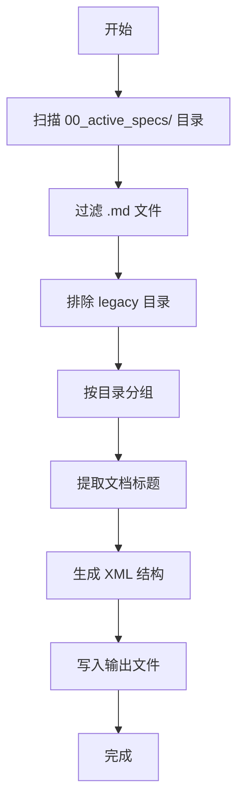

# Clotho 规格文档合并脚本设计

**版本**: 1.0.0
**日期**: 2026-02-09
**状态**: Design
**作者**: Clotho 架构团队

---

## 1. 设计目标

将 `00_active_specs/` 目录下的所有 Markdown 文档合并为单个 XML 文档，采用分层结构，按目录分组。

## 2. XML 结构设计

### 2.1 整体结构

```xml
<?xml version="1.0" encoding="UTF-8"?>
<clotho-specs>
  <metadata>
    <version>1.0.0</version>
    <generated>2026-02-09T11:00:00</generated>
    <source>00_active_specs/</source>
    <total_files>30</total_files>
  </metadata>

  <!-- 根目录文档 -->
  <category name="root">
    <document path="README.md">
      <title>Clotho 系统架构文档索引</title>
      <content>
        <![CDATA[
          # Clotho 系统架构文档索引
          ...
        ]]>
      </content>
    </document>
    <!-- 其他根目录文件 -->
  </category>

  <!-- 子系统文档 -->
  <category name="infrastructure">
    <document path="infrastructure/README.md">
      <title>基础设施层总览</title>
      <content>
        <![CDATA[
          # 基础设施层 (Infrastructure)
          ...
        ]]>
      </content>
    </document>
  </category>

  <!-- 其他分类 -->
  <category name="jacquard">...</category>
  <category name="mnemosyne">...</category>
  <category name="presentation">...</category>
  <category name="muse">...</category>
  <category name="protocols">...</category>
  <category name="workflows">...</category>
  <category name="runtime">...</category>
  <category name="reference">...</category>
</clotho-specs>
```

### 2.2 标签说明

| 标签 | 属性 | 说明 |
|------|------|------|
| `<clotho-specs>` | - | 根标签，包含所有规格文档 |
| `<metadata>` | - | 元数据信息 |
| `<category>` | `name` | 文档分类（目录名称） |
| `<document>` | `path` | 文档相对路径 |
| `<title>` | - | 文档标题（从 Markdown 提取） |
| `<content>` | - | 文档内容（使用 CDATA 包裹） |

## 3. 分类顺序

按照 `README.md` 中定义的阅读顺序排列：

1. **root** - 根目录文档（README.md, vision-and-philosophy.md 等）
2. **infrastructure** - 基础设施层
3. **jacquard** - 编排层
4. **mnemosyne** - 数据引擎
5. **presentation** - 表现层
6. **muse** - 智能服务
7. **protocols** - 协议与格式
8. **workflows** - 工作流
9. **runtime** - 运行时环境
10. **reference** - 参考文档

**排除**: `reference/legacy/` 目录（历史归档）

## 4. 脚本功能设计

### 4.1 核心功能

| 功能 | 描述 |
|------|------|
| **文件扫描** | 递归遍历 `00_active_specs/` 目录，收集所有 `.md` 文件 |
| **分类分组** | 按目录将文件分组到对应分类 |
| **标题提取** | 从 Markdown 内容中提取第一个 `#` 标题作为文档标题 |
| **XML 转义** | 正确处理 XML 特殊字符（使用 CDATA 包裹内容） |
| **排序输出** | 按预定义顺序输出分类，按文件名排序文档 |

### 4.2 处理流程



## 5. Python 脚本代码

```python
#!/usr/bin/env python3
# -*- coding: utf-8 -*-
"""
Clotho 规格文档合并脚本
将 00_active_specs/ 目录下的所有 Markdown 文档合并为单个 XML 文档
采用分层结构，按目录分组
"""

import os
import re
from datetime import datetime
from pathlib import Path
from xml.sax.saxutils import escape


def extract_title(content: str, default: str = "Untitled") -> str:
    """从 Markdown 内容中提取标题（第一个 # 标题）"""
    match = re.search(r'^#\s+(.+)$', content, re.MULTILINE)
    if match:
        return match.group(1).strip()
    return default


def read_markdown_file(file_path: Path) -> str:
    """读取 Markdown 文件内容"""
    try:
        with open(file_path, 'r', encoding='utf-8') as f:
            return f.read()
    except Exception as e:
        print(f"警告: 无法读取文件 {file_path}: {e}")
        return ""


def get_relative_path(file_path: Path, base_path: Path) -> str:
    """获取相对于基础目录的路径"""
    try:
        return str(file_path.relative_to(base_path))
    except ValueError:
        return str(file_path)


def categorize_files(base_path: Path) -> dict:
    """
    将文件按目录分组
    返回: {category_name: [file_paths]}
    """
    categories = {}

    # 遍历所有 .md 文件
    for md_file in base_path.rglob("*.md"):
        # 跳过 legacy 目录
        if "legacy" in md_file.parts:
            continue

        relative_path = get_relative_path(md_file, base_path)
        parts = Path(relative_path).parts

        if len(parts) == 1:
            # 根目录文件
            category = "root"
        else:
            # 子目录文件
            category = parts[0]

        if category not in categories:
            categories[category] = []
        categories[category].append(md_file)

    return categories


def generate_xml_document(categories: dict, base_path: Path) -> str:
    """生成 XML 文档"""
    lines = []

    # XML 声明
    lines.append('<?xml version="1.0" encoding="UTF-8"?>')
    lines.append('<clotho-specs>')
    lines.append('')

    # 元数据
    lines.append('  <metadata>')
    lines.append(f'    <version>1.0.0</version>')
    lines.append(f'    <generated>{datetime.now().isoformat()}</generated>')
    lines.append(f'    <source>{base_path}</source>')
    lines.append(f'    <total_files>{sum(len(files) for files in categories.values())}</total_files>')
    lines.append('  </metadata>')
    lines.append('')

    # 定义分类顺序（按照 README.md 中的阅读顺序）
    category_order = [
        "root",
        "infrastructure",
        "jacquard",
        "mnemosyne",
        "presentation",
        "muse",
        "protocols",
        "workflows",
        "runtime",
        "reference"
    ]

    # 处理每个分类
    for category in category_order:
        if category not in categories:
            continue

        files = sorted(categories[category], key=lambda x: str(x))

        lines.append(f'  <category name="{category}">')

        for file_path in files:
            content = read_markdown_file(file_path)
            if not content:
                continue

            relative_path = get_relative_path(file_path, base_path)
            title = extract_title(content, Path(file_path).stem)

            # 转义 XML 特殊字符
            escaped_content = escape(content)

            lines.append(f'    <document path="{relative_path}">')
            lines.append(f'      <title>{escape(title)}</title>')
            lines.append('      <content>')
            lines.append(f'        <![CDATA[')
            lines.append(escaped_content)
            lines.append(f'        ]]>')
            lines.append('      </content>')
            lines.append('    </document>')
            lines.append('')

        lines.append('  </category>')
        lines.append('')

    # 闭合标签
    lines.append('</clotho-specs>')

    return '\n'.join(lines)


def main():
    """主函数"""
    # 获取脚本所在目录的父目录作为项目根目录
    script_dir = Path(__file__).parent
    project_root = script_dir.parent
    specs_dir = project_root / "00_active_specs"
    output_file = project_root / "clotho-specs.xml"

    print(f"Clotho 规格文档合并脚本")
    print(f"=" * 50)
    print(f"源目录: {specs_dir}")
    print(f"输出文件: {output_file}")
    print(f"")

    # 检查源目录是否存在
    if not specs_dir.exists():
        print(f"错误: 源目录不存在: {specs_dir}")
        return

    # 按目录分组文件
    print("正在扫描文件...")
    categories = categorize_files(specs_dir)

    total_files = sum(len(files) for files in categories.values())
    print(f"找到 {total_files} 个 Markdown 文件")
    print(f"分类数量: {len(categories)}")
    print(f"")

    # 显示分类统计
    for category, files in categories.items():
        print(f"  {category}: {len(files)} 个文件")
    print(f"")

    # 生成 XML
    print("正在生成 XML 文档...")
    xml_content = generate_xml_document(categories, specs_dir)

    # 写入文件
    with open(output_file, 'w', encoding='utf-8') as f:
        f.write(xml_content)

    print(f"完成！已生成: {output_file}")
    print(f"文件大小: {len(xml_content)} 字节")


if __name__ == "__main__":
    main()
```

## 6. 使用说明

### 6.1 运行脚本

```bash
# 在项目根目录下运行
python scripts/merge_specs_to_xml.py
```

### 6.2 输出文件

脚本将在项目根目录生成 `clotho-specs.xml` 文件。

### 6.3 预期输出

```
Clotho 规格文档合并脚本
==================================================
源目录: c:\Users\Administrator\Documents\Clotho-Design\00_active_specs
输出文件: c:\Users\Administrator\Documents\Clotho-Design\clotho-specs.xml

正在扫描文件...
找到 30 个 Markdown 文件
分类数量: 10

  root: 7 个文件
  infrastructure: 1 个文件
  jacquard: 3 个文件
  mnemosyne: 4 个文件
  presentation: 1 个文件
  muse: 1 个文件
  protocols: 7 个文件
  workflows: 4 个文件
  runtime: 2 个文件
  reference: 4 个文件

正在生成 XML 文档...
完成！已生成: clotho-specs.xml
文件大小: XXXXXX 字节
```

## 7. 后续扩展

- [ ] 支持自定义输出路径
- [ ] 支持过滤特定文件
- [ ] 支持增量更新（只处理修改过的文件）
- [ ] 添加 XML 验证
- [ ] 生成索引文件（便于快速查找）

---

**最后更新**: 2026-02-09
**文档状态**: 设计完成，待实现
