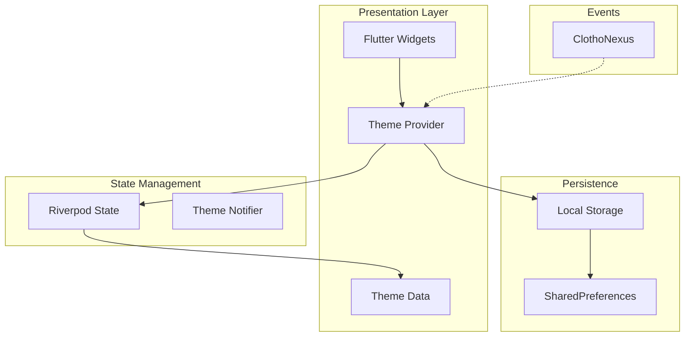

# 主题系统实现计划 (Theme System Implementation Plan)

**版本**: 1.0.0
**日期**: 2026-02-26
**状态**: Draft
**类型**: Implementation Plan
**方案**: 完整实现方案（覆盖全部6个核心内容）

---

## 1. 概述 (Overview)

本文档定义 Clotho 表现层主题系统的完整实现计划。主题系统是表现层的核心基础设施，为整个应用提供一致的视觉语言和用户体验。

### 1.1 实现目标

| 目标 | 描述 |
|------|------|
| **Material 3 集成** | 基于 Flutter Material 3 构建语义化主题系统 |
| **多主题支持** | 支持深色/浅色模式、自定义主题 |
| **无缝切换** | 支持运行时主题切换，带平滑动画过渡 |
| **状态持久化** | 主题偏好跨会话持久化存储 |
| **动态主题** | 支持运行时动态加载和创建主题 |

### 1.2 核心内容覆盖

| # | 内容 | 优先级 |
|---|------|--------|
| 1 | 主题系统概述 | P0 |
| 2 | Material 3 主题 | P0 |
| 3 | 暗黑模式 | P0 |
| 4 | 主题切换 | P0 |
| 5 | 自定义主题 | P1 |
| 6 | 主题持久化 | P0 |
| 7 | 主题动画 | P1 |

---

## 2. 架构设计 (Architecture)

### 2.1 模块关系图



### 2.2 核心组件

| 组件 | 职责 | 位置 |
|------|------|------|
| `ClothoTheme` | 主题数据定义（静态） | `presentation/theme/` |
| `ThemeProvider` | 主题状态管理与切换 | `presentation/providers/` |
| `ThemePersistence` | 主题持久化逻辑 | `infrastructure/storage/` |
| `ThemeEvents` | 主题相关事件定义 | `infrastructure/events/` |

---

## 3. 详细设计 (Detailed Design)

### 3.1 主题数据模型

```dart
/// 主题模式枚举
enum ThemeMode {
  system,  // 跟随系统
  light,   // 浅色模式
  dark,    // 深色模式
}

/// 主题配置模型
class ThemeConfig {
  final String id;
  final String name;
  final Color seedColor;
  final Brightness brightness;
  final ThemeExtension? customColors;
  
  const ThemeConfig({
    required this.id,
    required this.name,
    required this.seedColor,
    required this.brightness,
    this.customColors,
  });
}

/// 内置主题
class BuiltInThemes {
  static const dark = ThemeConfig(
    id: 'clotho-dark',
    name: 'Clotho 深色',
    seedColor: Color(0xFF6750A4),
    brightness: Brightness.dark,
  );
  
  static const light = ThemeConfig(
    id: 'clotho-light',
    name: 'Clotho 浅色',
    seedColor: Color(0xFF6750A4),
    brightness: Brightness.light,
  );
  
  static const ocean = ThemeConfig(
    id: 'ocean',
    name: '海洋',
    seedColor: Color(0xFF0D47A1),
    brightness: Brightness.dark,
  );
  
  static const forest = ThemeConfig(
    id: 'forest',
    name: '森林',
    seedColor: Color(0xFF2E7D32),
    brightness: Brightness.dark,
  );
}
```

### 3.2 ThemeProvider 设计

```dart
import 'package:flutter/material.dart';
import 'package:flutter_riverpod/flutter_riverpod.dart';
import 'package:shared_preferences/shared_preferences.dart';

/// 主题状态
class ThemeState {
  final ThemeMode themeMode;
  final ThemeConfig currentTheme;
  final List<ThemeConfig> customThemes;
  
  const ThemeState({
    this.themeMode = ThemeMode.dark,
    required this.currentTheme,
    this.customThemes = const [],
  });
  
  ThemeState copyWith({
    ThemeMode? themeMode,
    ThemeConfig? currentTheme,
    List<ThemeConfig>? customThemes,
  }) {
    return ThemeState(
      themeMode: themeMode ?? this.themeMode,
      currentTheme: currentTheme ?? this.currentTheme,
      customThemes: customThemes ?? this.customThemes,
    );
  }
}

/// 主题 Notifier
class ThemeNotifier extends StateNotifier<ThemeState> {
  final SharedPreferences _prefs;
  static const _keyThemeMode = 'theme_mode';
  static const _keyCurrentTheme = 'current_theme_id';
  
  ThemeNotifier(this._prefs) : super(_loadInitialState(_prefs));
  
  static ThemeState _loadInitialState(SharedPreferences prefs) {
    final themeModeIndex = prefs.getInt(_keyThemeMode) ?? 0;
    final themeId = prefs.getString(_keyCurrentTheme) ?? 'clotho-dark';
    
    final themeMode = ThemeMode.values[themeModeIndex];
    final theme = _findThemeById(themeId) ?? BuiltInThemes.dark;
    
    return ThemeState(
      themeMode: themeMode,
      currentTheme: theme,
    );
  }
  
  static ThemeConfig _findThemeById(String id) {
    final builtIn = [BuiltInThemes.dark, BuiltInThemes.light, BuiltInThemes.ocean, BuiltInThemes.forest];
    return builtIn.firstWhere(
      (t) => t.id == id,
      orElse: () => BuiltInThemes.dark,
    );
  }
  
  /// 切换主题模式（深色/浅色/系统）
  void setThemeMode(ThemeMode mode) {
    state = state.copyWith(themeMode: mode);
    _prefs.setInt(_keyThemeMode, mode.index);
    _publishThemeEvent(ThemeAction.modeChanged, mode);
  }
  
  /// 切换主题（内置主题）
  void setTheme(ThemeConfig theme) {
    state = state.copyWith(currentTheme: theme);
    _prefs.setString(_keyCurrentTheme, theme.id);
    _publishThemeEvent(ThemeAction.themeChanged, theme);
  }
  
  /// 添加自定义主题
  void addCustomTheme(ThemeConfig theme) {
    final themes = [...state.customThemes, theme];
    state = state.copyWith(customThemes: themes);
    // 持久化自定义主题列表
    _saveCustomThemes(themes);
  }
  
  /// 删除自定义主题
  void removeCustomTheme(String themeId) {
    final themes = state.customThemes.where((t) => t.id != themeId).toList();
    state = state.copyWith(customThemes: themes);
    _saveCustomThemes(themes);
  }
  
  void _saveCustomThemes(List<ThemeConfig> themes) {
    // 序列化主题列表到 JSON 并存储
    final json = themes.map((t) => {'id': t.id, 'name': t.name, 'seedColor': t.seedColor.value}).toList();
    _prefs.setString('custom_themes', jsonEncode(json));
  }
  
  void _publishThemeEvent(ThemeAction action, dynamic data) {
    // 通过 ClothoNexus 发布主题变更事件
  }
}

enum ThemeAction { modeChanged, themeChanged }

/// Riverpod Provider
final themeProvider = StateNotifierProvider<ThemeNotifier, ThemeState>((ref) {
  final prefs = ref.watch(sharedPreferencesProvider);
  return ThemeNotifier(prefs);
});

final sharedPreferencesProvider = Provider<SharedPreferences>((ref) {
  throw UnimplementedError('必须在根目录注入 SharedPreferences');
});
```

### 3.3 主题构建器

```dart
import 'package:flutter/material.dart';

/// 主题构建器
class ClothoThemeBuilder {
  static ThemeData build(ThemeConfig config, Brightness? brightness) {
    final resolvedBrightness = brightness ?? config.brightness;
    
    final scheme = ColorScheme.fromSeed(
      seedColor: config.seedColor,
      brightness: resolvedBrightness,
      // 自定义语义色映射
      primary: _mapSemanticColor(config, 'primary', resolvedBrightness),
      onPrimary: _mapSemanticColor(config, 'onPrimary', resolvedBrightness),
      primaryContainer: _mapSemanticColor(config, 'primaryContainer', resolvedBrightness),
      onPrimaryContainer: _mapSemanticColor(config, 'onPrimaryContainer', resolvedBrightness),
      surface: _mapSemanticColor(config, 'surface', resolvedBrightness),
      onSurface: _mapSemanticColor(config, 'onSurface', resolvedBrightness),
      surfaceContainer: _mapSemanticColor(config, 'surfaceContainer', resolvedBrightness),
      error: _mapSemanticColor(config, 'error', resolvedBrightness),
    );
    
    return ThemeData(
      useMaterial3: true,
      colorScheme: scheme,
      scaffoldBackgroundColor: scheme.surface,
      // 组件主题配置...
      appBarTheme: _buildAppBarTheme(scheme),
      cardTheme: _buildCardTheme(scheme),
      inputDecorationTheme: _buildInputDecorationTheme(scheme),
      navigationRailTheme: _buildNavigationRailTheme(scheme),
      // ... 其他组件主题
    );
  }
  
  static Color _mapSemanticColor(ThemeConfig config, String key, Brightness brightness) {
    // 从 config.customColors 获取自定义颜色映射
    return Colors.transparent; // TODO: 实现自定义颜色映射
  }
  
  static AppBarTheme _buildAppBarTheme(ColorScheme scheme) {
    return AppBarTheme(
      backgroundColor: scheme.surface,
      foregroundColor: scheme.onSurface,
      elevation: 0,
      centerTitle: false,
      titleTextStyle: TextStyle(
        color: scheme.onSurface,
        fontSize: 22,
        fontWeight: FontWeight.w500,
      ),
    );
  }
  
  static CardThemeData _buildCardTheme(ColorScheme scheme) {
    return CardThemeData(
      color: scheme.surfaceContainer,
      elevation: 0,
      shape: RoundedRectangleBorder(
        borderRadius: BorderRadius.circular(12),
      ),
    );
  }
  
  static InputDecorationTheme _buildInputDecorationTheme(ColorScheme scheme) {
    return InputDecorationTheme(
      filled: true,
      fillColor: scheme.surfaceContainerHighest,
      border: OutlineInputBorder(
        borderRadius: BorderRadius.circular(24),
        borderSide: BorderSide.none,
      ),
      contentPadding: const EdgeInsets.symmetric(horizontal: 16, vertical: 12),
    );
  }
  
  static NavigationRailThemeData _buildNavigationRailTheme(ColorScheme scheme) {
    return NavigationRailThemeData(
      backgroundColor: scheme.surface,
      selectedIconTheme: IconThemeData(color: scheme.onSecondaryContainer),
      unselectedIconTheme: IconThemeData(color: scheme.onSurfaceVariant),
      selectedLabelTextStyle: TextStyle(color: scheme.onSecondaryContainer, fontSize: 12),
      unselectedLabelTextStyle: TextStyle(color: scheme.onSurfaceVariant, fontSize: 12),
    );
  }
}
```

### 3.4 主题切换动画

```dart
import 'package:flutter/material.dart';

/// 主题切换动画包装器
class ThemeTransition extends StatelessWidget {
  final Widget child;
  final ThemeNotifier themeNotifier;
  
  const ThemeTransition({
    super.key,
    required this.child,
    required this.themeNotifier,
  });
  
  @override
  Widget build(BuildContext context) {
    return AnimatedTheme(
      data: Theme.of(context),
      duration: const Duration(milliseconds: 300),
      curve: Curves.easeInOut,
      child: child,
    );
  }
}

/// 应用级主题动画
class ClothApp extends ConsumerWidget {
  const ClothApp({super.key});
  
  @override
  Widget build(BuildContext context, WidgetRef ref) {
    final themeState = ref.watch(themeProvider);
    
    // 根据 themeMode 解析实际 brightness
    final brightness = _resolveBrightness(themeState.themeMode);
    
    // 构建 ThemeData
    final themeData = ClothoThemeBuilder.build(themeState.currentTheme, brightness);
    
    return AnimatedTheme(
      data: themeData,
      duration: const Duration(milliseconds: 300),
      curve: Curves.easeInOut,
      child: MaterialApp(
        theme: themeData,
        home: const HomeScreen(),
      ),
    );
  }
  
  Brightness _resolveBrightness(ThemeMode mode) {
    switch (mode) {
      case ThemeMode.light:
        return Brightness.light;
      case ThemeMode.dark:
        return Brightness.dark;
      case ThemeMode.system:
        // 通过 MediaQuery.platformBrightnessOf 获取系统亮度
        return Brightness.dark; // TODO: 实现系统亮度检测
    }
  }
}
```

### 3.5 ClothoNexus 主题事件

```dart
/// 主题变更事件
class ThemeChangedEvent extends ClothoEvent {
  final ThemeMode? mode;
  final ThemeConfig? config;
  
  ThemeChangedEvent({this.mode, this.config, Map<String, dynamic>? metadata})
      : super(metadata: metadata);
}

/// 主题事件类型
class ThemeEventTypes {
  static const String themeModeChanged = 'theme.mode.changed';
  static const String themeConfigChanged = 'theme.config.changed';
  static const String themeLoaded = 'theme.loaded';
}
```

---

## 4. 实现步骤 (Implementation Steps)

### 阶段 1: 核心基础设施

| 步骤 | 任务 | 依赖 |
|------|------|------|
| 1.1 | 创建主题数据模型（ThemeConfig, ThemeMode） | - |
| 1.2 | 扩展 ClothoThemeBuilder 支持内置主题 | 1.1 |
| 1.3 | 实现 ThemeNotifier 状态管理 | 1.1, 1.2 |
| 1.4 | 集成 SharedPreferences 持久化 | 1.3 |

### 阶段 2: 主题切换功能

| 步骤 | 任务 | 依赖 |
|------|------|------|
| 2.1 | 实现 ThemeMode 切换（深色/浅色/系统） | 1.4 |
| 2.2 | 实现内置主题切换 | 1.4 |
| 2.3 | 添加主题切换动画 | 2.2 |
| 2.4 | 集成 ClothoNexus 事件 | 2.3 |

### 阶段 3: 自定义主题

| 步骤 | 任务 | 依赖 |
|------|------|------|
| 3.1 | 实现自定义主题数据模型 | - |
| 3.2 | 添加自定义主题存储 | 2.4 |
| 3.3 | 实现自定义主题编辑器 UI | 3.2 |
| 3.4 | 添加主题预览功能 | 3.3 |

### 阶段 4: 高级特性

| 步骤 | 任务 | 依赖 |
|------|------|------|
| 4.1 | 实现动态主题加载 | 3.4 |
| 4.2 | 添加主题渐变背景支持 | 3.4 |
| 4.3 | 实现主题色温调节 | 4.1 |
| 4.4 | 添加高对比度模式 | 4.2 |

---

## 5. API 参考 (API Reference)

### 5.1 主题 Provider

```dart
// 读取当前主题状态
final themeState = ref.watch(themeProvider);

// 切换主题模式
ref.read(themeProvider.notifier).setThemeMode(ThemeMode.dark);

// 切换主题
ref.read(themeProvider.notifier).setTheme(BuiltInThemes.ocean);

// 添加自定义主题
ref.read(themeProvider.notifier).addCustomTheme(customTheme);

// 删除自定义主题
ref.read(themeProvider.notifier).removeCustomTheme('my-theme');
```

### 5.2 主题数据使用

```dart
// 在 Widget 中使用当前主题
final theme = Theme.of(context);
final colorScheme = theme.colorScheme;

// 使用语义颜色
Container(
  color: colorScheme.primaryContainer,
  child: Text(
    'Hello',
    style: TextStyle(color: colorScheme.onPrimaryContainer),
  ),
)
```

---

## 6. 性能考虑 (Performance Considerations)

| 优化点 | 策略 |
|--------|------|
| **主题切换** | 使用 AnimatedTheme 避免全量重建 |
| **主题数据缓存** | 预生成 ThemeData 并缓存 |
| **持久化优化** | 异步写入 SharedPreferences |
| **内存管理** | 限制自定义主题数量（最多 10 个） |

---

## 7. 关联文档 (Related Documents)

| 文档 | 关系 |
|------|------|
| [`02-color-theme.md`](../00_active_specs/presentation/02-color-theme.md) | 颜色主题基础规范 |
| [`01-design-tokens.md`](../00_active_specs/presentation/01-design-tokens.md) | 设计令牌系统 |
| [`infrastructure/clotho-nexus-events.md`](../00_active_specs/infrastructure/clotho-nexus-events.md) | 事件总线 |
| [`presentation/clotho-nexus-integration.md`](../00_active_specs/presentation/clotho-nexus-integration.md) | 表现层事件集成 |
| [`08_demo/lib/theme/app_theme.dart`](../08_demo/lib/theme/app_theme.dart) | 演示应用主题 |

---

## 8. 验收标准 (Acceptance Criteria)

- [ ] 深色/浅色/系统主题模式切换正常工作
- [ ] 至少 4 个内置主题可切换
- [ ] 主题切换带 300ms 平滑动画
- [ ] 主题偏好跨应用重启持久化
- [ ] 自定义主题可添加、切换、删除
- [ ] ClothoNexus 事件正确发布
- [ ] 代码示例可运行

---

**计划状态**: 已完成，等待架构评审委员会审议
**下一步**: 切换至 Code 模式实现核心基础设施