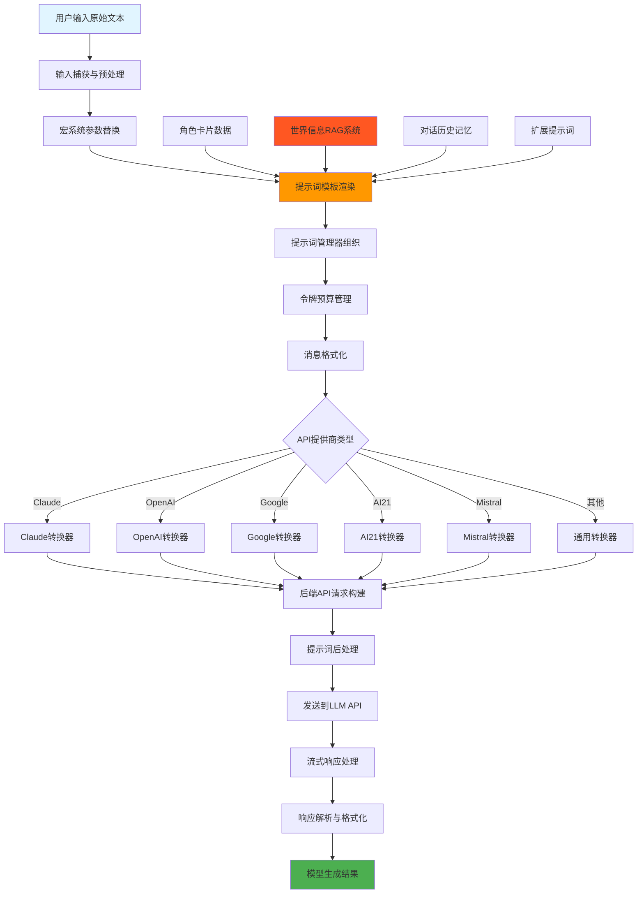

# SillyTavern 数据流转全链路深度分析

## 概述

本文档从理论层面深入分析SillyTavern从用户输入原始文本到最终构建并发送给LLM API的完整信息流转全链路，详细解析文本如何经过输入清洗与预处理、提示词模板渲染、上下文注入、系统指令设定、最终形成符合API接口规范的请求体，并阐述各环节对模型生成效果的具体影响。

---

## 一、完整数据流转链路图

---

## 二、用户输入捕获与预处理机制

### 2.1 输入捕获原理

**触发机制**：
当用户在输入框中输入文本并点击发送按钮或按下回车键时，系统会触发生成流程。这个过程的核心是将用户的原始意图捕获为可处理的数据结构。

**捕获流程**：
1. 系统检测到发送动作，将发送标志位设置为激活状态
2. 从页面的输入框元素中提取文本内容
3. 将文本内容传递给生成函数进行处理
4. 清空输入框以准备下一次输入
5. 触发输入事件以通知其他组件

**数据结构**：
捕获的原始文本会经过多个处理阶段，每个阶段都会对文本进行特定的转换和增强，最终形成一个结构化的消息对象。

### 2.2 输入清洗与预处理

**空白字符处理**：
系统会自动去除文本中的回车符（`\r`字符），这是为了减少无效的令牌消耗。回车符在大多数情况下不会影响语义，但会占用额外的令牌空间，因此去除它们可以提高效率。

**正则表达式处理**：
系统支持在多个位置应用正则表达式替换。这允许用户定义自己的文本处理规则，例如：
- 在提示词之前插入特定内容
- 在输出之后进行格式化
- 过滤或替换敏感词汇
- 统一特定的格式模式

正则处理的位置包括：
- 在主提示词之前
- 在主提示词之后
- 在输出开始之前
- 在输出开始之后

这种灵活性使得用户可以根据自己的需求定制输入和输出的处理方式。

**宏替换机制**：
宏系统是SillyTavern中非常强大的功能，它允许在文本中插入动态占位符，这些占位符会在运行时被替换为实际值。

**预处理宏**（在内容处理之前替换）：
这些宏在文本被进一步处理之前就已经被替换，主要用于提供基本的上下文信息：
- 用户名占位符：将用户名插入到文本中
- 角色名占位符：将当前角色名称插入到文本中
- 日期和时间占位符：插入当前的日期和时间
- 输入内容占位符：引用用户刚刚输入的内容
- 换行符占位符：插入换行符

**后处理宏**（在内容处理之后替换）：
这些宏在文本经过其他处理后才会被替换，主要用于提供计算后的值：
- 最大提示词大小：显示当前上下文窗口的令牌限制
- 最后聊天消息：引用对话历史中的最后一条消息
- 群组成员：列出当前群组中的所有成员
- 条件角色名：根据是否为群组聊天选择不同的角色名

**宏替换的影响**：
宏替换使得提示词可以动态适应不同的上下文和场景。例如，用户名和角色名的占位符使得同一个提示词模板可以用于不同的角色组合，而无需修改模板本身。

### 2.3 对模型生成效果的影响

**正面影响**：
- 去除多余空白减少了无效令牌的消耗，使得更多的令牌可以用于实际的上下文内容
- 正则表达式处理可以统一输出格式，提高生成内容的一致性和可读性
- 宏替换实现了动态内容注入，使得上下文更加相关和个性化，这可以显著提高模型对当前对话的理解能力

**潜在问题**：
- 过度的正则替换可能会改变用户的原始意图，特别是当替换规则过于激进时
- 如果宏替换失败（例如占位符拼写错误），会导致未替换的占位符残留在最终文本中，这可能影响模型的理解
- 复杂的宏逻辑可能会引入意外的行为或错误，特别是在递归替换的情况下

---

## 三、提示词管理系统

### 3.1 PromptManager核心架构

**系统设计理念**：
PromptManager是SillyTavern中管理所有提示词组件的核心系统。它的设计理念是将不同类型的提示词（系统提示词、角色描述、场景信息、世界信息等）组织成一个结构化的集合，然后根据预定义的规则将它们插入到适当的位置。

**提示词对象结构**：
每个提示词对象包含以下关键属性：
- 唯一标识符：用于在系统中引用和定位该提示词
- 消息角色：定义该提示词在对话中扮演的角色（系统、用户或助手）
- 提示词内容：实际要发送给模型的文本内容
- 注入位置：决定该提示词应该插入到消息流的哪个位置
- 注入深度：当使用相对位置时，指定插入的深度级别
- 注入优先级：当多个提示词具有相同位置和深度时，决定它们的排列顺序
- 启用状态：控制该提示词是否应该被使用
- 系统提示词标志：标识该提示词是否为系统级别的指令
- 禁止覆盖标志：防止该提示词被角色卡片或其他来源的设置覆盖

**提示词集合结构**：
提示词集合可以包含多个提示词对象或其他提示词集合，形成树状或层级结构。这种嵌套结构允许将相关的提示词组织在一起，便于管理和维护。

**提示词管理器功能**：
提示词管理器提供了创建、组织、渲染和管理所有提示词的完整功能。它还负责与令牌预算系统集成，确保提示词的总令牌数不超过模型的上下文限制。

### 3.2 提示词注入策略

**相对位置注入**：
相对位置是相对于某个参考点的位置，而不是绝对的消息索引。这种策略使得提示词的插入更加灵活，因为当参考点（如主提示词）的位置变化时，相对位置会自动调整。

相对位置包括：
- 在主提示词之前：用于提供背景信息或前置条件
- 在主提示词之后：用于提供补充说明或后续指令
- 在对话历史中：用于在对话的特定深度插入提示词

**绝对位置注入**：
绝对位置指定了提示词在最终消息数组中的精确索引。这种策略提供了精确的控制，但缺乏灵活性，因为当消息数量变化时可能需要手动调整索引。

**注入深度机制**：
深度是用于在对话历史中指定插入位置的数值。深度值为0表示在对话历史的开始（最旧的消息），深度值越大表示插入的位置越接近当前对话（最新的消息）。这种机制允许用户控制提示词相对于当前对话的上下文位置。

### 3.3 提示词组织顺序

提示词的顺序对模型的最终输出有重要影响。SillyTavern定义了一个默认的提示词顺序，这个顺序经过精心设计，以提供最佳的上下文组织：

**系统提示词阶段**（在对话历史之前）：
1. 世界信息（主提示词之前）：提供角色和世界的背景知识
2. 主提示词：定义模型的核心任务和基本行为规则
3. 世界信息（主提示词之后）：提供补充的世界信息
4. 角色描述：详细描述角色的外观、背景和特征
5. 角色性格：描述角色的性格特点和行为模式
6. 场景：定义当前对话发生的场景和背景

**用户设定阶段**（在系统提示词之后）：
7. 用户人设：描述用户的角色和特征
8. NSFW提示词：用于成人内容的处理规则
9. 越狱提示词：用于绕过模型的安全限制

**控制与引导阶段**：
10. 偏见提示词：用于引导模型的输出倾向
11. 摘要：对话历史的摘要，用于压缩长对话
12. 作者注释：作者提供的实时注释或指导
13. 向量记忆：通过向量检索的相关记忆
14. 向量数据库：外部知识库的检索结果
15. 智能上下文：通过智能检索的相关上下文

**对话历史阶段**（在控制与引导阶段之后）：
16. 对话历史：实际的对话内容，从最新到最旧排列
17. 对话示例：展示期望的对话风格和格式

**特殊提示词阶段**：
18. 扮演提示词：用于用户扮演模式的提示词
19. 静默提示词：用于静默生成（如摘要）的提示词
20. 群组提示词：用于群组聊天的特殊提示词

### 3.4 对模型生成效果的影响

**提示词顺序的影响**：
提示词在消息流中的位置对模型的理解和输出有显著影响。系统提示词（特别是主提示词）通常会被模型最先处理，因此它们定义了模型的基本行为框架。将重要的系统提示词放在前面可以确保模型在整个对话过程中遵循这些规则。

**角色分配的影响**：
不同的消息角色在对话中扮演不同的功能：
- 系统角色：用于设定行为规则、上下文信息和约束条件
- 用户角色：模拟用户的输入和请求
- 助手角色：用于预填充模型的输出或引导模型生成特定内容

合理使用角色可以清晰地区分不同类型的信息，避免模型混淆。

**注入深度的影响**：
在对话历史中插入提示词的深度决定了该提示词相对于当前对话的上下文位置。深度值越小，提示词越接近对话历史的开始（更旧的消息），这意味着它会影响更多的后续消息。深度值越大，提示词越接近当前对话（更新的消息），这意味着它主要影响最近的上下文。

---

## 四、世界信息系统（RAG）

### 4.1 WorldInfo核心组件

**系统设计理念**：
世界信息系统是SillyTavern的检索增强生成（RAG）实现，它允许用户定义与世界相关的知识条目，系统会根据当前对话内容自动匹配和激活相关的世界信息，并将这些信息注入到提示词中。

**扫描缓冲区**：
扫描缓冲区是一个维护最近消息的缓存结构，用于世界信息的匹配过程。缓冲区存储了最近N条消息的内容，这些消息会被用于关键词匹配。缓冲区的深度可以配置，决定了系统会检查多远的历史消息。

**时间效果管理器**：
时间效果管理器负责处理世界信息的激活和停用时机。它支持三种类型的时间效果：
- 持续效果：一旦激活，世界信息会一直保持激活状态，直到用户手动关闭
- 冷却效果：激活后，世界信息会等待指定的轮数才能再次激活，这防止相同的信息在短时间内重复出现
- 延迟效果：世界信息会延迟指定的轮数后才激活，这允许在对话进展到某个阶段后再注入相关信息

**世界信息条目结构**：
每个世界信息条目包含以下关键属性：
- 触发关键词数组：定义了哪些关键词会触发该条目的激活
- 世界信息内容：实际要注入到提示词中的文本内容
- 优先级：当多个条目同时匹配时，优先级高的会先被激活
- 扫描深度限制：限制该条目只在对话历史的指定深度范围内才会被匹配
- 注入位置：定义该条目的内容应该插入到提示词的哪个位置（之前或之后）
- 启用状态：控制该条目是否参与匹配过程

### 4.2 检索与激活机制

**扫描流程**：
世界信息的激活是一个多步骤的过程，系统会按照预定义的规则对每个世界信息条目进行评估。

1. 构建扫描缓冲区：系统首先从对话历史中提取最近的消息，构建扫描缓冲区。缓冲区的内容会根据配置决定是否包含角色名称。

2. 遍历世界信息条目：系统会逐个检查每个启用的世界信息条目，评估其是否应该被激活。

3. 关键词匹配检查：对于每个条目，系统会检查其定义的触发关键词是否出现在扫描缓冲区中。匹配过程是大小写敏感的，并且可以配置为精确匹配或包含匹配。

4. 扫描深度验证：系统会验证条目的扫描深度限制，确保只有在指定范围内的匹配才会被激活。这防止了过旧的历史消息触发不应该激活的条目。

5. 时间效果状态检查：系统会检查每个条目的时间效果状态，根据当前状态决定是否允许激活。例如，处于冷却期的条目不会被激活，处于延迟期的条目只有在延迟期满后才会被激活。

6. 优先级排序：当多个条目同时满足激活条件时，系统会根据它们的优先级进行排序，优先级高的条目会被优先激活。

7. 根据注入位置组织输出：激活的条目会根据其配置的注入位置被组织到不同的输出组中，例如在主提示词之前或之后。

**时间效果处理逻辑**：
- 持续效果：激活后，条目的状态会一直保持为激活，直到用户手动关闭或切换角色。这种效果适合于应该在整个对话过程中保持有效的背景信息。

- 冷却效果：激活后，条目会进入冷却期，在冷却期内即使关键词再次匹配也不会被激活。冷却期结束后，条目可以再次被激活。这种效果适合于防止相同的信息在短时间内重复出现。

- 延迟效果：条目在首次匹配时不会立即激活，而是会等待指定的轮数。延迟期结束后，如果关键词仍然匹配，条目会被激活。这种效果适合于在对话进展到特定阶段后才应该注入的信息。

### 4.3 注入策略

**注入位置**：
世界信息的注入位置决定了内容相对于主提示词的位置：
- 之前位置：世界信息的内容会插入到主提示词之前，这适合于提供背景信息或前置条件
- 之后位置：世界信息的内容会插入到主提示词之后，这适合于提供补充说明或后续指令
- 深度位置：世界信息的内容会插入到对话历史的指定深度，这允许根据对话的进展动态调整上下文

**格式化机制**：
世界信息的内容支持自定义格式化模板。模板使用占位符（如`{0}`）来表示实际的世界信息内容。系统会在注入时将占位符替换为实际内容。这种机制允许用户定义世界信息的展示格式。

### 4.4 对模型生成效果的影响

**正面影响**：
世界信息系统为模型提供了丰富的背景知识和上下文信息，这可以显著提高模型输出的一致性和准确性。通过自动匹配和激活相关的世界信息，系统确保了模型在生成内容时考虑了角色和世界的设定，避免了模型产生与设定相矛盾的内容。

动态注入机制使得上下文可以根据对话的进展自动调整，当对话涉及特定主题或场景时，相关的世界信息会被自动激活，为模型提供必要的背景知识。

**潜在问题**：
过多的世界信息可能会占用大量的令牌空间，减少了可用于对话历史和其他重要提示词的令牌数量。这可能导致对话历史的截断，影响模型对长期上下文的理解。

关键词匹配机制可能不够精确，导致不相关的世界信息被激活，或者相关的世界信息没有被激活。这可能会引入不准确的上下文，影响模型的输出质量。

时间效果管理不当可能会导致上下文混乱。例如，如果应该停用的世界信息没有被正确停用，可能会在后续对话中持续出现，干扰模型的判断。

---

## 五、宏系统与参数替换

### 5.1 宏类型

**预处理宏**：
预处理宏是在文本内容被其他处理之前就被替换的宏，主要用于提供基本的上下文信息和动态内容。

- 用户名占位符：将当前用户名插入到文本中，使得提示词可以针对特定用户进行个性化
- 角色名占位符：将当前角色名称插入到文本中，使得提示词可以针对特定角色进行定制
- 日期占位符：插入当前的日期，可以用于创建时间相关的上下文
- 时间占位符：插入当前的时间，可以用于创建时间相关的上下文
- 换行符占位符：插入换行符，用于格式化输出
- 输入内容占位符：引用用户刚刚输入的内容，使得提示词可以引用当前的输入
- 最后消息占位符：引用对话历史中的最后一条消息，使得提示词可以引用最近的对话

**后处理宏**：
后处理宏是在文本内容经过其他处理之后才被替换的宏，主要用于提供计算后的值或需要其他处理步骤才能确定的值。

- 最大提示词大小：显示当前上下文窗口的令牌限制，这个值需要计算所有提示词和消息的令牌数后才能确定
- 最后聊天消息：引用对话历史中的最后一条消息，这个值需要在对话历史被处理后才能确定
- 群组成员：列出当前群组中的所有成员，这个值需要根据当前的群组配置确定
- 条件角色名：根据是否为群组聊天选择不同的角色名，这个值需要根据当前的聊天模式确定

### 5.2 替换机制

**环境变量**：
宏替换系统使用环境变量来存储和提供替换值。环境变量是一个包含各种动态值的对象，这些值会在宏替换时被引用。

环境变量包括：
- 用户名：当前对话中的用户名称
- 角色名：当前对话中的角色名称
- 群组成员：群组聊天中所有成员的名称数组
- 日期对象：包含当前日期和时间的对象，提供各种格式化方法
- 其他动态变量：根据需要添加的自定义变量

**替换流程**：
宏替换是一个递归过程，系统会反复扫描文本中的宏模式，直到没有更多的宏可以被替换。

1. 模式匹配：系统使用正则表达式匹配文本中的宏模式，识别所有需要替换的占位符
2. 值获取：对于每个匹配的宏，系统从环境变量中获取对应的替换值
3. 值处理：获取的值可能会经过处理函数进行转换，例如格式化日期、条件判断等
4. 替换执行：将宏模式替换为处理后的值
5. 递归处理：系统会再次扫描替换后的文本，检查是否有新的宏模式，如果有则继续替换

**处理函数**：
宏替换系统支持自定义处理函数，这些函数可以在替换值时执行复杂的逻辑。处理函数可以访问环境变量，执行条件判断，进行字符串操作等。这使得宏系统具有很高的灵活性，可以实现复杂的动态内容生成。

### 5.3 对模型生成效果的影响

**正面影响**：
宏系统实现了动态内容生成，使得提示词可以根据不同的上下文和场景进行个性化。这显著提高了提示词的复用性和灵活性，用户可以使用同一个提示词模板适应不同的角色、场景和对话状态。

通过宏替换，系统可以注入动态的上下文信息，例如当前的时间、日期、用户输入等，这使得模型能够生成更加相关和时效性的内容。

**潜在问题**：
宏替换失败是一个常见的问题，当宏模式拼写错误或环境变量中没有对应的值时，会导致未替换的占位符残留在最终文本中。这可能会影响模型的理解，因为模型会将占位符字面解释为内容。

递归替换可能导致性能问题，特别是当宏的定义存在循环引用时。此外，复杂的宏逻辑可能会引入意外的行为或错误，影响最终输出的质量。

---

## 六、对话历史管理机制

### 6.1 ChatCompletion令牌预算管理

**核心概念**：
令牌预算管理是SillyTavern中确保提示词和消息的总令牌数不超过模型上下文限制的核心机制。系统会预先计算可用于提示词的令牌数量，然后根据这个预算决定哪些消息可以被包含在最终请求中。

**预算计算原理**：
令牌预算等于最大上下文大小减去预留给模型输出的令牌数量。这个计算确保了在生成过程中有足够的令牌用于模型的输出，同时最大化可用于提示词的令牌数量。

**预算分配策略**：
系统会为不同类型的提示词和消息分配不同的预算优先级：

- 系统提示词：这些是定义模型行为和上下文的提示词，通常具有最高的优先级，因为它们对模型的输出有基础性的影响
- 对话历史：这些是实际的对话内容，系统会从最新的消息开始填充，逐渐向更旧的消息扩展，直到预算用尽
- 对话示例：这些是展示期望输出风格的示例，通常具有中等优先级，因为它们主要用于引导而非提供实际上下文
- 工具调用：这些是模型可以调用的外部工具的定义和调用结果，需要预留一定的令牌空间
- 输出预留：这是专门为模型生成输出预留的令牌数量，确保模型有足够的空间生成响应

### 6.2 消息填充策略

**填充顺序**：
消息填充遵循从最新到最旧的顺序，这是为了确保最新的对话内容始终被包含在上下文中，因为最新的内容通常与当前的生成任务最相关。

**填充流程**：
1. 检查令牌预算：对于每条要添加的消息，系统会检查当前剩余的令牌预算是否足够
2. 添加消息：如果预算足够，消息会被添加到上下文中，并从预算中扣除相应的令牌数
3. 停止填充：如果预算不足，系统会停止填充更旧的消息，确保不超过上下文限制
4. 保留最新消息优先：由于填充是从最新开始，系统优先保留最新的消息，这确保了当前对话的连续性

**消息类型处理**：
系统支持多种消息类型，每种类型有不同的处理方式：

- 用户消息：代表用户的输入，通常包含实际的对话内容
- 助手消息：代表模型的输出，可能包含生成的文本、图像或其他内容
- 系统消息：代表系统级别的指令或上下文信息，通常用于设定行为规则
- 工具消息：代表工具调用的结果，包含工具执行后返回的数据
- 图像消息：包含图像数据，用于多模态对话

### 6.3 对模型生成效果的影响

**上下文长度影响**：
上下文长度是影响模型输出质量的关键因素。更多的上下文意味着模型有更多的信息可以参考，这通常会导致更连贯和准确的对话。然而，更多的上下文也意味着更高的令牌消耗和成本，以及可能的延迟增加。

系统需要在上下文长度和成本之间找到平衡点。对于简单的任务，较少的上下文可能就足够；对于复杂的任务，更多的上下文可能是必要的。

**截断策略影响**：
当对话历史超过令牌预算时，系统会截断旧的消息。这种截断策略确保了最新的消息始终被包含，这保持了当前对话的连续性。然而，这也意味着模型会丢失早期的上下文信息，可能会影响对长期对话的理解。

合理的截断策略对长期对话的质量至关重要。系统应该根据对话的重要性和相关性来决定哪些消息应该被保留，而不是简单地基于时间顺序。

---

## 七、后端API请求处理

### 7.1 请求路由

**路由设计理念**：
后端API请求处理采用统一的路由设计，所有生成请求都通过同一个端点进入，然后根据请求中的提供商类型分发到不同的处理函数。这种设计简化了客户端的调用逻辑，因为客户端只需要知道一个端点地址。

**请求处理流程**：
1. 接收请求：后端接收来自前端的生成请求，请求包含消息、参数和配置信息
2. 提示词后处理：根据配置的提示词后处理类型，对消息数组进行转换和优化
3. 提供商路由：根据请求中指定的提供商类型，将请求分发到对应的处理函数
4. 提供商处理：每个提供商的处理函数负责构建符合该提供商API规范的请求体
5. 发送请求：将构建好的请求发送到对应的LLM API端点
6. 响应处理：接收API的响应，进行解析和格式化
7. 返回结果：将处理后的响应返回给前端

### 7.2 提示词后处理类型

**后处理的目的**：
提示词后处理是在消息发送给LLM API之前对消息数组进行的最后转换和优化。这个步骤可以根据不同的需求调整消息的结构和内容。

**处理类型说明**：

1. 合并模式：将连续的相同角色消息合并为一条消息。这种模式减少了消息数量，可能提高某些API的效率，因为某些API对连续的相同角色消息有优化处理。

2. 合并工具模式：类似于合并模式，但在合并时保留了工具调用的信息。这对于支持工具调用的API特别重要，因为工具调用信息需要被正确传递。

3. 严格模式：在合并时保留更多的结构信息，如占位符和消息名称。这种模式提供了更精确的控制，但可能不被所有API支持。

4. 严格工具模式：结合了严格模式和工具模式的特性，既保留了结构信息又保留了工具调用信息。

5. 单条消息模式：将所有消息合并为一条消息。这种模式适用于某些只支持单条消息的API。

### 7.3 提供商适配

**支持的提供商**：
SillyTavern支持多种LLM API提供商，每个提供商都有自己的API规范和特性。系统需要为每个提供商实现专门的适配逻辑，以确保请求格式符合该提供商的要求。

主要提供商包括：
- OpenAI及其兼容API：包括官方OpenAI、Azure OpenAI、以及兼容OpenAI格式的自定义API
- Anthropic Claude：支持Claude特有的功能，如系统提示词、思考内容等
- Google MakerSuite和VertexAI：支持Google的多模态能力和工具调用
- AI21：支持AI21的特定参数和格式
- MistralAI：支持Mistral的工具调用和前缀功能
- Cohere：支持Cohere的对话历史格式
- 其他提供商：包括Perplexity、Groq、DeepSeek、xAI、OpenRouter、ElectronHub等

**提供商特定优化**：
每个提供商可能有不同的最佳实践和优化策略。系统会根据提供商的特性调整请求的格式和参数。例如，某些提供商支持特定的采样参数，某些提供商对消息格式有特殊要求。

### 7.4 对模型生成效果的影响

**提示词后处理影响**：
不同的提示词后处理类型对最终的请求结构有不同的影响。合并模式可以减少消息数量，可能提高某些API的效率，但也可能丢失一些结构信息。严格模式保留了更多的结构信息，可能提供更精确的控制，但可能不被所有API支持。

**提供商特定优化影响**：
每个提供商的API特性会影响模型的输出。系统需要根据提供商的特性调整请求格式，以确保模型能够正确理解和处理请求。错误的格式可能导致模型无法正确处理请求，影响输出质量。

---

## 八、提示词转换器系统

### 8.1 Claude消息转换

**转换设计理念**：
Claude消息转换器负责将通用的消息格式转换为Anthropic API所需的特定格式。Claude API使用不同的消息结构，支持系统提示词、工具调用和多模态内容。

**系统提示词处理**：
Claude API支持独立的系统提示词字段，这与将系统提示词作为普通消息不同。转换器会从消息数组中提取所有系统提示词，将它们合并为一个系统提示词对象，然后从消息数组中移除。这种设计使得系统提示词与对话历史分离，更符合Claude的API设计。

**工具调用转换**：
Claude使用特定的工具调用格式，与OpenAI的格式不同。转换器需要将OpenAI格式的工具调用转换为Claude格式，包括工具ID、工具名称和参数的映射。

**多模态内容处理**：
Claude支持多模态内容，包括文本和图像。转换器需要将图像内容转换为Claude要求的格式，包括图像的媒体类型、数据等。

**消息合并策略**：
Claude API要求连续的相同角色消息必须合并。转换器会检查相邻的消息，如果它们具有相同的角色，会将它们合并为一条消息，合并它们的内容数组。

### 8.2 Google/MakerSuite转换

**转换设计理念**：
Google MakerSuite和VertexAI使用独特的消息结构，基于内容和部件的概念。这种结构支持多模态内容和工具调用。

**系统指令处理**：
Google API支持系统指令字段，这是一个包含多个文本部件的对象。转换器会从消息数组中提取系统提示词，将它们转换为系统指令格式。

**内容部件结构**：
Google API将消息内容表示为部件数组，每个部件可以有不同的类型，如文本、图像、视频、工具调用等。这种结构提供了更大的灵活性，支持复杂的多模态内容。

**工具调用转换**：
Google使用函数调用的概念，与工具调用类似但格式不同。转换器需要将工具调用转换为Google要求的格式，包括函数名称和参数。

### 8.3 其他提供商转换

**AI21转换**：
AI21使用简化的消息格式，将系统提示词合并到消息数组的开头，然后合并连续的相同角色消息。这种设计简化了消息结构，但可能不支持某些高级功能。

**MistralAI转换**：
Mistral支持工具调用和消息前缀。转换器需要对工具ID进行哈希处理，因为Mistral对工具ID有特定的格式要求。消息前缀功能允许在消息内容前添加角色名称。

**Cohere转换**：
Cohere使用对话历史格式，将系统提示词和对话历史合并为一个字符串。这种设计简化了API调用，但可能不够灵活。

### 8.4 对模型生成效果的影响

**消息格式影响**：
不同的消息格式会影响模型对请求的理解和处理。某些格式支持更多的元数据和结构信息，这可能提供更精确的控制。多模态支持影响模型的视觉理解能力。

**系统提示词处理影响**：
系统提示词的位置和格式因提供商而异。正确的系统提示词设置对模型行为至关重要，错误的格式可能导致系统指令被忽略或误解。

---

## 九、工具调用（Function Calling）机制

### 9.1 工具注册

**工具管理器**：
工具管理器负责管理所有可用的工具定义，包括工具的名称、描述、参数schema等。它还负责检测当前模型是否支持工具调用，以及在请求中包含工具定义。

**工具定义结构**：
每个工具定义包含以下关键信息：
- 工具名称：唯一标识工具的名称
- 工具描述：对工具功能的描述，帮助模型理解何时调用该工具
- 参数schema：定义工具接受的参数结构、类型和约束
- 工具类型：标识工具的类型（如函数、插件等）

**工具注册流程**：
1. 定义工具：用户或系统创建工具定义，包括名称、描述和参数schema
2. 注册到管理器：将工具定义注册到工具管理器中
3. 能力检测：管理器检测当前选择的模型是否支持工具调用功能
4. 请求构建：在构建请求时，管理器会将工具定义包含在请求中

### 9.2 工具调用流程

**完整调用流程**：
工具调用是一个多步骤的过程，涉及模型、工具管理器和实际工具执行之间的交互。

1. 用户发送消息：用户发送包含工具调用需求的请求
2. 模型分析请求：模型分析用户的请求，判断是否需要调用工具
3. 模型返回工具调用请求：模型返回工具调用请求，包括工具名称和参数
4. 工具管理器接收请求：工具管理器接收模型的工具调用请求
5. 工具管理器执行工具：工具管理器调用实际的工具函数，传递参数
6. 工具返回结果：工具执行后返回结果
7. 工具管理器传递结果：工具管理器将工具结果转换为适当的格式
8. 结果包含在请求中：工具管理器将工具结果包含在下一个请求中
9. 模型接收结果：模型接收工具结果，可以基于结果生成最终响应

**错误处理**：
工具调用过程中可能发生各种错误，系统需要处理这些错误：
- 工具不存在：模型调用了未定义的工具
- 参数错误：工具参数不符合schema定义
- 执行错误：工具执行过程中发生错误
- 超时错误：工具执行时间过长

### 9.3 工具调用格式

**OpenAI格式**：
OpenAI使用特定的工具调用格式，包括工具ID、类型和函数信息。工具调用包含在消息的`tool_calls`字段中，每个工具调用有唯一的ID、类型为`function`，以及包含名称和参数的函数对象。

**Claude格式**：
Claude使用不同的工具调用格式，工具调用作为内容数组的一部分。每个工具调用有类型为`tool_use`的内容块，包含工具ID、名称和输入参数。

### 9.4 对模型生成效果的影响

**正面影响**：
工具调用扩展了模型的能力边界，使得模型可以执行外部操作，如查询数据库、调用API、执行计算等。这显著提高了模型的实用性，使得模型可以完成更复杂的任务。

工具调用实现了复杂任务的自动化，模型可以将任务分解为多个工具调用，每个工具调用执行特定的子任务。这提高了任务执行的效率和准确性。

**潜在问题**：
工具定义不清晰可能导致模型无法正确理解何时或如何调用工具。工具参数验证不严格可能导致无效的参数被传递给工具，引发错误。过多的工具调用可能增加延迟和成本，因为每个工具调用都需要额外的网络请求和执行时间。

---

## 十、流式响应处理

### 10.1 流式响应架构

**流式处理设计理念**：
流式响应处理是为了改善用户体验，允许在模型生成内容的同时实时显示结果，而不是等待整个生成完成后才显示。这减少了用户的等待时间感知，并提供了更好的交互体验。

**流式处理器**：
流式处理器负责管理流式响应的生命周期，包括初始化、读取数据块、解析内容、更新UI等。它支持多swipe（多个候选响应）的处理，允许模型生成多个可能的响应供用户选择。

**处理流程**：
1. 初始化流式读取器：创建流式数据读取器，准备接收流式数据
2. 逐块读取响应：从网络连接中逐块读取响应数据
3. 解析每个数据块：解析每个数据块，提取文本内容、工具调用等信息
4. 提取文本内容：从数据块中提取生成的文本内容
5. 处理工具调用：如果数据块包含工具调用信息，进行相应的处理
6. 处理推理内容：如果模型支持推理功能，提取推理内容
7. 处理多模态内容：如果数据块包含图像或视频内容，进行相应的处理
8. 累积结果并更新UI：将处理后的内容累积，并更新用户界面显示

### 10.2 数据块解析

**OpenAI流式格式**：
OpenAI的流式响应包含增量内容，每个数据块包含`delta`字段，其中包含新增的文本内容。系统需要累积这些增量内容，构建完整的响应。

**Claude流式格式**：
Claude的流式响应也使用增量内容，但格式略有不同。Claude还支持推理内容的流式传输，允许模型展示其思考过程。

### 10.3 对模型生成效果的影响

**正面影响**：
流式响应显著改善了用户体验，因为用户可以实时看到生成的内容，而不是等待整个生成完成。这减少了等待时间感知，使得交互更加自然和流畅。

流式响应支持中断和取消，用户可以在生成过程中停止生成，这提供了更好的控制能力。

**技术挑战**：
流式响应处理比非流式响应更复杂，因为需要处理不完整的数据块、错误处理、状态管理等。系统需要正确处理部分数据块，确保最终结果的完整性和正确性。

---

## 十一、各环节对模型生成效果的综合影响分析

### 11.1 提示词顺序与结构

**关键原则**：
提示词的顺序和结构对模型的最终输出有深远影响。合理的提示词组织可以引导模型产生期望的输出，而不合理的组织可能导致模型困惑或产生不符合预期的结果。

1. 系统提示词优先：系统提示词定义了模型的基本行为和约束，应该放在最前面，确保模型首先理解这些规则
2. 上下文相关：相关的上下文信息应该靠近当前对话，以便模型能够参考最新的相关信息
3. 任务明确：主提示词应该清晰定义模型需要完成的任务，避免模糊不清的指令
4. 示例引导：对话示例应该展示期望的输出风格和格式，引导模型产生符合要求的输出

**最佳实践**：
- 将最重要的系统提示词放在前面，确保模型首先理解基本规则
- 使用角色明确区分不同类型的消息，避免模型混淆
- 保持提示词简洁但完整，避免冗余但确保必要的信息都被包含
- 避免相互冲突的指令，确保提示词之间的一致性

### 11.2 上下文长度管理

**平衡策略**：
上下文长度管理是在令牌预算限制和对话质量之间找到平衡的关键。过多的上下文可能提供更多信息，但也增加了成本和延迟；过少的上下文可能导致模型缺乏必要信息。

**令牌分配建议**：
- 系统提示词：占用10-20%的上下文，用于定义基本规则和约束
- 世界信息：占用10-20%的上下文，用于提供背景知识
- 对话历史：占用40-60%的上下文，用于提供实际的对话内容
- 对话示例：占用0-10%的上下文，用于引导输出风格
- 工具调用：占用5-10%的上下文，用于工具定义和调用
- 输出预留：占用10-20%的上下文，确保模型有足够空间生成响应

**影响分析**：
- 过少上下文：模型可能缺乏必要的信息，导致不准确或不完整的回答
- 过多上下文：增加成本和延迟，可能引入无关信息，分散模型的注意力
- 动态调整：根据对话复杂度调整上下文长度，简单任务使用较少上下文，复杂任务使用较多上下文

### 11.3 世界信息注入策略

**优化建议**：
世界信息的注入策略对模型的上下文理解有重要影响，合理的策略可以确保模型在适当的时候获得适当的背景信息。

1. 关键词精确性：使用具体而非泛化的关键词，提高匹配的准确性
2. 优先级设置：重要信息应该有更高的优先级，确保它们被优先激活
3. 位置选择：
   - 背景信息适合before位置，提供前置知识
   - 上下文相关适合after位置，提供补充信息
   - 实时相关适合depth位置，根据对话进展动态调整
4. 时间效果：合理使用sticky、cooldown和delay，避免信息过早或过晚出现

### 11.4 参数配置影响

**温度（Temperature）**：
温度参数控制模型输出的随机性和创造性。低温度值（0.1-0.3）产生更确定和一致的输出，高温度值（0.7-1.0）产生更随机和有创造性的输出。

建议根据任务类型调整温度：对于需要准确性和一致性的任务（如事实问答、代码生成），使用低温度；对于需要创造性和多样性的任务（如创意写作、头脑风暴），使用高温度。

**Top-P / Top-K**：
这些参数控制模型的采样策略，影响输出的多样性。Top-P控制累积概率的质量，Top-K控制考虑的候选数量。建议根据任务类型调整这些参数。

**频率/存在惩罚**：
频率惩罚减少重复内容的出现，存在惩罚鼓励新的话题和出现。过高的惩罚可能导致不自然的输出，因为模型可能避免使用合理的重复。

### 11.5 工具调用影响

**正面影响**：
工具调用扩展了模型的能力边界，使得模型可以执行外部操作，如查询数据库、调用API、执行计算等。这显著提高了模型的实用性，使得模型可以完成更复杂的任务。

工具调用实现了复杂任务的自动化，模型可以将任务分解为多个工具调用，每个工具调用执行特定的子任务。这提高了任务执行的效率和准确性。

**注意事项**：
- 工具定义应该清晰准确，包含详细的描述和参数说明
- 参数验证应该严格，确保只有有效的参数被传递给工具
- 错误处理应该完善，提供有意义的错误信息
- 避免循环调用，确保工具调用能够正确终止

---

## 十二、总结与最佳实践

### 12.1 数据流转关键节点

| 阶段 | 关键组件 | 主要功能 | 对生成效果的影响 |
|------|----------|----------|----------------|
| 输入捕获 | 文本框, 生成函数 | 捕获用户意图，触发生成流程 |
| 预处理 | 宏替换, 正则处理 | 格式化输入，动态内容注入 |
| 提示词管理 | PromptManager | 组织上下文，控制提示词顺序和注入位置 |
| 世界信息 | WorldInfoBuffer | 检索和注入背景知识，增强一致性 |
| 对话历史 | ChatCompletion | 管理上下文长度，保持对话连续性 |
| 令牌预算 | TokenHandler | 控制成本，优化性能，确保不超过限制 |
| 提示词转换 | prompt-converters | 适配不同API提供商，优化兼容性 |
| API请求 | chat-completions | 路由到提供商，处理响应 |
| 流式响应 | StreamingProcessor | 实时显示，改善用户体验 |
| 工具调用 | ToolManager | 扩展模型能力，实现复杂任务自动化 |

### 12.2 最佳实践建议

**提示词工程**：
- 清晰定义任务和约束，避免模糊不清的指令
- 使用示例引导期望输出，展示期望的格式和风格
- 合理组织提示词顺序，确保重要信息优先被处理
- 避免相互冲突的指令，保持提示词之间的一致性
- 定期审查和优化提示词，根据实际效果调整

**上下文管理**：
- 根据任务复杂度调整上下文长度，平衡质量和成本
- 优先保留最相关的历史消息，确保连续性
- 合理使用世界信息注入，提供必要的背景知识
- 定期清理不必要的内容，避免上下文污染

**参数调优**：
- 根据任务类型调整温度，平衡确定性和创造性
- 合理设置采样参数，控制输出多样性
- 调整惩罚参数，避免重复或鼓励新话题
- 测试不同配置的效果，找到最优设置

**错误处理**：
- 实现完善的错误捕获和处理机制
- 提供有意义的错误信息，帮助用户理解问题
- 支持重试机制，处理临时性错误
- 记录详细的日志，便于问题诊断

**性能优化**：
- 缓存常用数据，减少重复计算
- 减少不必要的计算，提高响应速度
- 使用流式响应改善用户体验
- 优化令牌计数，准确计算成本

---

## 附录：关键文件索引

| 文件路径 | 主要功能 | 关键类/函数 |
|---------|----------|------------|
| public/script.js | 生成入口, 事件处理 | Generate函数, StreamingProcessor类 |
| public/scripts/openai.js | OpenAI集成, 消息准备 | prepareOpenAIMessages函数, ChatCompletion类, Message类 |
| public/scripts/PromptManager.js | 提示词管理 | Prompt类, PromptCollection类, PromptManager类 |
| public/scripts/world-info.js | 世界信息RAG | WorldInfoBuffer类, WorldInfoTimedEffects类, getWorldInfoPrompt函数 |
| public/scripts/macros.js | 宏系统 | evaluateMacros函数, MacrosParser类 |
| src/endpoints/backends/chat-completions.js | 后端API处理 | /generate路由, 提供商适配函数 |
| src/prompt-converters.js | 提示词转换 | convertClaudeMessages函数, convertGooglePrompt函数, 其他转换函数 |
| public/scripts/tool-calling.js | 工具调用 | ToolManager类, 工具注册和执行 |

---

*文档版本: 2.0*  
*创建日期: 2025-12-27*  
*分析基于: SillyTavern源代码，理论层面深度分析*
