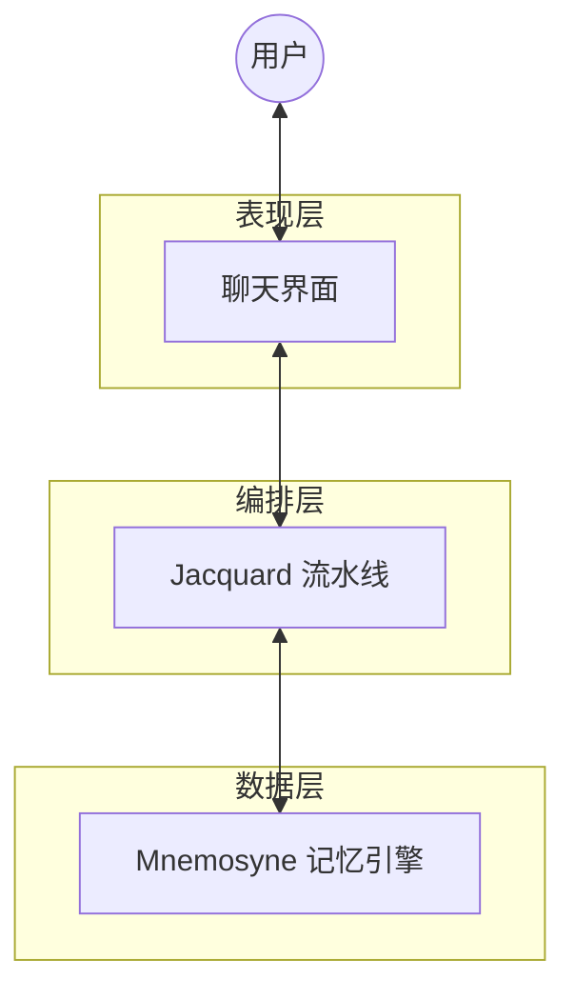

# Clotho 系统架构全景索引 (System Architecture Panorama)

**版本**: 1.0.0
**日期**: 2025-12-23
**状态**: Draft
**作者**: 资深系统架构师 (Architect Mode)

---

## 目录

1.  [第一章：宏观愿景与设计哲学](#第一章宏观愿景与设计哲学-vision--philosophy)
2.  [第二章：系统核心架构与编排层 (Jacquard)](#第二章系统核心架构与编排层-jacquard-layer)
3.  [第三章：数据中枢与记忆引擎 (Mnemosyne)](#第三章数据中枢与记忆引擎-mnemosyne-layer)
4.  [第四章：表现层与交互体系 (Presentation)](#第四章表现层与交互体系-presentation-layer)
5.  [第五章：跨平台基础设施 (Infrastructure)](#第五章跨平台基础设施-infrastructure-layer)
6.  [第六章：遗留生态迁移与扩展 (Migration)](#第六章遗留生态迁移与扩展-migration--ecosystem)
7.  [第七章：提示词处理工作流 (Prompt Workflow)](#第七章提示词处理工作流-prompt-processing-workflow)
8.  [第八章：角色卡导入与迁移系统 (Import & Migration)](#第八章角色卡导入与迁移系统-character-card-import--migration)
9.  [第九章：Filament 统一交互协议 (Unified Protocol)](#第九章filament-统一交互协议-unified-protocol)

---

## 第一章：宏观愿景与设计哲学 (Vision & Philosophy)

### 1.1 模块摘要
本模块确立了 Clotho 项目的立项根本与指导思想。针对现有 AI RPG 客户端（如 SillyTavern）在逻辑处理、上下文管理及性能上的痛点，提出了“混合代理 (Hybrid Agency)”的解决方案，旨在构建一个**高性能、确定性与沉浸感并存**的次世代客户端。

### 1.2 核心要素

#### 1.2.1 核心价值主张
*   **性能重塑**：摒弃 Web 技术栈，采用 **Flutter/Dart** 原生技术栈，解决长文本渲染卡顿与内存泄漏问题。
*   **时空一致性**：引入 **“多重宇宙树 (Turn-based Tree)”** 模型，确保在回溯 (Undo)、重绘 (Reroll) 与分支 (Branching) 操作中，世界状态与剧情发展严丝合缝。
*   **逻辑解耦**：彻底切断 UI 层与逻辑层的直接耦合，实现“逻辑升级不破坏界面，界面重构不影响逻辑”。

#### 1.2.2 设计哲学：凯撒原则 (The Caesar Principle)
遵循 **"Render unto Caesar the things that are Caesar's, and unto God the things that are God's"**：
*   **凯撒的归凯撒 (Code's Domain)**：逻辑判断、数值计算、状态管理、流程控制。这些必须由确定性的代码 (Jacquard/Mnemosyne) 严密掌控，**绝不外包给 LLM**。
*   **上帝的归上帝 (LLM's Domain)**：语义理解、情感演绎、剧情生成、文本润色。这是 LLM 的神性所在。

#### 1.2.3 宏观架构分层
系统划分为三个物理隔离但逻辑紧密的层次：
1.  **表现层 (Presentation)**: 负责用户交互与界面渲染 (Flutter UI, Webview)。
2.  **编排层 (Jacquard)**: 系统的“大脑”，负责流程控制与 Prompt 组装。
3.  **数据层 (Data & Infra)**: 负责数据的存储、检索与快照生成 (Mnemosyne)。

### 1.3 文档溯源
*   **顶层蓝图**: [`doc/architecture/01_vision_and_philosophy.md`](doc/architecture/01_vision_and_philosophy.md)
*   **历史归档**: [`doc/architecture/legacy_archive/project_core_blueprint.md`](doc/architecture/legacy_archive/project_core_blueprint.md)

---

## 第二章：系统核心架构与编排层 (Jacquard Layer)

### 2.1 模块摘要
Jacquard 是系统的“大脑”与“总线”，采用插件化流水线模式。它不直接存储数据，而是作为调度器，协调各个 Shuttle (逻辑单元) 完成 Prompt 组装、LLM 调用及结果解析。本层核心任务是实现**确定性的流程编排**。

### 2.2 核心要素

#### 2.2.1 流水线架构 (Pipeline Architecture)
Jacquard 不包含硬编码业务逻辑，而是按顺序执行注册的插件：
*   **Planner**: 分析意图，决定工具调用。
*   **Skein Builder**: 向 Mnemosyne 请求快照，构建结构化 Prompt 容器。
*   **Assembler**: 将 Skein 渲染为最终字符串。
*   **Invoker**: 调用 LLM API。
*   **Parser**: 解析 LLM 输出。
*   **Updater**: 提交状态变更。

#### 2.2.2 Skein (绞纱) - 结构化容器
Skein 是流水线中的核心数据对象，作为 **异构容器**，它取代了传统的字符串拼接，模块化地管理 System Prompt, Lore, User Input 等内容，支持动态裁剪与重组。

#### 2.2.3 Filament 协议 v2 (Filament Protocol)
为确保 LLM 输出的可解析性，定义了简化版 XML 协议。
*   **核心标签**: `<thought>` (思维链), `<reply>` (回复), `<state_update>` (状态变更)。
*   **v2 升级 (JSON Array)**: 为了提高 Token 效率与解析鲁棒性，`<state_update>` 内部采用 **JSON 列表包裹三元组** 的形式，替代重复的 XML 标签。
    *   格式: `[OpCode, Path, Value]`
    *   示例: `["SET", "character.mood", "happy"]`, `["ADD", "gold", 50]`

#### 2.2.4 脚本插件沙箱
支持用户使用 JavaScript/Lua 编写自定义逻辑，运行在受限沙箱 (QuickJS/LuaJIT) 中，确保系统安全。

### 2.3 文档溯源
*   **编排架构**: [`doc/architecture/02_jacquard_orchestration.md`](doc/architecture/02_jacquard_orchestration.md)
*   **历史归档**: [`doc/architecture/legacy_archive/system_architecture.md`](doc/architecture/legacy_archive/system_architecture.md)

---

## 第三章：数据中枢与记忆引擎 (Mnemosyne Layer)

### 3.1 模块摘要
Mnemosyne 是系统的“海马体”，负责管理多维度的上下文链。它超越了静态存储，进化为**动态快照生成引擎**，能够根据时间指针 (Time Pointer) 瞬间投影出任意时刻的世界状态 (Punchcards)。同时，它融合了 MVU (MagVarUpdate) 的数据设计，增强了状态的描述能力。

### 3.2 核心要素

#### 3.2.1 多维上下文链 (Multi-dimensional Context Chains)
*   **History Chain**: 线性投影的对话记录。
*   **State Chain**: 采用 **关键帧 (Keyframe) + 增量 (Delta)** 存储策略，支持无损回溯。
*   **RAG Chain**: 基于向量检索的动态知识注入。

#### 3.2.2 Value with Description (VWD) 数据模型
引入 MVU 的核心特性，支持“带描述的值”，使状态不仅对程序可读，对 LLM 也具备语义自解释性。
*   **结构**: `[Value, Description]`
*   **示例**: `"health": [80, "当前生命值，0为死亡"]`
*   **渲染**: System Prompt 中包含描述，UI 展示时仅提取值。

#### 3.2.3 状态管理与 Schema
*   **$meta 约束**: 引入 `$meta` 字段定义状态树的扩展性 (Extensible) 与必填项 (Required)。
*   **Snapshotting**: `getPunchcards(pointer)` 接口负责聚合上述所有数据，生成不可变快照供 Jacquard 使用。

### 3.3 文档溯源
*   **数据引擎**: [`doc/architecture/03_mnemosyne_data_engine.md`](doc/architecture/03_mnemosyne_data_engine.md)
*   **历史归档**: [`doc/architecture/legacy_archive/mvu_integration_design.md`](doc/architecture/legacy_archive/mvu_integration_design.md)

---

## 第四章：表现层与交互体系 (Presentation Layer)

### 4.1 模块摘要
表现层负责将底层数据流转化为可视化的像素。遵循 **"Hybrid SDUI (混合服务端驱动 UI)"** 架构，既保证了 Flutter 原生渲染的高性能，又通过 Webview 兼容了海量的第三方动态内容。布局上采用 **"Stage & Control"** 哲学，适配多端形态。

### 4.2 核心要素

#### 4.2.1 布局哲学：Stage & Control
*   **Stage (舞台)**: 核心对话区，沉浸式体验，减少干扰。
*   **Control (控制台)**: 参数配置与辅助信息，按需呼出。
*   **响应式三栏设计**:
    *   Desktop (>1200dp): 导航-舞台-监视器 (3栏全开)。
    *   Tablet: 双栏或抽屉。
    *   Mobile: 单栏流式。

#### 4.2.2 Hybrid SDUI 引擎
解决原生高性能与动态扩展性的矛盾：
*   **原生轨道 (Native Track)**: 使用 **RFW (Remote Flutter Widgets)** 渲染官方/高性能组件。
*   **Web 轨道 (Web Track)**: 使用 **WebView** 渲染复杂的 HTML/JS 第三方内容 (如复杂的动态状态栏)。
*   **路由调度**: 根据内容 ID 自动决策渲染轨道。

#### 4.2.3 交互隔离与 InputDraft
UI 层**严禁**直接修改业务数据。所有的交互 (如点击状态栏按钮) 只能生成 **Input Draft (输入草稿)** 或标准指令，经由 `InputDraftController` 发送给编排层。

### 4.3 文档溯源
*   **表现层设计**: [`doc/architecture/04_presentation_layer.md`](doc/architecture/04_presentation_layer.md)
*   **历史归档**: [`doc/architecture/legacy_archive/ui_layout_design.md`](doc/architecture/legacy_archive/ui_layout_design.md), [`doc/architecture/legacy_archive/ui_subsystem_design.md`](doc/architecture/legacy_archive/ui_subsystem_design.md)

---

## 第五章：跨平台基础设施 (Infrastructure Layer)

### 5.1 模块摘要
为了在 Android 和 Windows 端提供一致且高效的体验，本层设计了严格的**跨平台抽象层**。通过**依赖倒置 (DIP)** 原则，将 UI 代码与具体平台实现解耦。

### 5.2 核心要素

#### 5.2.1 依赖倒置与 Repository 模式
*   **Domain Layer**: 定义纯 Dart 抽象接口 (如 `INativeFileSystem`)。
*   **Data Layer**: 根据平台动态注入实现 (如 `AndroidFileSystem`, `WindowsFileSystem`)。
*   UI 层只依赖接口，不感知平台差异。

#### 5.2.2 差异化通信策略
*   **Android**: 使用 **MethodChannel** (Kotlin Coroutines) 处理权限、文件。
*   **Windows**: 采用混合策略。
    *   低频 OS 交互 -> MethodChannel (C++)。
    *   **高频/大数据 (LLM 推理)** -> **Dart FFI** (C++ DLL)，利用共享内存优化性能。

#### 5.2.3 容错与生命周期
*   **异常转化**: Native 异常 -> 错误码 -> Dart Failure 对象，严禁 Crash 导致 UI 崩溃。
*   **生命周期统一**: 将 Android `ActivityLifecycle` 和 Windows `WindowProc` 统一抽象为 `AppLifecycleState` 流。

### 5.3 文档溯源
*   **基础设施设计**: [`doc/architecture/05_infrastructure_layer.md`](doc/architecture/05_infrastructure_layer.md)
*   **历史归档**: [`doc/architecture/legacy_archive/cross_platform_abstraction_layer.md`](doc/architecture/legacy_archive/cross_platform_abstraction_layer.md)

---

## 第六章：遗留生态迁移与扩展 (Migration & Ecosystem)

### 6.1 模块摘要
本模块关注如何将 SillyTavern 庞大的生态资产 (特别是 `ST-Prompt-Template` EJS 脚本) 迁移到 Clotho 架构中。由于架构理念的根本差异 (代码执行 vs 结构化数据)，采取 **"交互式迁移向导"** 策略，而非全自动转译。

### 6.2 核心要素

#### 6.2.1 遗留系统分析
ST 扩展严重依赖 JS `eval` 和全局变量污染，数据流向混乱。
*   变量管理：分层存储 (Global/Local)。
*   逻辑注入：正则表达式、EJS 模板渲染。

#### 6.2.2 迁移策略：扫描-建议-交互 (Scan-Suggest-Interact)
*   **扫描**: 识别 EJS 代码中的模式 (变量定义、状态展示、条件逻辑)。
*   **建议**: 将其映射为 Clotho 组件。
    *   `getvar/setvar` -> Mnemosyne State Schema。
    *   HTML 状态栏 -> UI Extension / RFW。
    *   逻辑判断 -> Jacquard Triggers / Events。
*   **交互**: 提供 UI 向导，由用户确认转换方案。

#### 6.2.3 集成路线
*   **Phase 1**: 核心逻辑移植 (Dart 版变量管理)。
*   **Phase 2**: 注入服务实现 (PromptInjectionService)。
*   **Phase 3**: 编排层集成 (Wiring into Orchestrator)。

### 6.3 文档溯源
*   **迁移战略**: [`doc/architecture/06_migration_strategy.md`](doc/architecture/06_migration_strategy.md)
*   **历史归档**: [`doc/architecture/legacy_archive/st_prompt_template_migration_design.md`](doc/architecture/legacy_archive/st_prompt_template_migration_design.md)

---

## 第七章：提示词处理工作流 (Prompt Processing Workflow)

### 7.1 模块摘要
本模块详细描述了 Clotho 的提示词处理流程，这是一个高度结构化、确定性的流水线。流程遵循 **"晚期绑定 (Late Binding)"** 和 **"无副作用 (Zero Side-Effect)"** 原则，确保 LLM 接收到的始终是基于最新状态的纯净文本。

### 7.2 核心要素

#### 7.2.1 五阶段处理流程
1.  **Planner (意图规划)**: 分析用户意图，决定使用的 Prompt Template，路由到相应的 Pipeline 分支。
2.  **Skein Builder (原始构建)**: 初始化 Skein 容器，向 Mnemosyne 请求快照，填充原始数据（含 Jinja2 模板）。
3.  **Template Renderer (模板渲染)**: 使用 Jinja2 引擎，将动态逻辑转化为静态文本。
4.  **Assembler (最终拼接)**: 将分散的 Block 链编织并转换为 LLM 请求体，执行 Weaving、Format 和 Truncate 操作。
5.  **LLM Invoker (LLM 调用)**: 调用底层 API，发送请求并接收流式响应。

#### 7.2.2 核心设计原则
*   **Late Binding**: 变量替换发生在发送给 LLM 的最后一刻，确保 Prompt 反映最新状态。
*   **Zero Side-Effect**: 渲染层是纯函数，绝对不因为渲染而改变状态。
*   **Structured Container**: 使用 Skein 而非长字符串传递数据，允许独立修改、替换或调试特定部分。

### 7.3 文档溯源
*   **工作流设计**: [`doc/architecture/07_prompt_processing_workflow.md`](doc/architecture/07_prompt_processing_workflow.md)
*   **关联文档**: `02_jacquard_orchestration.md`, `03_mnemosyne_data_engine.md`, `macro_system_spec.md`

---

## 第八章：角色卡导入与迁移系统 (Character Card Import & Migration)

### 8.1 模块摘要
本模块设计了完整的角色卡导入与迁移系统，采用 **"深度分析 -> 双重分诊 -> 专用通道"** 的半自动处理范式。系统摒弃"一键全自动"的幻想，通过核心分析引擎对复杂组件（世界书、正则脚本）进行特征识别，然后生成预分类标签，交由用户在分诊界面确认。

### 8.2 核心要素

#### 8.2.1 核心分析引擎
*   **HTML Analyzer**: 检测 `<iframe>`, `<script>`, `onclick`, `style` 等。
*   **EJS Analyzer**: 检测 `<%`, `getvar`, `getwi`, `{{random}}`。
*   **Instruction Analyzer**: 检测 `<format>`, `always output`, `instruction` 等关键词。
*   **State Analyzer**: 检测隐藏的数据结构（如 `<!--<|state|>-->`）。

#### 8.2.2 双重分诊策略
*   **世界书分诊**: 将条目分为基础设定 📘、指令型 ⚡、代码型 🧩 三类。
*   **正则脚本分诊**: 将脚本分为文本替换型 📝、数据清洗型 🧹、UI 注入型 🎨 三类。

#### 8.2.3 交互式迁移流程
1.  **概览与分诊**: 展示分诊面板，系统给出预分类建议，用户可批量确认或修改。
2.  **复杂内容处理**: 对代码型条目展示 LLM 生成的 Jinja2 代码建议，对 UI 型脚本询问用户渲染策略。
3.  **最终确认**: 展示最终的数据结构预览，包括 Mnemosyne 变量表、Lorebook 结构和特殊的 UI 挂载点。

#### 8.2.4 Prompt 格式规范化
为了最大化 LLM 的注意力效率并减少解析错误，系统对 Lorebook 条目内容进行格式规范化，统一采用 **"XML 包裹 YAML"** 格式。

### 8.3 文档溯源
*   **导入与迁移**: [`doc/architecture/08_character_import_and_migration.md`](doc/architecture/08_character_import_and_migration.md)
*   **源文档**: `plans/character-card-import-migration-design.md`, `doc/EvaluationDoc/又看遗迹.json`, `doc/EvaluationDoc/观星者（自设）.json`

---

## 第九章：Filament 统一交互协议 (Unified Protocol)

### 9.1 模块摘要
**Filament 协议**是 Clotho 系统的通用交互语言，旨在消除"自然语言"与"机器指令"之间的模糊地带。它贯穿于系统的所有交互环节，从提示词构建、逻辑控制到界面渲染，实现了统一的语义表达和确定性通信。协议遵循 **"XML + YAML IN, XML + JSON OUT"** 的非对称设计哲学。

### 9.2 核心要素

#### 9.2.1 核心设计哲学：非对称交互
*   **输入端 (Context Ingestion): XML + YAML**
    *   **结构 (XML)**: 使用 XML 标签构建 Prompt 的骨架，确保 LLM 理解内容的层级与边界。
    *   **数据 (YAML)**: 在标签内部使用 YAML 描述属性与状态。YAML 相比 JSON 更符合人类阅读习惯，且 Token 消耗更低。
    
*   **输出端 (Instruction Generation): XML + JSON**
    *   **意图 (XML)**: 使用 XML 标签明确标识 LLM 的意图类型（如思考、说话、操作）。
    *   **参数 (JSON)**: 在标签内部使用 JSON 描述具体的参数。JSON 的严格语法更易于机器解析。

#### 9.2.2 协议在系统中的应用范畴
Filament 不仅是 LLM 的输出协议，更是系统的通用语言，统一管理：
1.  **提示词格式 (Prompt Engineering)**: 所有的 Character Card、World Info 均通过 Filament 结构化注入。
2.  **标签类型 (Tag System)**: 定义一套标准化的 XML 标签集，用于控制流程。
3.  **嵌入式前端 (Embedded UI)**: 允许 LLM 通过协议直接请求渲染原生的嵌入式网页组件。
4.  **状态管理 (State Management)**: 统一的状态更新指令格式。
5.  **宏系统支持 (Macro System)**: 通过 Jinja2 模板引擎实现动态提示词构建，支持变量插值、条件渲染和逻辑控制，提供安全的沙箱环境。

#### 9.2.3 输出协议：标签体系
LLM 的所有输出必须包裹在特定的 Filament 标签中：

*   **认知与表达标签**:
    *   `<thought>`: 思维链（CoT），用于推理、规划与自我反思。此内容默认对用户隐藏，或折叠显示。
    *   `<content>`: 最终回复，直接展示给用户的对话内容。
    
*   **逻辑与状态标签**:
    *   `<state_update>`: 状态变更指令。内部包裹 **JSON 数组**，执行精确的数据修改。
        *   格式: `[OpCode, Path, Value]`
        *   示例: `["SET", "character.mood", "anxious"]`, `["ADD", "inventory.gold", -50]`
    *   `<tool_call>`: 工具调用，请求执行特定的工具或函数。
    
*   **表现与交互标签**:
    *   `<ui_component>`: 嵌入式前端，允许 LLM 请求渲染特定的原生 UI 组件。
    *   `<media>`: 媒体资源，请求插入图片、音频、视频等。

#### 9.2.4 协议解析流程
Filament 协议的解析是实时流式进行的，确保低延迟的用户体验：

1.  **流式切分**: Parser 实时监控 `<` 符号，识别标签边界。
2.  **路由分发**:
    *   `<thought>` -> ThoughtHandler: 存储到思维日志
    *   `<content>` -> ContentHandler: 直接推送到 UI 文本组件
    *   `<state_update>` -> StateParser + Mnemosyne: 解析 JSON，执行状态变更
    *   `<ui_component>` -> UIJSONParser + UIEventBus: 解析 JSON，触发 UI 渲染
    *   `<media>` -> MediaLoader: 加载媒体资源，插入到消息流中

#### 9.2.5 协议版本演进
*   **v1.0 (初始版本)**: 使用重复的 XML 标签表示状态更新，Token 效率低，解析复杂。
*   **v2.0 (当前版本)**: 使用 JSON 数组包裹三元组，Token 效率提升约 40%，解析逻辑简化，支持批量操作。
*   **v3.0 (未来规划)**: 考虑引入二进制协议、流式增量更新、类型约束等高级特性。

### 9.3 文档溯源
*   **Filament 协议**: [`doc/architecture/09_filament_protocol.md`](doc/architecture/09_filament_protocol.md)
*   **宏系统规范**: [`doc/EvaluationDoc/macro_system_spec.md`](doc/EvaluationDoc/macro_system_spec.md)
*   **ST 宏参考**: [`doc/EvaluationDoc/micro.md`](doc/EvaluationDoc/micro.md)
*   **关联文档**: `02_jacquard_orchestration.md`, `03_mnemosyne_data_engine.md`, `04_presentation_layer.md`
