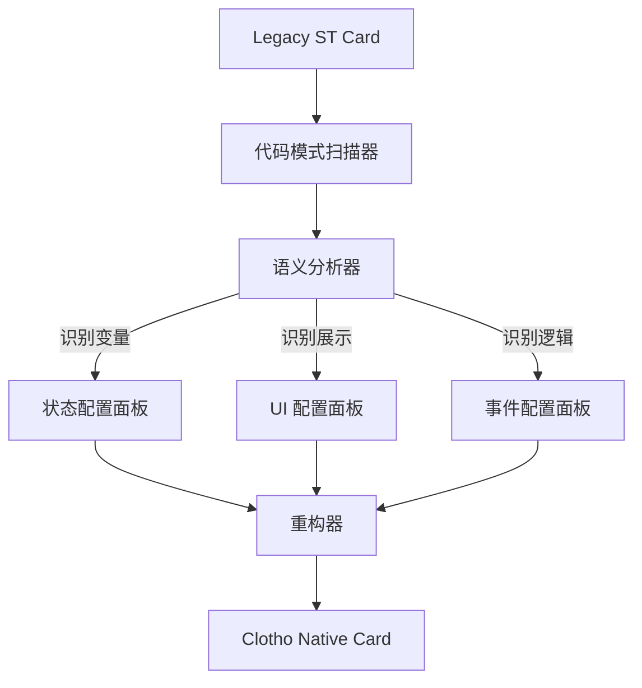
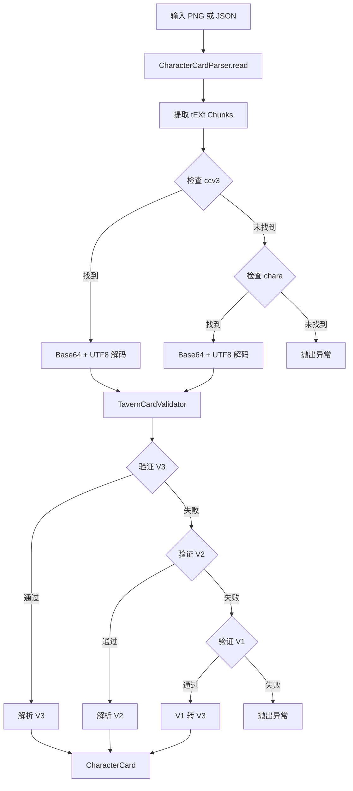

# 第六章：遗留生态迁移与扩展 (Migration & Ecosystem)

**版本**: 1.0.0
**日期**: 2025-12-23
**状态**: Draft
**作者**: 资深系统架构师 (Architect Mode)
**源文档**: `st_prompt_template_analysis.md`, `st_prompt_template_migration_design.md`, `st_prompt_template_integration_plan.md`

---

## 1. 迁移战略综述 (Strategy Overview)

本模块关注如何将 SillyTavern (ST) 庞大的生态资产，特别是 `ST-Prompt-Template` (EJS) 脚本，迁移到 Clotho 架构中。

### 1.1 根本矛盾
*   **ST (Legacy)**: 依赖 JS `eval` 任意代码执行，逻辑与数据混杂，不易维护。
*   **Clotho (Modern)**: 强调数据与逻辑分离，采用 **Jinja2 模板引擎** 进行确定性编排，禁止不受控的代码执行。

### 1.2 解决方案：交互式迁移向导 (Interactive Migration Wizard)
我们**不追求全自动黑盒转译**，而是提供一套工具链，引导用户将老旧的 EJS 逻辑解构、提取并映射到 Clotho 的现代架构组件（Mnemosyne 状态、Jinja2 宏、Jacquard 触发器）中。

---

## 2. 遗留系统深度分析 (Legacy Analysis)

`ST-Prompt-Template` 是 ST 生态中实现复杂逻辑的核心扩展，其核心机制如下：

### 2.1 核心模块
1.  **模板引擎 (EJS)**: 在消息、World Info 中嵌入 `<% ... %>` 脚本。
2.  **变量管理**: 分层级的变量存储 (Global, Local, Message)。
3.  **Prompt 注入**: 基于正则 (`regex`) 或位置 (`pos`) 的动态消息插入 (`@INJECT`)。

### 2.2 数据流向痛点
ST 的数据流向是隐式的，模板执行的副作用（如 `setvar`）可能发生在渲染的任何阶段，导致状态难以追踪和调试。

---

## 3. 迁移流程设计 (Migration Workflow)

迁移过程包含四个阶段：**扫描 (Scan) -> 建议 (Suggest) -> 交互 (Interact) -> 执行 (Action)**。



### 3.1 模式识别与映射规则
| EJS 模式 | 特征代码 | Clotho (Jinja2) 映射 | 迁移策略 |
| :--- | :--- | :--- | :--- |
| **状态定义** | `getvar('hp')` | `{{ state.hp }}` | 提取变量名，映射为 Mnemosyne 路径 |
| **临时变量** | `setvar('x', 'y')` | `` | 转换为 Jinja2 局部变量 |
| **状态展示** | `HP: <%- hp %>` | `HP: {{ state.hp }}` | 转换为 Jinja2 插值 |
| **条件逻辑** | `<% if (hp<10) %>` | `` | 转换为 Jinja2 控制流 |
| **复杂逻辑** | `while/for` | **Script Plugin** | 标记为 Legacy，建议封装入 Lua/JS 插件 |

---

## 4. 集成与实施计划 (Implementation Plan)

### Phase 1: 核心逻辑移植 (Foundation)
1.  **Variable Manager**: 在 Dart 端复刻分层变量存储逻辑。
2.  **Template Engine**: 集成 `jinja` 包，替换原有 XML 解析器。

### Phase 2: 注入服务实现 (Injection Service)
1.  **PromptInjectionService**: 实现基于正则和位置的 Prompt 插入逻辑。
2.  **Strategies**: 实现 Absolute, Relative, Regex 三种注入策略。

### Phase 3: 编排层集成 (Orchestration)
1.  **Wiring**: 将 `PromptInjectionService` 注入到 `Jacquard` 流水线中。
2.  **Pipeline**: 在 `Skein Builder` 阶段调用注入服务，修改上下文结构。


## 5. 角色卡解析与导入 (Character Card Parsing & Import)

### 5.1 模块摘要

本模块负责解析和导入角色卡数据，支持 SillyTavern 生态中的 V1/V2/V3 角色卡格式，以及 PNG/APNG 嵌入方式。系统采用**"尽力解析 (Best-Effort Parsing)"**原则，确保兼容性和数据完整性。

### 5.2 核心组件

#### 5.2.1 CharacterCardParser - PNG元数据解析器


**职责**:
- 从 PNG/APNG 图像的 tEXt chunks 中提取角色卡数据
- 支持 V2 (`chara`) 和 V3 (`ccv3`) 两种格式
- V3 优先级高于 V2
- 实现角色的写入功能

**PNG元数据存储机制**:
- 角色卡数据以 Base64 编码存储在 PNG 的 tEXt chunks 中
- V2: keyword 为 `chara`
- V3: keyword 为 `ccv3`
- 数据格式: `utf-8 -> base64` 编码的 JSON 字符串

#### 5.2.2 TavernCardValidator - 角色卡验证器

**职责**:
- 验证角色卡是否符合 V1/V2/V3 规范
- 返回版本号：1(V1), 2(V2), 3(V3), 0(无效)
- 提供详细的验证错误信息

**验证规则**:
- **V3**: 需要 `spec='chara_card_v3'` 且 `spec_version >= 3.0`
- **V2**: 需要 `spec='chara_card_v2'` 且 `spec_version='2.0'`
- **V1**: 仅检查必需字段是否存在 (name, description, personality, scenario, first_mes, mes_example)

#### 5.2.3 CharacterRepositoryImpl - 角色卡仓库


**职责**:
- 提供 `importFromPng()` 和 `importFromJson()` 方法
- 处理 V1 到 V3 的转换
- 统一的错误处理

#### 5.2.4 CharacterCardModel - 数据模型


**职责**:
- 使用 Freezed 生成不可变数据类
- 支持 V2 和 V3 的所有字段
- 包含 `extensions` 字段用于存储额外数据

**关键字段**:
- **V2 字段**: name, description, personality, scenario, first_mes, mes_example, creator_notes, system_prompt, post_history_instructions, alternate_greetings, tags, creator, character_version, extensions, character_book
- **V3 新增字段**: nickname, creator_notes_multilingual, source, group_only_greetings, creation_date, modification_date, assets

### 5.3 解析流程



### 5.4 尽力解析 (Best-Effort Parsing)

根据角色卡 V3 规范（第115-118行）：
- 应用程序应该**忽略**规范中不存在的字段，但**不应拒绝**导入
- 应用程序**可以保存**规范中不存在的字段，以便安全导出
- 对于应用程序特定的数据，应该保存在 `extensions` 字段中

**当前实现状态**:
- ✅ `extensions` 字段已在数据模型中定义
- ❌ Freezed + json_serializable 默认会**忽略** JSON 中未映射的字段
- ❌ 没有自定义的 `fromJson` 方法来捕获未知字段
- ❌ 未定义的字段会被静默忽略，无法保存

**改进建议**:
1. 实现自定义的 `fromJson` 方法，在解析前捕获所有未知字段
2. 将未知字段合并到 `extensions` 字段中
3. 确保导出时能够完整还原原始数据

### 5.5 版本兼容性处理

#### 5.5.1 V1 转 V3 转换

当检测到 V1 角色卡时，系统会自动转换为 V3 格式：
- 将 V1 的扁平结构字段映射到 V3 的 `CharacterCardModel`
- V3 特有字段（如 nickname, assets）保持为 null
- 设置 `spec='chara_card_v3'` 和 `specVersion='3.0'`

#### 5.5.2 V2/V3 直接解析

V2 和 V3 格式具有相同的包装结构：
```json
{
  "spec": "chara_card_v3",
  "spec_version": "3.0",
  "data": { ... }
}
```

由于 `CharacterCardModel` 是 V3 的超集，可以直接解析 V2 数据。