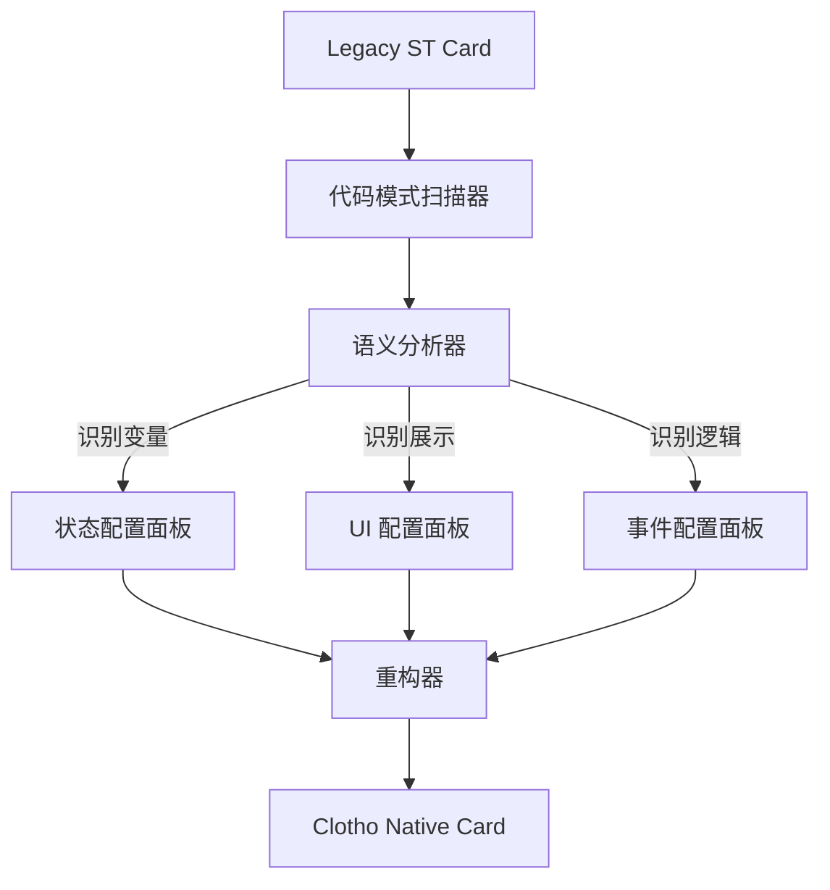

# 第六章：遗留生态迁移与扩展 (Migration & Ecosystem)

**版本**: 1.0.0
**日期**: 2025-12-23
**状态**: Draft
**作者**: 资深系统架构师 (Architect Mode)
**源文档**: `st_prompt_template_analysis.md`, `st_prompt_template_migration_design.md`, `st_prompt_template_integration_plan.md`

---

## 1. 迁移战略综述 (Strategy Overview)

本模块关注如何将 SillyTavern (ST) 庞大的生态资产，特别是 `ST-Prompt-Template` (EJS) 脚本，迁移到 Clotho 架构中。

### 1.1 根本矛盾
*   **ST (Legacy)**: 依赖 JS `eval` 任意代码执行，逻辑与数据混杂，不易维护。
*   **Clotho (Modern)**: 强调数据与逻辑分离，采用 **Jinja2 模板引擎** 进行确定性编排，禁止不受控的代码执行。

### 1.2 解决方案：交互式迁移向导 (Interactive Migration Wizard)
我们**不追求全自动黑盒转译**，而是提供一套工具链，引导用户将老旧的 EJS 逻辑解构、提取并映射到 Clotho 的现代架构组件（Mnemosyne 状态、Jinja2 宏、Jacquard 触发器）中。

---

## 2. 遗留系统深度分析 (Legacy Analysis)

`ST-Prompt-Template` 是 ST 生态中实现复杂逻辑的核心扩展，其核心机制如下：

### 2.1 核心模块
1.  **模板引擎 (EJS)**: 在消息、World Info 中嵌入 `<% ... %>` 脚本。
2.  **变量管理**: 分层级的变量存储 (Global, Local, Message)。
3.  **Prompt 注入**: 基于正则 (`regex`) 或位置 (`pos`) 的动态消息插入 (`@INJECT`)。

### 2.2 数据流向痛点
ST 的数据流向是隐式的，模板执行的副作用（如 `setvar`）可能发生在渲染的任何阶段，导致状态难以追踪和调试。

---

## 3. 迁移流程设计 (Migration Workflow)

迁移过程包含四个阶段：**扫描 (Scan) -> 建议 (Suggest) -> 交互 (Interact) -> 执行 (Action)**。

### 3.1 模式识别与映射规则
| EJS 模式 | 特征代码 | Clotho (Jinja2) 映射 | 迁移策略 |
| :--- | :--- | :--- | :--- |
| **状态定义** | `getvar('hp')` | `{{ state.hp }}` | 提取变量名，映射为 Mnemosyne 路径 |
| **临时变量** | `setvar('x', 'y')` | `` | 转换为 Jinja2 局部变量 |
| **状态展示** | `HP: <%- hp %>` | `HP: {{ state.hp }}` | 转换为 Jinja2 插值 |
| **条件逻辑** | `<% if (hp<10) %>` | `` | 转换为 Jinja2 控制流 |
| **复杂逻辑** | `while/for` | **Script Plugin** | 标记为 Legacy，建议封装入 Lua/JS 插件 |

---

## 4. 集成与实施计划 (Implementation Plan)

### Phase 1: 核心逻辑移植 (Foundation)
1.  **Variable Manager**: 在 Dart 端复刻分层变量存储逻辑。
2.  **Template Engine**: 集成 `jinja` 包，替换原有 XML 解析器。

### Phase 2: 注入服务实现 (Injection Service)
1.  **PromptInjectionService**: 实现基于正则和位置的 Prompt 插入逻辑。
2.  **Strategies**: 实现 Absolute, Relative, Regex 三种注入策略。

### Phase 3: 编排层集成 (Orchestration)
1.  **Wiring**: 将 `PromptInjectionService` 注入到 `Jacquard` 流水线中。
2.  **Pipeline**: 在 `Skein Builder` 阶段调用注入服务，修改上下文结构。
