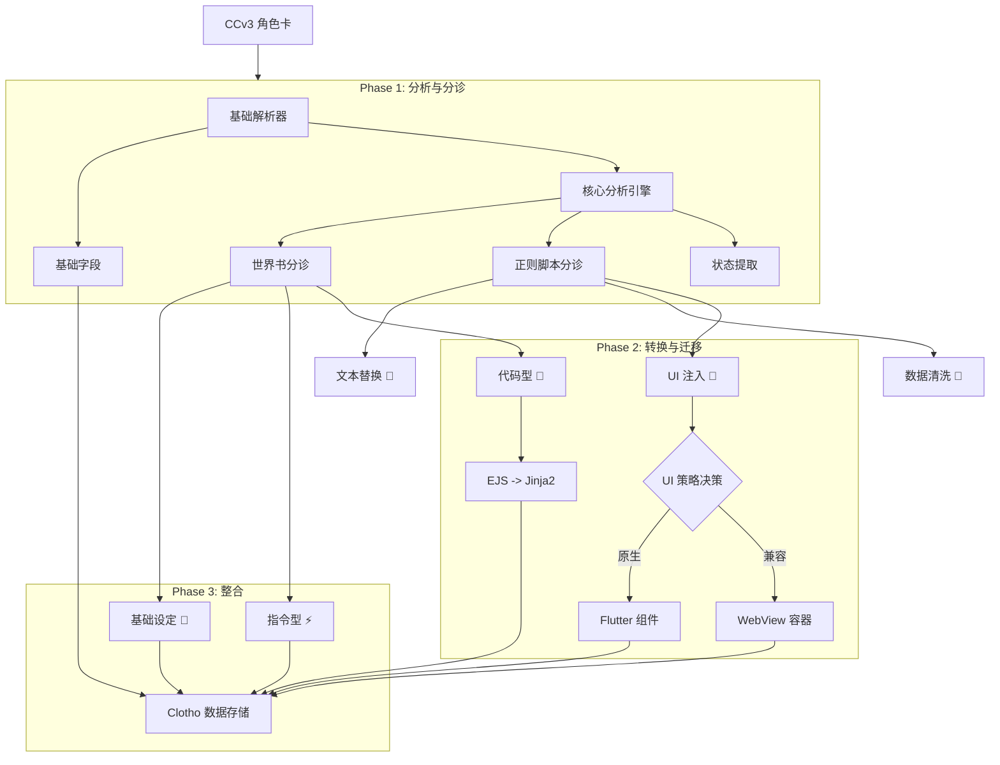
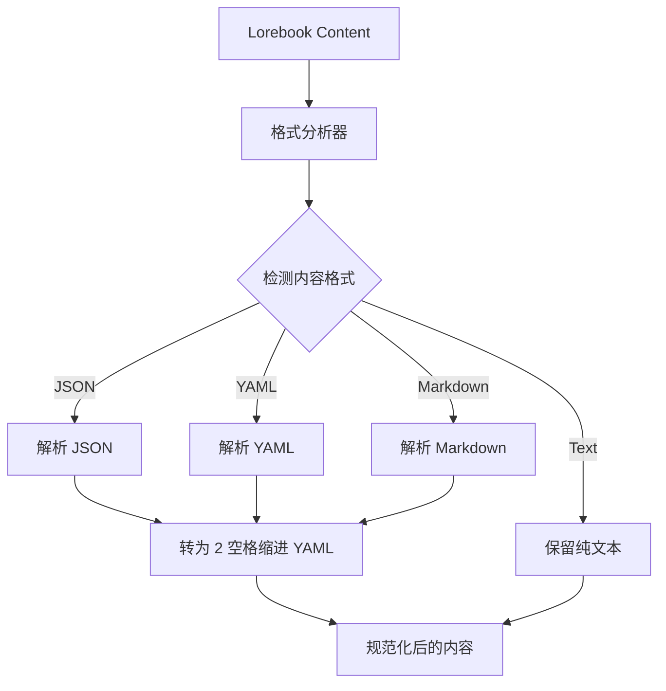

# 第八章：角色卡导入与迁移系统 (Character Card Import & Migration)

**版本**: 2.0.0
**日期**: 2025-12-27
**状态**: Final Draft
**作者**: 资深系统架构师 (Architect Mode)
**源文档**: `plans/character-card-import-migration-design.md`, `doc/EvaluationDoc/又看遗迹.json`, `doc/EvaluationDoc/观星者（自设）.json`

---

## 1. 核心设计理念

本系统旨在解决从 SillyTavern (ST) 生态向 Clotho 架构迁移时的复杂性问题。鉴于 ST 极其灵活（甚至混乱）的生态，我们摒弃"一键全自动"的幻想，转而采用 **"深度分析 -> 双重分诊 -> 专用通道"** 的半自动处理范式。

### 1.1 处理范式：分诊 (Triage)
系统不尝试直接转换所有内容，而是首先通过 **核心分析引擎** 对复杂组件（世界书、正则脚本）进行**特征识别**，然后生成预分类标签，交由用户在**分诊界面**确认，最后根据分类进入不同的处理流水线。

---

## 2. 系统架构全景



---

## 3. 核心分析引擎 (Core Analysis Engine)

### 3.1 职责
负责扫描文本内容，识别潜在的代码、HTML 结构、特殊指令模式，为分诊提供依据。

### 3.2 插件化分析器
*   **HTML Analyzer**: 检测 `<iframe>`, `<script>`, `onclick`, `style` 等。
    *   *Case A 命中*: `开局选项` 脚本包含 `<iframe>` 和复杂 `<script>` 逻辑。
*   **EJS Analyzer**: 检测 `<%`, `getvar`, `getwi`, `{{random}}`。
    *   *Case A 命中*: 世界书条目 `[Controller]高松灯_Persona` 包含 `<% if (getvar... %>`。
*   **Instruction Analyzer**: 检测 `<format>`, `always output`, `instruction` 等关键词。
    *   *Case A 命中*: 世界书 Entry 28 包含 `<options_format>` 标签。
*   **State Analyzer**: 检测 `<!--<|state|>-->` 或类似隐藏数据结构。
    *   *Case B 命中*: `first_mes` 中包含隐藏的状态 JSON。

---

## 4. 世界书分诊策略 (Lorebook Triage)

系统将世界书条目分为三类。用户在导入向导中确认分类。

| 分类 | 定义 | 典型特征 | 案例引用 (Case A) | 处理策略 |
|---|---|---|---|---|
| **基础设定** 📘 | 纯文本描述，无动态逻辑。 | 无代码标签。 | 条目 `TakamatsuTomori_Unwavering` | **直接导入** |
| **指令型** ⚡ | 控制 LLM 输出格式的系统指令。 | 含 `format`, `rule`, `options`。 | 条目 `28` (`<options_format>`) | **建议迁移** 至 System Prompt 或 Post History Instructions |
| **代码型** 🧩 | 含动态逻辑或变量操作。 | 含 EJS, 宏。 | 条目 `[Controller]高松灯_Persona` | **进入 Phase 2** (EJS转Jinja2) |

### 4.1 特殊逻辑处理
*   **`getwi` 映射**: `[Controller]高松灯_Persona` 使用了 `getwi` 动态加载其他条目。
    *   *策略*: 转换为 Jinja2 的 `` (如果 Clotho 支持) 或通过 Mnemosyne 的 **Linked Entries** 机制实现条件激活。

---

## 5. 正则脚本分诊策略 (Regex Script Triage)

正则脚本 (`regex_scripts`) 用途差异巨大，需分类处理。

| 分类 | 定义 | 典型特征 | 案例引用 (Case A) | 处理策略 |
|---|---|---|---|---|
| **文本替换型** 📝 | 传统的文本修正或注入。 | 普通文本替换，无 HTML。 | 脚本 `点击选项` (替换为特定文本) | **导入为 Regex Entry** |
| **数据清洗型** 🧹 | 移除思维链或元数据标签。 | 替换为空字符串 `""`。 | 脚本 `开局选项（移除）`, `歌曲隐藏` | **迁移至 Output Filter** |
| **UI 注入型** 🎨 | 在界面渲染自定义 UI。 | 含 `<div>`, `iframe`, `script`。 | 脚本 `开局选项` (音乐播放器) | **进入 Phase 2** (UI 决策) |

### 5.1 UI 注入处理决策
针对 **UI 注入型** 脚本，提供两种路径：
1.  **WebView 兜底 (推荐)**: 针对 Case A 中的 `开局选项` (音乐播放器)，由于其包含复杂的 DOM 操作 (`document.getElementById`, `addEventListener`)，无法自动转换为原生组件。必须将其封装在沙箱化的 WebView 中运行。
2.  **原生重构**: 针对简单的 HTML/CSS (如状态栏)，LLM 可尝试将其转换为 Flutter 的 `Row/Column` 布局代码。

---

## 6. 内嵌状态提取 (State Extraction)

针对 Case B (`观星者`) 中隐藏在 `first_mes` 的状态数据：

1.  **识别**: 正则匹配 `<!--<|state|>(.*?)</\|state\|>-->`。
2.  **提取**: 解析 JSON 内容。
3.  **迁移**: 将变量合并入 `Mnemosyne` 的初始状态表 (`initial_state`)。
4.  **清理**: 在导入后的首条消息中移除该注释块，防止污染上下文。

---

## 7. 交互流程设计 (UI Workflow)

### Step 1: 概览与分诊
展示“世界书分诊”和“正则脚本分诊”两个面板。系统根据分析引擎给出预分类建议（例如：将 Case A 的 Entry 28 标记为⚡指令型，将音乐播放器脚本标记为🎨UI型）。用户可批量确认或修改。

### Step 2: 复杂内容处理
*   **代码转换**: 对标记为🧩代码型的条目，展示 LLM 生成的 Jinja2 代码建议（例如将 `getvar` 转为 `state.get`）。
*   **UI 决策**: 对标记为🎨UI型的脚本，询问用户是“保留为 WebView”还是“尝试转原生”。

### Step 3: 最终确认
展示最终的数据结构预览，包括 Mnemosyne 变量表、Lorebook 结构和特殊的 UI 挂载点。

---

## 8. 数据结构定义

### 8.1 核心分析结果
```dart
class AnalysisResult {
  final List<LorebookTriageItem> lorebookItems;
  final List<RegexScriptTriageItem> scriptItems;
  final Map<String, dynamic> extractedState;
  // ...
}

enum TriageCategory {
  static, instructional, dynamic, // Lorebook
  replacement, cleanup, uiInjection // Regex
}
```

### 8.2 UI 注入定义
```dart
class UIInjectionConfig {
  final String id;
  final String triggerRegex;
  final UIInjectionMode mode; // webview, native
  final String? rawHtml; // for webview
  final String? nativeLayoutId; // for native
}
```

---

## 11. 协议 Schema 提取与标识 (Protocol Schema Recognition & Extraction)

### 11.1 设计背景
在 ST 生态中，复杂的输出规则（如 `<SFW>` JSON 格式、好感度更新逻辑）常被硬编码在 First Message 或 Description 中。这种方式占用 Token 且难以维护。Clotho 引入 **"Schema Library"** 机制，在导入时自动识别这些规则模式，将其提取为系统预设的 Schema 引用，从而实现 Prompt 的"瘦身"与逻辑的"标准化"。

### 11.2 提取逻辑

分析引擎会扫描文本中的规则定义块，尝试匹配已知的 Schema 模式：

| 模式名称 | 匹配特征 | 提取动作 | 替换结果 |
|---|---|---|---|
| **SFW Output** | 含 `<SFW>`, `JSON`, `Avatar_Map` 等关键词。 | 1. 提取 Map 数据 (Avatar/Portrait) 存入 Metadata。<br>2. 识别为 `protocol: sfw_json_output`。 | `<use_protocol>sfw_json_output</use_protocol>` |
| **Variable Update** | 含 `<UpdateVariable>`, `<Analysis>`, `_.add()`。 | 1. 提取变量定义 (如 `好感度`) 存入 Initial State。<br>2. 识别为 `protocol: variable_update_v2`。 | `<use_protocol>variable_update_v2</use_protocol>` |
| **Custom Colors** | 含 `<自定义颜色>`, `<span style="...">`。 | 1. 提取颜色规则。<br>2. 识别为 `protocol: semantic_color`。 | `<use_protocol>semantic_color</use_protocol>` |

### 11.3 交互式确认流程

在迁移向导的 **"Phase 2: 复杂内容处理"** 中，新增 **Schema 确认** 步骤：

1.  **展示发现**: "检测到该角色卡包含复杂的'SFW 输出格式'定义 (约 500 Tokens)。"
2.  **提供选项**:
    *   ✅ **提取并引用 (推荐)**: 移除原文中的定义，替换为 `<use_protocol>` 标签。Jacquard 将在运行时自动注入标准化的、经过优化的规则。
    *   ❌ **保留原样**: 保持原始文本不变（适用于非标准或极其特殊的规则）。
3.  **参数配置**: 对于提取的 Schema，允许用户微调提取出的参数（如修正提取出的 Avatar Map）。

### 11.4 运行时注入机制

当 Jacquard 在 Character Card 中遇到 `<use_protocol>ID</use_protocol>` 标签时：
1.  **查询**: 从 Clotho 内置的 Schema Library 中查找对应 ID 的 Schema 定义。
2.  **注入**: 将 Schema 定义中的 System Instruction 注入到 Prompt 的 System 区域。
3.  **参数化**: 如果 Schema 支持参数（如 SFW 的 Avatar Map），将卡片中存储的 Metadata 填充到模板中。

---

## 12. 附录 A: 案例结构解析 (Case Study: 观星者)

以下展示系统如何处理 `doc/EvaluationDoc/观星者（自设）.json` 中的复杂结构。

### A.1 正则脚本分诊 (Regex Scripts)

| 脚本名称 | 原始正则 / 替换内容 | 系统分析特征 | 分诊结果 | 处理策略 |
|---|---|---|---|---|
| **Remove <state> json** | `/<!--<\|state\|>.../` -> `""` | `match_xml_tag`, `replace_empty` | **数据清洗型** 🧹 | 忽略脚本逻辑，但利用其模式在 Phase 1 提取 State 数据。 |
| **Hide** | `/.*/s` -> `""` | `match_all`, `replace_empty` | **数据清洗型** 🧹 | 标记为 Output Filter，需人工确认是否保留隐藏逻辑。 |
| **UI** | `$` -> `<ui_sys>...html...` | `inject_html`, `ui_sys_tag` | **UI 注入型** 🎨 | 强制进入 UI 决策流程，建议使用 WebView 渲染。 |

### A.2 扩展插件分诊 (TavernHelper)

*   **检测对象**: `extensions.tavern_helper` & `TavernHelper_scripts`
*   **内容**: 包含 `sam_state_manager.js` 引用和复杂 JS 逻辑。
*   **分诊**: 标记为 **"外部 JS 插件"**。
*   **策略**: Clotho 不支持直接运行外部 JS。
    *   *Option A*: 引导用户使用 Mnemosyne 的 Rules System 重构状态机逻辑。
    *   *Option B*: 保留源代码作为参考，但禁用运行。

### A.3 内嵌状态提取

*   **位置**: `first_mes`
*   **内容**: `<!--<|state|>复杂的json</|state|>-->`
*   **动作**:
    1.  解析器提取 JSON。
    2.  将其展平并合并到 `Mnemosyne` 的 `initial_state`。
    3.  在转换后的 `first_mes` 中自动移除该 XML 标签（模拟原脚本行为）。

### A.4 案例解析：Flash (小少女乐队时代)

针对 `doc/EvaluationDoc/flash.json`，展示系统对“伪复杂”结构和指令型数据的处理。

| 条目/特征 | 内容摘要 | 系统分析特征 | 分诊/处理策略 |
|---|---|---|---|
| **Entry 0 (青森峰)** | `keys=["青森峰"]`, `use_regex=true` | `regex_is_literal` (正则无特殊字符) | **优化建议** 💡: 检测到正则是纯文本，建议降级为普通关键词匹配以提升性能。 |
| **Entry 5 (状态栏)** | `<block>...Output Format...</block>` | `pattern_output_format`, `xml_structure` | **指令型 Lore** 📜: 识别为格式说明，建议迁移到 System Prompt 或作为高优先级 Lore 保留。 |
| **Entry 7 (时间线)** | `**在{{User}}没有...**` | `macro_legacy_case` (`{{User}}`) | **宏转换** 🔄: 自动识别大小写不敏感的宏，映射为 Clotho 的 `{{ user.name }}`。 |
| **Entry 10 (素世)** | `<Soyo>...YAML Data...</Soyo>` | `xml_semantic` (语义标签), `yaml_structure` | **静态 Lore** 📄: 识别为结构化数据。保留 XML 标签（有助于 LLM 理解），不视为 UI 注入。 |
| **depth_prompt** | `{"depth": 4, "prompt": "..."}` | `extension_depth_prompt` | **结构迁移** 🏗️: 提取并转换为 Clotho 的 System Instruction 模块，保留深度配置。 |

---

## 10. Prompt 格式规范化 (Prompt Normalization)

### 10.1 设计目标

为了最大化 LLM 的注意力效率并减少解析错误，Clotho 对所有输入给 LLM 的结构化数据采用 **"XML 包裹 YAML"** 的统一格式。

*   **输入端**: XML + YAML
*   **输出端**: XML + JSON (Filament 协议 V3)

### 10.2 世界书条目格式转换

在导入过程中，系统会对 Lorebook 条目中的 `content` 进行格式规范化。

#### 10.2.1 转换规则 (最终版)

| 原始格式 | 检测特征 | 转换目标 | 备注 |
|---|---|---|---|
| **JSON** | `{...}`, `[...]` | **保留 XML + 转为 YAML** | 保留 `<Soyo>` 等标签，将内部 JSON 转为 2 空格缩进的 YAML。 |
| **YAML** | `key: value` | **保留 XML + 统一缩进** | 保留标签，将内部 YAML 统一为 2 空格缩进。 |
| **Markdown** | `-`, `*`, `#` 等 | **保留 XML + 转为 YAML** (尽力而为) | 将 Markdown 列表、标题等结构尝试转换为 YAML 结构。 |

**转换示例**:

| 原始格式 | 转换后 |
|---|---|
| `<Soyo>{"name": "Soyo", "age": 16}</Soyo>` | `<Soyo>\n  name: Soyo\n  age: 16\n</Soyo>` |
| `<Aomori>\n  - Point A\n  - Point B\n</Aomori>` (Markdown) | `<Aomori>\n  - Point A\n  - Point B\n</Aomori>` (YAML 数组) |

#### 10.2.2 转换流程


