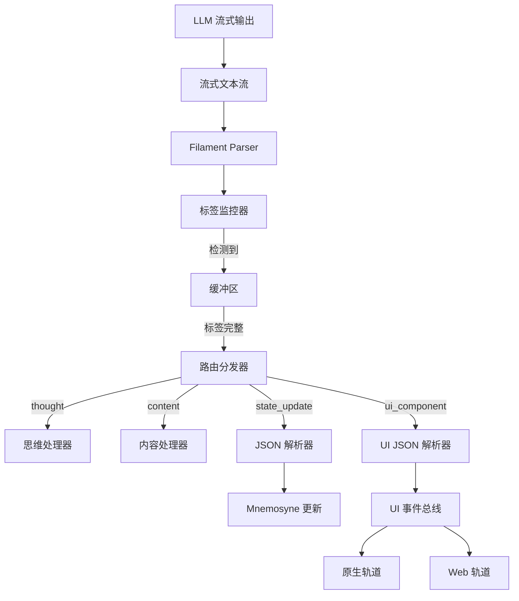

# 第九章：Filament 统一交互协议 (Filament Unified Protocol)

**版本**: 2.0.0
**日期**: 2025-12-28
**状态**: Draft
**作者**: 资深系统架构师 (Architect Mode)
**关联文档**: `02_jacquard_orchestration.md`, `03_mnemosyne_data_engine.md`, `04_presentation_layer.md`

---

## 1. 协议概览 (Protocol Overview)

**Filament 协议**是 Clotho 系统的通用交互语言，旨在消除"自然语言"与"机器指令"之间的模糊地带。它贯穿于系统的所有交互环节，从提示词构建、逻辑控制到界面渲染，实现了统一的语义表达和确定性通信。

### 1.1 核心设计哲学：非对称交互 (Asymmetric Interaction)

Filament 遵循 **"XML + YAML IN, XML + JSON OUT"** 的非对称设计哲学：

*   **输入端 (Context Ingestion): XML + YAML**
    *   **结构 (XML)**: 使用 XML 标签构建 Prompt 的骨架 (Skein Blocks)，确保 LLM 理解内容的层级与边界。
    *   **数据 (YAML)**: 在标签内部使用 YAML 描述属性与状态。YAML 相比 JSON 更符合人类阅读习惯，且 Token 消耗更低，适合作为大量的上下文输入。
    
*   **输出端 (Instruction Generation): XML + JSON**
    *   **意图 (XML)**: 使用 XML 标签明确标识 LLM 的意图类型 (如思考、说话、操作)，明确拒绝使用自闭合标签来减少 LLM 输出失败。
    *   **参数 (JSON)**: 在标签内部使用 JSON 描述具体的参数。JSON 的严格语法更易于机器解析，确保工具调用与状态变更的确定性。

### 1.2 协议在系统中的应用范畴

Filament 不仅是 LLM 的输出协议，更是系统的通用语言，统一管理：

1.  **提示词格式 (Prompt Engineering)**: 所有的 Character Card、World Info 均通过 Filament 结构化注入。
2.  **标签类型 (Tag System)**: 定义一套标准化的 XML 标签集，用于控制流程。
3.  **嵌入式前端 (Embedded UI)**: 允许 LLM 通过协议直接请求渲染原生的嵌入式网页组件（Mini-Apps），实现交互维度的升维。
4.  **状态管理 (State Management)**: 统一的状态更新指令格式。

---

## 2. 输入协议：提示词构建 (Prompt Engineering)

### 2.1 Filament 结构化提示词

Jacquard 使用 Filament 格式组装最终的 Prompt，确保 LLM 清晰感知不同信息的语义边界。

#### 2.1.1 基础数据块格式

```xml
<system_instruction>
role: Dungeon Master
tone: Dark Fantasy
rules:
  - strict_physics
  - permadeath
</system_instruction>

<character_card>
name: Seraphina
class: Mage
attributes:
  int: 18
  str: 4
</character_card>

<world_state>
location: Ancient Ruins
time: Midnight
weather: Stormy
</world_state>
```

#### 2.1.2 世界书条目格式

世界书条目在导入时会经过**格式规范化**处理，统一转换为 **"XML 包裹 YAML"** 格式：

```xml
<location_forest>
  name: Dark Forest
  atmosphere: Eerie, misty
  creatures:
    - Shadow Wolves
    - Forest Spirits
  loot:
    - Ancient Bark
    - Moon Petals
</location_forest>
```

**格式转换规则**：
- **JSON 转换**: 保留 XML 标签，内部 JSON 转为 2 空格缩进的 YAML
- **YAML 保留**: 保留 XML 标签，统一内部缩进为 2 空格
- **Markdown 转换**: 尽力将列表、标题等结构转换为 YAML 格式

### 2.2 标签语义体系 (Tag Semantics)

#### 2.2.1 顶层结构标签

| 标签 | 用途 | 示例 |
|---|---|---|
| `<system_instruction>` | 系统级指令和规则 | 角色扮演规则、输出格式要求 |
| `<character_card>` | 角色定义 | 姓名、性格、外貌、背景 |
| `<world_state>` | 当前世界状态 | 位置、时间、环境 |
| `<lorebook_entry>` | 世界书条目 | 设定、规则、背景知识 |
| `<conversation_history>` | 对话历史 | 历史消息列表 |

#### 2.2.2 元数据标签

| 标签 | 用途 | 示例 |
|---|---|---|
| `<block>` | 标记文本块边界 | `<block role="system">...</block>` |
| `<format>` | 格式化指令 | `<format type="yaml">...</format>` |
| `<priority>` | 优先级标记 | `<priority level="high">...</priority>` |

---

## 3. 输出协议：指令与响应 (Output Protocol)

LLM 的所有输出必须包裹在特定的 Filament 标签中，确保机器可解析。

### 3.1 认知与表达标签 (Cognition & Expression)

#### 3.1.1 `<thought>` - 思维链

用于推理、规划与自我反思。

```xml
<thought>
用户询问了关于森林的危险性。我需要：
1. 回忆森林中的主要威胁
2. 根据当前时间（午夜）调整危险程度
3. 考虑用户的装备水平
4. 提供建议而非直接命令
</thought>
```

**特性**:
- 此内容默认对用户隐藏，或折叠显示
- 可通过用户设置切换为完全隐藏或完全显示
- 不计入最终输出 Token

#### 3.1.2 `<content>` - 最终回复

直接展示给用户的对话内容。

```xml
<content>
在这片黑暗森林中，你要特别小心。午夜时分，暗影狼群会变得更加活跃。如果你看到微弱的蓝色光芒，那可能是森林精灵，它们通常不会主动攻击，但也最好不要打扰。
</content>
```

**特性**:
- 直接展示在聊天界面
- 支持 Markdown 格式（如果配置允许）
- 可以包含 Filament 嵌套标签（如 `<state_update>`）

### 3.2 逻辑与状态标签 (Logic & State)

#### 3.2.1 `<state_update>` - 状态变更

内部包裹 **JSON 数组**，执行精确的数据修改。这是 v2 协议的升级版本，相比 v1 的重复 XML 标签，显著提升了 Token 效率和解析鲁棒性。

```xml
<state_update>
[
  ["SET", "character.mood", "anxious"],
  ["ADD", "inventory.gold", -50],
  ["MUL", "character.hp", 0.8],
  ["PUSH", "conversation.topics", "forest_danger"]
]
</state_update>
```

**操作码 (OpCode) 定义**:

| OpCode | 含义 | 参数示例 | 说明 |
|---|---|---|---|
| `SET` | 设置值 | `["SET", "path", value]` | 覆盖指定路径的值 |
| `ADD` | 加法 | `["ADD", "path", number]` | 数值相加 |
| `SUB` | 减法 | `["SUB", "path", number]` | 数值相减 |
| `MUL` | 乘法 | `["MUL", "path", number]` | 数值相乘 |
| `DIV` | 除法 | `["DIV", "path", number]` | 数值相除 |
| `PUSH` | 追加到数组 | `["PUSH", "array_path", value]` | 向数组末尾添加元素 |
| `POP` | 弹出数组 | `["POP", "array_path"]` | 移除数组末尾元素 |
| `DELETE` | 删除字段 | `["DELETE", "path"]` | 删除指定路径的字段 |

**路径语法**:
- 使用点号 `.` 分隔层级：`character.mood`, `inventory.gold`
- 支持数组索引：`conversation.history[0]`
- 支持通配符（待实现）：`inventory.*` (批量操作)

#### 3.2.2 `<tool_call>` - 工具调用

请求执行特定的工具或函数。

```xml
<tool_call name="weather_forecast">
{
  "location": "Ancient Ruins",
  "days": 3,
  "units": "celsius"
}
</tool_call>
```

**特性**:
- 参数使用 JSON 格式
- 支持异步执行
- 可返回执行结果给 LLM 生成后续回复

### 3.3 表现与交互标签 (Presentation & Interaction)

#### 3.3.1 `<ui_component>` - 嵌入式前端

允许 LLM 请求渲染特定的原生 UI 组件或嵌入式状态栏（Mini-Apps）。

```xml
<!-- 示例1：动态生成的物品清单 -->
<ui_component view="widget.inventory_grid">
{
  "filter": "magical_items",
  "columns": 3,
  "max_items": 12
}
</ui_component>

<!-- 示例2：交互式选项菜单 -->
<ui_component view="dialog.choice_menu">
{
  "title": "选择你的行动",
  "choices": [
    {"id": "investigate", "label": "调查废墟", "icon": "search"},
    {"id": "rest", "label": "休息恢复", "icon": "camp"},
    {"id": "leave", "label": "离开此地", "icon": "arrow"}
  ]
}
</ui_component>

<!-- 示例3：动态状态栏 -->
<ui_component view="status.character_stats">
{
  "layout": "horizontal",
  "show_hp": true,
  "show_mp": true,
  "highlight_low": true
}
</ui_component>
```

**属性定义**:

| 属性 | 类型 | 必填 | 说明 |
|---|---|---|---|
| `view` | string | ✅ | 视图类型标识符（如 `widget.inventory_grid`） |
| `id` | string | ❌ | 组件唯一标识（用于更新或销毁） |

**渲染策略**:
系统根据 `view` 类型自动决策渲染轨道（参见第四章：表现层）：

1.  **Extension Check**: 查询 UI 扩展包注册表
2.  **Native Track (优先)**: 若存在匹配的 `.rfw` (Remote Flutter Widgets) 包，加载并注入数据，执行原生渲染
3.  **Web Track (兜底)**: 若无匹配包，降级使用 WebView 渲染 HTML/JS，确保兼容性

#### 3.3.2 `<media>` - 媒体资源

请求插入图片、音频、视频等媒体资源。

```xml
<media type="image" src="assets/forest_night.jpg" alt="黑暗森林的夜景" />
<media type="audio" src="ambient/forest_night.mp3" loop="true" />
```

**属性定义**:

| 属性 | 类型 | 必填 | 说明 |
|---|---|---|---|
| `type` | string | ✅ | 媒体类型：`image`, `audio`, `video` |
| `src` | string | ✅ | 资源路径或 URL |
| `alt` | string | ❌ | 替代文本（用于图片） |
| `loop` | boolean | ❌ | 是否循环播放（音频/视频） |

---

## 4. 协议解析流程 (Parsing Workflow)

Filament 协议的解析是实时流式进行的，确保低延迟的用户体验。

### 4.1 流式解析架构



### 4.2 解析阶段详解

#### 4.2.1 实时切分 (Streaming Segmentation)

*   **监控**: Parser 实时监控 `<` 符号，识别标签边界
*   **状态机**: 维护解析状态机，处理嵌套标签和转义字符
*   **缓冲**: 未完成的标签内容暂存于缓冲区，等待完整标签后再处理

#### 4.2.2 路由分发 (Routing Dispatch)

根据标签类型将内容分发到不同的处理器：

| 标签类型 | 目标处理器 | 处理动作 |
|---|---|---|
| `<thought>` | ThoughtHandler | 存储到思维日志，UI 可选择性显示 |
| `<content>` | ContentHandler | 直接推送到 UI 文本组件，支持 Markdown 渲染 |
| `<state_update>` | StateParser + Mnemosyne | 解析 JSON，执行状态变更，更新 UI |
| `<tool_call>` | ToolExecutor | 执行工具，将结果反馈给 LLM |
| `<ui_component>` | UIJSONParser + UIEventBus | 解析 JSON，触发 UI 渲染（原生/WebView） |
| `<media>` | MediaLoader | 加载媒体资源，插入到消息流中 |

#### 4.2.3 错误处理 (Error Handling)

*   **标签不匹配**: 检测到未闭合的标签，等待超时后视为解析失败
*   **JSON 解析错误**: `<state_update>` 或 `<ui_component>` 中的 JSON 格式错误，记录日志并跳过该标签
*   **未知标签**: 忽略未知标签，记录警告日志（兼容性考虑）
*   **恢复机制**: 解析失败不影响后续内容的解析，保证流的连续性

---

## 5. 协议版本演进 (Protocol Evolution)

### 5.1 v1.0 - 初始版本

*   特点：使用重复的 XML 标签表示状态更新
*   示例：
    ```xml
    <state_update>
      <set path="character.mood" value="anxious" />
      <add path="inventory.gold" value="-50" />
    </state_update>
    ```
*   缺陷：Token 效率低，解析复杂

### 5.2 v2.0 - 当前版本

*   特点：使用 JSON 数组包裹三元组
*   示例：
    ```xml
    <state_update>
    [
      ["SET", "character.mood", "anxious"],
      ["ADD", "inventory.gold", -50]
    ]
    </state_update>
    ```
*   优势：
    *   Token 效率提升约 40%
    *   解析逻辑简化，鲁棒性提升
    *   支持批量操作

### 5.3 未来规划 (v3.0)

*   **二进制协议**: 考虑引入二进制编码，进一步压缩 Token
*   **流式增量更新**: 支持 WebSocket 等长连接下的增量状态推送
*   **类型约束**: 在 JSON Schema 中添加类型约束，运行时验证
*   **扩展机制**: 允许用户自定义标签和处理器

---

## 6. 最佳实践与约束 (Best Practices & Constraints)

### 6.1 LLM 输出约束

1.  **严禁自闭合标签**: 
    ❌ 错误：`<state_update />`
    ✅ 正确：`<state_update>...</state_update>`
    
2.  **标签必须嵌套正确**:
    ❌ 错误：`<state_update><state_update>...</state_update></state_update>`
    ✅ 正确：`<state_update>[...]</state_update>`

3.  **JSON 必须有效**:
    ❌ 错误：`["SET", "path", value]` (字符串未加引号)
    ✅ 正确：`["SET", "path", "value"]`

4.  **路径语法规范**:
    ❌ 错误：`character[mood]` (错误的数组语法)
    ✅ 正确：`character.mood` (对象属性访问)

### 6.2 提示词构建最佳实践

1.  **使用 YAML 而非 JSON**: 在输入端优先使用 YAML，减少 Token 消耗
2.  **合理使用 XML 标签**: 不要过度嵌套，保持 2-3 层深度
3.  **添加语义化标签**: 使用有意义的标签名，如 `<location_forest>` 而非 `<item_1>`
4.  **分离关注点**: 指令、数据、状态应分在不同标签中

### 6.3 UI 组件设计规范

1.  **view 命名规范**: 使用点号分隔命名空间，如 `widget.inventory_grid`, `dialog.choice_menu`
2.  **必需参数**: 组件应该能够处理必需参数缺失的情况，提供默认值
3.  **响应式设计**: 组件应适配不同屏幕尺寸（参考第四章：表现层）
4.  **沙箱隔离**: WebView 中的组件应运行在受限环境中，防止恶意操作

---

## 7. 扩展性与定制化 (Extensibility & Customization)

### 7.1 自定义标签注册

系统允许用户注册自定义的 Filament 标签和对应的处理器：

```dart
// 伪代码示例
FilamentRegistry.registerTag(
  name: "custom_action",
  handler: (TagContext ctx) async {
    // 自定义处理逻辑
    final data = jsonDecode(ctx.content);
    await executeCustomAction(data);
  }
);
```

### 7.2 UI 组件扩展包

开发者可以创建自定义的 UI 组件包：

```yaml
# components/my_widgets.rfw
component: inventory_grid
props:
  filter: string
  columns: int
  max_items: int
```

### 7.3 插件生态

Filament 协议的扩展性为第三方插件开发提供了标准接口：

- **Prompt 扩展插件**: 添加新的输入标签类型
- **输出处理器插件**: 添加新的输出标签处理逻辑
- **UI 组件插件**: 提供新的 `view` 类型实现

---

## 8. 协议安全与验证 (Security & Validation)

### 8.1 输入验证

*   **标签白名单**: 只允许已注册的标签类型
*   **大小限制**: 单个标签的内容大小限制（防止 DoS）
*   **深度限制**: 标签嵌套深度限制（防止栈溢出）

### 8.2 输出净化

*   **JSON Schema 验证**: 所有 JSON 输出必须符合预定义的 Schema
*   **路径访问控制**: 禁止访问系统关键路径
*   **类型检查**: 数值操作的类型检查（防止类型混淆攻击）

### 8.3 沙箱隔离

*   **UI 沙箱**: WebView 组件运行在受限环境中
*   **工具调用沙箱**: 工具执行受权限系统控制
*   **状态更新隔离**: 状态更新操作受 Mnemosyne 的 Schema 约束

---

## 9. 性能优化 (Performance Optimization)

### 9.1 Token 效率

*   **YAML 优于 JSON**: 在输入端优先使用 YAML，可节省约 20-30% Token
*   **标签缩写**: 对常用标签提供缩写形式（如 `<t>` 代替 `<thought>`）
*   **去重压缩**: 对重复的路径引用使用变量

### 9.2 解析性能

*   **流式解析**: 避免等待完整输出后再解析
*   **惰性求值**: 对非关键标签（如 `<thought>`）延迟处理
*   **缓存**: 对重复的结构化内容进行缓存

### 9.3 渲染性能

*   **原生优先**: 优先使用原生轨道（Flutter）渲染
*   **虚拟滚动**: 长列表使用虚拟滚动技术
*   **懒加载**: 媒体资源懒加载，按需加载

---

## 10. 测试与调试 (Testing & Debugging)

### 10.1 协议测试工具

提供专门的测试工具用于验证 Filament 协议的正确性：

```bash
# 命令行工具示例
filament-validator --input prompt.yaml
filament-parser --output response.xml --format json
```

### 10.2 调试模式

在调试模式下，系统会输出详细的解析日志：

- 标签检测时间戳
- 路由分发决策
- JSON 解析错误详情
- UI 组件渲染路径

### 10.3 可视化工具

提供 Filament 协议的可视化编辑器：

- 实时预览渲染效果
- 语法高亮和自动补全
- 协议验证和错误提示
