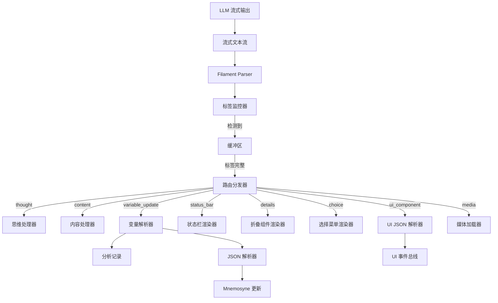

# 第九章：Filament 统一交互协议 (Filament Unified Protocol)

**版本**: 2.1.0
**日期**: 2025-12-28
**状态**: Draft
**作者**: 资深系统架构师 (Architect Mode)
**关联文档**: `02_jacquard_orchestration.md`, `03_mnemosyne_data_engine.md`, `04_presentation_layer.md`

---

## 1. 协议概览 (Protocol Overview)

**Filament 协议**是 Clotho 系统的通用交互语言，旨在消除"自然语言"与"机器指令"之间的模糊地带。它贯穿于系统的所有交互环节，从提示词构建、逻辑控制到界面渲染，实现了统一的语义表达和确定性通信。

### 1.1 核心设计哲学 (Core Design Philosophy)

Filament 遵循以下两大设计哲学：

1.  **非对称交互 (Asymmetric Interaction)**:
    *   **输入端 (Context Ingestion): XML + YAML**
        *   **结构 (XML)**: 使用 XML 标签构建 Prompt 的骨架 (Skein Blocks)，确保 LLM 理解内容的层级与边界。
        *   **数据 (YAML)**: 在标签内部使用 YAML 描述属性与状态。YAML 相比 JSON 更符合人类阅读习惯，且 Token 消耗更低，适合作为大量的上下文输入。
    *   **输出端 (Instruction Generation): XML + JSON**
        *   **意图 (XML)**: 使用 XML 标签明确标识 LLM 的意图类型 (如思考、说话、操作)。
        *   **参数 (JSON)**: 在标签内部使用 JSON 描述具体的参数。JSON 的严格语法更易于机器解析，确保工具调用与状态变更的确定性。

2.  **混合扩展策略 (Mixed Extension Strategy) - v2.1 新增**:
    *   **核心严格性 (Core Strictness)**: 对于影响系统逻辑的关键指令（如变量更新、工具调用），采用严格的 Schema 验证和标准格式。
    *   **边缘灵活性 (Edge Flexibility)**: 对于展示层和辅助信息（如自定义状态栏、摘要），允许更灵活的自定义标签结构，以适应多变的业务需求。

### 1.2 协议在系统中的应用范畴

Filament 不仅是 LLM 的输出协议，更是系统的通用语言，统一管理：

1.  **提示词格式 (Prompt Engineering)**: 所有的 Character Card、World Info 均通过 Filament 结构化注入。
2.  **标签类型 (Tag System)**: 定义一套标准化的 XML 标签集，用于控制流程。
3.  **嵌入式前端 (Embedded UI)**: 允许 LLM 通过协议直接请求渲染原生的嵌入式网页组件（Mini-Apps），实现交互维度的升维。
4.  **状态管理 (State Management)**: 统一的状态更新指令格式。

---

## 2. 输入协议：提示词构建 (Prompt Engineering)

### 2.1 Filament 结构化提示词

Jacquard 使用 Filament 格式组装最终的 Prompt，确保 LLM 清晰感知不同信息的语义边界。

#### 2.1.1 基础数据块格式

```xml
<system_instruction>
role: Dungeon Master
tone: Dark Fantasy
rules:
  - strict_physics
  - permadeath
</system_instruction>

<character_card>
name: Seraphina
class: Mage
attributes:
  int: 18
  str: 4
</character_card>

<world_state>
location: Ancient Ruins
time: Midnight
weather: Stormy
</world_state>
```

#### 2.1.2 世界书条目格式

世界书条目在导入时会经过**格式规范化**处理，统一转换为 **"XML 包裹 YAML"** 格式：

```xml
<location_forest>
  name: Dark Forest
  atmosphere: Eerie, misty
  creatures:
    - Shadow Wolves
    - Forest Spirits
  loot:
    - Ancient Bark
    - Moon Petals
</location_forest>
```

**格式转换规则**：
- **JSON 转换**: 保留 XML 标签，内部 JSON 转为 2 空格缩进的 YAML
- **YAML 保留**: 保留 XML 标签，统一内部缩进为 2 空格
- **Markdown 转换**: 尽力将列表、标题等结构转换为 YAML 格式

### 2.2 标签语义体系 (Tag Semantics)

#### 2.2.1 顶层结构标签

| 标签 | 用途 | 示例 |
|---|---|---|
| `<system_instruction>` | 系统级指令和规则 | 角色扮演规则、输出格式要求 |
| `<character_card>` | 角色定义 | 姓名、性格、外貌、背景 |
| `<world_state>` | 当前世界状态 | 位置、时间、环境 |
| `<lorebook_entry>` | 世界书条目 | 设定、规则、背景知识 |
| `<conversation_history>` | 对话历史 | 历史消息列表 |
| `<use_protocol>` | **引用协议 Schema** (v2.1) | `<use_protocol>variable_update_v2</use_protocol>` |

#### 2.2.2 元数据标签

| 标签 | 用途 | 示例 |
|---|---|---|
| `<block>` | 标记文本块边界 | `<block role="system">...</block>` |
| `<format>` | 格式化指令 | `<format type="yaml">...</format>` |
| `<priority>` | 优先级标记 | `<priority level="high">...</priority>` |

---

## 3. 输出协议：指令与响应 (Output Protocol)

LLM 的所有输出必须包裹在特定的 Filament 标签中，确保机器可解析。v2.1 版本引入了更多语义化标签以支持复杂交互。

### 3.1 认知与表达标签 (Cognition & Expression)

#### 3.1.1 `<thought>` - 思维链

用于推理、规划与自我反思。

```xml
<thought>
用户询问了关于森林的危险性。我需要：
1. 回忆森林中的主要威胁
2. 根据当前时间（午夜）调整危险程度
3. 考虑用户的装备水平
4. 提供建议而非直接命令
</thought>
```

**特性**:
- 此内容默认对用户隐藏，或折叠显示
- 可通过用户设置切换为完全隐藏或完全显示
- 不计入最终输出 Token

#### 3.1.2 `<content>` - 最终回复

直接展示给用户的对话内容。

```xml
<content>
　　「在这片黑暗森林中，你要特别小心。」
<!-- consider: (角色对白模拟插入) -->
<!--
1. 「a」
2. 「aa」
-->
</content>
```

**特性 (v2.1 更新)**:
- 直接展示在聊天界面
- 支持 Markdown 格式
- **支持 HTML 注释**: 允许嵌入 `<!-- ... -->` 格式的注释，用于内部模拟、标记或辅助逻辑，Parser 会将其路由到特定处理器（如隐藏或记录），而不直接展示给用户。
- **支持受限的行内 HTML**: 为满足富文本表现需求（如自定义颜色、字体样式），允许使用特定的行内 HTML 标签。系统会执行严格的白名单过滤。

#### 3.1.3 受限 HTML 白名单 (HTML Sanitization Whitelist)

为了安全起见，Clotho 仅允许以下 HTML 标签和属性：

| 标签 | 允许属性 | 用途 |
|---|---|---|
| `<span>` | `style` (仅限 color, background-color, font-weight 等安全样式) | 文本高亮、改色 |
| `<br>` | 无 | 换行 |
| `<b>`, `<strong>`, `<i>`, `<em>`, `<u>`, `<s>` | 无 | 基础排版 |
| `<ruby>` | 无 | 注音 |

**安全机制**:
- 前端渲染器（Flutter `HtmlWidget` 或 WebView）必须集成 Sanitize 模块（如 `DOMPurify`）。
- 任何不在白名单中的标签（如 `<script>`, `<iframe>`, `onclick`）将被剥离或转义。

### 3.2 逻辑与状态标签 (Logic & State)

#### 3.2.1 `<variable_update>` - 变量更新 (v2.1 推荐)

`<variable_update>` 是 `<state_update>` 的升级版，增加了 `<analysis>` 子标签用于记录变更原因，增强了可解释性。它兼容 v2.0 的 JSON OpCode 格式。

```xml
<variable_update>
  <analysis>
    - 角色对白模拟插入
    - 嫉妒乐奈受到的"特别待遇"，对源的执念更深
  </analysis>
  [
    ["SET", "纯田真奈.好感度", 2],
    ["ADD", "mood.value", 1]
  ]
</variable_update>
```

**结构**:
1.  `<analysis>` (可选): 文本形式的分析，解释为何进行这些状态变更。
2.  `JSON Array` (必填): 执行状态变更的操作码列表。

**操作码 (OpCode) 定义**:

| OpCode | 含义 | 参数示例 | 说明 |
|---|---|---|---|
| `SET` | 设置值 | `["SET", "path", value]` | 覆盖指定路径的值 |
| `ADD` | 加法 | `["ADD", "path", number]` | 数值相加 |
| `SUB` | 减法 | `["SUB", "path", number]` | 数值相减 |
| `MUL` | 乘法 | `["MUL", "path", number]` | 数值相乘 |
| `DIV` | 除法 | `["DIV", "path", number]` | 数值相除 |
| `PUSH` | 追加到数组 | `["PUSH", "array_path", value]` | 向数组末尾添加元素 |
| `POP` | 弹出数组 | `["POP", "array_path"]` | 移除数组末尾元素 |
| `DELETE` | 删除字段 | `["DELETE", "path"]` | 删除指定路径的字段 |

#### 3.2.2 `<tool_call>` - 工具调用

请求执行特定的工具或函数。

```xml
<tool_call name="weather_forecast">
{
  "location": "Ancient Ruins",
  "days": 3,
  "units": "celsius"
}
</tool_call>
```

### 3.3 表现与交互标签 (Presentation & Interaction)

#### 3.3.1 `<status_bar>` - 自定义状态栏 (v2.1 新增)

用于显示轻量级的、非标准化的状态信息。这体现了"边缘灵活性"哲学。

```xml
<status_bar>
  <SFW>safe</SFW>
  <mood>anxious</mood>
  <location>Dark Forest</location>
</status_bar>
```

**特性**:
- **自由结构**: 内部标签名不限，由 UI 层动态解析并渲染。
- **用途**: 适用于 Character Script 自定义的显示需求，无需预先定义 Schema。

#### 3.3.2 `<details>` - 折叠摘要 (v2.1 新增)

兼容 HTML `<details>` 标签，用于输出折叠的辅助信息或摘要。

```xml
<details>
  <summary>摘要</summary>
  用户询问了森林的危险性，我提供了关于暗影狼群和森林精灵的信息。
</details>
```

#### 3.3.3 `<choice>` - 选择菜单 (v2.1 新增)

用于向用户提供明确的行动选项，替代不规范的 `<xx>` 标签。

```xml
<choice>
  <prompt>请选择源的下一步行动：</prompt>
  <options>
    <option id="investigate">调查废墟</option>
    <option id="rest">休息恢复</option>
    <option id="leave">离开此地</option>
  </options>
</choice>
```

#### 3.3.4 `<ui_component>` - 嵌入式前端

允许 LLM 请求渲染复杂的、原生的嵌入式 UI 组件。

```xml
<ui_component view="widget.inventory_grid">
{
  "filter": "magical_items",
  "columns": 3,
  "max_items": 12
}
</ui_component>
```

#### 3.3.5 `<media>` - 媒体资源

请求插入图片、音频、视频等媒体资源。

```xml
<media type="image" src="assets/forest_night.jpg" alt="黑暗森林的夜景" />
```

---

## 4. 协议解析流程 (Parsing Workflow)

Filament 协议的解析是实时流式进行的，v2.1 增加了对扩展标签的路由支持。

### 4.1 流式解析架构



### 4.2 路由分发表 (v2.1)

| 标签类型 | 目标处理器 | 处理动作 | 备注 |
|---|---|---|---|
| `<thought>` | ThoughtHandler | 存储思维日志 | 默认折叠 |
| `<content>` | ContentHandler | 推送正文 | 支持 HTML 注释过滤 |
| `<variable_update>` | VariableParser | 记录分析 + 更新状态 | 替代 `<state_update>` |
| `<status_bar>` | StatusBarRenderer | 动态渲染状态标签 | 灵活结构 |
| `<details>` | DetailsRenderer | 渲染折叠块 | 标准 HTML 行为 |
| `<choice>` | ChoiceRenderer | 渲染交互按钮 | 替代 `<xx>` |
| `<ui_component>` | UIJSONParser | 渲染复杂原生组件 | |
| `<tool_call>` | ToolExecutor | 执行外部工具 | |

---

## 5. 协议版本演进 (Protocol Evolution)

### 5.1 v1.0 - 初始版本
*   使用重复的 XML 标签表示状态更新。
*   Token 效率低。

### 5.2 v2.0 - 结构化版本
*   引入 `<state_update>` 和 JSON 数组三元组。
*   Token 效率提升，解析简化。

### 5.3 v2.1 - 混合扩展版本 (当前)
*   **标签重命名与增强**: `<UpdateVariable>` (遗留) -> `<variable_update>`，增加了分析字段。
*   **交互标准化**: `<xx>` (遗留) -> `<choice>`。
*   **UI 灵活性**: 引入 `<status_bar>` 和 `<details>`，允许更灵活的非结构化展示。
*   **混合策略**: 核心逻辑保持严格 JSON Schema，展示层允许 XML 自由结构。

---

## 6. 最佳实践与约束 (Best Practices & Constraints)

### 6.1 LLM 输出约束

1.  **标签闭合**: 所有标签必须严格闭合，禁止自闭合标签（`<media>` 除外，如果 Parser 支持）。
2.  **JSON 格式**: `<variable_update>` 和 `<ui_component>` 内部的 JSON 必须严格符合标准（双引号、无尾随逗号）。
3.  **注释规范**: 在 `<content>` 中使用 `<!-- -->` 进行内部标记，不要将用户不可见的内容裸露在正文中。

### 6.2 迁移指南

对于从 SillyTavern 或旧系统迁移的内容：

*   **变量更新**: 将 `<UpdateVariable>` 映射为 `<variable_update>`。
*   **选择菜单**: 将 `<xx>` 或纯文本选项映射为 `<choice>`。
*   **状态栏**: 将 HTML 状态栏映射为 `<status_bar>` 或 `<ui_component>`。

### 6.3 UI 组件设计规范

1.  **view 命名**: 使用 `namespace.component` 格式。
2.  **降级策略**: 关键交互组件应提供文本降级方案，以防 UI 渲染失败。
