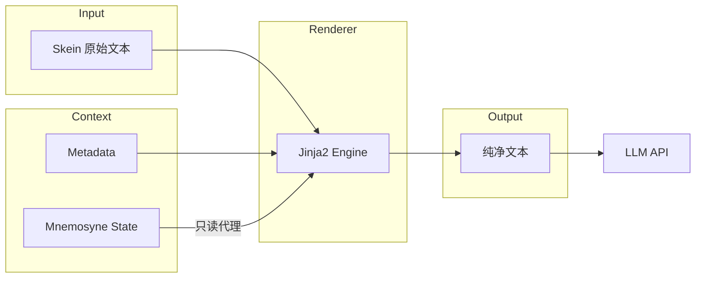
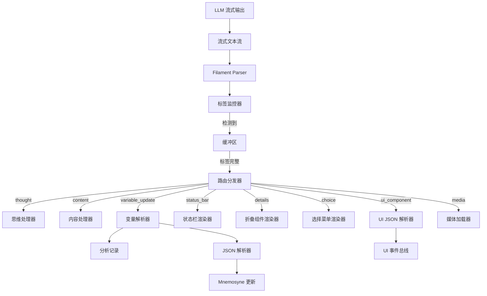

# 第九章：Filament 统一交互协议 (Filament Unified Protocol)

**版本**: 2.3.0
**日期**: 2025-12-28
**状态**: Draft
**作者**: 资深系统架构师 (Architect Mode)
**关联文档**: `02_jacquard_orchestration.md`, `03_mnemosyne_data_engine.md`, `04_presentation_layer.md`, `../EvaluationDoc/macro_system_spec.md`, `../EvaluationDoc/micro.md`

---

## 1. 协议概览 (Protocol Overview)

**Filament 协议**是 Clotho 系统的通用交互语言，旨在消除"自然语言"与"机器指令"之间的模糊地带。它贯穿于系统的所有交互环节，从提示词构建、逻辑控制到界面渲染，实现了统一的语义表达和确定性通信。

### 1.1 核心设计哲学 (Core Design Philosophy)

Filament 遵循以下两大设计哲学：

1.  **非对称交互 (Asymmetric Interaction)**:
    *   **输入端 (Context Ingestion): XML + YAML**
        *   **结构 (XML)**: 使用 XML 标签构建 Prompt 的骨架 (Skein Blocks)，确保 LLM 理解内容的层级与边界。
        *   **数据 (YAML)**: 在标签内部使用 YAML 描述属性与状态。YAML 相比 JSON 更符合人类阅读习惯，且 Token 消耗更低，适合作为大量的上下文输入。
    *   **输出端 (Instruction Generation): XML + JSON**
        *   **意图 (XML)**: 使用 XML 标签明确标识 LLM 的意图类型 (如思考、说话、操作)。
        *   **参数 (JSON)**: 在标签内部使用 JSON 描述具体的参数。JSON 的严格语法更易于机器解析，确保工具调用与状态变更的确定性。

2.  **混合扩展策略 (Mixed Extension Strategy) - v2.1 新增**:
    *   **核心严格性 (Core Strictness)**: 对于影响系统逻辑的关键指令（如变量更新、工具调用），采用严格的 Schema 验证和标准格式。
    *   **边缘灵活性 (Edge Flexibility)**: 对于展示层和辅助信息（如自定义状态栏、摘要），允许更灵活的自定义标签结构，以适应多变的业务需求。

### 1.2 协议在系统中的应用范畴

Filament 不仅是 LLM 的输出协议，更是系统的通用语言，统一管理：

1.  **提示词格式 (Prompt Engineering)**: 所有的 Character Card、World Info 均通过 Filament 结构化注入。
2.  **标签类型 (Tag System)**: 定义一套标准化的 XML 标签集，用于控制流程。
3.  **嵌入式前端 (Embedded UI)**: 允许 LLM 通过协议直接请求渲染原生的嵌入式网页组件（Mini-Apps），实现交互维度的升维。
4.  **状态管理 (State Management)**: 统一的状态更新指令格式。

---

## 2. 输入协议：提示词构建 (Prompt Engineering)

### 2.1 Filament 结构化提示词

Jacquard 使用 Filament 格式组装最终的 Prompt，确保 LLM 清晰感知不同信息的语义边界。

#### 2.1.1 基础数据块格式

```xml
<system_instruction>
role: Dungeon Master
tone: Dark Fantasy
rules:
  - strict_physics
  - permadeath
</system_instruction>

<character_card>
name: Seraphina
class: Mage
attributes:
  int: 18
  str: 4
</character_card>

<world_state>
location: Ancient Ruins
time: Midnight
weather: Stormy
</world_state>
```

#### 2.1.2 世界书条目格式

世界书条目在导入时会经过**格式规范化**处理，统一转换为 **"XML 包裹 YAML"** 格式：

```xml
<location_forest>
  name: Dark Forest
  atmosphere: Eerie, misty
  creatures:
    - Shadow Wolves
    - Forest Spirits
  loot:
    - Ancient Bark
    - Moon Petals
</location_forest>
```

**格式转换规则**：
- **JSON 转换**: 保留 XML 标签，内部 JSON 转为 2 空格缩进的 YAML
- **YAML 保留**: 保留 XML 标签，统一内部缩进为 2 空格
- **Markdown 转换**: 尽力将列表、标题等结构转换为 YAML 格式

### 2.2 标签语义体系 (Tag Semantics)

#### 2.2.1 顶层结构标签

| 标签 | 用途 | 示例 |
|---|---|---|
| `<system_instruction>` | 系统级指令和规则 | 角色扮演规则、输出格式要求 |
| `<character_card>` | 角色定义 | 姓名、性格、外貌、背景 |
| `<world_state>` | 当前世界状态 | 位置、时间、环境 |
| `<lorebook_entry>` | 世界书条目 | 设定、规则、背景知识 |
| `<conversation_history>` | 对话历史 | 历史消息列表 |
| `<use_protocol>` | **引用协议 Schema** (v2.1) | `<use_protocol>variable_update_v2</use_protocol>` |

#### 2.2.2 元数据标签

| 标签 | 用途 | 示例 |
|---|---|---|
| `<block>` | 标记文本块边界 | `<block role="system">...</block>` |
| `<format>` | 格式化指令 | `<format type="yaml">...</format>` |
| `<priority>` | 优先级标记 | `<priority level="high">...</priority>` |

### 2.3 Jinja2 宏系统 (Jinja2 Macro System)

Filament 协议与 Clotho 的 Jinja2 宏系统紧密集成，实现了动态提示词构建和安全的模板渲染。

#### 2.3.1 设计哲学：凯撒原则

Clotho 的宏系统严格遵循 **凯撒原则 (The Caesar Principle)**，采用 **Jinja2 (Dart Port)** 作为标准模板引擎。

**核心差异：模板渲染 vs 脚本执行**

| 特性 | SillyTavern | Clotho (Jinja2) |
|---|---|---|
| 执行方式 | 正则替换 + JS `eval` | TemplateRenderer (模板渲染) |
| 逻辑控制 | 分散且不安全 | 由 Jinja2 接管 |
| 结构支撑 | 混合 | XML 作为结构骨架，Jinja2 处理逻辑 |
| 输出纯净度 | 可能残留标签 | 完全渲染为纯文本 |

**Filament 结构与 Jinja2 的分工**：
- **Filament XML (`<thought>`, `<content>`, `<variable_update>`)**: 作为 LLM 输出的结构骨架，用于解析意图和边界
- **Jinja2 逻辑 (``, `{{ var }}`)**: 完全接管输入端的逻辑控制，在发送给 LLM 前被渲染为纯文本

#### 2.3.2 宏分类与规范

##### 身份与上下文宏 (Context Variables)

直接作为 Jinja2 模板的上下文变量传入。

| 宏 (Clotho) | ST 对应 | 描述 |
|---|---|---|
| `{{ user }}` | `{{user}}` | 当前用户名 |
| `{{ char }}` | `{{char}}` | 当前角色名 |

##### 状态与记忆宏 (State Variables)

Mnemosyne 的状态树以只读字典形式注入 Jinja2 上下文。

**语法**: `{{ state.path }}`

| 宏示例 | ST 对应 | 描述 |
|---|---|---|
| `{{ state.hp }}` | `{{getvar::hp}}` | 获取数值 |
| `{{ state.inventory[0].name }}` | - | 列表访问 |
| `{{ state_desc.hp }}` | - | 获取语义描述 |

##### 逻辑控制与结构化拼装 (Logic & Assembly)

使用标准的 Jinja2 控制流标签。

| 语法 (Jinja2) | ST 对应 | 描述 | 实现方式 |
|---|---|---|---|
| `...` | `<if>` | 条件渲染 | Jinja2 Native |
| `{{ random([a, b]) }}` | `{{random}}` | 随机选择 | Custom Filter / Function |
| `` | `{{setvar}}` | **定义临时变量** | Jinja2 Scoped Context |
| `{{ var }}` | `{{var}}` | **注入变量内容** | Jinja2 Variable Interpolation |

**解决 Prompt 动态内容注入案例**：

**ST 写法**:
```
{{setvar::灰魂4::\n- 灰魂会在...}}
...
{{灰魂4}}
```

**Clotho (Jinja2) 写法**:
```jinja
{# 1. 定义复杂内容块 (Block Assignment) #}

- 灰魂会在任何用户需要的情况下合理的出现在用户所处场景，但不一定会帮助用户


{# ... 在后续文档位置 ... #}

{# 2. 注入内容 #}
{{ grey_soul_fragment }}
```

**优势**:
1. **Block Set**: `...` 语法原生支持多行文本和复杂结构
2. **Scope Safety**: 变量仅存在于模板渲染上下文中，**绝对不会** 写入 Mnemosyne 数据库

#### 2.3.3 安全沙箱 (Security Sandbox)

为了维护安全性，Jinja2 环境受到严格限制：

1. **只读状态**: `state` 对象是不可变的 (Immutable) 或只读代理，模板无法执行 `state.hp = 0`
2. **禁用系统调用**: 无法访问文件系统 (`import 'io'`) 或网络
3. **函数白名单**: 仅暴露安全的辅助函数（如 `random`, `time`, `format`）

#### 2.3.4 迁移映射表 (Migration Map)

##### 基础宏映射

| SillyTavern Macro | Clotho (Jinja2) | 说明 |
|---|---|---|
| `{{user}}` / `<USER>` | `{{ user }}` | 当前用户名 |
| `{{char}}` / `<BOT>` / `<CHAR>` | `{{ char }}` | 当前角色名 |
| `{{getvar::x}}` | `{{ state.x }}` | 获取状态变量 |
| `{{setvar::x::y}}` (Temp) | `` | 定义临时变量 |
| `{{#if x}}...{{/if}}` | `...` | 条件渲染 |
| `{{random:a,b}}` | `{{ random(['a', 'b']) }}` | 随机选择 |
| `{{// comment}}` | `{# comment #}` | 注释 |

##### 核心/身份宏 (Core/Identity)

| SillyTavern Macro | Clotho (Jinja2) | 说明 |
|---|---|---|
| `{{group}}` | `{{ group }}` | 群组成员列表 |
| `{{groupNotMuted}}` | `{{ group | filter_not_muted }}` | 排除静音成员 |
| `{{notChar}}` | `{{ not_char }}` | 除当前说话者外的参与者 |
| `{{description}}` | `{{ char.description }}` | 角色描述 |
| `{{personality}}` | `{{ char.personality }}` | 角色个性 |
| `{{persona}}` | `{{ user.persona }}` | 用户角色设定 |
| `{{scenario}}` | `{{ char.scenario }}` | 场景描述 |
| `{{charVersion}}` | `{{ char.version }}` | 角色版本号 |
| `{{charPrompt}}` | `{{ char.main_prompt }}` | 主提示词覆盖 |
| `{{charJailbreak}}` | `{{ char.jailbreak }}` | 越狱指令覆盖 |
| `{{charDepthPrompt}}` | `{{ char.depth_prompt }}` | 深度提示词 |
| `{{creatorNotes}}` | `{{ char.creator_notes }}` | 作者注释 |
| `{{model}}` | `{{ config.model }}` | 当前模型名称 |
| `{{mesExamples}}` | `{{ char.examples | format_examples }}` | 对话示例（已格式化） |
| `{{mesExamplesRaw}}` | `{{ char.examples_raw }}` | 对话示例（原始） |

##### 消息/对话宏 (Message/Conversation)

| SillyTavern Macro | Clotho (Jinja2) | 说明 |
|---|---|---|
| `{{lastMessage}}` | `{{ history[-1].content }}` | 上一条消息内容 |
| `{{lastMessageId}}` | `{{ history[-1].id }}` | 上一条消息 ID |
| `{{lastUserMessage}}` | `{{ history | select('role', 'user') | last }}` | 上一条用户消息 |
| `{{lastCharMessage}}` | `{{ history | select('role', 'assistant') | last }}` | 上一条角色消息 |
| `{{firstIncludedMessageId}}` | `{{ context[0].id }}` | 上下文首条消息 ID |
| `{{firstDisplayedMessageId}}` | `{{ display_context[0].id }}` | 显示首条消息 ID |
| `{{lastSwipeId}}` | `{{ history[-1].swipe_count }}` | Swipe 数量 |
| `{{currentSwipeId}}` | `{{ history[-1].current_swipe }}` | 当前 Swipe ID |
| `{{lastGenerationType}}` | `{{ last_generation.type }}` | 上次生成类型 |
| `{{input}}` | `{{ user_input }}` | 用户输入内容 |

##### 时间/日期宏 (Time/Date)

| SillyTavern Macro | Clotho (Jinja2) | 说明 |
|---|---|---|
| `{{time}}` | `{{ now | time_format('LT') }}` | 当前时间 |
| `{{date}}` | `{{ now | date_format('LL') }}` | 当前日期 |
| `{{weekday}}` | `{{ now | date_format('dddd') }}` | 当前星期 |
| `{{isotime}}` | `{{ now | time_format('HH:mm') }}` | ISO 时间 |
| `{{isodate}}` | `{{ now | date_format('YYYY-MM-DD') }}` | ISO 日期 |
| `{{datetimeformat format}}` | `{{ now | date_format(format) }}` | 自定义格式 |
| `{{time_UTC±X}}` | `{{ now | utc_offset(X) | time_format }}` | UTC 偏移时间 |
| `{{idle_duration}}` | `{{ idle_duration }}` | 空闲时长 |
| `{{timeDiff::time1::time2}}` | `{{ time_diff(time1, time2) }}` | 时间差计算 |

##### 变量/逻辑宏 (Variables/Logic)

| SillyTavern Macro | Clotho (Jinja2) | 说明 |
|---|---|---|
| `{{getvar::name}}` | `{{ state.name }}` | 获取局部变量 |
| `{{setvar::name::value}}` | `` | 设置局部变量 |
| `{{addvar::name::value}}` | `` | 变量加法 |
| `{{incvar::name}}` | `` | 变量自增 |
| `{{decvar::name}}` | `` | 变量自减 |
| `{{getglobalvar::name}}` | `{{ global_state.name }}` | 获取全局变量 |
| `{{setglobalvar::name::value}}` | `` | 设置全局变量 |
| `{{addglobalvar::name::value}}` | `` | 全局变量加法 |
| `{{incglobalvar::name}}` | `` | 全局变量自增 |
| `{{decglobalvar::name}}` | `` | 全局变量自减 |
| `{{var_name}}` | `{{ state.var_name }}` | 动态变量访问 |

##### 格式化/实用工具宏 (Formatting/Utility)

| SillyTavern Macro | Clotho (Jinja2) | 说明 |
|---|---|---|
| `{{newline}}` | `{{ '\n' }}` | 插入换行符 |
| `{{trim}}` | `{{ content | trim }}` | 移除空白 |
| `{{noop}}` | `{# no-op #}` | 无操作 |
| `{{random:arg1,arg2,...}}` | `{{ random(['arg1', 'arg2']) }}` | 随机选择（逗号分隔） |
| `{{random::arg1::arg2...}}` | `{{ random(['arg1', 'arg2']) }}` | 随机选择（双冒号分隔） |
| `{{pick::arg1::arg2...}}` | `{{ pick(['arg1', 'arg2']) }}` | 一致选择（基于 hash） |
| `{{roll:formula}}` | `{{ roll('formula') }}` | 掷骰子 |
| `{{reverse:content}}` | `{{ content | reverse }}` | 反转字符串 |
| `{{banned "word"}}` | `{# 安全过滤 #}` | 词汇过滤（安全机制） |
| `{{isMobile}}` | `{{ is_mobile }}` | 是否移动设备 |

##### 扩展/系统宏 (Extension/System)

| SillyTavern Macro | Clotho (Jinja2) | 说明 |
|---|---|---|
| `{{outlet::name}}` | `{{ outlet(name) }}` | World Info Outlet |
| `{{maxPrompt}}` | `{{ config.max_context }}` | 最大 Context Size |
| `{{pipe}}` | `{{ pipe_result }}` | Slash Command 管道 |
| `{{anchorBefore}}` | `{{ anchor_before }}` | WI 插入锚点（前） |
| `{{anchorAfter}}` | `{{ anchor_after }}` | WI 插入锚点（后） |
| `{{wiBefore}}` / `{{loreBefore}}` | `{{ lore_before }}` | WI 插入位置（前） |
| `{{wiAfter}}` / `{{loreAfter}}` | `{{ lore_after }}` | WI 插入位置（后） |

##### 指令/上下文模板宏 (Instruct/Context Template)

| SillyTavern Macro | Clotho (Jinja2) | 说明 |
|---|---|---|
| `{{system}}` | `{{ system_prompt }}` | 系统提示词位置 |
| `{{instructSystemPrompt}}` | `{{ instruct.system_prompt }}` | 指令模式系统提示词 |
| `{{instructUserPrefix}}` | `{{ instruct.user_prefix }}` | 用户指令前缀 |
| `{{instructUserSuffix}}` | `{{ instruct.user_suffix }}` | 用户指令后缀 |
| `{{instructAssistantPrefix}}` | `{{ instruct.assistant_prefix }}` | 助手回复前缀 |
| `{{instructAssistantSuffix}}` | `{{ instruct.assistant_suffix }}` | 助手回复后缀 |

##### 酒馆助手扩展宏 (Tavern-Helper Extension Macros)

| SillyTavern Macro | Clotho (Jinja2) | 说明 |
|---|---|---|
| `{{get_message_variable::path}}` | `{{ state.message.path }}` | 获取消息变量 |
| `{{get_chat_variable::path}}` | `{{ state.chat.path }}` | 获取聊天变量 |
| `{{get_character_variable::path}}` | `{{ state.character.path }}` | 获取角色变量 |
| `{{get_preset_variable::path}}` | `{{ state.preset.path }}` | 获取预设变量 |
| `{{get_global_variable::path}}` | `{{ state.global.path }}` | 获取全局变量 |
| `{{format_message_variable::path}}` | `{{ state.message.path | to_yaml }}` | 格式化为 YAML |
| `{{format_chat_variable::path}}` | `{{ state.chat.path | to_yaml }}` | 格式化为 YAML |
| `{{format_character_variable::path}}` | `{{ state.character.path | to_yaml }}` | 格式化为 YAML |
| `{{format_preset_variable::path}}` | `{{ state.preset.path | to_yaml }}` | 格式化为 YAML |
| `{{format_global_variable::path}}` | `{{ state.global.path | to_yaml }}` | 格式化为 YAML |
| `{{userAvatar}}` | `{{ user.avatar_path }}` | 用户头像路径 |

**注意**：部分宏（如 `banned`、`pipe`、`outlet`）需要 Clotho 提供特定的安全机制或替代方案实现。

#### 2.3.5 实现架构 (Architectural Integration)

**组件重命名**: `PromptASTExecutor` → **`TemplateRenderer`**

**Pipeline 流程**:
1. **Input**: `Skein` (包含 `systemPrompt`, `lore` 等原始文本，可能包含 Jinja2 标签)
2. **Context Build**: 将 `Skein.metadata`, `Mnemosyne.state` 包装为 `Map<String, dynamic>` 上下文
3. **Render**: 调用 `jinja.render(template, context)`
4. **Output**: 纯净字符串，送往 LLM



---

## 3. 输出协议：指令与响应 (Output Protocol)

LLM 的所有输出必须包裹在特定的 Filament 标签中，确保机器可解析。v2.1 版本引入了更多语义化标签以支持复杂交互。

### 3.1 认知与表达标签 (Cognition & Expression)

#### 3.1.1 `<thought>` - 思维链

用于推理、规划与自我反思。

```xml
<thought>
用户询问了关于森林的危险性。我需要：
1. 回忆森林中的主要威胁
2. 根据当前时间（午夜）调整危险程度
3. 考虑用户的装备水平
4. 提供建议而非直接命令
</thought>
```

**特性**:
- 此内容默认对用户隐藏，或折叠显示
- 可通过用户设置切换为完全隐藏或完全显示
- 不计入最终输出 Token

#### 3.1.2 `<content>` - 最终回复

直接展示给用户的对话内容。

```xml
<content>
　　「在这片黑暗森林中，你要特别小心。」
<!-- consider: (角色对白模拟插入) -->
<!--
1. 「a」
2. 「aa」
-->
</content>
```

**特性 (v2.1 更新)**:
- 直接展示在聊天界面
- 支持 Markdown 格式
- **支持 HTML 注释**: 允许嵌入 `<!-- ... -->` 格式的注释，用于内部模拟、标记或辅助逻辑，Parser 会将其路由到特定处理器（如隐藏或记录），而不直接展示给用户。
- **支持受限的行内 HTML**: 为满足富文本表现需求（如自定义颜色、字体样式），允许使用特定的行内 HTML 标签。系统会执行严格的白名单过滤。

#### 3.1.3 受限 HTML 白名单 (HTML Sanitization Whitelist)

为了安全起见，Clotho 仅允许以下 HTML 标签和属性：

| 标签 | 允许属性 | 用途 |
|---|---|---|
| `<span>` | `style` (仅限 color, background-color, font-weight 等安全样式) | 文本高亮、改色 |
| `<br>` | 无 | 换行 |
| `<b>`, `<strong>`, `<i>`, `<em>`, `<u>`, `<s>` | 无 | 基础排版 |
| `<ruby>` | 无 | 注音 |

**安全机制**:
- 前端渲染器（Flutter `HtmlWidget` 或 WebView）必须集成 Sanitize 模块（如 `DOMPurify`）。
- 任何不在白名单中的标签（如 `<script>`, `<iframe>`, `onclick`）将被剥离或转义。

### 3.2 逻辑与状态标签 (Logic & State)

#### 3.2.1 `<variable_update>` - 变量更新 (v2.1 推荐)

`<variable_update>` 是 `<state_update>` 的升级版，增加了 `<analysis>` 子标签用于记录变更原因，增强了可解释性。它兼容 v2.0 的 JSON OpCode 格式。

```xml
<variable_update>
  <analysis>
    - 角色对白模拟插入
    - 嫉妒乐奈受到的"特别待遇"，对源的执念更深
  </analysis>
  [
    ["SET", "纯田真奈.好感度", 2],
    ["ADD", "mood.value", 1]
  ]
</variable_update>
```

**结构**:
1.  `<analysis>` (可选): 文本形式的分析，解释为何进行这些状态变更。
2.  `JSON Array` (必填): 执行状态变更的操作码列表。

**操作码 (OpCode) 定义**:

| OpCode | 含义 | 参数示例 | 说明 |
|---|---|---|---|
| `SET` | 设置值 | `["SET", "path", value]` | 覆盖指定路径的值 |
| `ADD` | 加法 | `["ADD", "path", number]` | 数值相加 |
| `SUB` | 减法 | `["SUB", "path", number]` | 数值相减 |
| `MUL` | 乘法 | `["MUL", "path", number]` | 数值相乘 |
| `DIV` | 除法 | `["DIV", "path", number]` | 数值相除 |
| `PUSH` | 追加到数组 | `["PUSH", "array_path", value]` | 向数组末尾添加元素 |
| `POP` | 弹出数组 | `["POP", "array_path"]` | 移除数组末尾元素 |
| `DELETE` | 删除字段 | `["DELETE", "path"]` | 删除指定路径的字段 |

#### 3.2.2 `<tool_call>` - 工具调用

请求执行特定的工具或函数。

```xml
<tool_call name="weather_forecast">
{
  "location": "Ancient Ruins",
  "days": 3,
  "units": "celsius"
}
</tool_call>
```

### 3.3 表现与交互标签 (Presentation & Interaction)

#### 3.3.1 `<status_bar>` - 自定义状态栏 (v2.1 新增)

用于显示轻量级的、非标准化的状态信息。这体现了"边缘灵活性"哲学。

```xml
<status_bar>
  <SFW>safe</SFW>
  <mood>anxious</mood>
  <location>Dark Forest</location>
</status_bar>
```

**特性**:
- **自由结构**: 内部标签名不限，由 UI 层动态解析并渲染。
- **用途**: 适用于 Character Script 自定义的显示需求，无需预先定义 Schema。

#### 3.3.2 `<details>` - 折叠摘要 (v2.1 新增)

兼容 HTML `<details>` 标签，用于输出折叠的辅助信息或摘要。

```xml
<details>
  <summary>摘要</summary>
  用户询问了森林的危险性，我提供了关于暗影狼群和森林精灵的信息。
</details>
```

#### 3.3.3 `<choice>` - 选择菜单 (v2.1 新增)

用于向用户提供明确的行动选项，替代不规范的 `<xx>` 标签。

```xml
<choice>
  <prompt>请选择源的下一步行动：</prompt>
  <options>
    <option id="investigate">调查废墟</option>
    <option id="rest">休息恢复</option>
    <option id="leave">离开此地</option>
  </options>
</choice>
```

#### 3.3.4 `<ui_component>` - 嵌入式前端

允许 LLM 请求渲染复杂的、原生的嵌入式 UI 组件。

```xml
<ui_component view="widget.inventory_grid">
{
  "filter": "magical_items",
  "columns": 3,
  "max_items": 12
}
</ui_component>
```

#### 3.3.5 `<media>` - 媒体资源

请求插入图片、音频、视频等媒体资源。

```xml
<media type="image" src="assets/forest_night.jpg" alt="黑暗森林的夜景" />
```

---

## 4. 协议解析流程 (Parsing Workflow)

Filament 协议的解析是实时流式进行的，v2.1 增加了对扩展标签的路由支持。

### 4.1 流式解析架构



### 4.2 路由分发表 (v2.1)

| 标签类型 | 目标处理器 | 处理动作 | 备注 |
|---|---|---|---|
| `<thought>` | ThoughtHandler | 存储思维日志 | 默认折叠 |
| `<content>` | ContentHandler | 推送正文 | 支持 HTML 注释过滤 |
| `<variable_update>` | VariableParser | 记录分析 + 更新状态 | 替代 `<state_update>` |
| `<status_bar>` | StatusBarRenderer | 动态渲染状态标签 | 灵活结构 |
| `<details>` | DetailsRenderer | 渲染折叠块 | 标准 HTML 行为 |
| `<choice>` | ChoiceRenderer | 渲染交互按钮 | 替代 `<xx>` |
| `<ui_component>` | UIJSONParser | 渲染复杂原生组件 | |
| `<tool_call>` | ToolExecutor | 执行外部工具 | |

---

## 5. 协议版本演进 (Protocol Evolution)

### 5.1 v1.0 - 初始版本
*   使用重复的 XML 标签表示状态更新。
*   Token 效率低。

### 5.2 v2.0 - 结构化版本
*   引入 `<state_update>` 和 JSON 数组三元组。
*   Token 效率提升，解析简化。

### 5.3 v2.1 - 混合扩展版本 (当前)
*   **标签重命名与增强**: `<UpdateVariable>` (遗留) -> `<variable_update>`，增加了分析字段。
*   **交互标准化**: `<xx>` (遗留) -> `<choice>`。
*   **UI 灵活性**: 引入 `<status_bar>` 和 `<details>`，允许更灵活的非结构化展示。
*   **混合策略**: 核心逻辑保持严格 JSON Schema，展示层允许 XML 自由结构。

---

## 6. 最佳实践与约束 (Best Practices & Constraints)

### 6.1 LLM 输出约束

1.  **标签闭合**: 所有标签必须严格闭合，禁止自闭合标签（`<media>` 除外，如果 Parser 支持）。
2.  **JSON 格式**: `<variable_update>` 和 `<ui_component>` 内部的 JSON 必须严格符合标准（双引号、无尾随逗号）。
3.  **注释规范**: 在 `<content>` 中使用 `<!-- -->` 进行内部标记，不要将用户不可见的内容裸露在正文中。

### 6.2 迁移指南

对于从 SillyTavern 或旧系统迁移的内容：

*   **变量更新**: 将 `<UpdateVariable>` 映射为 `<variable_update>`。
*   **选择菜单**: 将 `<xx>` 或纯文本选项映射为 `<choice>`。
*   **状态栏**: 将 HTML 状态栏映射为 `<status_bar>` 或 `<ui_component>`。

### 6.3 UI 组件设计规范

1.  **view 命名**: 使用 `namespace.component` 格式。
2.  **降级策略**: 关键交互组件应提供文本降级方案，以防 UI 渲染失败。

---

## 11. 输出结构鲁棒性 (Output Structure Robustness)

### 11.1 设计挑战
在复杂的 RPG 场景中，Prompt 可能会启用多种协议功能（如思维链、状态更新、状态栏），且其顺序可能因 System Prompt 的微调或随机因素而波动。传统的严格解析器在面对 LLM 的"幻觉"（如遗漏标签、标签未闭合）时往往会失败。Clotho 引入 **"期望结构注册表"** 与 **"流式模糊修正器"** 来解决这一问题。

### 11.2 期望结构注册表 (Expected Structure Registry)

Jacquard 在组装 Prompt 时，会根据启用的模块动态生成一个 **"期望结构表"**。这个表定义了当前回复中 *可能* 出现的标签及其 *推荐* 顺序，作为解析器的指导（Hint）。

```dart
// 伪代码定义
class ExpectedStructure {
  final List<String> mandatoryTags; // 必须出现的标签 (e.g., content)
  final List<String> optionalTags;  // 可能出现的标签 (e.g., thought, status_bar)
  final Map<String, String> dependency; // 依赖关系 (e.g., variable_update 必须在 content 之后)
}
```

*   **自动生成**: Jacquard 根据 `<use_protocol>` 自动填充。
*   **手动调整**: 高级用户可以在 System Instruction 中微调。

### 11.3 流式模糊修正器 (Streaming Fuzzy Corrector)

解析器不再是简单的正则匹配，而是一个 **容错状态机 (Fault-Tolerant State Machine)**。

#### 11.3.1 核心修正策略

1.  **首部缺失自动补全**:
    *   *场景*: 期望 `<think>` 开头，但 LLM 直接输出了文本。
    *   *动作*: 如果首个非空字符不是 `<`，且期望表中包含 `<think>`，则自动插入 `<think>` 标签头，并标记状态为 `InThought`。

2.  **尾部闭合预测**:
    *   *场景*: 检测到 `<tag>` 开始，但在遇到下一个 `<tag2>` 时仍未闭合。
    *   *动作*: 如果 `<tag2>` 是期望表中的顶层标签，则推断 `<tag>` 已结束，自动插入 `</tag>`。

3.  **相邻冗余修正**:
    *   *场景*: `</content><content>` (LLM 意外分段)。
    *   *动作*: 自动合并为单一流，忽略中间的闭合与开启标签。

#### 11.3.2 状态机流程图

```mermaid
graph TD
    Start((Start)) -->|非 < 字符| AutoInsert{需自动补全?}
    Start -->|<| DetectTag[检测标签]
    
    AutoInsert -->|Yes (Exp: think)| InsertThink[插入 <think>] --> InThink
    AutoInsert -->|No| InContent[默认进入 Content]
    
    DetectTag -->|Known Tag| EnterState[进入特定标签状态]
    DetectTag -->|Next Top-Level Tag| AutoClose{上个标签未闭合?}
    
    AutoClose -->|Yes| InsertClose[插入 </prev_tag>] --> EnterState
    
    InThink -->|</think>| EndThink[结束 Think]
    InContent -->|</content>| EndContent[结束 Content]
```

### 11.4 容错降级

如果修正器无法确定结构（如 JSON 语法严重错误），系统将执行降级策略：
1.  **Raw Text Fallback**: 将所有无法解析的内容视为 `<content>` 的一部分展示给用户。
2.  **Error Toast**: 在 UI 侧轻量级提示"部分状态更新失败"，但不阻断对话流程。
