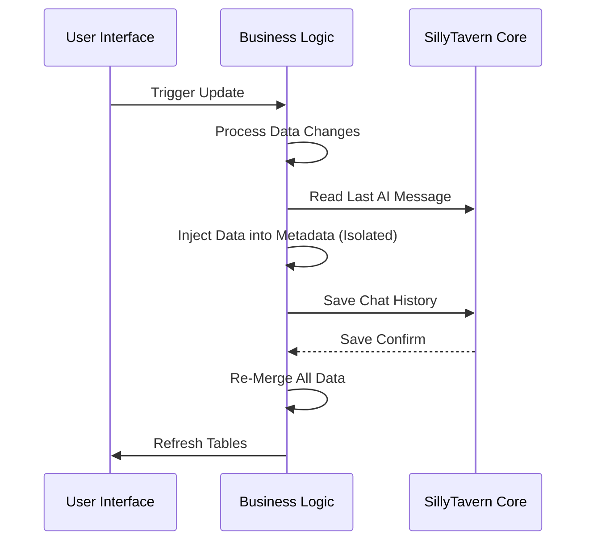

# Data Processing Layer Architecture

## 1. 核心理念：聊天记录即数据库 (Chat History as Database)

Auto Card Updater (ACU) 运行在一个无状态的浏览器环境中，其中唯一的持久化存储是 SillyTavern 的聊天记录文件（JsonL）。因此，ACU 采用了一种独特的数据架构，将聊天记录视为一个只能追加（Append-Only）的分布式数据库。

### 1.1 设计原则
*   **无状态核心 (Stateless Core)**: 系统不依赖任何外部数据库（如 IndexedDB 或 LocalStorage）来存储核心数据，确保数据随聊天记录迁移。
*   **增量快照 (Incremental Snapshots)**: 每次数据更新只保存发生变化的表格，而非全量数据，以减少上下文占用。
*   **反向重建 (Backwards Reconstruction)**: 系统的当前状态是通过倒序扫描聊天记录并合并最新的表格快照来动态构建的。

---

## 2. 数据隔离与存储结构 (Data Isolation & Storage)

为了支持多时间线（Timeline）或多分支剧情，系统引入了严格的数据隔离机制。

### 2.1 隔离键 (Isolation Key)
所有数据读写操作都受 `getCurrentIsolationKey_ACU()` 控制。
*   **无标签模式 (No Tag)**: 键为空字符串 `""`。
*   **标签模式 (With Tag)**: 键为用户定义的字符串（如 "timeline_a"）。
*   **严格隔离**: 即使是"无标签"数据也被视为一种特殊的标签，与其他标签数据严格互斥。

### 2.2 存储结构 (Storage Schema)
数据以 JSON 对象形式存储在 SillyTavern 消息对象的 `TavernDB_ACU_IsolatedData` 字段中。

```json
{
  "TavernDB_ACU_IsolatedData": {
    "timeline_a": {
      "independentData": {
        "sheet_1": { "name": "角色状态", "content": [...] },
        "sheet_3": { "name": "物品栏", "content": [...] }
      },
      "modifiedKeys": ["sheet_1", "sheet_3"],
      "updateGroupKeys": ["sheet_1", "sheet_2", "sheet_3"]
    },
    "": {
      // 默认/无标签数据槽
    }
  }
}
```

*   **independentData**: 包含本次更新实际修改的表格数据。
*   **modifiedKeys**: 记录本次修改了哪些表（用于索引）。
*   **updateGroupKeys**: 记录参与本次更新计算的所有表（即使某些表未发生变化）。

---

## 3. 状态重建机制 (State Reconstruction)

`mergeAllIndependentTables_ACU` 函数负责将分散在聊天记录中的数据碎片重组成完整的当前状态。

### 3.1 倒序扫描算法 (Reverse Scan Algorithm)
1.  **初始化**: 创建一个空的 `mergedData` 对象和一个 `foundSheets` 标记集。
2.  **倒序遍历**: 从最新的消息开始向历史消息遍历。
3.  **匹配隔离键**: 检查每条消息是否包含当前激活的 `Isolation Key` 的数据。
4.  **按表合并**:
    *   对于消息中包含的每一个表格（Sheet）：
    *   如果该表格在 `foundSheets` 中未出现（即尚未找到更新的版本），则将其**采纳**。
    *   将其加入 `mergedData` 并标记为已找到。
5.  **终止条件**: 当所有已知表格都找到，或遍历完所有消息。
6.  **结果重排**: 使用 `reorderDataBySheetKeys_ACU` 确保合并后的数据顺序符合用户定义的逻辑顺序（而非发现顺序）。

### 3.2 兼容性策略 (Legacy Compatibility)
为了支持旧版本数据，扫描过程包含即时迁移逻辑：
*   **优先级 1**: 新版 `TavernDB_ACU_IsolatedData` 结构。
*   **优先级 2**: 旧版 `TavernDB_ACU_IndependentData`（严格匹配 `TavernDB_ACU_Identity`）。
*   **优先级 3**: 传统的 `TavernDB_ACU_Data` (标准表) 和 `TavernDB_ACU_SummaryData` (总结表)。

---

## 4. 持久化流程 (Persistence Flow)

`saveIndependentTableToChatHistory_ACU` 负责将内存中的变更写入聊天记录。

### 4.1 写入逻辑
1.  **目标定位**: 寻找最近一条 AI 消息（或指定消息）作为载体。
2.  **数据克隆**: 读取目标消息现有的 `TavernDB_ACU_IsolatedData`，避免覆盖同消息中的其他标签数据。
3.  **数据清洗**: 使用 `sanitizeSheetForStorage_ACU` 移除运行时字段（如 UI 状态），只保留核心数据。
4.  **原子写入**: 将更新后的数据对象写回消息，并触发 SillyTavern 的 `saveChat`。
5.  **UI 通知**: 写入完成后，触发 `refreshMergedDataAndNotify_ACU` 刷新全局状态和 UI。

### 4.2 完整性修复
在加载数据时，系统会自动检测数据完整性。例如，检测以 `AM` (Auto Merge) 编码的行是否丢失了 `auto_merged` 标记，并自动进行修复。


