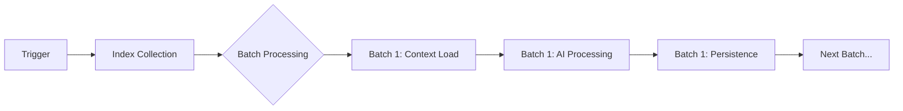

# Update & Intelligence Layer Architecture

## 1. 概览

更新与智能层（Update & Intelligence Layer）是 Auto Card Updater (ACU) 的"大脑"，负责协调用户触发、上下文组装、LLM 交互以及结果回写。该层通过高度可配置的批处理引擎来处理大规模数据更新，并根据不同的更新模式动态调整 AI 的视野。

## 2. 更新管道 (The Update Pipeline)

更新过程是一个线性的流水线操作，主要由 `processUpdates_ACU` 驱动。

### 2.1 触发与生命周期
1.  **触发 (Trigger)**: 用户手动点击或自动触发更新。
2.  **索引收集 (Index Collection)**: 系统确定需要扫描的消息范围（通常是自上次更新以来的新消息）。
3.  **批处理 (Batching)**: 将大量消息切分为小批次（Batch），以适应 LLM 的上下文窗口限制。
4.  **执行 (Execution)**: 对每个批次执行 `proceedWithCardUpdate_ACU`。

---

## 3. 批处理引擎 (Batch Processing Engine)

`processor.js` 实现了复杂的批处理逻辑，确保在大规模对话更新时系统的稳定性和准确性。

### 3.1 动态上下文窗口
*   **切片逻辑**: 每个批次仅处理 `batchSize`（默认为 2）条消息。
*   **上下文回溯**: 系统会自动包含当前批次第一条消息**之前**的一条用户消息（如果是用户发言），以提供完整的对话上下文（Q&A 对）。
*   **状态前行**: 在处理每个批次前，系统会先加载该批次起始点**之前**的最新表格状态。这意味着 Batch N 的输入是 Batch N-1 的输出，确保了状态的连续性。

### 3.2 批次隔离与合并
*   **独立加载**: 每个批次开始时，都会独立执行一次"微型合并"（Mini-Merge），从历史记录中查找该时刻对应的表格状态。
*   **增量更新**: AI 只需要基于当前的表格状态和当前的对话片段，输出发生变化的表格。

---

## 4. 智能输入准备 (Intelligent Input Preparation)

`input-prep.js` 负责将结构化数据转化为 LLM 可理解的自然语言提示。

### 4.1 动态数据可见性 (Dynamic Data Visibility)
根据更新模式的不同，AI 看到的表格数据也会有所不同，以节省 Token 并聚焦任务。

| 模式 (Mode) | 标准表 (Standard Sheets) | 总结表 (Summary Sheet) | 适用场景 |
| :--- | :--- | :--- | :--- |
| **auto_standard** | ✅ 可见 | ❌ 隐藏 | 日常自动更新，关注细节 |
| **auto_summary** | ❌ 隐藏 | ✅ 可见 | 总结生成，宏观概括 |
| **unified (full)** | ✅ 可见 | ✅ 可见 | 强力模式，全面更新 |

### 4.2 表格序列化策略
*   **Full Data**: 默认显示表格的所有行。
*   **Header Only**: 当表格为空时，仅显示列头，并附带 `(该表格为空，请进行初始化。)` 提示。
*   **Truncated**: 对于特别长的表格（如历史总结），系统会自动截取最后 N 行（例如 10 行），防止上下文溢出。

### 4.3 提示词组装
最终发送给 AI 的 Prompt 包含三个动态部分：
1.  **Table Data ($0)**: 当前表格状态的文本化表示。
2.  **Chat Log ($1)**: 当前批次的对话记录（经过标签筛选）。
3.  **Worldbook ($2)**: 相关的世界书条目（Lorebook）。

---

## 5. 交互模式详解 (Update Modes)

系统支持多种更新模式，通过 `mode` 参数控制行为。

*   **Auto Modes (自动模式)**:
    *   `auto_standard`: 标准自动更新，跳过过短的回复。
    *   `auto_summary_silent`: 静默更新总结表，不显示 Toast 提示，失败不报错。
*   **Manual Modes (手动模式)**:
    *   `manual_standard`: 强制更新标准表，忽略长度限制。
    *   `manual_unified`: 强制更新所有表。
*   **特殊逻辑**:
    *   **Silent Mode**: 当 `mode` 包含 `silent` 时，系统将抑制所有 UI 通知（Toast），适用于后台静默任务。

## 6. 错误处理与反馈
如果在批处理过程中发生错误（如 LLM拒答、网络超时），该批次会被标记为失败，系统会中断后续批次并通知用户。这种"快速失败"（Fail-Fast）机制防止了错误累积导致的数据污染。
