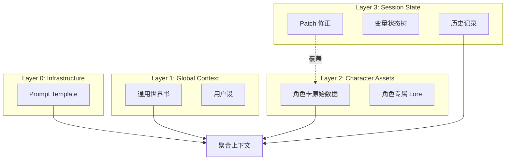

# 运行时环境文档目录

**定位**: 系统运行时环境、状态管理和会话管理  
**目标读者**: 运行时工程师、状态管理开发者  
**文档状态**: 已重组 (2025-12-30)

---

## 📖 目录简介

本目录包含 Clotho 系统的运行时环境架构和状态管理机制。核心是 **分层运行时环境 (Layered Runtime Architecture)**，它将一个运行中的角色会话解构为四个物理隔离但逻辑叠加的层次，实现了“写时复制”和“平行宇宙”等高级特性。

## 📚 文档列表

### 1. 分层运行时环境架构
- **文件**: [`layered-runtime-architecture.md`](layered-runtime-architecture.md)
- **简介**: 描述 Clotho 的运行时环境核心架构，即“分层叠加模型 (Layered Sandwich Model)”。
- **核心内容**: 四层叠加模型 (Infrastructure, Global Context, Character Assets, Session State)、Patching 机制、运行时数据流
- **阅读建议**: 了解系统如何管理角色状态、支持平行宇宙和无损回溯
- **关联文档**: 核心架构 [`../core/`](../core/)，工作流目录 [`../workflows/`](../workflows/)

### 2. 运行时环境切换流程
- **文件**: [`runtime-environment-switching.md`](runtime-environment-switching.md) (待创建)
- **简介**: 描述系统如何在不同的运行时环境（角色、预设、场景）之间切换。
- **核心内容**: Freeze-Unload-Hydrate-Resume 四阶段流程、状态保存与恢复、UI 组件重建
- **阅读建议**: 了解系统如何实现多角色会话的平滑切换
- **关联文档**: 分层运行时架构 [`layered-runtime-architecture.md`](layered-runtime-architecture.md)，工作流目录 [`../workflows/`](../workflows/)

### 3. 状态管理与 Patching 机制
- **文件**: (与核心架构共享) [`../core/mnemosyne-data-engine.md#L3-Patching-机制与-Deep-Merge`](../core/mnemosyne-data-engine.md#L3-Patching-机制与-Deep-Merge)
- **简介**: L3 (Session State) 层对 L2 (Character Assets) 层的动态补丁机制。
- **核心内容**: Deep Merge 算法、Patch 应用场景、与分层运行时架构的集成
- **阅读建议**: 了解状态补丁的具体实现
- **关联文档**: 核心架构 [`../core/mnemosyne-data-engine.md`](../core/mnemosyne-data-engine.md)，分层运行时架构 [`layered-runtime-architecture.md`](layered-runtime-architecture.md)

## 🔗 架构关系图

## 🧭 导航指南

### 从哪里开始？
如果您是**运行时工程师**：
1. 阅读 [`layered-runtime-architecture.md`](layered-runtime-architecture.md) 了解整体架构
2. 查看核心架构中的状态管理部分，了解具体实现

如果您是**状态管理开发者**：
1. 重点关注 Patching 机制和 Deep Merge 算法
2. 了解状态在不同层间的流动和转换

如果您是**UI 开发者**：
1. 了解运行时环境切换流程，确保 UI 能正确响应状态变化
2. 查看工作流目录中的相关文档，了解状态变更的触发时机

### 相邻目录
- **核心架构** ([`../core/`](../core/)): 运行时环境的架构支撑
- **工作流与处理** ([`../workflows/`](../workflows/)): 运行时环境中执行的具体业务流程
- **协议与格式** ([`../protocols/`](../protocols/)): 运行时环境中使用的数据格式
- **参考文档** ([`../reference/`](../reference/)): 运行时环境中使用的技术参考

## 📝 文档更新记录

| 日期 | 版本 | 变更说明 |
|------|------|----------|
| 2025-12-30 | 2.0.0 | 文档重组，创建统一的运行时目录 |
| 2025-12-30 | 1.0.0 | 分层运行时环境架构创建 |

---

**最后更新**: 2025-12-30  
**维护者**: Clotho 运行时团队