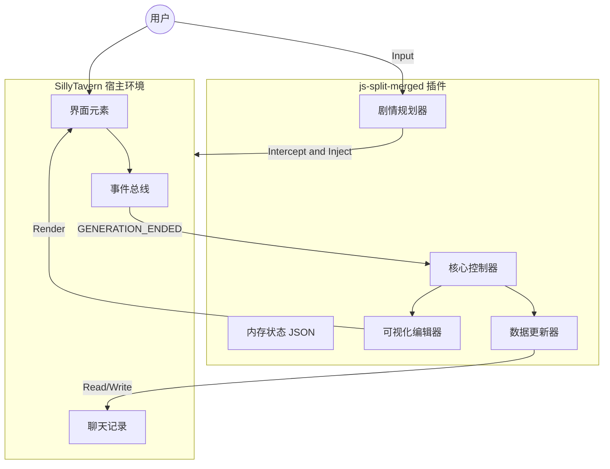
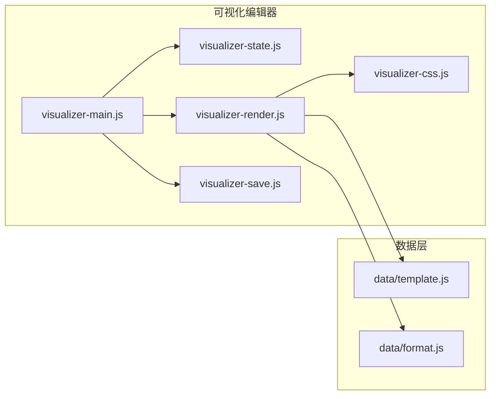
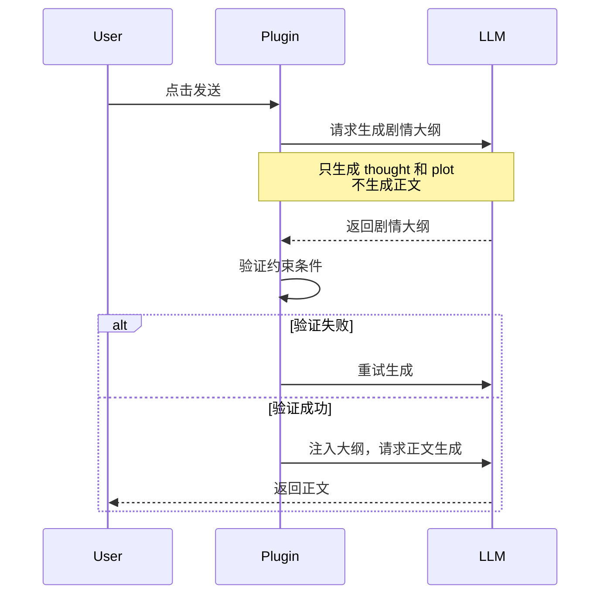
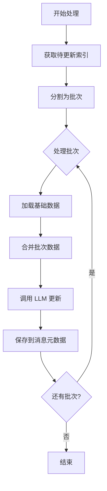
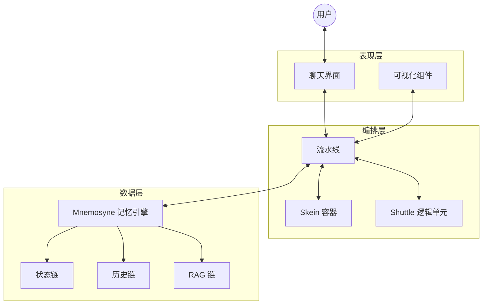
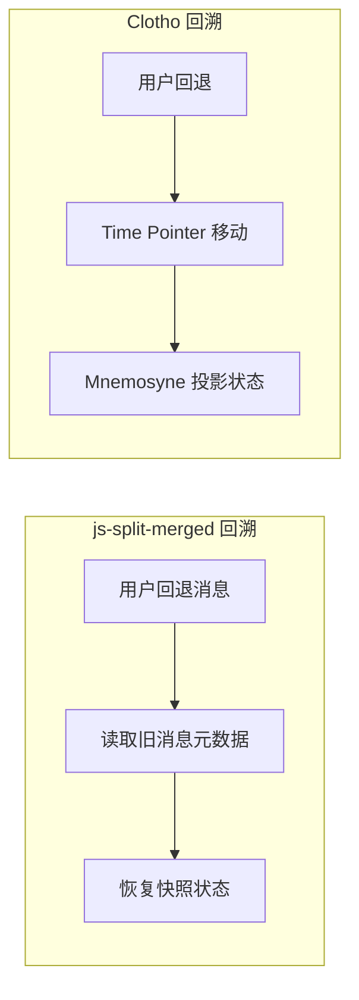

# js-split-merged 插件与 Clotho 架构比较分析

**版本**: 1.0.0
**日期**: 2025-12-28
**状态**: Draft
**作者**: Architect Mode

---

## 目录

1.  [概述与背景](#概述与背景)
2.  [js-split-merged 插件架构分析](#js-split-merged-插件架构分析)
3.  [Clotho 架构核心分析](#clotho-架构核心分析)
4.  [架构对比分析](#架构对比分析)
5.  [js-split-merged 关键优势](#js-split-merged-关键优势)
6.  [Clotho 可采纳的建议](#clotho-可采纳的建议)
7.  [总结与结论](#总结与结论)

---

## 概述与背景

### 1.1 分析目的

本文档旨在深入比较 `js-split-merged` 插件（又称 "AutoCardUpdater" 或 "神·数据库V8"）与 Clotho 系统架构，识别前者在数据管理、状态持久化、可视化编辑和自动化流程方面的关键优势，为 Clotho 的架构演进提供可采纳的设计建议。

### 1.2 系统定位对比

| 维度 | js-split-merged 插件 | Clotho 架构 |
|------|---------------------|--------------|
| **定位** | SillyTavern 的寄生式数据增强插件 | 独立的次世代 AI RPG 客户端 |
| **技术栈** | JavaScript (浏览器端) | Flutter/Dart + Dart FFI |
| **架构模式** | 寄生式架构，依赖宿主环境 | 原生架构，完全自主控制 |
| **核心目标** | 自动化数据管理、状态持久化、可视化编辑 | 高性能、确定性、沉浸感 |

### 1.3 分析范围

本比较分析聚焦于以下核心领域：
- 数据存储与持久化策略
- 状态管理与回溯机制
- 可视化编辑与 UI 架构
- 提示词构建与流程编排
- 自动化与批处理机制

---

## js-split-merged 插件架构分析

### 2.1 宏观架构：寄生与共生

js-split-merged 采用**寄生式架构 (Parasitic Architecture)**，完全运行在用户的浏览器端，依赖 SillyTavern 暴露的全局对象进行交互。



### 2.2 数据持久化与隔离机制

#### 2.2.1 消息元数据存储策略

这是 js-split-merged 最独特的设计——**基于消息元数据的"时间旅行"式存储**。

**核心特性**：
- **存储位置**：数据不保存在独立的 `.json` 文件或数据库中，而是作为 **Metadata (元数据)** 附加在 Chat History 的每条消息对象中（具体字段为 `TavernDB_ACU_IsolatedData`）
- **快照机制**：每轮对话更新后，生成一份当前世界的**全量快照 (Snapshot)** 并保存到该轮消息中
- **分支友好**：当用户回退 (Swipe/Delete) 到旧消息并重新生成时，插件会读取旧消息上的旧快照，数据状态自动"回滚"到那个时刻

**数据结构示例**：
```javascript
// 消息对象中的元数据结构
{
    "mes": "AI回复内容...",
    "is_user": false,
    "TavernDB_ACU_IsolatedData": {
        "default": {
            "independentData": {
                "sheet_status": { /* 状态表数据 */ },
                "sheet_inventory": { /* 背包表数据 */ },
                "sheet_summary": { /* 总结表数据 */ }
            }
        }
    }
}
```

#### 2.2.2 数据隔离策略

插件通过 `Isolation Key` 实现数据隔离：
- 不同的角色卡、甚至同一角色的不同独立世界线（通过 Tag 区分），其数据存储在不同的命名空间下
- 互不污染，支持多角色、多世界线并行管理

### 2.3 可视化编辑器架构

#### 2.3.1 SDUI 变体思想

编辑器采用 **SDUI (Server-Driven UI)** 的前端变体思想：
- **Schema 驱动**：UI 不是硬编码的，而是根据内存中的 JSON 数据结构动态生成
- **双向绑定**：
  - **Render**: JSON -> HTML
  - **Update**: DOM Input 事件 -> 更新内存 JSON -> 触发保存逻辑
- **独立性**：编辑器的 UI 渲染逻辑与数据处理逻辑解耦，支持不同的数据 Schema（如状态表、背包表、任务表）

#### 2.3.2 编辑器功能模块



### 2.4 剧情编排引擎

#### 2.4.1 MCTS-like 规划机制

为了解决 LLM "写着写着就崩了"的问题，插件引入了 **MCTS-like (蒙特卡洛树搜索变体)** 的规划机制。

**工作流程**：
1. **拦截 (Intercept)**: 用户点击发送时，请求被暂停
2. **思考 (Thought)**: 插件构建特殊 Prompt，要求 LLM **不生成正文**，而是生成 `<thought>` (思考) 和 `<plot>` (剧情大纲)
3. **反思 (Reflection)**: (可选) 检查生成的 Plot 是否符合约束（如字数限制、必须包含的关键词）。如果不符合，自动触发重试
4. **执行 (Execution)**: 只有当 Plot 满意后，才会将其作为 `[System Directive]` 注入到原始 Prompt 中，放行给 SillyTavern 进行正文生成



#### 2.4.2 自动化循环机制

插件支持自动化剧情推进循环：
- **快速回复内容**：预设自动输入内容
- **标签验证**：验证 AI 回复是否包含所需标签
- **重试机制**：验证失败时自动删除并重试
- **倒计时控制**：支持总时长限制和批次延迟

### 2.5 自动化更新流程

#### 2.5.1 批处理机制

插件采用智能批处理策略处理数据更新：
- **动态批次大小**：根据更新模式（标准表 vs 总结表）使用不同的批处理大小
- **增量处理**：每个批次只处理增量消息，避免重复处理
- **上下文优化**：AI 只需要阅读当前批次的增量内容，提高效率

**批处理流程**：


#### 2.5.2 自动合并总结

插件支持智能的总结合并功能：
- **增量合并**：将多条总结合并为一条
- **标记系统**：使用 `auto_merged` 标记自动合并的条目
- **顺序追踪**：维护 `autoMergedOrder` 记录合并顺序
- **基础数据累积**：合并时基于已有 auto_merged 条目进行增量合并

### 2.6 存储策略

#### 2.6.1 IndexedDB + localStorage 混合存储

插件采用混合存储策略：
- **IndexedDB**：用于存储大容量数据（导入临时数据）
- **localStorage**：用于存储配置和小量数据
- **自动迁移**：IndexedDB 缺失时自动从 localStorage 搬迁数据

**存储适配逻辑**：
```javascript
async function importTempGet_ACU(key) {
    // 优先使用 IndexedDB
    if (isIndexedDbAvailable_ACU()) {
        const v = await idbGet_ACU(key);
        if (typeof v !== 'undefined') return v;
    }

    // 回退到 localStorage 并尝试搬迁
    const legacy = storage_ACU.getItem(key);
    if (legacy !== null) {
        try {
            await idbSet_ACU(key, legacy);
            storage_ACU.removeItem(key);
        } catch (e) {
            // 搬迁失败则保留在 localStorage
        }
        return legacy;
    }
    return null;
}
```

---

## Clotho 架构核心分析

### 3.1 宏观架构：三层分离

Clotho 采用**三层物理隔离但逻辑紧密的架构**：



### 3.2 Mnemosyne 数据引擎

#### 3.2.1 多维上下文链

Mnemosyne 管理多维度的上下文链：
- **History Chain**: 线性投影的对话记录
- **State Chain**: 采用 **关键帧 (Keyframe) + 增量 (Delta)** 存储策略，支持无损回溯
- **RAG Chain**: 基于向量检索的动态知识注入

#### 3.2.2 Value with Description (VWD) 数据模型

引入 MVU 的核心特性，支持"带描述的值"：
- **结构**: `[Value, Description]`
- **示例**: `"health": [80, "当前生命值，0为死亡"]`
- **渲染**: System Prompt 中包含描述，UI 展示时仅提取值

### 3.3 Jacquard 编排层

#### 3.3.1 流水线架构

Jacquard 不包含硬编码业务逻辑，而是按顺序执行注册的 Shuttle：
- **Planner**: 分析意图，决定工具调用
- **Skein Builder**: 向 Mnemosyne 请求快照，构建结构化 Prompt 容器
- **Assembler**: 将 Skein 渲染为最终字符串
- **Invoker**: 调用 LLM API
- **Parser**: 解析 LLM 输出
- **Updater**: 提交状态变更

#### 3.3.2 Skein 容器

Skein 是流水线中的核心数据对象，作为 **异构容器**：
- 取代传统的字符串拼接
- 模块化管理 System Prompt, Lore, User Input 等内容
- 支持动态裁剪与重组

### 3.4 Filament 协议

#### 3.4.1 输入协议

Filament 结构化提示词包含以下核心组件：
- `<system_instruction>`: 系统级指令和规则
- `<character_card>`: 角色定义
- `<world_state>`: 当前世界状态
- `<lorebook_entry>`: 世界书条目
- `<conversation_history>`: 对话历史

#### 3.4.2 输出协议

LLM 的所有输出必须包裹在特定的 Filament 标签中：
- `<thought>`: 思维链（CoT）
- `<content>`: 最终回复
- `<variable_update>`: 变量更新指令（JSON 数组格式）
- `<status_bar>`: 自定义状态栏
- `<choice>`: 选择菜单
- `<ui_component>`: 嵌入式前端

### 3.5 表现层

#### 3.5.1 Hybrid SDUI 引擎

- **原生轨道**: 使用 **RFW (Remote Flutter Widgets)** 渲染官方/高性能组件
- **Web 轨道**: 使用 **WebView** 渲染复杂的 HTML/JS 第三方内容
- **路由调度**: 根据内容 ID 自动决策渲染轨道

#### 3.5.2 Stage & Control 哲学

- **Stage (舞台)**: 核心对话区，沉浸式体验
- **Control (控制台)**: 参数配置与辅助信息，按需呼出

---

## 架构对比分析

### 4.1 数据存储与持久化策略

| 维度 | js-split-merged | Clotho | 对比结论 |
|------|---------------|---------|----------|
| **存储位置** | 消息元数据 (Chat History) | 独立存储引擎 (Mnemosyne) | js-split-merged 的元数据存储天然支持分支回溯 |
| **快照机制** | 每轮消息保存全量快照 | 关键帧 + 增量存储 | js-split-merged 实现简单但冗余；Clotho 更高效但复杂 |
| **数据模型** | JSON 表格结构 | VWD (Value with Description) | Clotho 的 VWD 更适合 LLM 理解 |
| **隔离策略** | Isolation Key 命名空间 | 多维上下文链 | 两者都支持隔离，但实现方式不同 |

### 4.2 状态管理与回溯机制



| 维度 | js-split-merged | Clotho | 对比结论 |
|------|---------------|---------|----------|
| **回溯方式** | 直接读取消息元数据 | Time Pointer 投影 | js-split-merged 更直观，Clotho 更灵活 |
| **分支支持** | 天然支持（消息分支） | 天然支持（Turn-based Tree） | 两者都支持分支 |
| **状态一致性** | 强一致性（快照） | 最终一致性（投影） | js-split-merged 简单可靠 |

### 4.3 可视化编辑与 UI 架构

| 维度 | js-split-merged | Clotho | 对比结论 |
|------|---------------|---------|----------|
| **UI 架构** | SDUI 变体 (Schema 驱动) | Hybrid SDUI (Native + Web) | js-split-merged 的 Schema 驱动更灵活 |
| **双向绑定** | DOM <-> JSON | InputDraft -> Jacquard | js-split-merged 的实时编辑体验更好 |
| **动态渲染** | 基于 JSON 结构动态生成 | 基于 RFW 协议 | js-split-merged 更轻量级 |

### 4.4 提示词构建与流程编排

| 维度 | js-split-merged | Clotho | 对比结论 |
|------|---------------|---------|----------|
| **编排方式** | 拦截式 (Hook) | 流水线式 (Shuttle) | Clotho 的流水线更结构化、可扩展 |
| **提示词构建** | 动态上下文注入 | Skein 容器 + Jinja2 | Clotho 的 Skein 更模块化 |
| **规划机制** | MCTS-like (思考-大纲-正文) | Planner Shuttle | js-split-merged 的两阶段生成更实用 |

### 4.5 自动化与批处理机制

| 维度 | js-split-merged | Clotho | 对比结论 |
|------|---------------|---------|----------|
| **批处理** | 智能批处理（动态批次大小） | 未明确 | js-split-merged 的批处理更成熟 |
| **自动合并** | 支持总结智能合并 | 未明确 | js-split-merged 的自动合并是独特优势 |
| **循环机制** | 支持自动化剧情循环 | 未明确 | js-split-merged 的自动化循环更实用 |

---

## js-split-merged 关键优势

### 5.1 消息元数据存储优势

#### 5.1.1 分支友好 (Branching Friendly)

**优势描述**：
- 当用户回退 (Swipe/Delete) 到旧消息并重新生成时，插件会读取旧消息上的旧快照
- 数据状态自动"回滚"到那个时刻，完美支持 RPG 的 S/L (Save/Load) 大法

**技术实现**：
```javascript
// 切换聊天时扫描最近一次保存的有效数据快照
function loadLatestSnapshot() {
    const chat = SillyTavern_API_ACU.chat;
    for (let i = chat.length - 1; i >= 0; i--) {
        const msg = chat[i];
        if (msg.TavernDB_ACU_IsolatedData) {
            currentJsonTableData_ACU = JSON.parse(JSON.stringify(
                msg.TavernDB_ACU_IsolatedData[isolationKey].independentData
            ));
            break;
        }
    }
}
```

**Clotho 可采纳建议**：
- 虽然 Clotho 的 Mnemosyne 使用 Time Pointer 投影机制，但可以考虑在消息对象中添加轻量级的快照引用
- 这样可以在快速切换时减少投影计算开销

#### 5.1.2 时间旅行式存储

**优势描述**：
- 每轮对话更新后，生成一份当前世界的**全量快照 (Snapshot)**
- 用户可以随时回到任意历史时刻查看当时的状态

**Clotho 可采纳建议**：
- 在 Mnemosyne 的消息对象中添加 `snapshot_ref` 字段，指向该时刻的状态快照 ID
- 实现快速状态预览功能，无需完整投影

### 5.2 可视化编辑器优势

#### 5.2.1 Schema 驱动的动态渲染

**优势描述**：
- UI 不是硬编码的，而是根据内存中的 JSON 数据结构动态生成
- 支持动态添加/删除表格，无需修改代码

**技术实现**：
```javascript
// 动态生成表格 UI
function renderVisualizerDataMode_ACU($main, sheet) {
    const headers = sheet.content[0];
    const rows = sheet.content.slice(1);

    let html = '<table class="acu-data-table">';
    html += '<thead><tr>';
    headers.forEach(h => {
        html += `<th>${escapeHtml_ACU(h)}</th>`;
    });
    html += '</tr></thead><tbody>';

    rows.forEach((row, idx) => {
        html += `<tr data-row-idx="${idx}">`;
        row.forEach((cell, cellIdx) => {
            html += `<td><input type="text" value="${escapeHtml_ACU(cell)}" data-col-idx="${cellIdx}"></td>`;
        });
        html += '</tr>';
    });

    html += '</tbody></table>';
    $main.html(html);
}
```

**Clotho 可采纳建议**：
- 在 Hybrid SDUI 的 Web 轨道中实现类似的 Schema 驱动渲染
- 支持用户自定义表格结构，动态生成 UI

#### 5.2.2 实时双向绑定

**优势描述**：
- DOM Input 事件 -> 更新内存 JSON -> 触发保存逻辑
- 用户修改即时反映，无需手动保存按钮

**Clotho 可采纳建议**：
- 实现 InputDraft 的实时预览机制
- 在可视化编辑器中添加实时数据同步

### 5.3 自动化更新优势

#### 5.3.1 智能批处理

**优势描述**：
- 根据更新模式使用不同的批处理大小
- 标准表模式 vs 总结表模式
- 每个批次只处理增量消息，避免重复处理

**技术实现**：
```javascript
// 根据模式选择批处理大小
const isSummaryMode = (mode && (mode.includes('summary') || mode === 'manual_summary'));
const batchSize = specificBatchSize || (settings_ACU.updateBatchSize || 2);

// 分割为批次
const batches = [];
for (let i = 0; i < indicesToUpdate.length; i += batchSize) {
    batches.push(indicesToUpdate.slice(i, i + batchSize));
}
```

**Clotho 可采纳建议**：
- 在 Jacquard 的 Updater Shuttle 中实现批处理机制
- 支持不同类型状态的差异化批处理策略

#### 5.3.2 自动合并总结

**优势描述**：
- 将多条总结合并为一条，减少冗余
- 使用 `auto_merged` 标记自动合并的条目
- 基于已有 auto_merged 条目进行增量合并

**技术实现**：
```javascript
// 自动合并时基于已有 auto_merged 条目
const existingSummaryAutoMerged = getExistingAutoMergedRows(summaryKey, summaryTableObj, 1);
const summaryBaseData = [...existingSummaryAutoMerged, ...accumulatedSummary];

// 为新生成的条目添加标记
if (isAutoMode) {
    rowData.push('auto_merged');
}
```

**Clotho 可采纳建议**：
- 在 Mnemosyne 的 State Chain 中实现自动合并机制
- 支持总结条目的增量合并和标记

### 5.4 数据隔离优势

#### 5.4.1 命名空间隔离

**优势描述**：
- 不同的角色卡、甚至同一角色的不同独立世界线，其数据存储在不同的命名空间下
- 互不污染，支持多角色、多世界线并行管理

**技术实现**：
```javascript
// 获取当前隔离标签键名
function getCurrentIsolationKey_ACU() {
    if (settings_ACU.dataIsolationEnabled) {
        return settings_ACU.dataIsolationCode || 'default';
    }
    return 'default';
}

// 按标签存储数据
msg.TavernDB_ACU_IsolatedData = {
    [isolationKey]: {
        independentData: { /* 表格数据 */ }
    }
};
```

**Clotho 可采纳建议**：
- 在 Mnemosyne 中实现更细粒度的命名空间隔离
- 支持按角色、世界线、场景等多维度隔离

### 5.5 存储策略优势

#### 5.5.1 混合存储与自动迁移

**优势描述**：
- IndexedDB 用于存储大容量数据
- localStorage 用于存储配置和小量数据
- 自动从 localStorage 搬迁到 IndexedDB

**技术实现**：
```javascript
// 自动迁移逻辑
async function importTempGet_ACU(key) {
    try {
        if (isIndexedDbAvailable_ACU()) {
            const v = await idbGet_ACU(key);
            if (typeof v !== 'undefined') return v;
        }
    } catch (e) {
        logWarn_ACU('[外部导入] IndexedDB get 失败，将回退到 localStorage:', e);
    }

    const legacy = storage_ACU.getItem(key);
    if (legacy !== null) {
        try {
            if (isIndexedDbAvailable_ACU()) {
                await idbSet_ACU(key, legacy);
                storage_ACU.removeItem(key);
            }
        } catch (e) {
            logWarn_ACU('[外部导入] 从 localStorage 迁移到 IndexedDB 失败:', e);
        }
        return legacy;
    }
    return null;
}
```

**Clotho 可采纳建议**：
- 在基础设施层实现类似的混合存储策略
- 支持不同数据类型的差异化存储

---

## Clotho 可采纳的建议

### 6.1 数据层改进建议

#### 6.1.1 消息元数据快照引用

**建议**：
在 Mnemosyne 的消息对象中添加 `snapshot_ref` 字段，实现快速状态预览。

**实现方式**：
```dart
class ChatMessage {
  final String id;
  final String content;
  final DateTime timestamp;
  final String? snapshotRef; // 新增：快照引用
}
```

**优势**：
- 快速切换时减少投影计算开销
- 支持快速状态预览功能

#### 6.1.2 增量合并机制

**建议**：
在 State Chain 中实现自动合并机制，支持总结条目的增量合并。

**实现方式**：
```dart
class StateChain {
  List<StateDelta> deltas;
  List<MergedSummary> mergedSummaries;

  void mergeSummaries(int startIndex, int endIndex) {
    // 合并指定范围的总结
    var newSummary = _generateMergedSummary(startIndex, endIndex);
    mergedSummaries.add(newSummary);
  }
}
```

**优势**：
- 减少状态链的冗余
- 提高状态检索效率

### 6.2 编排层改进建议

#### 6.2.1 批处理 Shuttle

**建议**：
在 Jacquard 中实现批处理 Shuttle，支持不同类型状态的差异化批处理。

**实现方式**：
```dart
class BatchProcessorShuttle extends Shuttle {
  final int batchSize;
  final BatchMode mode;

  @override
  Future<void> execute(Skein skein) async {
    var indices = _getIndicesToUpdate();
    var batches = _splitIntoBatches(indices, batchSize);

    for (var batch in batches) {
      await _processBatch(batch, mode);
    }
  }
}
```

**优势**：
- 提高状态更新效率
- 支持大规模数据处理

#### 6.2.2 两阶段生成 Shuttle

**建议**：
实现类似 js-split-merged 的两阶段生成机制（思考-大纲-正文）。

**实现方式**：
```dart
class TwoStageGenerationShuttle extends Shuttle {
  @override
  Future<void> execute(Skein skein) async {
    // 阶段1：生成思考和大纲
    var outline = await _generateOutline(skein);

    // 验证约束
    if (!_validateConstraints(outline)) {
      return _retry();
    }

    // 阶段2：生成正文
    var content = await _generateContent(skein, outline);
    skein.setContent(content);
  }
}
```

**优势**：
- 提高生成质量
- 支持约束验证

### 6.3 表现层改进建议

#### 6.3.1 Schema 驱动的可视化编辑器

**建议**：
在 Hybrid SDUI 的 Web 轨道中实现 Schema 驱动的可视化编辑器。

**实现方式**：
```dart
class SchemaDrivenVisualizer extends StatefulWidget {
  final Map<String, dynamic> schema;

  @override
  Widget build(BuildContext context) {
    return WebView(
      onWebViewCreated: (controller) {
        _loadSchemaDrivenUI(controller, schema);
      },
    );
  }

  void _loadSchemaDrivenUI(WebViewController controller, Map<String, dynamic> schema) {
    var html = _generateSchemaHTML(schema);
    controller.loadHtml(html);
  }
}
```

**优势**：
- 支持用户自定义表格结构
- 动态生成 UI，无需修改代码

#### 6.3.2 实时双向绑定

**建议**：
实现 InputDraft 的实时预览机制和可视化编辑器的实时数据同步。

**实现方式**：
```dart
class InputDraftController extends ChangeNotifier {
  Map<String, dynamic> _draftData;

  void updateField(String path, dynamic value) {
    _draftData[path] = value;
    notifyListeners();
  }

  Stream<Map<String, dynamic>> get dataStream => _dataStreamController.stream;
}
```

**优势**：
- 用户修改即时反映
- 提升用户体验

### 6.4 基础设施层改进建议

#### 6.4.1 混合存储策略

**建议**：
在基础设施层实现 IndexedDB + localStorage 的混合存储策略。

**实现方式**：
```dart
class HybridStorage {
  final IndexedDBStorage _indexedDB;
  final LocalStorage _localStorage;

  Future<T?> get<T>(String key) async {
    try {
      var value = await _indexedDB.get<T>(key);
      if (value != null) return value;
    } catch (e) {
      logWarning('IndexedDB get failed, fallback to localStorage: $e');
    }

    var legacy = await _localStorage.get<T>(key);
    if (legacy != null) {
      try {
        await _indexedDB.set(key, legacy);
        await _localStorage.remove(key);
      } catch (e) {
        logWarning('Migration failed: $e');
      }
      return legacy;
    }
    return null;
  }
}
```

**优势**：
- 支持大容量数据存储
- 自动迁移旧数据

---

## 总结与结论

### 7.1 核心发现

通过深入比较分析，我们识别出 js-split-merged 插件的以下核心优势：

| 优势领域 | js-split-merged 优势 | Clotho 可采纳性 |
|---------|-------------------|----------------|
| **数据持久化** | 消息元数据存储、分支友好 | 高 |
| **状态管理** | 时间旅行式快照 | 中 |
| **可视化编辑** | Schema 驱动、实时双向绑定 | 高 |
| **自动化流程** | 智能批处理、自动合并总结 | 高 |
| **数据隔离** | 命名空间隔离 | 中 |
| **存储策略** | 混合存储、自动迁移 | 中 |

### 7.2 建议优先级

基于可采纳性和对 Clotho 架构的价值，建议按以下优先级实施：

**高优先级**：
1. **消息元数据快照引用** - 提升状态切换效率
2. **Schema 驱动的可视化编辑器** - 提升用户体验
3. **智能批处理机制** - 提升性能

**中优先级**：
4. **增量合并机制** - 减少状态冗余
5. **实时双向绑定** - 提升交互体验
6. **两阶段生成 Shuttle** - 提升生成质量

**低优先级**：
7. **混合存储策略** - 优化存储性能
8. **命名空间隔离** - 增强数据管理

### 7.3 架构演进方向

Clotho 的架构设计在整体上比 js-split-merged 更先进、更结构化。通过采纳 js-split-merged 的关键优势，Clotho 可以在以下方面进一步提升：

1. **用户体验**：通过 Schema 驱动的可视化编辑器和实时双向绑定
2. **性能优化**：通过消息元数据快照引用和智能批处理
3. **功能增强**：通过增量合并和两阶段生成

这些改进将使 Clotho 在保持其先进架构的同时，获得 js-split-merged 在实际应用中验证过的实用功能。

---

**文档结束**
