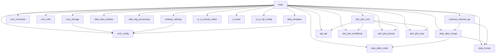

# 1.js 文件拆分计划

## 概述

将 `参考文件/数据库/1.js`（约 4000 行）拆分为按功能分组的模块化结构。

## 目录结构

```
参考文件/数据库/拆分/
├── core/              # 核心基础设施
│   ├── config.js
│   ├── storage.js
│   ├── constants.js
│   └── utils.js
├── data/              # 数据处理
│   ├── template.js
│   ├── table-order.js
│   ├── data-sanitize.js
│   ├── tag-processing.js
│   ├── data-merge.js
│   └── format.js
├── settings/           # 设置和配置
│   └── settings.js
├── ui/                # UI 相关
│   ├── ui-prompt-editor.js
│   ├── toast.js
│   └── ui-api-config.js
├── plot/              # 剧情推进
│   ├── plot-core.js
│   ├── plot-worldbook.js
│   ├── plot-prompt.js
│   └── plot-loop.js
├── api/               # API 相关
│   └── api.js
├── external/           # 外部接口
│   └── external-api.js
└── main.js            # 主入口
```

## 模块依赖关系图



## 详细任务清单

### core/ 目录 - 核心基础设施

#### core/config.js
- [ ] 脚本ID前缀 (SCRIPT_ID_PREFIX_ACU)
- [ ] 存储键常量 (STORAGE_KEY_*)
  - STORAGE_KEY_CUSTOM_TEMPLATE_ACU
  - STORAGE_KEY_ALL_SETTINGS_ACU
  - STORAGE_KEY_IMPORTED_ENTRIES_ACU
  - STORAGE_KEY_IMPORTED_STATUS_ACU
  - STORAGE_KEY_IMPORTED_STATUS_STANDARD_ACU
  - STORAGE_KEY_IMPORTED_STATUS_SUMMARY_ACU
  - STORAGE_KEY_IMPORTED_STATUS_FULL_ACU
  - STORAGE_KEY_PLOT_SETTINGS_ACU
- [ ] 默认模板 (DEFAULT_TABLE_TEMPLATE_ACU)
- [ ] 默认角色卡提示词 (DEFAULT_CHAR_CARD_PROMPT_ACU)
- [ ] 默认剧情推进设置 (DEFAULT_PLOT_SETTINGS_ACU)
- [ ] 默认合并总结提示词 (DEFAULT_MERGE_SUMMARY_PROMPT_ACU)
- [ ] 默认自动更新阈值 (DEFAULT_AUTO_UPDATE_THRESHOLD_ACU)
- [ ] 默认自动更新频率 (DEFAULT_AUTO_UPDATE_FREQUENCY_ACU)
- [ ] 默认自动更新Token阈值 (DEFAULT_AUTO_UPDATE_TOKEN_THRESHOLD_ACU)
- [ ] 自动更新楼层增加延迟 (AUTO_UPDATE_FLOOR_INCREASE_DELAY_ACU)
- [ ] 调试模式标志 (DEBUG_MODE_ACU)
- [ ] 表格顺序字段 (TABLE_ORDER_FIELD_ACU)
- [ ] 防抖延迟 (NEW_MESSAGE_DEBOUNCE_DELAY_ACU)
- [ ] 默认世界书配置 (defaultWorldbookConfig_ACU)
- [ ] 最大数据隔离历史 (MAX_DATA_ISOLATION_HISTORY)
- [ ] 新消息防抖延迟 (NEW_MESSAGE_DEBOUNCE_DELAY_ACU)
- [ ] 弹窗ID (POPUP_ID_ACU)
- [ ] 菜单项ID (MENU_ITEM_ID_ACU)
- [ ] 菜单项容器ID (MENU_ITEM_CONTAINER_ID_ACU)
- [ ] Toast标题 (ACU_TOAST_TITLE_ACU)
- [ ] IndexedDB数据库名 (IMPORT_TEMP_DB_NAME_ACU)
- [ ] IndexedDB存储名 (IMPORT_TEMP_STORE_NAME_ACU)

#### core/storage.js
- [ ] localStorage 初始化和测试 (storage_ACU)
- [ ] IndexedDB 可用性检查 (isIndexedDbAvailable_ACU)
- [ ] 打开临时数据库 (openImportTempDb_ACU)
- [ ] IndexedDB请求转Promise (idbRequestToPromise_ACU)
- [ ] IndexedDB获取 (idbGet_ACU)
- [ ] IndexedDB设置 (idbSet_ACU)
- [ ] IndexedDB删除 (idbDel_ACU)
- [ ] 临时存储获取 (importTempGet_ACU)
- [ ] 临时存储设置 (importTempSet_ACU)
- [ ] 临时存储删除 (importTempRemove_ACU)

#### core/constants.js
- [ ] API 对象占位符 (SillyTavern_API_ACU, TavernHelper_API_ACU, jQuery_API_ACU, toastr_API_ACU)
- [ ] 核心API就绪标志 (coreApisAreReady_ACU)
- [ ] 聊天消息数组 (allChatMessages_ACU)
- [ ] 上次AI消息总数 (lastTotalAiMessages_ACU)
- [ ] 当前聊天文件标识 (currentChatFileIdentifier_ACU)
- [ ] 当前JSON表格数据 (currentJsonTableData_ACU)
- [ ] 弹窗实例 ($popupInstance_ACU)
- [ ] 独立表格状态 (independentTableStates_ACU)
- [ ] UI jQuery 对象占位符 ($apiConfigSectionToggle_ACU, $customApiUrlInput_ACU 等)
- [ ] 自动更新标志 (isAutoUpdatingCard_ACU)
- [ ] 用户停止标志 (wasStoppedByUser_ACU)
- [ ] 防抖定时器 (newMessageDebounceTimer_ACU)
- [ ] 当前中止控制器 (currentAbortController_ACU)
- [ ] 手动额外提示 (manualExtraHint_ACU)
- [ ] 表格更新回调 (tableUpdateCallbacks_ACU)
- [ ] 表格填充开始回调 (tableFillStartCallbacks_ACU)
- [ ] 待放置基础状态标志 (pendingBaseStatePlacement_ACU)
- [ ] 抑制世界书注入标志 (suppressWorldbookInjectionInGreeting_ACU)
- [ ] 剧情推进去重锁 (lastPlotInterception_ACU)
- [ ] 剧情提示词覆盖激活 (plotPromptOverrideActive_ACU)
- [ ] 剧情提示词覆盖备份 (plotPromptOverrideBackup_ACU)
- [ ] 剧情处理标志 (isProcessing_Plot_ACU)
- [ ] 临时存储的plot (tempPlotToSave_ACU)
- [ ] 表格更新回调 (tableUpdateCallbacks_ACU)
- [ ] 表格填充开始回调 (tableFillStartCallbacks_ACU)

#### core/utils.js
- [ ] 日志调试 (logDebug_ACU)
- [ ] 日志错误 (logError_ACU)
- [ ] 日志警告 (logWarn_ACU)
- [ ] HTML转义 (escapeHtml_ACU)
- [ ] 文件名清理 (cleanChatName_ACU)
- [ ] 深度合并 (deepMerge_ACU)
- [ ] 颜色变亮变暗 (lightenDarkenColor_ACU)
- [ ] 获取对比度YIQ (getContrastYIQ_ACU)
- [ ] 正则转义 (escapeRegExp_ACU)

### data/ 目录 - 数据处理

#### data/template.js
- [ ] 模板解析 (parseTableTemplateJson_ACU)
- [ ] 去除示例行 (stripSeedRowsFromTemplate_ACU)
- [ ] 从存储加载模板 (loadTemplateFromStorage_ACU)
- [ ] 模板基础状态构建 (buildTemplateBaseStateDataForLocalStorage_ACU)

#### data/table-order.js
- [ ] 应用表格编号 (applySheetOrderNumbers_ACU)
- [ ] 确保表格编号 (ensureSheetOrderNumbers_ACU)
- [ ] 获取模板表格键 (getTemplateSheetKeys_ACU)
- [ ] 获取排序后的表格键 (getSortedSheetKeys_ACU)
- [ ] 按表格键重排数据 (reorderDataBySheetKeys_ACU)

#### data/data-sanitize.js
- [ ] 保留键集合 (SHEET_KEEP_KEYS_ACU)
- [ ] 单表清洗 (sanitizeSheetForStorage_ACU)
- [ ] 表格对象清洗 (sanitizeChatSheetsObject_ACU)

#### data/tag-processing.js
- [ ] 标签列表解析 (parseTagList_ACU)
- [ ] 提取上下文标签 (extractContextTags_ACU)
- [ ] 从行提取标签 (extractTagsFromLine_ACU)
- [ ] 提取最后标签内容 (extractLastTagContent)
- [ ] 移除标签块 (removeTaggedBlocks_ACU)
- [ ] 应用上下文标签过滤 (applyContextTagFilters_ACU)
- [ ] 判断是否总结表或大纲表 (isSummaryOrOutlineTable_ACU)
- [ ] 判断是否标准表 (isStandardTable_ACU)

#### data/data-merge.js
- [ ] 合并所有独立表格 (mergeAllIndependentTables_ACU)
- [ ] 刷新合并数据并通知 (refreshMergedDataAndNotify_ACU)
- [ ] 判断新对话开场白阶段 (isNewChatGreetingStage_ACU)
- [ ] 判断单AI无用户对话 (isSingleAiNoUserChat_ACU)
- [ ] 抑制世界书注入 (shouldSuppressWorldbookInjection_ACU)
- [ ] 解除世界书抑制 (maybeLiftWorldbookSuppression_ACU)
- [ ] 从模板播种开场白数据 (seedGreetingLocalDataFromTemplate_ACU)

#### data/format.js
- [ ] JSON转可读文本 (formatJsonToReadable_ACU)
- [ ] 可读文本转JSON (parseReadableToJson_ACU)
- [ ] 表格数据格式化给LLM (formatTableDataForLLM_ACU)
- [ ] 格式化大纲表给剧情 (formatOutlineTableForPlot_ACU)

### settings/ 目录 - 设置和配置

#### settings/settings.js
- [ ] 保存设置 (saveSettings_ACU)
- [ ] 加载设置 (loadSettings_ACU)
- [ ] 获取当前角色设置 (getCurrentCharSettings_ACU)
- [ ] 获取当前世界书配置 (getCurrentWorldbookConfig_ACU)
- [ ] 数据隔离历史规范化 (normalizeDataIsolationHistory_ACU)
- [ ] 获取数据隔离历史 (getDataIsolationHistory_ACU)
- [ ] 添加数据隔离历史 (addDataIsolationHistory_ACU)
- [ ] 移除数据隔离历史 (removeDataIsolationHistory_ACU)

### ui/ 目录 - UI 相关

#### ui/ui-prompt-editor.js
- [ ] 渲染提示词段落 (renderPromptSegments_ACU)
- [ ] 从UI获取提示词 (getCharCardPromptFromUI_ACU)

#### ui/toast.js
- [ ] 注入Toast样式 (ensureAcuToastStylesInjected_ACU)
- [ ] 规范化Toast参数 (_acuNormalizeToastArgs_ACU)
- [ ] 显示Toast (showToastr_ACU)
- [ ] Toast去重映射 (_acuToastDedup_ACU)

#### ui/ui-api-config.js
- [ ] 更新API模式视图 (updateApiModeView_ACU)
- [ ] 更新自定义API输入状态 (updateCustomApiInputsState_ACU)
- [ ] 加载酒馆API预设 (loadTavernApiProfiles_ACU)
- [ ] 保存API配置 (saveApiConfig_ACU)
- [ ] 清除API配置 (clearApiConfig_ACU)
- [ ] 更新API状态显示 (updateApiStatusDisplay_ACU)

### plot/ 目录 - 剧情推进

#### plot/plot-core.js
- [ ] 运行优化逻辑 (runOptimizationLogic_ACU)
- [ ] 获取剧情历史 (getPlotFromHistory_ACU)
- [ ] 保存剧情到最新消息 (savePlotToLatestMessage_ACU)
- [ ] 开始自动循环 (startAutoLoop_ACU)
- [ ] 停止自动循环 (stopAutoLoop_ACU)
- [ ] 更新循环UI状态 (updateLoopUIStatus_ACU)
- [ ] 更新循环倒计时 (updateLoopTimerDisplay_ACU)
- [ ] 触发循环生成 (triggerLoopGeneration_ACU)
- [ ] 验证循环标签 (validateLoopTags_ACU)
- [ ] 触发直接重生成 (triggerDirectRegenerateForLoop_ACU)
- [ ] 进入循环重试流程 (enterLoopRetryFlow_ACU)
- [ ] 循环生成结束处理 (onLoopGenerationEnded_ACU)

#### plot/plot-worldbook.js
- [ ] 获取剧情世界书内容 (getWorldbookContentForPlot_ACU)
- [ ] 判断条目是否被屏蔽 (isEntryBlocked_ACU)

#### plot/plot-prompt.js
- [ ] 确保提示词数组 (ensurePlotPromptsArray_ACU)
- [ ] 获取提示词内容 (getPlotPromptContentById_ACU)
- [ ] 设置提示词内容 (setPlotPromptContentById_ACU)
- [ ] 构建修改后的提示词 (buildPlotModifiedCharCardPrompt_ACU)
- [ ] 应用提示词覆盖 (applyPlotPromptOverride_ACU)
- [ ] 恢复提示词覆盖 (restorePlotPromptOverride_ACU)
- [ ] 加载预设并清理数据 (loadPresetAndCleanCharacterData_ACU)
- [ ] 构建默认剧情世界书配置 (buildDefaultPlotWorldbookConfig_ACU)

#### plot/plot-loop.js
- [ ] 规划去重锁标记 (lastPlotInterception_ACU)
- [ ] 标记剧情拦截 (markPlotIntercept_ACU)
- [ ] 跳过剧情拦截 (shouldSkipPlotIntercept_ACU)

### api/ 目录 - API 相关

#### api/api.js
- [ ] 调用API (callApi_ACU)
- [ ] 获取有效更新阈值 (getEffectiveAutoUpdateThreshold_ACU)

### external/ 目录 - 外部接口

#### external/external-api.js
- [ ] AutoCardUpdaterAPI对象定义
- [ ] 打开可视化编辑器 (openVisualizer)
- [ ] 导出表格为JSON (exportTableAsJson)
- [ ] 导入表格为JSON (importTableAsJson)
- [ ] 触发更新 (triggerUpdate)
- [ ] 打开设置 (openSettings)
- [ ] 手动更新 (manualUpdate)
- [ ] 同步世界书条目 (syncWorldbookEntries)
- [ ] 删除注入条目 (deleteInjectedEntries)
- [ ] 设置大纲条目启用 (setOutlineEntryEnabled)
- [ ] 设置0TK占用模式 (setZeroTkOccupyMode)
- [ ] 模板管理API (importTemplate, exportTemplate, resetTemplate)
- [ ] 数据管理API (resetAllDefaults, exportJsonData, importCombinedSettings, exportCombinedSettings, overrideWithTemplate)
- [ ] 导入TXT链路API (importTxtAndSplit, injectImportedSelected, injectImportedStandard, injectImportedSummary, injectImportedFull)
- [ ] 导入管理API (deleteImportedEntries, clearImportedEntries, clearImportCache)
- [ ] 合并总结 (mergeSummaryNow)
- [ ] 回调注册 (registerTableUpdateCallback, registerTableFillStartCallback)
- [ ] 回调注销 (unregisterTableUpdateCallback)
- [ ] 内部通知 (_notifyTableUpdate, _notifyTableFillStart)

### 根目录 - 主入口

#### main.js
- [ ] Userscript元数据头部
- [ ] 初始化日志
- [ ] 顶层窗口获取
- [ ] 存储初始化
- [ ] 核心变量声明
- [ ] 导出所有模块
