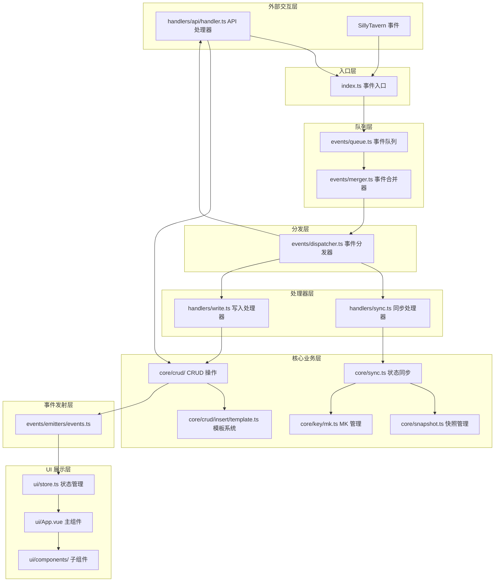
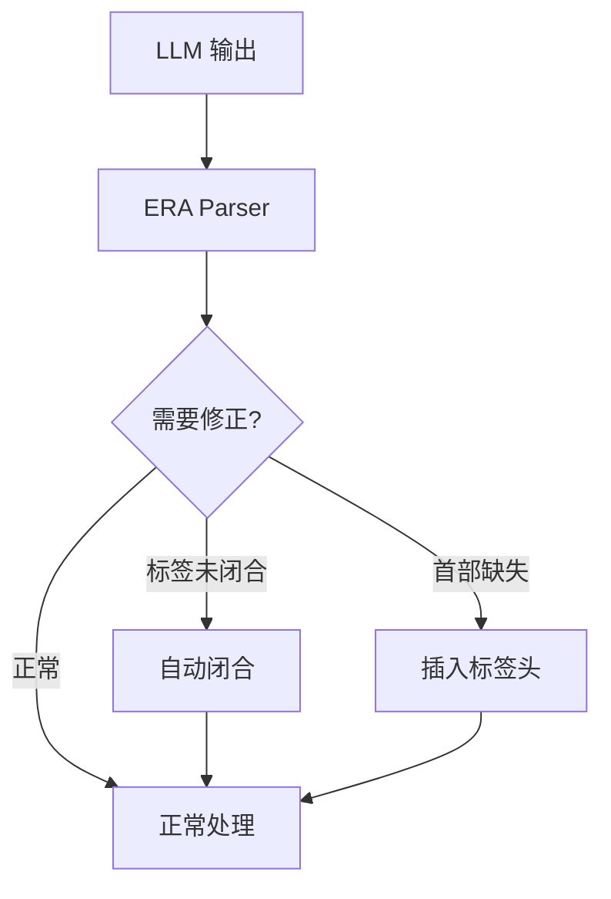

# ERA 插件综合技术文档

**版本**: 1.0.0
**日期**: 2025-12-28
**状态**: Final
**作者**: Architect Mode

---

## 文档概述

本文档是 ERA 变量框架的综合技术分析报告，整合了四份深度分析文档的核心内容，按逻辑关联性重新归类为五个主要板块：框架总体架构、核心功能实现路径、事件驱动架构原理、模板继承机制以及竞品对比分析。

**整合的源文档**：
1. `era-framework-architecture-analysis.md` - ERA 变量框架技术架构分析
2. `era-clotho-comparative-analysis.md` - ERA 与 Clotho 架构对比分析
3. `event-driven-architecture-deep-dive.md` - 事件驱动架构深度分析
4. `template-inheritance-deep-dive.md` - 模板继承机制深度分析

---

## 目录

- [一、框架总体架构](#一框架总体架构)
  - [1.1 架构概览](#11-架构概览)
  - [1.2 核心设计原则](#12-核心设计原则)
  - [1.3 数据存储架构](#13-数据存储架构)
  - [1.4 核心设计理念](#14-核心设计理念)

- [二、核心功能实现路径](#二核心功能实现路径)
  - [2.1 消息密钥（MK）管理](#21-消息密钥mk管理)
  - [2.2 状态同步机制](#22-状态同步机制)
  - [2.3 CRUD 操作实现](#23-crud-操作实现)
  - [2.4 宏系统详解](#24-宏系统详解)
  - [2.5 初始化机制](#25-初始化机制)

- [三、事件驱动架构原理](#三事件驱动架构原理)
  - [3.1 事件系统架构](#31-事件系统架构)
  - [3.2 事件队列机制](#32-事件队列机制)
  - [3.3 事件合并机制](#33-事件合并机制)
  - [3.4 事件分发机制](#34-事件分发机制)
  - [3.5 事件负载](#35-事件负载)
  - [3.6 防循环机制](#36-防循环机制)

- [四、模板继承机制](#四模板继承机制)
  - [4.1 模板定义](#41-模板定义)
  - [4.2 模板继承规则](#42-模板继承规则)
  - [4.3 模板应用](#43-模板应用)
  - [4.4 约束继承](#44-约束继承)
  - [4.5 模板与 Insert 操作](#45-模板与-insert-操作)

- [五、竞品对比分析](#五竞品对比分析)
  - [5.1 核心设计理念对比](#51-核心设计理念对比)
  - [5.2 变量操作机制对比](#52-变量操作机制对比)
  - [5.3 状态管理对比](#53-状态管理对比)
  - [5.4 UI 交互与事件系统对比](#54-ui-交互与事件系统对比)
  - [5.5 可借鉴的设计模式](#55-可借鉴的设计模式)

- [六、技术总结](#六技术总结)
  - [6.1 核心设计模式](#61-核心设计模式)
  - [6.2 已解决的技术挑战](#62-已解决的技术挑战)
  - [6.3 架构优势](#63-架构优势)

---

## 一、框架总体架构

### 1.1 架构概览

ERA 变量框架采用分层的事件驱动架构，整体结构如下：



#### 架构分层说明

**外部交互层**
- API 事件调用：外部脚本通过 `eventEmit` 触发变量操作
- SillyTavern 事件：酒馆助手的原生事件（如消息接收、删除等）

**入口层**
- `index.ts`：框架的统一入口，负责注册所有事件监听器并将事件推入队列

**队列层**
- `events/queue.ts`：管理事件队列，实现防抖与批处理
- `events/merger.ts`：智能合并事件，支持事件组合和对冲检测

**分发层**
- `events/dispatcher.ts`：将事件路由到对应的处理器，执行前置保障

**处理器层**
- `handlers/sync.ts`：处理同步相关事件
- `handlers/write.ts`：处理写入相关事件
- `handlers/api/handler.ts`：处理 API 调用事件

**核心业务层**
- `core/sync.ts`：实现状态同步逻辑（逆序回滚、顺序重算）
- `core/snapshot.ts`：管理历史快照
- `core/key/mk.ts`：管理消息密钥系统
- `core/crud/`：实现 Insert、Update、Delete 操作
- `core/crud/insert/template.ts`：实现模板继承机制

**事件发射层**
- `events/emitters/events.ts`：发射 `writeDone`、`queryResult` 等事件

**UI 展示层**
- `ui/store.ts`：UI 状态管理
- `ui/App.vue`：主应用组件
- `ui/components/`：各种 UI 子组件

### 1.2 核心设计原则

#### 单一职责原则
每个模块只负责一个明确的功能领域：
- `index.ts` 只负责事件监听和入队
- `queue.ts` 只负责队列管理和防抖
- `merger.ts` 只负责事件合并
- `dispatcher.ts` 只负责事件路由
- 各处理器只负责特定类型的处理

#### 依赖倒置原则
高层模块不依赖低层模块的具体实现：
- 事件分发器通过抽象接口调用处理器
- 处理器通过抽象接口调用核心业务逻辑
- 核心业务逻辑通过抽象接口操作数据

#### 开闭原则
对扩展开放，对修改封闭：
- 新增事件类型只需在 `merger.ts` 中添加定义
- 新增处理器只需实现统一的接口
- 新增 CRUD 操作只需扩展核心模块

#### 接口隔离原则
通过事件接口实现模块间解耦：
- 所有外部交互通过 `eventEmit`/`eventOn` 接口
- 模块间不直接依赖，通过事件通信

#### 迪米特法则
高层模块不依赖低层模块，只依赖抽象：
- UI 层通过事件订阅获取状态更新
- 处理器层通过事件接口调用核心逻辑
- 核心层通过抽象接口操作数据

### 1.3 数据存储架构

#### 数据结构概览

ERA 框架的数据存储在 SillyTavern 的 `chat` 变量下，分为两个主要部分：

```json
{
  "ERAMetaData": {
    "EditLogs": {
      "era_mk_1759246942209_jipmrj": [
        { "op": "insert", "path": "player", "value_new": { ... } },
        { "op": "update", "path": "player.hp", "value_old": 100, "value_new": 90 }
      ],
      "SelectedMks": ["era_mk_greeting", "era_mk_abc123", null, "era_mk_xyz789"]
    }
  },
  "stat_data": {
    "player": {
      "name": "勇者",
      "hp": 100,
      "max_hp": 100,
      "stats": { "strength": 10, "agility": 8 }
    },
    "world_state": {
      "location": "起始的村庄",
      "npcs": { "npc_001": { "name": "村民A" } }
    }
  }
}
```

#### ERAMetaData（元数据）

元数据包含框架运行所需的核心信息：

**EditLogs**
- 以 MK 为键
- 值为该 MK 引发的变量变更记录数组
- 每条记录包含：操作类型、路径、旧值、新值

**SelectedMks**
- 已选择消息密钥链
- 稀疏数组，索引约等于消息 ID
- 用于检测历史变更和分歧点

#### stat_data（状态数据）

状态数据包含所有用户和 AI 管理的游戏/故事变量：

**用户变量**
- 玩家属性（name、hp、max_hp 等）
- 背包物品
- 游戏进度

**世界状态**
- NPC 状态
- 场景信息
- 时间系统

**元字段**
- 以 `$` 开头的特殊字段
- `$meta`：元数据约束（updatable、necessary 等）
- `$template`：模板定义

#### 关键常量定义

数据存储路径定义在 `utils/constants.ts` 中：

| 常量 | 值 | 说明 |
|-------|-----|------|
| `META_DATA_PATH` | `'ERAMetaData'` | 元数据根路径 |
| `STAT_DATA_PATH` | `'stat_data'` | 状态数据根路径 |
| `LOGS_PATH` | `'EditLogs'` | 编辑日志路径 |
| `SEL_PATH` | `'SelectedMks'` | 已选择消息密钥链路径 |

### 1.4 核心设计理念

#### 语义化操作
使用明确的标签表达操作意图：
- `<VariableInsert>`：非破坏性插入
- `<VariableEdit>`：破坏性更新
- `<VariableDelete>`：删除操作
- `<VariableThink>`：AI 思考过程

#### 模板驱动
通过 `$template` 定义默认结构：
- 支持继承和覆盖
- 减少重复定义
- 确保数据一致性

#### 保护机制
使用 `$meta` 字段实现细粒度的访问控制：
- `$meta.updatable`：控制是否可更新
- `$meta.necessary`：控制删除保护
- `$meta.unInsertAble`：控制插入保护

#### 事件驱动
通过 `eventEmit`/`eventOn` 实现解耦的组件通信：
- 所有外部交互通过事件系统进行
- 实现完全的模块解耦
- 支持灵活的事件监听和响应

---

## 二、核心功能实现路径

### 2.1 消息密钥（MK）管理

#### 核心概念

MK（Message Key）是 ERA 框架的核心创新，用于解决 SillyTavern 原生消息变量系统的根本缺陷。

**问题背景**
- SillyTavern 的消息变量在删除、滑动等操作时会发生错位
- 后一条 swipe 的内容"顶"到被删除位置，但变量保留了旧位置的值
- 被删除 swipe 的变量仍然残留在数据中
- 新 swipe 可能继承残留的孤儿变量

**解决方案**
- 将 MK 直接注入到消息内容中，作为不可变的锚点
- MK 与消息内容绑定，不依赖 SillyTavern 的消息变量
- 每个消息有独立的 MK，避免孤儿变量继承

#### MK 格式

```html
<era_data>{"era-message-key"="era_mk_1759246942209_jipmrj","era-message-type"="assistant"}</era_data>
```

**格式特点**
- 使用自定义 XML 标签包裹
- 避免被注释清理脚本误删
- 使用非标准 JSON 格式（`=` 分隔符）以避免与 AI 生成的内容冲突
- 包含消息类型信息（user/assistant）

#### 核心函数实现

**readMessageKey(msg)**
- 从消息内容中解析 MK
- 优先从当前激活的内容中读取
- 确保与新消息的独立性
- 返回 MK 或 null

**ensureMessageKey(msg)**
- 检查消息是否已有 MK
- 不存在则生成新的 MK（格式：`era_mk_时间戳_随机字符串`）
- 将 MK 注入到消息内容末尾
- 返回 MK 和是否新建的标志

**updateLatestSelectedMk(mk)**
- 更新 `SelectedMks` 数组中最新消息的 MK
- 确保框架状态与实际消息同步
- 用于消息发送后的状态同步

#### MK 系统的优势

1. **完全解耦**：变量状态与 SillyTavern 消息变量完全解耦
2. **不可变性**：MK 一旦生成永不改变，确保锚点稳定
3. **独立性**：每个消息有独立的 MK，避免孤儿变量继承
4. **可追溯**：通过 MK 可以精确定位到具体消息

### 2.2 状态同步机制

#### 核心问题

SillyTavern 在删除 swipe 时存在以下奇特行为：

1. **内容与变量错位**：后一条 swipe 的内容"顶"到被删除位置，但变量保留了旧位置的值
2. **孤儿变量残留**：被删除 swipe 的变量仍然残留在数据中
3. **孤儿变量继承**：新 swipe 可能继承残留的孤儿变量

#### 解决方案：逆序回滚，顺序重算

`core/sync.ts` 中的 `resyncStateOnHistoryChange()` 函数实现了完整的同步逻辑。

#### 分歧点检测

1. 获取当前实际消息列表
2. 与历史 `SelectedMks` 进行比对
3. 找到第一个不一致的位置（分歧点）
4. 判断是否为"无害删除"（仅删除无变量变更的消息）

**无害删除判断**
- 如果仅删除了没有变量变更的消息
- 只需更新 `SelectedMks` 数组
- 无需执行完整的重算

#### 逆序回滚

从最新状态开始，向前回滚到分歧点之前的状态：

1. 确定回滚目标：分歧点前一个消息的 MK
2. 调用 `rollbackStatToMK()` 逆序撤销所有不一致的变量修改
3. 回滚结果作为重算的起点状态

**回滚策略**
- 按时间倒序遍历 `EditLogs`
- 对每条日志执行逆操作
- Insert → Delete
- Update → 恢复旧值
- Delete → 恢复被删除的值

#### 顺序重算

从分歧点开始，根据实际消息内容重新计算变量：

1. 为每条消息创建正确的上下文元数据
2. 解析消息中的变量指令块
3. 应用变量变更，生成新的编辑日志
4. 构建新的 `SelectedMks` 数组
5. 一次性写入最终状态

**重算策略**
- 按消息顺序处理
- 解析 `<VariableInsert>`、`<VariableEdit>`、`<VariableDelete>` 标签
- 应用模板继承
- 生成新的 `EditLogs`

#### 优化策略

| 策略 | 触发条件 | 行为 |
|-------|----------|------|
| **快速同步** | 仅删除无变量变更的消息 | 只更新 `SelectedMks` 数组 |
| **完全重算** | 其他情况 | 从分歧点开始完整重算 |
| **定向同步** | 指定目标消息 ID | 可停止在目标处 |

### 2.3 CRUD 操作实现

#### 2.3.1 插入操作

`core/crud/insert/insert.ts` 实现了非破坏性插入。

**核心规则**
1. **只在路径不存在时写入**：路径已存在则跳过
2. **原子性插入**：基础路径不存在时，整个对象作为单元一次性插入
3. **递归补充**：基础路径存在时，递归深入补充子属性
4. **模板支持**：应用模板默认值

**执行策略**

**原子性插入**（路径不存在）
- 解析当前层级的模板内容
- 将模板与补丁合并
- 一次性写入整个对象
- 记录一条 `insert` 日志

**递归补充**（路径存在）
- 遍历补丁对象的键
- 检查 `$meta.unInsertAble` 保护
- 递归处理每个子节点
- 传递继承的模板内容

**模板系统**

`core/crud/insert/template.ts` 实现了模板继承机制。

**模板解析**
- `resolveTemplate(inheritedContent, parentNodeData)`：
  - 从父节点变量中获取 `$template`
  - 按优先级合并：父节点变量 > 继承内容
  - 返回合并后的模板内容

**模板继承**
- `getInheritedTemplateContent(parentTplContent, key)`：
  - 查找通用的原型规则（`$template`）
  - 查找特定键的特异性规则
  - 合并两者，特异性规则优先
  - 返回子节点应继承的模板内容

**模板应用**
- `applyTemplateToPatch(tplContent, patchObj)`：
  - 补丁为空：完全使用模板内容
  - 补丁非空：模板作为默认值与补丁合并
  - 返回最终合成的数据对象

**保护机制**
- `$meta.unInsertAble: 'all'`：阻止整个子树的插入
- `$meta.unInsertAble: 'self'`：阻止当前节点的直接子节点插入

#### 2.3.2 更新操作

`core/crud/update.ts` 实现了破坏性更新。

**核心规则**
1. **只修改已存在的路径**：路径不存在则跳过
2. **精确的旧值查找**：在历史日志中追溯旧值
3. **叶子节点操作**：只在叶子节点执行实际修改
4. **权限检查**：检查 `$meta.updatable` 保护

**执行策略**

**权限检查**
- 读取 `$meta.updatable` 标志
- 默认为 `true`（允许更新）
- `false` 时阻止更新（包括所有子孙）
- 豁免条件：指令明确将 `updatable` 从 `false` 改为 `true`

**递归深入**
- 如果指令值是对象，继续向内递归
- 如果指令值不是对象，执行更新操作

**执行更新**
- 查找旧值：优先从历史日志追溯，找不到则从当前状态获取
- 记录编辑意图：即使新旧值相同也记录日志
- 写入新值：清理数组中的无效值
- 生成 `update` 日志

**数学表达式支持**
- 支持 `'+=10'`、`'-=10'`、`'*=2'`、`'/=2'` 等语法
- 支持复杂表达式：`player.max_hp * 0.5`
- 表达式求值在更新前完成

#### 2.3.3 删除操作

`core/crud/delete.ts` 实现了删除操作。

**核心规则**
1. **指令驱动行为**：空对象 `{}` 删除当前节点，非空对象递归删除子节点
2. **安全第一**：引入 `$meta.necessary` 权限机制防止误删
3. **原子性日志**：每次删除生成单一精确的日志

**执行策略**

**递归删除子节点**（指令为非空对象）
- 检查 `$meta.necessary` 保护
- `'all'` 保护：阻止所有子节点删除
- `'children'` 保护：阻止直属子节点删除
- 豁免条件：删除 `$meta` 或 `$meta.necessary` 属性

**删除当前节点**（指令为空对象）
- `'self'` 或 `'all'` 保护：阻止当前节点删除
- 根节点保护：不允许删除根对象
- 执行原子性删除
- 生成 `delete` 日志

**保护机制详解**
| 保护级别 | 行为 |
|---------|------|
| `$meta.necessary: 'self'` | 保护当前节点不被直接删除，但子节点可被删除 |
| `$meta.necessary: 'children'` | 保护所有直属子节点不被删除 |
| `$meta.necessary: 'all'` | 保护当前节点及其所有后代节点不被删除 |

### 2.4 宏系统详解

#### 宏解析

`macro/parser.ts` 实现了宏的解析和替换功能。

**宏格式**
- `{{ERA:path.to.data}}`：查询不含 `$meta` 的纯净数据
- `{{ERA-withmeta:path.to.data}}`：查询包含 `$meta` 的原始数据
- `{{ERA:$ALLDATA}}`：获取完整数据

**解析机制**
- 使用正则表达式匹配宏模式
- 从数据源中获取指定路径的值
- 对象类型返回 JSON 字符串
- 其他类型返回字符串
- 路径未找到返回空字符串

#### 宏自动刷新

**监听机制**
- 监听 `era:writeDone` 事件
- 检测消息内容中的宏
- 自动替换 DOM 中的宏

**刷新策略**
- 跳过 `swipedRollback` 场景
- 检查消息内容和 HTML 中的宏
- 递归遍历 DOM 节点进行替换
- 支持通过 `SillyTavern.updateMessageBlock` 更新消息

#### 占位符系统

`macro/placeholder.ts` 实现了占位符管理。

**核心功能**
- 确保 AI 消息末尾存在占位符
- 占位符值可在设置中自定义
- 默认值：`<StatusPlaceHolderImpl/>`

**执行逻辑**
- 仅处理 AI 消息（跳过用户消息）
- 检查消息是否已包含占位符
- 不存在则追加到消息末尾

### 2.5 初始化机制

#### 世界书初始化

`initer/manual/worldbook.ts` 实现了世界书条目初始化。

**初始化条目**

1. **ERA 变量意图说明**：向 AI 说明变量系统
   - 使用 `{{ERA:$ALLDATA}}` 宏展示当前变量状态
   - 提供变量操作规则说明

2. **ERA 变量操作规则**：定义变量操作规则
   - 指导 AI 如何使用变量指令
   - 提供操作示例和最佳实践

**执行流程**
1. 获取当前角色卡绑定的世界书
2. 不存在则创建并绑定新的主世界书
3. 注入两个世界书条目
4. 返回每个条目的注入状态

#### 正则表达式初始化

`initer/manual/regex.ts` 实现了正则表达式的初始化。

**注入的正则表达式**

1. **隐藏 ERA 数据块**：隐藏消息中的 `<era_data>` 标签
2. **隐藏 ERA 元数据**：隐藏 `$meta` 等内部字段
3. **隐藏 ERA 思考过程**：隐藏 AI 的思考标记
4. **替换占位符**：将占位符替换为实际内容

**执行流程**
1. 检查角色卡是否开启局部正则
2. 遍历所有需要注入的正则表达式
3. 调用 `ensureCharacterRegex()` 注入
4. 返回每个正则表达式的注入状态

---

## 三、事件驱动架构原理

### 3.1 事件系统架构

#### 事件入口

`index.ts` 是整个框架的入口点，负责：

1. 定义所有需要监听的事件类型
2. 为每个事件注册统一的回调函数
3. 将事件推入事件队列进行统一处理

**事件分组**

| 分组 | 事件类型 | 说明 |
|------|---------|------|
| **INIT** | `APP_READY` | 应用初始化事件 |
| **SYNC** | `MESSAGE_RECEIVED`、`MESSAGE_DELETED`、`MESSAGE_SWIPED`、`MANUAL_SYNC` | 同步相关事件 |
| **API** | `era:insertByObject`、`era:updateByObject` 等 | 外部 API 调用事件 |
| **UPDATE_MK_ONLY** | `MESSAGE_SENT` | 仅更新 MK 的事件 |
| **COLLISION_DETECTORS** | `GENERATION_STARTED` | 用于对冲检测的事件 |
| **COMBO_STARTERS** | `MESSAGE_UPDATED` | 组合事件的起始事件 |
| **DIRECTED_SYNC** | `MESSAGE_EDITED`、`MESSAGE_SWIPED_AND_REGENERATED` | 定向同步事件 |

### 3.2 事件队列机制

#### 核心功能

`events/queue.ts` 实现了核心的事件队列处理机制。

**事件入队**
- `pushToQueue()` 将事件封装为 `EventJob` 对象并推入队列
- `EventJob` 包含事件类型、事件详情、时间戳等信息

**防抖处理**
- 在处理前等待指定时间，收集连续触发的事件
- 默认防抖时间：100 毫秒
- 自定义防抖：通过 `EVENT_DEBOUNCE_MAP` 为特定事件设置不同的防抖时间
- 紧急组合检测：如果检测到需要立即处理的组合事件，提前结束防抖等待

**批处理**
- 一次性处理队列中的所有事件
- 减少处理次数，提高效率

**单线程锁**
- `isProcessing` 标志确保同一时间只有一个处理循环运行
- 防止并发处理导致的状态竞争

**排队等待**
- 当处理器忙碌时，新的调用进入等待状态
- 处理完成后自动继续等待的调用

### 3.3 事件合并机制

#### 事件组合规则

框架能够识别特定的事件模式并将其合并为单一事件。

**编辑并继续**
- 事件组合：`MESSAGE_UPDATED` + `GENERATION_STARTED` → `combo_edit_and_continue`
- 场景：用户编辑消息后立即开始生成
- 时间窗口：1500 毫秒
- 行为：合并为单一同步事件

**滑动并重新生成**
- 事件组合：`MESSAGE_SWIPED` + `GENERATION_STARTED` → `combo_swipe_and_regenerate`
- 场景：用户滑动消息后立即重新生成
- 时间窗口：600 毫秒
- 行为：合并为单一同步事件

#### 同组事件覆盖

SYNC 组内的事件遵循"新覆盖旧"的原则：
- 如果同一批次中存在多个 SYNC 事件，后一个事件会覆盖前一个
- 这确保了最终处理的是最新的状态变更

#### 未配对事件清理

处理完成后，清理以下类型的孤立事件：
- `COLLISION_DETECTORS`：仅用于检测的事件，未配对则忽略
- `COMBO_STARTERS`：组合事件的起始事件，未配对则忽略

### 3.4 事件分发机制

#### 处理流程

`events/dispatcher.ts` 负责将事件分发给对应的处理器。

**前置保障**
- 确保最新消息拥有 MK
- 确保 AI 消息拥有占位符
- 获取消息内容并验证

**处理器路由**
| 事件类型 | 处理器 | 说明 |
|---------|--------|------|
| **INIT** | 初始化设置 + 同步 | 应用初始化 |
| **SYNC** | 同步处理器 | 处理同步相关事件 |
| **API** | API 处理器 | 处理外部 API 调用 |
| **UPDATE_MK_ONLY** | 仅更新 MK | 仅更新消息密钥 |
| **DIRECTED_SYNC** | 定向同步 | 支持目标消息 ID |

**上下文传递**
- 创建 `DispatcherPayload` 对象
- 包含 MK、消息 ID、用户标识、操作记录等核心上下文

**操作追踪**
- `ActionsTaken` 对象记录本轮执行的所有操作
- 包括回滚、应用、同步、API 调用等标志

### 3.5 事件负载

#### WriteDonePayload

```typescript
interface WriteDonePayload {
  mk: string;                    // 本次更新的消息密钥
  message_id: number;              // 本次更新的消息 ID
  is_user: boolean;              // 消息是否由用户发送
  actions: {
    rollback: boolean;          // 是否执行了回滚
    apply: boolean;             // 是否应用了来自AI输出的变量变更
    resync: boolean;            // 是否因历史记录变化而执行了再同步
    api: boolean;               // 是否由API直接调用触发
    apiWrite: boolean;           // 是否由API写入操作触发
  };
  selectedMks: (string | null)[];  // 当前聊天的主干消息密钥链
  editLogs: { [key: string]: any[] };  // 完整的编辑日志
  stat: any;                     // 包含 $meta 字段的完整变量状态
  statWithoutMeta: any;           // 不含 $meta 的纯净变量状态
  consecutiveProcessingCount: number;  // 对当前消息的连续处理次数
}
```

**特点**
- **完整的状态信息**：携带完整的变量状态和编辑日志
- **操作类型标识**：通过 `actions` 字段区分不同的操作来源
- **防循环机制**：`apiWrite` 字段可用于防止无限循环

#### QueryResultPayload

```typescript
interface QueryResultPayload {
  queryType: 'getCurrentVars' | 'getSnapshotAtMk' | 'getSnapshotsBetweenMks' | 'getSnapshotAtMId' | 'getSnapshotsBetweenMIds';
  request: any;                // 原始查询请求
  result: QueryResultItem | QueryResultItem[] | { error: string } | null;  // 查询结果
  selectedMks: (string | null)[];  // 查询执行时的已选择消息密钥链
  editLogs: { [key: string]: any[] };  // 查询执行时的编辑日志
}

interface QueryResultItem {
  mk: string;                    // 该状态快照所对应的**消息密钥**
  message_id: number;              // 该状态快照所对应的**消息 ID**
  is_user: boolean;              // 消息是否由用户发送
  stat: any;                     // 包含 $meta 等内部字段的**完整**变量状态对象
  statWithoutMeta: any;           // **不包含**任何 `$` 前缀字段的**纯净**变量状态对象
}
```

**特点**
- **统一的查询接口**：所有查询通过同一事件返回
- **错误处理**：`result.error` 字段用于错误处理
- **快照信息**：包含消息密钥和 ID，便于定位

### 3.6 防循环机制

#### 问题背景

在事件驱动系统中，可能出现以下循环场景：
1. UI 监听 `writeDone` 事件
2. UI 收到事件后调用 API 更新变量
3. API 更新触发新的 `writeDone` 事件
4. UI 再次收到事件，继续调用 API
5. 形成无限循环

#### 解决方案

**apiWrite 标识**
- 在 `WriteDonePayload` 中包含 `actions.apiWrite` 标识
- 当事件由 API 写入操作触发时，该标识为 `true`
- 监听器可以检查此标识并跳过处理

**使用示例**

```javascript
eventOn('era:writeDone', (detail) => {
  // 防止无限循环
  if (detail.actions.apiWrite) {
    console.log('本次更新由 API 写入触发，跳过某些逻辑。');
    return;
  }

  const { mk, message_id, statWithoutMeta } = detail;
  
  // 更新 UI
  updateUI(statWithoutMeta);
});
```

---

## 四、模板继承机制

### 4.1 模板定义

#### 模板结构

```json
{
  "guild": {
    "$template": {
      "rank": "Rookie",
      "contribution": 0,
      "$meta": { "updatable": true }
    }
  }
}
```

**模板特点**
- 模板定义在父节点上
- 使用 `$template` 键标识
- 可以包含 `$meta` 约束
- 可以嵌套定义

### 4.2 模板继承规则

#### 继承优先级

ERA 定义了明确的模板查找优先级：

1. **变量中已有的模板**：如果要插入的路径的父级已经定义了 `$template`，将优先使用它
2. **继承的模板**：如果父级没有，则会使用从更上层节点继承下来的模板
3. **指令中自带的模板**：仅当以上两者都不存在时，才会使用本次 `insert` 指令中提供的 `$template`

#### 模板覆盖

```json
// 父节点定义模板
{
  "characters": {
    "$template": {
      "level": 1,
      "hp": 10,
      "inventory": [],
      "$meta": { "necessary": "self" }
    }
  }
}

// 子节点可以覆盖模板中的值
{
  "characters": {
    "player": {
      "hp": 15,  // 覆盖模板中的 hp: 10
      // level, inventory, $meta 继承自模板
    }
  }
}
```

**覆盖规则**
- 子节点提供的值会覆盖模板中的对应值
- 未提供的值会继承自模板
- `$meta` 约束也会被继承

#### 嵌套模板继承

```json
// 第一层：基础角色模板
{
  "characters": {
    "$template": {
      "level": 1,
      "hp": 10
    }
  }
}

// 第二层：NPC 专用模板
{
  "characters": {
    "npcs": {
      "$template": {
        "faction": "neutral",
        "dialogue": []
      }
    }
  }
}

// 第三层：创建具体 NPC
{
  "characters": {
    "npcs": {
      "guard_001": {
        "class": "Warrior"
        // 继承：level=1, hp=10 (来自 characters)
        // 继承：faction="neutral", dialogue=[] (来自 npcs)
        // 覆盖：class="Warrior" (来自指令)
      }
    }
  }
}
```

**嵌套继承特点**
- 支持多层嵌套继承
- 每层可以定义特定的默认值
- 子节点可以覆盖任意层级的值

### 4.3 模板应用

#### Insert 操作流程

```xml
<VariableInsert>
{
  "world_state": {
    "characters": {
      "player": {
        "hp": 15
      }
    }
  }
}
</VariableInsert>
```

**执行流程**
1. 检查 `characters.player` 是否已存在
2. 如果不存在，查找可用的模板
3. 应用 `characters.$template`（如果存在）
4. 合并指令中的值与模板值（指令值优先）
5. 创建新节点

### 4.4 约束继承

#### $meta 约束通过模板继承

```json
{
  "characters": {
    "$template": {
      "level": 1,
      "hp": 10,
      "$meta": {
        "updatable": true,
        "necessary": "self"
      }
    },
    "player": {
      // 继承模板的 $meta
      // 可以覆盖：level, hp
      // 不能覆盖（除非显式）：$meta
      "hp": 15
    }
  }
}
```

**约束继承规则**
1. **默认继承**：子节点继承模板的 `$meta`
2. **显式覆盖**：子节点必须显式提供 `$meta` 才能覆盖
3. **合并策略**：深度合并，子节点的 `$meta` 覆盖模板的 `$meta`

### 4.5 模板与 Insert 操作

#### 原子性插入

当基础路径不存在时：
- 解析当前层级的模板内容
- 将模板与补丁合并
- 一次性写入整个对象
- 记录一条 `insert` 日志

#### 递归补充

当基础路径存在时：
- 遍历补丁对象的键
- 检查 `$meta.unInsertAble` 保护
- 递归处理每个子节点
- 传递继承的模板内容

---

## 五、竞品对比分析

### 5.1 核心设计理念对比

#### ERA 设计理念

1. **语义化操作**：使用 `<VariableInsert>`、`<VariableEdit>`、`<VariableDelete>` 明确表达操作意图
2. **模板驱动**：通过 `$template` 定义默认结构，支持继承和覆盖
3. **保护机制**：使用 `$meta` 字段实现细粒度的访问控制
4. **事件驱动**：通过 `eventEmit`/`eventOn` 实现解耦的组件通信

#### Clotho 设计理念

1. **非对称交互**：输入用 XML+YAML，输出用 XML+JSON
2. **混合扩展**：核心逻辑严格，展示层灵活
3. **确定性编排**：Jacquard 流水线确保可预测的执行流程
4. **时间旅行**：Keyframe+Delta 支持无损回溯

### 5.2 变量操作机制对比

#### ERA 变量操作

| 操作类型 | 标签 | 行为 | 特点 |
|---------|------|------|------|
| 插入 | `<VariableInsert>` | 只增不改，跳过已存在路径 | 非破坏性，支持模板应用 |
| 更新 | `<VariableEdit>` | 只改不增，跳过不存在路径 | 破坏性，支持 `$meta.updatable` 保护 |
| 删除 | `<VariableDelete>` | 删除指定节点 | 支持 `$meta.necessary` 保护 |

**示例**
```xml
<VariableInsert>
{
  "guild": {
    "$template": {
      "rank": "Rookie",
      "contribution": 0
    }
  }
}
</VariableInsert>
```

#### Clotho 变量操作

| OpCode | 含义 | 参数 | 说明 |
|--------|------|------|------|
| `SET` | 设置值 | `["SET", "path", value]` | 覆盖指定路径 |
| `ADD` | 加法 | `["ADD", "path", number]` | 数值相加 |
| `SUB` | 减法 | `["SUB", "path", number]` | 数值相减 |
| `MUL` | 乘法 | `["MUL", "path", number]` | 数值相乘 |
| `DIV` | 除法 | `["DIV", "path", number]` | 数值相除 |
| `PUSH` | 追加 | `["PUSH", "array_path", value]` | 数组末尾添加 |
| `POP` | 弹出 | `["POP", "array_path"]` | 移除数组末尾 |
| `DELETE` | 删除 | `["DELETE", "path"]` | 删除字段 |

**示例**
```xml
<variable_update>
  <analysis>
    角色受到伤害
  </analysis>
  [
    ["SUB", "player.hp", 20],
    ["SET", "player.mood", "injured"]
  ]
</variable_update>
```

#### 对比分析

| 维度 | ERA | Clotho | 评价 |
|------|-----|--------|------|
| **语义清晰度** | 高（Insert/Edit/Delete） | 中（OpCode） | ERA 更直观 |
| **操作原子性** | 单标签批量操作 | 单指令单操作 | ERA 支持批量 |
| **保护机制** | `$meta.updatable`/`necessary` | Schema 约束 | ERA 更细粒度 |
| **可解释性** | `<VariableThink>` 标签 | `<analysis>` 子标签 | 两者都支持 |
| **数学表达式** | 支持 `+=10` 语法 | 仅支持 OpCode | ERA 更便捷 |

### 5.3 状态管理对比

#### ERA 模板系统

```json
{
  "characters": {
    "$template": {
      "level": 1,
      "hp": 10,
      "inventory": [],
      "$meta": { "necessary": "self" }
    }
  }
}
```

**特点**
- 支持模板继承（父模板应用于子节点）
- 子模板可覆盖父模板
- 模板优先级：变量中已有 > 继承 > 指令自带

#### ERA 保护机制

- `$meta.updatable`：控制是否可更新（默认 true）
- `$meta.necessary`：控制删除保护
  - `"self"`：保护自身，子节点可删除
  - `"children"`：保护直属子节点
  - `"all"`：保护所有子孙节点

#### Clotho VWD 数据模型

```json
{
  "health": [80, "当前生命值，0为死亡"],
  "mood": ["happy", "角色当前心情"]
}
```

**特点**
- 值与描述分离
- System Prompt 显示完整，UI 仅显示值

#### Clotho Schema 约束

```json
{
  "character": {
    "$meta": {
      "extensible": false,
      "required": ["health", "mood"]
    }
  }
}
```

**特点**
- `extensible`：是否允许扩展
- `required`：必填字段列表
- `template`：新增项目默认模板

#### 对比分析

| 维度 | ERA | Clotho | 评价 |
|------|-----|--------|------|
| **模板继承** | 支持多级继承 | 仅单级模板 | ERA 更强大 |
| **删除保护** | 三级粒度 | 无专门删除保护 | ERA 更完善 |
| **语义描述** | 无内置 VWD | 支持 VWD | Clotho 更优 |
| **Schema 验证** | 基础约束 | 完整 Schema | Clotho 更系统 |

### 5.4 UI 交互与事件系统对比

#### ERA UI 交互

**宏系统**
```
{{ERA:player.hp}} / {{ERA:player.max_hp}}
```

**特点**
- 简单的路径语法
- 支持强制重载
- 通过正则替换注入状态栏

**事件驱动 API**
```javascript
// 写入事件
eventEmit('era:updateByPath', {
  path: 'player.hp',
  value: '+=10'
});

// 监听事件
eventOn('era:writeDone', (detail) => {
  updateUI(detail.statWithoutMeta);
});
```

**特点**
- 统一的事件接口
- `writeDone` 携带完整状态
- 支持快照查询 API

#### Clotho UI 交互

**Filament 协议输出**
```xml
<status_bar>
  <SFW>safe</SFW>
  <mood>anxious</mood>
  <location>Dark Forest</location>
</status_bar>
```

**特点**
- 自由结构的标签
- 动态渲染
- 混合扩展策略

**Hybrid SDUI**
- **原生轨道**：RFW 渲染官方组件
- **Web 轨道**：WebView 渲染第三方内容
- **路由调度**：自动决策渲染轨道

#### 对比分析

| 维度 | ERA | Clotho | 评价 |
|------|-----|--------|------|
| **宏语法** | 简单直观 | 无宏系统 | ERA 更易用 |
| **事件系统** | 统一事件总线 | 分散的事件处理 | ERA 更一致 |
| **状态栏** | 正则替换 | Filament 标签 | Clotho 更结构化 |
| **动态更新** | writeDone 事件 | UIEventBus | ERA 更成熟 |
| **快照查询** | 丰富 API | Mnemosyne 快照 | ERA 更完善 |

### 5.5 可借鉴的设计模式

#### ERA 可借鉴到 Clotho

**1. 语义化操作标签**
**现状**：Clotho 使用 OpCode（SET/ADD/SUB）
**建议**：增加语义化标签作为 OpCode 的补充

```xml
<!-- 建议增加 -->
<variable_insert>
  <path>player.inventory</path>
  <value>
    "potion": { "name": "治疗药水", "quantity": 3 }
  </value>
</variable_insert>

<variable_edit>
  <path>player.hp</path>
  <value>80</value>
</variable_edit>

<variable_delete>
  <path>player.inventory.broken_item</path>
</variable_delete>
```

**优势**
- 更直观的语义表达
- 降低用户学习成本
- 与 ERA 生态兼容

**2. 模板继承机制**
**现状**：Clotho 仅支持单级模板
**建议**：实现多级模板继承

```json
{
  "characters": {
    "$template": {
      "level": 1,
      "hp": 100,
      "inventory": []
    },
    "npcs": {
      "$template": {
        "faction": "neutral",
        "dialogue": []
      },
      "guard_001": {
        // 继承 characters 和 npcs 的模板
        "class": "Warrior"
      }
    }
  }
}
```

**优势**
- 支持更复杂的默认值结构
- 减少重复定义
- 提高模板复用性

**3. 删除保护机制**
**现状**：Clotho 无专门的删除保护
**建议**：增加 `$meta.necessary` 约束

```json
{
  "player": {
    "$meta": {
      "necessary": "all"  // 保护自身和所有子节点
    },
    "hp": 100
  }
}
```

**保护级别**
- `"self"`：仅保护自身
- `"children"`：保护直属子节点
- `"all"`：保护所有子孙节点

**优势**
- 防止误删关键数据
- 细粒度权限控制
- 与 ERA 兼容

**4. 数学表达式支持**
**现状**：Clotho 仅支持数值 OpCode
**建议**：支持表达式语法

```xml
<!-- 建议增加 -->
<variable_update>
  [
    ["SET", "player.hp", "player.max_hp * 0.5"],
    ["ADD", "player.gold", "+=50"]
  ]
</variable_update>
```

**优势**
- 更灵活的数值计算
- 简化常见操作
- 提高可读性

**5. 快照查询 API**
**现状**：Clotho 快照功能未充分暴露
**建议**：增加丰富的查询 API

```dart
// 获取当前状态
getCurrentVars()

// 获取指定消息密钥的快照
getSnapshotAtMk(String mk)

// 获取两个消息之间的所有快照
getSnapshotsBetweenMks({String? startMk, String? endMk})
```

**优势**
- 支持历史状态回溯
- 便于调试和分析
- 与 ERA API 兼容

#### Clotho 可借鉴到 ERA

**1. VWD 数据模型**
**现状**：ERA 无内置语义描述
**建议**：增加值描述支持

```json
{
  "hp": [80, "当前生命值，0为死亡"],
  "mood": ["happy", "角色当前心情"]
}
```

**优势**
- 增强对 LLM 的语义支持
- 自动生成文档
- 提高可维护性

**2. 流式模糊修正器**
**现状**：ERA 依赖 LLM 严格遵循格式
**建议**：增加容错机制



**优势**
- 提高鲁棒性
- 减少因格式错误导致的失败
- 更好的用户体验

**3. 混合扩展策略**
**现状**：ERA 状态栏格式固定
**建议**：支持自由结构的标签

```xml
<custom_status>
  <weather>Stormy</weather>
  <time>Midnight</time>
  <danger_level>High</danger_level>
</custom_status>
```

**优势**
- 更灵活的自定义
- 支持多样化的需求
- 降低 Schema 依赖

**4. 深度注入机制**
**现状**：ERA 注入位置相对固定
**建议**：支持深度注入

```json
{
  "injection": {
    "position": "relativeToEnd",
    "depth": -3,
    "priority": "high"
  }
}
```

**优势**
- 更精确的内容控制
- 支持复杂的 Prompt 工程
- 与 Clotho 兼容

---

## 六、技术总结

### 6.1 核心设计模式

#### 事件驱动架构
- 所有外部交互通过事件系统进行
- 实现了完全的模块解耦
- 支持灵活的事件监听和响应

#### 命令模式
- 变量操作通过指令对象描述
- 支持嵌套的复杂操作
- 易于解析和验证

#### 策略模式
- 不同操作类型有不同的执行策略
- 插入、更新、删除各有专门的处理器
- 支持条件分支和优化

#### 模板方法模式
- 模板继承实现数据复用
- 支持多层嵌套和特异性规则
- 优先级明确的覆盖机制

#### 观察者模式
- `era:writeDone` 事件通知外部脚本
- UI 组件监听事件进行更新
- 支持多个监听器

#### 责任链模式
- 事件合并器依次应用合并规则
- 每个规则负责特定的合并逻辑
- 易于扩展和维护

#### 单例模式
- `Logger` 类实现统一日志记录
- 提供一致的日志格式和级别

### 6.2 已解决的技术挑战

#### 消息变量错位问题
- **问题**：SillyTavern 的消息变量在删除、滑动等操作时会发生错位
- **解决方案**：通过 MK 系统实现与消息内容绑定的不可变锚点
- **效果**：完全解耦变量状态与 SillyTavern 消息变量

#### 孤儿变量继承问题
- **问题**：新消息可能继承残留的孤儿变量
- **解决方案**：MK 确保每个消息有独立的标识符
- **效果**：避免新消息继承残留的旧变量

#### 并发状态竞争
- **问题**：多个事件触发同时可能导致状态不一致
- **解决方案**：事件队列的单线程锁确保顺序处理
- **效果**：排队等待机制防止状态竞争

#### 历史追溯复杂性
- **问题**：精确查找旧值需要遍历历史日志
- **解决方案**：`EditLogs` 提供完整的变更历史，`findLatestNewValue()` 实现高效追溯
- **效果**：支持快速的历史状态回溯

#### 模板继承链
- **问题**：多级模板继承可能导致优先级混淆
- **解决方案**：明确的优先级规则避免混淆
- **效果**：支持嵌套模板和特异性规则

### 6.3 架构优势

#### 鲁棒性
- **逆序回滚、顺序重算**确保数据一致性
- **自动修复历史变更导致的状态不一致**
- **保护机制**防止误操作

#### 可维护性
- **清晰的模块划分**和单一职责
- **完善的类型定义**和常量管理
- **事件驱动架构**便于调试和追踪

#### 可扩展性
- **事件驱动架构**支持灵活扩展
- **模块化设计**便于添加新功能
- **模板系统**支持复杂的业务规则

#### 用户友好
- **宏系统**简化变量引用
- **API 接口**清晰易用
- **详细的文档**和示例

#### 性能优化
- **快速同步**避免不必要的重算
- **事件防抖**减少处理次数
- **批处理**提高效率

---

## 附录

### A.1 文件路径索引

| 文件路径 | 功能 |
|---------|------|
| `index.ts` | 事件入口，注册监听器 |
| `events/queue.ts` | 事件队列管理 |
| `events/merger.ts` | 事件合并与对冲检测 |
| `events/dispatcher.ts` | 事件分发与路由 |
| `events/handlers/sync.ts` | 同步处理器 |
| `events/handlers/write.ts` | 写入处理器 |
| `events/handlers/api/handler.ts` | API 处理器 |
| `core/sync.ts` | 状态同步（逆序回滚，顺序重算） |
| `core/key/mk.ts` | MK 管理系统 |
| `core/crud/insert/insert.ts` | 插入操作实现 |
| `core/crud/insert/template.ts` | 模板继承机制 |
| `core/crud/update.ts` | 更新操作实现 |
| `core/crud/delete.ts` | 删除操作实现 |
| `core/snapshot.ts` | 快照管理 |
| `macro/parser.ts` | 宏解析与替换 |
| `macro/placeholder.ts` | 占位符管理 |
| `initer/manual/worldbook.ts` | 世界书初始化 |
| `initer/manual/regex.ts` | 正则表达式初始化 |
| `ui/store.ts` | UI 状态管理 |
| `utils/constants.ts` | 核心常量定义 |

### A.2 相关文档链接

| 文档名称 | 路径 |
|---------|------|
| ERA 插件综合技术索引 | `plans/era-plugin-comprehensive-index.md` |
| ERA 变量框架技术架构分析 | `plans/era-framework-architecture-analysis.md` |
| ERA 与 Clotho 架构对比分析 | `plans/era-clotho-comparative-analysis.md` |
| 事件驱动架构深度分析 | `plans/event-driven-architecture-deep-dive.md` |
| 模板继承机制深度分析 | `plans/template-inheritance-deep-dive.md` |

---

## 版本历史

| 版本 | 日期 | 变更内容 |
|------|------|----------|
| 1.0.0 | 2025-12-28 | 初始版本，整合四份分析文档 |
