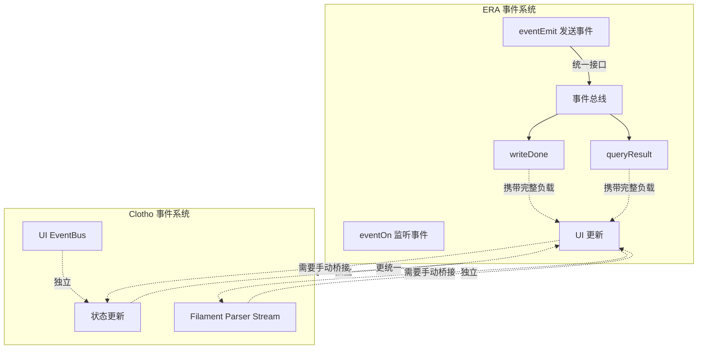

# 事件驱动架构深度分析

**版本**: 1.0.0
**日期**: 2025-12-28
**状态**: Draft
**作者**: Architect Mode

---

## 目录

1. [概述](#概述)
2. [ERA 事件驱动架构](#era-事件驱动架构)
3. [Clotho 当前事件系统](#clotho-当前事件系统)
4. [对比分析](#对比分析)
5. [改进方案](#改进方案)
6. [实现设计](#实现设计)

---

## 概述

事件驱动架构（Event-Driven Architecture）是一种解耦的设计模式，通过事件的发布和订阅机制，实现组件之间的松耦合通信。这种模式在复杂系统中特别有用，可以降低模块间的依赖性，提高系统的可扩展性和可维护性。

### 核心价值
- **解耦**: 组件之间通过事件通信，而非直接依赖
- **异步**: 支持异步事件处理，提高响应速度
- **可扩展**: 新的事件类型可以轻松添加
- **可调试**: 事件日志便于追踪和调试

---

## ERA 事件驱动架构

### 2.1 核心概念

ERA 采用**统一事件总线**模式，通过 `eventEmit` 和 `eventOn` 函数实现组件通信。

### 2.2 事件类型

#### 2.2.1 写入类事件

| 事件名 | 参数 | 说明 |
|--------|------|------|
| `era:insertByObject` | `object` | 非破坏性插入变量 |
| `era:updateByObject` | `object` | 修改已存在的变量 |
| `era:insertByPath` | `path`, `value` | 通过路径插入变量 |
| `era:updateByPath` | `path`, `value` | 通过路径修改变量 |
| `era:deleteByObject` | `object` | 通过对象结构删除变量 |
| `era:deleteByPath` | `path` | 通过路径删除变量 |
| `era:forceSync` | `mode`, `message_id` | 强制同步变量状态 |
| `era:requestWriteDone` | 无 | 请求重新广播 writeDone 事件 |

#### 2.2.2 广播类事件

| 事件名 | 参数 | 说明 |
|--------|------|------|
| `era:writeDone` | `WriteDonePayload` | 变量写入完成通知 |
| `era:queryResult` | `QueryResultPayload` | 查询结果通知 |

### 2.3 事件负载

#### 2.3.1 WriteDonePayload

```typescript
interface WriteDonePayload {
  mk: string;                    // 本次更新的消息密钥
  message_id: number;              // 本次更新的消息 ID
  is_user: boolean;              // 消息是否由用户发送
  actions: {
    rollback: boolean;          // 是否执行了回滚
    apply: boolean;             // 是否应用了来自AI输出的变量变更
    resync: boolean;            // 是否因历史记录变化而执行了再同步
    api: boolean;               // 是否由API直接调用触发
    apiWrite: boolean;           // 是否由API写入操作触发
  };
  selectedMks: (string | null)[];  // 当前聊天的主干消息密钥链
  editLogs: { [key: string]: any[] };  // 完整的编辑日志
  stat: any;                     // 包含 $meta 字段的完整变量状态
  statWithoutMeta: any;           // 不含 $meta 的纯净变量状态
  consecutiveProcessingCount: number;  // 对当前消息的连续处理次数
}
```

**特点**:
- **完整的状态信息**: 携带完整的变量状态和编辑日志
- **操作类型标识**: 通过 `actions` 字段区分不同的操作来源
- **防循环机制**: `apiWrite` 字段可用于防止无限循环

#### 2.3.2 QueryResultPayload

```typescript
interface QueryResultPayload {
  queryType: 'getCurrentVars' | 'getSnapshotAtMk' | 'getSnapshotsBetweenMks' | 'getSnapshotAtMId' | 'getSnapshotsBetweenMIds';
  request: any;                // 原始查询请求
  result: QueryResultItem | QueryResultItem[] | { error: string } | null;  // 查询结果
  selectedMks: (string | null)[];  // 查询执行时的已选择消息密钥链
  editLogs: { [key: string]: any[] };  // 查询执行时的编辑日志
}

interface QueryResultItem {
  mk: string;                    // 该状态快照所对应的**消息密钥**
  message_id: number;              // 该状态快照所对应的**消息 ID**
  is_user: boolean;              // 消息是否由用户发送
  stat: any;                     // 包含 $meta 等内部字段的**完整**变量状态对象
  statWithoutMeta: any;           // **不包含**任何 `$` 前缀字段的**纯净**变量状态对象
}
```

**特点**:
- **统一的查询接口**: 所有查询通过同一事件返回
- **错误处理**: `result.error` 字段用于错误处理
- **快照信息**: 包含消息密钥和 ID，便于定位

### 2.4 使用示例

#### 2.4.1 监听变量更新

```javascript
// 监听变量写入完成事件
eventOn('era:writeDone', (detail) => {
  // 防止无限循环
  if (detail.actions.apiWrite) {
    console.log('本次更新由 API 写入触发，跳过某些逻辑。');
    return;
  }

  const { mk, message_id, statWithoutMeta } = detail;
  
  // 更新 UI
  updateUI(statWithoutMeta);
  
  // 记录日志
  console.log(`ERA 变量已在消息 ${message_id} (MK: ${mk}) 处更新。`);
});
```

#### 2.4.2 写入变量

```javascript
// 通过路径更新变量
eventEmit('era:updateByPath', {
  path: 'player.hp',
  value: '+=10'  // 支持表达式语法
});

// 通过对象批量更新
eventEmit('era:updateByObject', {
  player: {
    hp: 90,
    mood: 'injured'
  }
});
```

#### 2.4.3 查询快照

```javascript
// 获取当前变量
eventEmit('era:getCurrentVars');

// 获取指定消息密钥的快照
eventEmit('era:getSnapshotAtMk', { 
  mk: 'era_mk_1759246942209_jipmrj' 
});

// 获取两个消息之间的所有快照
eventEmit('era:getSnapshotsBetweenMks', {
  startMk: 'era_mk_1759246942209_jipmrj',
  endMk: 'era_mk_1759247953101_abcdef'
});
```

### 2.5 ERA 事件系统的优势

| 特性 | 说明 |
|------|------|
| **统一接口** | 所有操作通过 `eventEmit`/`eventOn` |
| **完整负载** | 事件携带完整的上下文信息 |
| **防循环机制** | `apiWrite` 标识避免无限循环 |
| **丰富查询 API** | 支持多种快照查询方式 |
| **表达式支持** | `value: '+=10'` 语法 |
| **调试友好** | 事件日志便于追踪问题 |

---

## Clotho 当前事件系统

### 3.1 核心概念

Clotho 采用**分散式事件处理**，不同模块通过各自的机制传递事件。

### 3.2 现有事件机制

#### 3.2.1 Mnemosyne 事件

```dart
// 状态更新事件
class Mnemosyne {
  final Stream<StateChangeEvent> stateChangeStream;
  
  void updateState(StateDelta delta) {
    // 应用状态变更
    // 触发 stateChangeStream
  }
}
```

**特点**:
- 基于 Dart Stream
- 仅用于状态变更
- 无统一的事件总线

#### 3.2.2 UI 事件总线

```dart
class UIEventBus {
  final Stream<UIEvent> eventStream;
  
  void emit(UIEvent event) {
    // 发送 UI 事件
  }
  
  StreamSubscription on<T>(EventHandler<T> handler) {
    // 订阅事件
  }
}
```

**特点**:
- 基于 Dart Stream
- 用于 UI 组件通信
- 与 Mnemosyne 事件独立

#### 3.2.3 Filament Parser 事件

```dart
class FilamentParser {
  final Stream<ParsedEvent> eventStream;
  
  void parse(String input) {
    // 解析 Filament 协议
    // 触发不同的事件
  }
}
```

**特点**:
- 流式解析触发事件
- 与 UI 和 Mnemosyne 事件独立

### 3.3 Clotho 事件系统的限制

| 限制 | 说明 | 影响 |
|------|------|
| **分散式处理** | 不同模块使用不同的事件机制 | 缺乏统一性 |
| **无统一接口** | 没有全局的事件总线 | 难以跨模块通信 |
| **无完整负载** | 事件信息不完整 | 难以追踪和调试 |
| **无防循环机制** | 缺少 API 写入标识 | 可能导致无限循环 |
| **查询功能弱** | 快照查询功能未充分暴露 | 用户体验差 |

---

## 对比分析

### 4.1 功能对比表

| 特性 | ERA | Clotho | 差距 |
|------|-----|--------|------|
| **统一接口** | `eventEmit`/`eventOn` | 分散的 Stream | ERA 优势 |
| **完整负载** | 携带完整上下文 | 简单事件对象 | ERA 优势 |
| **防循环机制** | `apiWrite` 标识 | 无标识 | ERA 优势 |
| **丰富查询 API** | 多种快照查询 | 基础 Stream | ERA 优势 |
| **表达式支持** | `+=10` 语法 | 仅 OpCode | ERA 优势 |
| **调试友好** | 事件日志完整 | 分散日志 | ERA 优势 |
| **跨模块通信** | 统一总线 | 需要手动桥接 | ERA 优势 |
| **类型安全** | TypeScript 接口 | Dart 动态类型 | Clotho 优势 |

### 4.2 架构对比图



### 4.3 使用场景对比

#### 场景 1：变量更新触发 UI 更新

**ERA 实现**:
```javascript
// 1. API 写入变量
eventEmit('era:updateByPath', {
  path: 'player.hp',
  value: '+=10'
});

// 2. 自动触发 writeDone 事件
// era:writeDone 携带完整状态
{
  mk: 'era_mk_123',
  message_id: 45,
  statWithoutMeta: { player: { hp: 90, gold: 100 } },
  actions: { apiWrite: true }
}

// 3. UI 监听并更新
eventOn('era:writeDone', (detail) => {
  if (!detail.actions.apiWrite) {
    updateUI(detail.statWithoutMeta);
  }
});
```

**Clotho 实现**（当前）:
```dart
// 1. Mnemosyne 更新状态
mnemosyne.updateState([
  ['SUB', 'player.hp', 10]
]);

// 2. 触发 stateChangeStream
// Stream<StateChangeEvent> 携带状态变更信息

// 3. UI 监听并更新
mnemosyne.stateChangeStream.listen((event) {
  updateUI(event.newState);
});
```

**对比**:
- ERA 自动触发统一事件，携带完整上下文
- Clotho 需要手动订阅不同的 Stream
- ERA 的 `apiWrite` 标识可防止循环响应

#### 场景 2：快照查询与历史回溯

**ERA 实现**:
```javascript
// 1. 请求快照
eventEmit('era:getSnapshotAtMk', { 
  mk: 'era_mk_1759246942209_jipmrj' 
});

// 2. 接收查询结果
eventOn('era:queryResult', (detail) => {
  if (detail.queryType === 'getSnapshotAtMk') {
    const { statWithoutMeta, mk, message_id } = detail.result;
    console.log('快照:', statWithoutMeta, 'at message:', message_id);
    // 使用快照数据...
  }
});
```

**Clotho 实现**（当前）:
```dart
// 1. Mnemosyne 快照功能
// 需要直接调用 Mnemosyne API
var snapshot = mnemosyne.getSnapshotAtMk('era_mk_1759246942209_jipmrj');

// 2. 使用快照数据
// 没有统一的事件通知机制
```

**对比**:
- ERA 提供统一的事件查询接口
- Clotho 需要直接调用 Mnemosyne 方法
- ERA 的事件负载包含查询上下文，便于调试

#### 场景 3：跨模块通信

**ERA 实现**:
```javascript
// 任何模块都可以通过统一接口发送事件
eventEmit('era:forceSync', { 
  mode: 'full' 
});

// 任何模块都可以监听事件
eventOn('era:writeDone', (detail) => {
  // 响应同步完成事件
});
```

**Clotho 实现**（当前）:
```dart
// 需要手动桥接不同模块的事件
// 例如：UI 需要订阅 Mnemosyne 的 Stream
mnemosyne.stateChangeStream.listen((event) {
  // 响应状态变更
});

// Mnemosyne 需要调用 UI 的方法
uiEventBus.emit(UIEvent(...));
```

**对比**:
- ERA 通过统一事件总线实现松耦合
- Clotho 需要模块间直接依赖或手动桥接

---

## 改进方案

### 5.1 设计目标

在保持 Clotho 现有优势（类型安全、高性能）的基础上，引入 ERA 的统一事件驱动架构。

### 5.2 核心改进点

#### 5.2.1 统一事件总线

**目标**: 建立全局事件总线，统一所有模块的事件通信。

**设计**:
```dart
class EventBus {
  // 事件类型定义
  static const String EVENT_STATE_CHANGED = 'state_changed';
  static const String EVENT_WRITE_DONE = 'write_done';
  static const String EVENT_QUERY_RESULT = 'query_result';
  static const String EVENT_TOOL_CALL = 'tool_call';
  
  // 事件发布
  static void emit<T>(String type, T payload) {
    // 发布事件到总线
  }
  
  // 事件订阅
  static StreamSubscription on<T>(
    String type,
    EventHandler<T> handler
  ) {
    // 订阅事件
  }
}

// 事件处理器定义
typedef EventHandler<T> = void Function(T payload);
```

**特点**:
- 类型安全：使用泛型确保类型安全
- 统一接口：所有模块通过同一接口通信
- 解耦：发布者和订阅者完全解耦

#### 5.2.2 事件负载标准化

**目标**: 定义标准的事件负载结构，确保事件携带完整的上下文信息。

**设计**:
```dart
class StateChangedEvent {
  final String mk;                    // 消息密钥
  final int messageId;                // 消息 ID
  final Map<String, dynamic> oldState;  // 旧状态
  final Map<String, dynamic> newState;  // 新状态
  final StateChangeSource source;       // 变更来源
}

class WriteDoneEvent {
  final String mk;                    // 消息密钥
  final int messageId;                // 消息 ID
  final Map<String, dynamic> statWithoutMeta;  // 纯净状态
  final Map<String, dynamic> stat;        // 完整状态（含 $meta）
  final EventActions actions;           // 操作类型
}

class EventActions {
  final bool rollback;               // 是否回滚
  final bool apply;                  // 是否应用 AI 输出
  final bool resync;                 // 是否再同步
  final bool api;                    // 是否 API 调用
  final bool apiWrite;               // 是否 API 写入
}

class QueryResultEvent {
  final String queryType;             // 查询类型
  final dynamic request;               // 原始请求
  final QueryResult result;            // 查询结果
}

class QueryResultItem {
  final String mk;                    // 消息密钥
  final int messageId;                // 消息 ID
  final bool isUser;                 // 是否用户消息
  final Map<String, dynamic> stat;   // 完整状态
  final Map<String, dynamic> statWithoutMeta;  // 纯净状态
}
```

**特点**:
- **完整上下文**: 事件携带完整的操作上下文
- **类型标识**: 通过 `source` 和 `actions` 区分操作来源
- **调试友好**: 便于追踪和日志记录

#### 5.2.3 防循环机制

**目标**: 防止事件监听器响应事件后再次触发相同事件，导致无限循环。

**设计**:
```dart
class EventBus {
  // 发布事件时标记来源
  static void emit<T>(String type, T payload, {bool fromApi = false}) {
    final event = _EventWrapper(
      type: type,
      payload: payload,
      fromApi: fromApi,
      timestamp: DateTime.now(),
    );
    _streamController.add(event);
  }
  
  // 事件包装器
  class _EventWrapper {
    final String type;
    final T payload;
    final bool fromApi;
    final DateTime timestamp;
  }
}

// 监听器检查来源
eventBus.on<WriteDoneEvent>(EventBus.EVENT_WRITE_DONE, (event) {
  // 如果事件来自 API，跳过处理
  if (event.fromApi) {
    return;
  }
  
  // 处理事件
  handleWriteDone(event.payload);
});
```

**特点**:
- **来源标识**: 事件携带 `fromApi` 标识
- **自动跳过**: 监听器可以自动跳过 API 事件
- **灵活控制**: 监听器可以选择是否忽略 API 事件

#### 5.2.4 快照查询 API

**目标**: 提供统一的快照查询接口，支持多种查询方式。

**设计**:
```dart
class SnapshotQueryService {
  /// 获取当前变量
  Future<QueryResultEvent> getCurrentVars();
  
  /// 获取指定消息密钥的快照
  Future<QueryResultEvent> getSnapshotAtMk(String mk);
  
  /// 获取两个消息密钥之间的所有快照
  Future<QueryResultEvent> getSnapshotsBetweenMks({
    String? startMk,
    String? endMk,
  });
  
  /// 获取指定消息 ID 的快照
  Future<QueryResultEvent> getSnapshotAtMId(int messageId);
  
  /// 获取两个消息 ID 之间的所有快照
  Future<QueryResultEvent> getSnapshotsBetweenMIds({
    int? startId,
    int? endId,
  });
  
  /// 请求重新广播 writeDone 事件
  Future<void> requestWriteDone();
}
```

**特点**:
- **统一接口**: 所有查询通过同一服务
- **异步支持**: 使用 Future 支持异步操作
- **事件通知**: 查询结果通过事件返回
- **错误处理**: 统一的错误处理机制

#### 5.2.5 表达式语法支持

**目标**: 支持类似 ERA 的 `+=10` 表达式语法，简化数值操作。

**设计**:
```dart
class ExpressionEvaluator {
  /// 解析并计算表达式
  static dynamic evaluate(String expression, Map<String, dynamic> context);
  
  /// 支持的表达式语法
  /// +=: 加法
  /// -=: 减法
  /// *=: 乘法
  /// /=: 除法
  /// 复杂表达式: player.max_hp * 0.5
}

// 在 OpCode 解析器中使用
class OpCodeParser {
  static List<dynamic> parse(String opCode, Map<String, dynamic> context) {
    var parts = opCode.split(' ');
    var path = parts[0];
    var value = parts[1];
    
    // 检查是否是表达式
    if (value is String && value.startsWith('+=')) {
      var expression = value.substring(2);
      var result = ExpressionEvaluator.evaluate(expression, context);
      return ['ADD', path, result];
    }
    
    // 常规处理
    return [parts[0], value];
  }
}
```

**特点**:
- **兼容 ERA**: 支持 `+=10` 等表达式
- **安全求值**: 受限的上下文和函数
- **类型检查**: 确保表达式结果类型正确

### 5.3 向后兼容

**目标**: 保持与现有 Clotho 事件系统的兼容性。

**策略**:
1. **渐进式增强**: 保留现有 Stream，逐步迁移到统一总线
2. **适配器模式**: 使用适配器将现有 Stream 接入统一总线
3. **配置开关**: 允许用户选择是否启用新的事件系统

```dart
// 适配器：将 Mnemosyne Stream 接入统一总线
class MnemosyneEventAdapter {
  final EventBus _eventBus;
  final StreamSubscription _subscription;
  
  MnemosyneEventAdapter(this._eventBus, Stream<StateChangeEvent> stream) {
    _subscription = stream.listen((event) {
      _eventBus.emit(
        EventBus.EVENT_STATE_CHANGED,
        StateChangedEvent.fromMnemosyneEvent(event),
      );
    });
  }
  
  void dispose() {
    _subscription.cancel();
  }
}
```

---

## 实现设计

### 6.1 核心组件

#### 6.1.1 事件总线

```dart
class EventBus {
  static const String EVENT_STATE_CHANGED = 'state_changed';
  static const String EVENT_WRITE_DONE = 'write_done';
  static const String EVENT_QUERY_RESULT = 'query_result';
  
  final _controllers = <String, StreamController>{};
  final _streams = <String, Stream>{};
  
  /// 获取事件流
  static Stream<T> on<T>(String type) {
    _controllers.putIfAbsent(type, () => StreamController.broadcast());
    return _controllers[type]!.stream.cast();
  }
  
  /// 发布事件
  static void emit<T>(String type, T payload, {bool fromApi = false}) {
    final controller = _controllers[type];
    if (controller != null) {
      controller.add(_EventWrapper(type, payload, fromApi));
    }
  }
  
  /// 清理资源
  static void dispose() {
    _controllers.forEach((_, controller) => controller.close());
    _controllers.clear();
  }
}

class _EventWrapper {
  final String type;
  final dynamic payload;
  final bool fromApi;
  final DateTime timestamp;
}
```

#### 6.1.2 事件负载

```dart
// 状态变更事件
class StateChangedEvent {
  final String mk;
  final int messageId;
  final Map<String, dynamic> oldState;
  final Map<String, dynamic> newState;
  final StateChangeSource source;
  
  factory StateChangedEvent.fromMnemosyneEvent(StateChangeEvent event) {
    return StateChangedEvent(
      mk: event.mk,
      messageId: event.messageId,
      oldState: event.oldState,
      newState: event.newState,
      source: StateChangeSource.mnemosyne,
    );
  }
}

// 写入完成事件
class WriteDoneEvent {
  final String mk;
  final int messageId;
  final Map<String, dynamic> statWithoutMeta;
  final Map<String, dynamic> stat;
  final EventActions actions;
  
  factory WriteDoneEvent.fromMnemosyneWrite(StateChangeEvent event) {
    return WriteDoneEvent(
      mk: event.mk,
      messageId: event.messageId,
      statWithoutMeta: event.newStateWithoutMeta,
      stat: event.newState,
      actions: EventActions(
        rollback: false,
        apply: true,
        resync: false,
        api: false,
        apiWrite: true,  // 标记为 API 写入
      ),
    );
  }
}

// 查询结果事件
class QueryResultEvent {
  final String queryType;
  final dynamic request;
  final QueryResult result;
}

enum StateChangeSource {
  mnemosyne,
  filamentParser,
  ui,
  api,
}
```

#### 6.1.3 快照查询服务

```dart
class SnapshotQueryService {
  final Mnemosyne _mnemosyne;
  final EventBus _eventBus;
  
  SnapshotQueryService(this._mnemosyne, this._eventBus);
  
  /// 获取当前变量
  Future<QueryResultEvent> getCurrentVars() async {
    try {
      var stat = await _mnemosyne.getCurrentState();
      var statWithoutMeta = _stripMeta(stat);
      
      _eventBus.emit(
        EventBus.EVENT_QUERY_RESULT,
        QueryResultEvent(
          queryType: 'getCurrentVars',
          request: null,
          result: QueryResultItem(
            mk: _currentMk,
            messageId: _currentMessageId,
            stat: stat,
            statWithoutMeta: statWithoutMeta,
          ),
        ),
        fromApi: true,
      );
    } catch (e) {
      _eventBus.emit(
        EventBus.EVENT_QUERY_RESULT,
        QueryResultEvent(
          queryType: 'getCurrentVars',
          request: null,
          result: QueryResult(error: e.toString()),
        ),
        fromApi: true,
      );
    }
  }
  
  /// 获取指定消息密钥的快照
  Future<QueryResultEvent> getSnapshotAtMk(String mk) async {
    try {
      var snapshot = await _mnemosyne.getSnapshotAtMk(mk);
      var statWithoutMeta = _stripMeta(snapshot.stat);
      
      _eventBus.emit(
        EventBus.EVENT_QUERY_RESULT,
        QueryResultEvent(
          queryType: 'getSnapshotAtMk',
          request: {mk: mk},
          result: QueryResultItem(
            mk: snapshot.mk,
            messageId: snapshot.messageId,
            stat: snapshot.stat,
            statWithoutMeta: statWithoutMeta,
          ),
        ),
        fromApi: true,
      );
    } catch (e) {
      _eventBus.emit(
        EventBus.EVENT_QUERY_RESULT,
        QueryResultEvent(
          queryType: 'getSnapshotAtMk',
          request: {mk: mk},
          result: QueryResult(error: e.toString()),
        ),
        fromApi: true,
      );
    }
  }
  
  /// 辅助方法：移除 $meta 字段
  Map<String, dynamic> _stripMeta(Map<String, dynamic> stat) {
    var result = <String, dynamic>{};
    stat.forEach((key, value) {
      if (!key.startsWith('\$')) {
        result[key] = value;
      }
    });
    return result;
  }
  
  /// 获取当前消息密钥和 ID
  String get _currentMk;
  int get _currentMessageId;
}
```

#### 6.1.4 表达式求值器

```dart
class ExpressionEvaluator {
  /// 求值上下文
  final Map<String, dynamic> _context;
  
  ExpressionEvaluator(this._context);
  
  /// 解析并计算表达式
  dynamic evaluate(String expression) {
    // 支持 += 语法
    if (expression.startsWith('+=')) {
      var path = expression.substring(2);
      var currentValue = _getValue(path);
      var addValue = _parseValue(expression.substring(2));
      return currentValue + addValue;
    }
    
    // 支持 -= 语法
    if (expression.startsWith('-=')) {
      var path = expression.substring(2);
      var currentValue = _getValue(path);
      var subValue = _parseValue(expression.substring(2));
      return currentValue - subValue;
    }
    
    // 其他情况：直接求值
    return _parseValue(expression);
  }
  
  /// 获取值
  dynamic _getValue(String path) {
    var parts = path.split('.');
    var value = _context;
    for (var part in parts) {
      if (value is Map) {
        value = value[part];
      } else {
        return null;
      }
    }
    return value;
  }
  
  /// 解析值（支持数字和路径）
  dynamic _parseValue(String value) {
    // 尝试解析为数字
    var num = num.tryParse(value);
    if (num != null) return num;
    
    // 否则作为路径处理
    return _getValue(value);
  }
}
```

### 6.2 集成方案

#### 6.2.1 Mnemosyne 集成

```dart
class Mnemosyne {
  final EventBus _eventBus;
  final StreamController<StateChangeEvent> _stateChangeController;
  
  Mnemosyne(this._eventBus) {
    _stateChangeController = StreamController.broadcast();
  }
  
  /// 更新状态（触发事件）
  Future<void> updateState(List<dynamic> opCodes) async {
    var oldState = await getCurrentState();
    
    // 应用状态变更
    await _applyOpCodes(opCodes);
    
    var newState = await getCurrentState();
    
    // 发布状态变更事件
    _eventBus.emit(
      EventBus.EVENT_STATE_CHANGED,
      StateChangedEvent(
        mk: _currentMk,
        messageId: _currentMessageId,
        oldState: oldState,
        newState: newState,
        source: StateChangeSource.mnemosyne,
      ),
      fromApi: true,
    );
    
    // 发布写入完成事件
    _eventBus.emit(
      EventBus.EVENT_WRITE_DONE,
      WriteDoneEvent.fromMnemosyneWrite(
        StateChangeEvent(
          mk: _currentMk,
          messageId: _currentMessageId,
          oldState: oldState,
          newState: newState,
        ),
      ),
      fromApi: true,
    );
  }
  
  /// 暴露状态变更流（保持兼容性）
  Stream<StateChangeEvent> get stateChangeStream => _stateChangeController.stream;
}
```

#### 6.2.2 UI 集成

```dart
class UIEventManager {
  final EventBus _eventBus;
  final List<StreamSubscription> _subscriptions = [];
  
  UIEventManager(this._eventBus);
  
  /// 初始化
  void init() {
    // 监听状态变更事件
    _subscriptions.add(
      _eventBus.on<StateChangedEvent>(
        EventBus.EVENT_STATE_CHANGED,
        _handleStateChanged,
      ),
    );
    
    // 监听写入完成事件
    _subscriptions.add(
      _eventBus.on<WriteDoneEvent>(
        EventBus.EVENT_WRITE_DONE,
        _handleWriteDone,
      ),
    );
  }
  
  /// 处理状态变更
  void _handleStateChanged(StateChangedEvent event) {
    // 防止循环：忽略来自 Mnemosyne 的事件
    if (event.source == StateChangeSource.mnemosyne) {
      return;
    }
    
    // 更新 UI
    updateStateDisplay(event.newState);
  }
  
  /// 处理写入完成
  void _handleWriteDone(WriteDoneEvent event) {
    // 防止循环：忽略 API 写入事件
    if (event.actions.apiWrite) {
      return;
    }
    
    // 更新 UI
    updateStateDisplay(event.statWithoutMeta);
  }
  
  /// 清理资源
  void dispose() {
    for (var sub in _subscriptions) {
      sub.cancel();
    }
    _subscriptions.clear();
  }
}
```

#### 6.2.3 Filament Parser 集成

```dart
class FilamentParser {
  final EventBus _eventBus;
  
  FilamentParser(this._eventBus);
  
  /// 解析并发布事件
  void parse(String input) {
    // 解析 Filament 协议
    var events = _parseFilament(input);
    
    // 发布解析事件
    for (var event in events) {
      _eventBus.emit(
        event.type,
        event.payload,
        fromApi: true,
      );
    }
  }
}
```

### 6.3 迁移支持

#### 6.3.1 ERA 格式迁移

```dart
class ERAMigrationService {
  /// 将 ERA 事件调用迁移到 Clotho 事件总线
  static void migrateERAEventCall(String eventName, dynamic params) {
    switch (eventName) {
      case 'era:insertByObject':
      case 'era:updateByObject':
      case 'era:insertByPath':
      case 'era:updateByPath':
      case 'era:deleteByObject':
      case 'era:deleteByPath':
        // 映射到 Clotho 事件总线
        _mapToClothoEvent(eventName, params);
        break;
      default:
        throw UnimplementedError('Unknown ERA event: $eventName');
    }
  }
  
  static void _mapToClothoEvent(String eraEvent, dynamic params) {
    // 将 ERA 事件参数转换为 Clotho 事件
    // 发布到统一事件总线
  }
}
```

---

## 总结

### 7.1 核心收益

| 收益 | 说明 |
|------|------|
| **统一通信** | 所有模块通过统一事件总线通信 |
| **完整上下文** | 事件携带完整的操作上下文 |
| **防循环机制** | API 写入标识防止无限循环 |
| **丰富查询 API** | 支持多种快照查询方式 |
| **表达式支持** | 支持 `+=10` 等便捷语法 |
| **调试友好** | 事件日志便于追踪和调试 |
| **向后兼容** | 保留现有 Stream，渐进式增强 |

### 7.2 实现优先级

| 优先级 | 功能 | 说明 |
|--------|------|------|
| **P0** | 统一事件总线 | 实现全局 EventBus |
| **P0** | 事件负载标准化 | 定义标准事件负载 |
| **P1** | 防循环机制 | 实现 `fromApi` 标识 |
| **P1** | 快照查询服务 | 实现多种快照查询接口 |
| **P2** | 表达式求值器 | 支持 `+=10` 语法 |
| **P2** | Mnemosyne 集成 | 触发统一事件 |
| **P2** | UI 集成 | 监听并响应事件 |
| **P3** | Filament Parser 集成 | 发布解析事件 |
| **P3** | ERA 格式迁移 | 支持 ERA 事件调用 |

### 7.3 风险和缓解

| 风险 | 缓解措施 |
|------|----------|
| **性能开销** | 事件总线可能增加开销 | 使用 StreamController.broadcast() 优化 |
| **复杂性增加** | 统一事件增加系统复杂度 | 提供清晰的文档和示例 |
| **向后兼容** | 新功能可能影响现有代码 | 渐进式增强，适配器模式 |
| **调试困难** | 事件链可能难以调试 | 提供事件追踪工具 |

---

## 附录

### A.1 事件类型定义

```dart
/// 事件类型常量
class EventTypes {
  static const String STATE_CHANGED = 'state_changed';
  static const String WRITE_DONE = 'write_done';
  static const String QUERY_RESULT = 'query_result';
  static const String TOOL_CALL = 'tool_call';
  static const String UI_EVENT = 'ui_event';
}

/// 操作来源枚举
enum StateChangeSource {
  mnemosyne,
  filamentParser,
  ui,
  api,
}
```

### A.2 使用示例

```dart
// 初始化事件总线
var eventBus = EventBus();

// Mnemosyne 发布事件
mnemosyne.updateState([
  ['SET', 'player.hp', 90]
]);

// UI 监听事件
eventBus.on<WriteDoneEvent>(EventTypes.WRITE_DONE, (event) => {
  print('Write done: ${event.messageId}');
  updateUI(event.statWithoutMeta);
});

// 查询快照
var queryService = SnapshotQueryService(mnemosyne, eventBus);
queryService.getSnapshotAtMk('era_mk_123').then((event) => {
  if (event.result != null) {
    print('Snapshot: ${event.result.statWithoutMeta}');
  }
});
```
