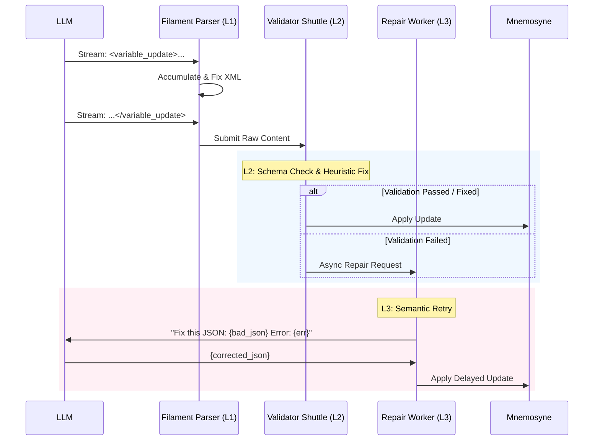

# Filament 解析器强化方案：分层容错与自我修正

**版本**: 1.0.0
**日期**: 2026-01-03
**状态**: Draft
**关联**: `structure/protocols/filament-parsing-workflow.md`, `plans/acu-integration-insights.md`

---

## 1. 背景与目标

当前的 Clotho (Filament) 解析器在处理流式文本和基础 XML 结构方面表现出色，利用 "流式模糊修正" 解决了标签闭合和顺序问题。然而，在面对复杂的结构化数据（如 `<variable_update>` 中的 JSON）时，仅靠正则和基础状态机难以保证数据的 *逻辑完整性* 和 *Schema 符合性*。

另一方面，ACU (AutoCardUpdater) 展示了通过 "Medusa Protocol"（自检 + 重试）实现高可靠性数据维护的能力，但这通常以牺牲实时性为代价。

本方案旨在融合两者的优势，构建一个 **分层容错 (Layered Fault Tolerance)** 系统，既保留流式响应的快感，又具备企业级的数据可靠性。

---

## 2. 分层容错架构 (Layered Fault Tolerance)

我们将解析过程划分为三道防线：

### L1: 流式语法修正 (Streaming Syntax Correction) - *实时层*
*   **目标**: 确保 XML 标签结构的完整性，让解析器能正确提取出内容块。
*   **位置**: `FilamentParser` 核心循环。
*   **现有机制**:
    *   自动补全缺失的标签头/尾 (基于 `ExpectedStructureRegistry`)。
    *   合并相邻冗余标签。
*   **新增增强**:
    *   **JSON 预清洗**: 在进入 JSON 解析器前，对流式片段进行字符级清洗（如转换中文引号、移除控制字符）。

### L2: 结构化验证与本地修复 (Structural Validation & Local Repair) - *同步层*
*   **目标**: 确保提取出的内容符合 JSON Schema，且类型正确。
*   **位置**: 标签闭合后的 `ContentHandler` / `VariableParser`。
*   **机制**:
    *   **Schema 校验**: 使用 Zod 或类似库对解析出的对象进行即时校验。
    *   **启发式修复 (Heuristic Repair)**:
        *   *场景*: 缺少引号 `{ key: "value" }` -> 自动修复为 `{"key": "value"}`。
        *   *场景*: 类型错误 `age: "18"` (期望 number) -> 自动转换类型。
        *   *场景*: 数组尾随逗号 `[1, 2,]` -> 自动移除。
    *   **结果**: 如果 L2 修复成功，继续流程；如果失败，进入 L3。

### L3: 语义级重试与回退 (Semantic Retry & Fallback) - *异步层*
*   **目标**: 解决严重的数据错误或逻辑幻觉（如引用了不存在的 ID，或 JSON 结构彻底崩坏）。
*   **位置**: `ValidatorShuttle` (后台线程/Worker)。
*   **机制**:
    *   **错误拦截**: 当 L2 报告无法修复的错误时，暂停该特定数据块的应用（不阻塞主文本流）。
    *   **构造修正 Prompt**: 将 *错误的原始片段* + *Schema 报错信息* 包装成一个新的请求。
    *   **微型重试 (Micro-Retry)**: 调用一个轻量级模型（或原模型）仅重新生成该 JSON 块。
    *   **降级策略**: 如果重试仍失败，丢弃该更新，并记录 "解析失败" 事件到系统日志，UI 显示警告 Toast。

---

## 3. Validator Shuttle 工作流设计

`ValidatorShuttle` 是连接解析器与执行层的关键组件。



---

## 4. Prompt 策略调整 (Medusa 融合)

借鉴 ACU 的经验，我们将在 Prompt 层面引导模型生成更易于解析的内容，但比 ACU 的 "强制 Checklist" 更轻量，以免影响流式体验。

### 4.1. System Prompt 增强
在 `filament-protocol-overview` 中定义的 System Prompt 中加入：

> **Data Integrity Protocol**:
> When outputting JSON in `<variable_update>`:
> 1. Ensure all property names are double-quoted.
> 2. Verify `id` references exist in the current context.
> 3. If complex changes are needed, think inside `<thought>` first.

### 4.2. 错误修正 Prompt (Correction Prompt)
用于 L3 重试阶段的模板：

```markdown
SYSTEM: You are a JSON Repair Agent.
TASK: Fix the malformed JSON below. It failed schema validation.
ERROR: {{error_message}}
SCHEMA: {{target_schema}}

BAD JSON:
```json
{{bad_json}}
```

OUTPUT: Only the corrected JSON object, no markdown, no explanations.
```

---

## 5. 对比分析

| 特性 | 原始 Clotho (v2.1) | ACU (Medusa) | **Filament v2.3 (融合方案)** |
| :--- | :--- | :--- | :--- |
| **解析方式** | 纯流式 + 正则 | 批处理 + 后处理 | **流式 (L1) + 异步微批处理 (L2/L3)** |
| **容错能力** | XML 标签级 | 逻辑级 (高) | **全栈 (语法 -> 语义)** |
| **延迟** | 极低 | 高 (需等待生成完) | **文本极低，数据更新偶有延迟** |
| **重试机制** | 无 (失败即丢弃) | 有 (整段重试) | **有 (精准片段重试)** |
| **Token 消耗**| 低 | 高 (Checklist + Logs) | **中 (仅在出错时重试)** |

## 6. 下一步计划

1. 更新 `structure/protocols/filament-parsing-workflow.md`，纳入 L1-L3 分层定义。
2. 定义 `ValidatorShuttle` 的接口规范。
3. 更新 System Prompt 模板以包含数据完整性提示。
