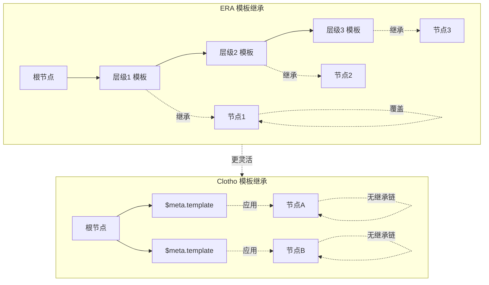
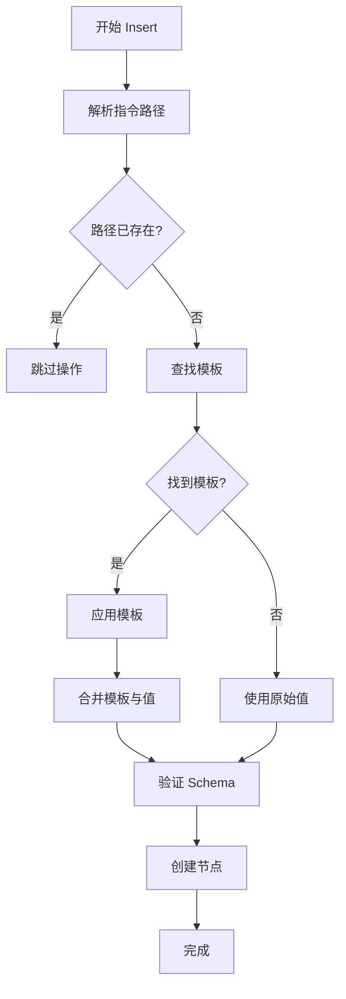

# 模板继承机制深度分析

**版本**: 1.0.0
**日期**: 2025-12-28
**状态**: Draft
**作者**: Architect Mode

---

## 目录

1. [概述](#概述)
2. [ERA 模板继承机制](#era-模板继承机制)
3. [Clotho 当前模板机制](#clotho-当前模板机制)
4. [对比分析](#对比分析)
5. [改进方案](#改进方案)
6. [实现设计](#实现设计)

---

## 概述

模板继承是一种强大的设计模式，允许定义默认值结构，并在创建新对象时自动应用这些默认值。这在 RPG 游戏中特别有用，可以减少重复代码，确保数据一致性。

### 核心价值
- **减少重复**: 避免为每个新对象重复定义相同的属性
- **保证一致性**: 确保同类对象具有相同的基础结构
- **提高可维护性**: 修改模板即可影响所有使用该模板的对象
- **增强灵活性**: 允许在特定层级覆盖默认值

---

## ERA 模板继承机制

### 2.1 核心概念

ERA 的模板系统支持**多级继承**，允许模板在状态树的不同层级上定义，并自动应用到其子节点。

### 2.2 模板定义

```json
{
  "guild": {
    "$template": {
      "rank": "Rookie",
      "contribution": 0,
      "$meta": { "updatable": true }
    }
  }
}
```

**特点**:
- 模板定义在父节点上
- 使用 `$template` 键标识
- 可以包含 `$meta` 约束

### 2.3 模板继承规则

#### 2.3.1 继承优先级

ERA 定义了明确的模板查找优先级：

1. **变量中已有的模板**: 如果要插入的路径的父级已经定义了 `$template`，将优先使用它
2. **继承的模板**: 如果父级没有，则会使用从更上层节点继承下来的模板
3. **指令中自带的模板**: 仅当以上两者都不存在时，才会使用本次 `insert` 指令中提供的 `$template`

#### 2.3.2 模板覆盖

```json
// 父节点定义模板
{
  "characters": {
    "$template": {
      "level": 1,
      "hp": 10,
      "inventory": [],
      "$meta": { "necessary": "self" }
    }
  }
}

// 子节点可以覆盖模板中的值
{
  "characters": {
    "player": {
      "hp": 15,  // 覆盖模板中的 hp: 10
      // level, inventory, $meta 继承自模板
    }
  }
}
```

**特点**:
- 子节点提供的值会覆盖模板中的对应值
- 未提供的值会继承自模板
- `$meta` 约束也会被继承

#### 2.3.3 嵌套模板继承

```json
// 第一层：基础角色模板
{
  "characters": {
    "$template": {
      "level": 1,
      "hp": 10
    }
  }
}

// 第二层：NPC 专用模板
{
  "characters": {
    "npcs": {
      "$template": {
        "faction": "neutral",
        "dialogue": []
      }
    }
  }
}

// 第三层：创建具体 NPC
{
  "characters": {
    "npcs": {
      "guard_001": {
        "class": "Warrior"
        // 继承：level=1, hp=10 (来自 characters)
        // 继承：faction="neutral", dialogue=[] (来自 npcs)
        // 覆盖：class="Warrior" (来自指令)
      }
    }
  }
}
```

**特点**:
- 支持多层嵌套继承
- 每层可以定义特定的默认值
- 子节点可以覆盖任意层级的值

### 2.4 模板与 Insert 操作

```xml
<VariableInsert>
{
  "world_state": {
    "characters": {
      "player": {
        "hp": 15
      }
    }
  }
}
</VariableInsert>
```

**执行流程**:
1. 检查 `characters.player` 是否已存在
2. 如果不存在，查找可用的模板
3. 应用 `characters.$template`（如果存在）
4. 合并指令中的值与模板值（指令值优先）
5. 创建新节点

### 2.5 ERA 模板机制的优势

| 特性 | 说明 |
|------|------|
| **多级继承** | 支持嵌套的模板结构 |
| **自动应用** | Insert 时自动查找并应用模板 |
| **灵活覆盖** | 子节点可以覆盖任意层级的值 |
| **约束继承** | `$meta` 约束也会被继承 |
| **减少重复** | 避免为每个对象重复定义相同属性 |

---

## Clotho 当前模板机制

### 3.1 核心概念

Clotho 的 Mnemosyne 引擎支持**单级模板**，通过 `$meta.template` 字段定义。

### 3.2 模板定义

```json
{
  "character": {
    "$meta": {
      "extensible": false,
      "required": ["health", "mood"],
      "template": ["Unknown Item", "物品描述"]
    },
    "inventory": {
      "item_001": {
        "name": "初级治疗药水",
        "quantity": 3
      }
    }
  }
}
```

**特点**:
- 模板定义在 `$meta` 字段中
- 使用 `template` 键标识
- 与 `extensible` 和 `required` 约束并存

### 3.3 模板应用规则

#### 3.3.1 应用时机

Clotho 的模板在**创建新对象时**应用：

1. **Insert 操作**: 创建新节点时应用模板
2. **Schema 验证**: 根据 `$meta` 定义验证结构

#### 3.3.2 应用范围

Clotho 的模板仅应用于**直接子节点**：

```json
{
  "inventory": {
    "$meta": {
      "template": ["Unknown Item", "物品描述"]
    },
    "item_001": {
      // 应用模板，补充 name 和 description
      "quantity": 3
    }
  }
}
```

**限制**:
- 模板不会自动应用到孙节点
- 需要为每个需要模板的层级单独定义

### 3.4 VWD 与模板的交互

Clotho 的 VWD (Value with Description) 模型与模板系统协同工作：

```json
{
  "inventory": {
    "$meta": {
      "template": ["Unknown Item", "物品描述"]
    },
    "item_001": {
      "name": "初级治疗药水",
      "quantity": 3
      // VWD 格式：[value, description]
      // 模板提供：["Unknown Item", "物品描述"]
      // 如果 name 或 description 缺失，会从模板补充
    }
  }
}
```

**特点**:
- VWD 的 `description` 可以从模板继承
- VWD 的 `value` 必须在指令中提供

### 3.5 Clotho 模板机制的限制

| 限制 | 说明 | 影响 |
|------|------|
| **单级继承** | 仅支持直接子节点的模板 | 需要为每个层级单独定义 |
| **无嵌套继承** | 不支持模板链 | 无法实现复杂的默认值层级 |
| **无自动查找** | 模板必须明确定义在父节点 | 无法自动查找最近的模板 |
| **无覆盖规则** | 缺少明确的优先级规则 | 可能导致模板冲突 |

---

## 对比分析

### 4.1 功能对比表

| 特性 | ERA | Clotho | 差距 |
|------|-----|--------|------|
| **多级继承** | 支持 | 不支持 | ERA 优势 |
| **嵌套模板** | 支持 | 不支持 | ERA 优势 |
| **自动模板查找** | 支持 | 不支持 | ERA 优势 |
| **模板优先级** | 明确的三级优先级 | 无明确规则 | ERA 优势 |
| **约束继承** | 支持 | 部分（VWD） | ERA 优势 |
| **与 VWD 集成** | 良好 | 良好 | 平手 |
| **Schema 验证** | 基础 | 完整 | Clotho 优势 |
| **类型安全** | 弱类型 | 强类型（Dart） | Clotho 优势 |

### 4.2 使用场景对比

#### 场景 1：RPG 角色系统

**ERA 实现**:
```json
{
  "characters": {
    "$template": {
      "level": 1,
      "hp": 100,
      "mp": 50,
      "inventory": [],
      "$meta": { "necessary": "self" }
    },
    "player": { "hp": 150 },  // 覆盖 hp
    "npcs": {
      "$template": {
        "faction": "neutral",
        "aggressive": false
      },
      "guard_001": { "class": "Warrior" },
      "merchant_001": { "class": "Merchant" }
    }
  }
}
```

**Clotho 实现**（当前）:
```json
{
  "characters": {
    "$meta": {
      "template": {
        "level": 1,
        "hp": 100,
        "mp": 50,
        "inventory": []
      }
    },
    "player": { "hp": 150 },
    "npcs": {
      "$meta": {
        "template": {
          "faction": "neutral",
          "aggressive": false
        }
      },
      "guard_001": { "class": "Warrior" },
      "merchant_001": { "class": "Merchant" }
    }
  }
}
```

**对比**:
- ERA 可以在 `characters` 层定义基础模板，`npcs` 层定义 NPC 专用模板
- Clotho 需要为每个层级单独定义模板
- ERA 的嵌套模板更符合 RPG 的层级结构

#### 场景 2：物品系统

**ERA 实现**:
```json
{
  "inventory": {
    "weapons": {
      "$template": {
        "damage": 10,
        "durability": 100,
        "rarity": "common"
      },
      "sword_001": { "damage": 25 },  // 覆盖 damage
      "bow_001": {}  // 完全继承模板
    },
    "potions": {
      "$template": {
        "healing": 20,
        "duration": 60
      },
      "health_potion": {},
      "mana_potion": { "healing": 30 }
    }
  }
}
```

**Clotho 实现**（当前）:
```json
{
  "inventory": {
    "weapons": {
      "$meta": {
        "template": {
          "damage": 10,
          "durability": 100,
          "rarity": "common"
        }
      },
      "sword_001": { "damage": 25 },
      "bow_001": {}
    },
    "potions": {
      "$meta": {
        "template": {
          "healing": 20,
          "duration": 60
        }
      },
      "health_potion": {},
      "mana_potion": { "healing": 30 }
    }
  }
}
```

**对比**:
- ERA 的嵌套模板更自然地表达分类层级
- Clotho 需要为每个分类单独定义模板

### 4.3 架构对比图



---

## 改进方案

### 5.1 设计目标

在保持 Clotho 现有优势（类型安全、Schema 验证）的基础上，引入 ERA 的多级模板继承机制。

### 5.2 核心改进点

#### 5.2.1 支持嵌套模板继承

**目标**: 允许模板在状态树的不同层级上定义，并自动应用到子节点。

**设计**:
```json
{
  "characters": {
    "$template": {
      "level": 1,
      "hp": 100,
      "mp": 50
    },
    "npcs": {
      "$template": {
        "faction": "neutral",
        "aggressive": false
      },
      "guard_001": { "class": "Warrior" }
    }
  }
}
```

**继承规则**:
1. **就近原则**: 子节点查找最近的父级模板
2. **层级优先**: 更近的模板优先于更远的模板
3. **显式覆盖**: 子节点提供的值覆盖模板值

#### 5.2.2 定义模板优先级

**目标**: 明确模板查找和应用顺序，避免歧义。

**优先级规则**:
1. **直接父模板**: 父节点的 `$template`
2. **继承模板**: 从祖先节点继承的模板
3. **全局模板**: 系统级别的默认模板
4. **指令模板**: Insert 指令中提供的模板

**伪代码**:
```dart
class TemplateResolver {
  TemplateNode? resolveTemplate(String path) {
    // 1. 检查直接父节点
    var parent = getParent(path);
    if (parent.$template != null) {
      return parent.$template;
    }
    
    // 2. 查找继承的模板
    var inherited = findInheritedTemplate(path);
    if (inherited != null) {
      return inherited;
    }
    
    // 3. 返回 null（无模板）
    return null;
  }
  
  Map<String, dynamic> applyTemplate(
    String path,
    Map<String, dynamic> values,
    TemplateNode? template
  ) {
    // 合并模板值与指令值
    // 指令值优先
    var result = {...template, ...values};
    return result;
  }
}
```

#### 5.2.3 约束继承

**目标**: 允许 `$meta` 约束通过模板继承。

**设计**:
```json
{
  "characters": {
    "$template": {
      "level": 1,
      "hp": 100,
      "$meta": {
        "updatable": true,
        "necessary": "self"
      }
    },
    "player": {
      // 继承模板的 $meta
      // 可以覆盖：level, hp
      // 不能覆盖（除非显式）：$meta
      "hp": 150
    }
  }
}
```

**规则**:
1. **默认继承**: 子节点继承模板的 `$meta`
2. **显式覆盖**: 子节点必须显式提供 `$meta` 才能覆盖
3. **合并策略**: 深度合并，子节点的 `$meta` 覆盖模板的 `$meta`

#### 5.2.4 与 VWD 集成

**目标**: 确保模板继承与 VWD 模型协同工作。

**设计**:
```json
{
  "inventory": {
    "$template": {
      "name": ["Unknown Item", "物品描述"],
      "quantity": 1,
      "rarity": ["common", "稀有度"]
    },
    "sword_001": {
      // 继承：name[0], quantity, rarity
      // 提供值：name[0] = "铁剑"
      "name": "铁剑"
    }
  }
}
```

**规则**:
1. **VWD 值**: 指令中提供的值优先
2. **VWD 描述**: 如果 VWD 描述缺失，从模板继承
3. **类型检查**: 确保 VWD 值类型与模板匹配

### 5.3 向后兼容

**目标**: 保持与现有 Clotho 模板系统的兼容性。

**策略**:
1. **渐进式增强**: 保留现有 `$meta.template` 作为直接模板
2. **扩展语法**: 增加嵌套模板支持，不破坏现有功能
3. **配置开关**: 允许用户选择是否启用嵌套继承

---

## 实现设计

### 6.1 数据结构

#### 6.1.1 模板节点定义

```dart
class TemplateNode {
  // 模板值（可以是简单值或 VWD）
  Map<String, dynamic> values;
  
  // 模板元数据（可选）
  TemplateMetadata? meta;
}

class TemplateMetadata {
  // 约束继承
  Map<String, dynamic>? constraints;
  
  // 模板来源（用于调试）
  String? source;
}
```

#### 6.1.2 状态树扩展

```dart
class StateNode {
  // 节点值
  dynamic value;
  
  // VWD 描述（可选）
  String? description;
  
  // 元数据
  StateMetadata meta;
  
  // 模板（可选，仅父节点有效）
  TemplateNode? template;
}

class StateMetadata {
  // 是否可扩展
  bool? extensible;
  
  // 必填字段
  List<String>? required;
  
  // 是否可更新
  bool? updatable;
  
  // 删除保护
  String? necessary; // "self", "children", "all"
}
```

### 6.2 模板解析器

#### 6.2.1 模板查找算法

```dart
class TemplateResolver {
  /// 查找指定路径的模板
  TemplateNode? findTemplate(String path, StateTree tree) {
    // 1. 获取父节点路径
    var parentPath = getParentPath(path);
    
    // 2. 检查父节点是否有模板
    var parentNode = tree.get(parentPath);
    if (parentNode != null && parentNode.template != null) {
      return parentNode.template;
    }
    
    // 3. 递归查找继承的模板
    if (parentPath.isNotEmpty) {
      return findTemplate(parentPath, tree);
    }
    
    // 4. 无模板
    return null;
  }
  
  /// 应用模板到值
  Map<String, dynamic> applyTemplate(
    Map<String, dynamic> values,
    TemplateNode template
  ) {
    // 深度合并，值优先
    var result = <String, dynamic>{};
    
    // 1. 添加模板值
    if (template != null) {
      template.values.forEach((key, value) {
        // 处理 VWD 格式
        if (value is List && value.length == 2) {
          result[key] = value; // [value, description]
        } else {
          result[key] = value;
        }
      });
    }
    
    // 2. 覆盖为指令值
    values.forEach((key, value) {
      result[key] = value;
    });
    
    return result;
  }
}
```

#### 6.2.2 Insert 操作流程



### 6.3 Schema 验证

```dart
class SchemaValidator {
  /// 验证节点是否符合 Schema
  ValidationResult validate(
    String path,
    Map<String, dynamic> node,
    StateTree tree
  ) {
    var errors = <ValidationError>[];
    
    // 1. 获取父节点的 Schema
    var schema = getSchema(path, tree);
    
    // 2. 检查必填字段
    if (schema?.required != null) {
      for (var field in schema.required) {
        if (!node.containsKey(field)) {
          errors.add(ValidationError.missing(field));
        }
      }
    }
    
    // 3. 检查可扩展性
    if (schema?.extensible == false) {
      var allowedKeys = getAllowedKeys(path, tree);
      for (var key in node.keys) {
        if (!allowedKeys.contains(key)) {
          errors.add(ValidationError.unexpected(key));
        }
      }
    }
    
    // 4. 检查类型
    // （根据类型定义验证）
    
    return ValidationResult(errors.isEmpty, errors);
  }
}
```

### 6.4 迁移支持

#### 6.4.1 ERA 格式迁移

```dart
class ERATemplateMigrator {
  /// 将 ERA 格式转换为 Clotho 格式
  StateTree migrateFromERA(Map<String, dynamic> eraData) {
    var clothoData = <String, dynamic>{};
    
    eraData.forEach((key, value) {
      if (value is Map) {
        var innerMap = value as Map<String, dynamic>;
        
        // 处理 $template
        if (innerMap.containsKey('\$template')) {
          var template = innerMap['\$template'];
          // 转换为 Clotho 的 $meta.template
          clothoData[key] = {
            '\$meta': {
              'template': template
            },
            ...innerMap..remove('\$template')
          };
        } else {
          clothoData[key] = value;
        }
      } else {
        clothoData[key] = value;
      }
    });
    
    return StateTree.fromMap(clothoData);
  }
}
```

#### 6.4.2 向后兼容层

```dart
class TemplateCompatibilityLayer {
  /// 兼容旧版单级模板
  bool supportsNestedInheritance;
  
  /// 解析模板配置
  TemplateConfig parseConfig(Map<String, dynamic> config) {
    // 检查是否启用嵌套继承
    if (config.containsKey('nested_inheritance')) {
      supportsNestedInheritance = config['nested_inheritance'];
    }
    
    // 返回配置对象
    return TemplateConfig(
      nestedInheritance: supportsNestedInheritance,
      // ... 其他配置
    );
  }
}
```

---

## 总结

### 7.1 核心收益

| 收益 | 说明 |
|------|------|
| **减少重复代码** | 模板继承避免为每个对象重复定义相同属性 |
| **提高一致性** | 确保同类对象具有相同的基础结构 |
| **增强灵活性** | 支持复杂的默认值层级和覆盖规则 |
| **改善可维护性** | 修改模板即可影响所有使用该模板的对象 |
| **向后兼容** | 保留现有单级模板，渐进式增强 |

### 7.2 实现优先级

| 优先级 | 功能 | 说明 |
|--------|------|------|
| **P0** | 基础模板解析器 | 实现模板查找和应用逻辑 |
| **P0** | Insert 操作增强 | 支持 Insert 时应用模板 |
| **P1** | 约束继承 | 支持 `$meta` 通过模板继承 |
| **P1** | Schema 验证更新 | 验证嵌套模板结构 |
| **P2** | ERA 格式迁移 | 支持从 ERA 导入模板 |
| **P2** | 配置和开关 | 允许用户控制模板行为 |
| **P3** | 文档和示例 | 提供使用指南和示例 |

### 7.3 风险和缓解

| 风险 | 缓解措施 |
|------|----------|
| **性能开销** | 模板查找可能增加开销 | 缓存模板解析结果 |
| **复杂性增加** | 嵌套继承增加系统复杂度 | 提供清晰的文档和工具 |
| **向后兼容** | 新功能可能影响现有代码 | 渐进式增强，配置开关 |
| **调试困难** | 模板继承链可能难以调试 | 提供模板可视化工具 |

---

## 附录

### A.1 ERA 模板示例

```json
{
  "world_state": {
    "capital": {
      "type": "city",
      "population": 1000,
      "description": "The bustling capital city.",
      "$meta": {
        "updatable": false,
        "necessary": "all"
      }
    },
    "characters": {
      "$template": {
        "level": 1,
        "hp": 10,
        "inventory": [],
        "$meta": { "necessary": "self" }
      },
      "player": {
        "hp": 15
      },
      "npcs": {
        "$template": {
          "faction": "neutral",
          "dialogue": []
        },
        "guard_001": {
          "class": "Warrior"
        }
      }
    },
    "game_version": "1.0.0"
  }
}
```

### A.2 Clotho 增强后示例

```json
{
  "world_state": {
    "capital": {
      "type": "city",
      "population": 1000,
      "description": "The bustling capital city.",
      "$meta": {
        "updatable": false,
        "necessary": "all"
      }
    },
    "characters": {
      "$template": {
        "level": 1,
        "hp": 10,
        "inventory": [],
        "$meta": { "necessary": "self" }
      },
      "player": {
        // 应用 characters.$template
        // 覆盖 hp: 10 -> 15
        "hp": 15
      },
      "npcs": {
        "$template": {
          "faction": "neutral",
          "dialogue": []
        },
        "guard_001": {
          "class": "Warrior"
          // 应用 npcs.$template
          // 继承 faction, dialogue
          // 覆盖 class
        }
      }
    },
    "game_version": "1.0.0"
  }
}
```
