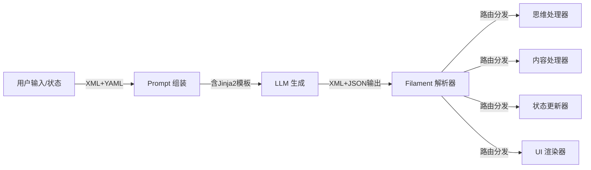

# 协议与格式文档目录

**定位**: 系统间通信的标准化协议  
**目标读者**: 协议开发者、集成工程师  
**文档状态**: 已重组 (2025-12-30)

---

## 📖 目录简介

本目录包含 Clotho 系统的通信协议和数据格式规范。核心是 **Filament 统一交互协议**，它贯穿于系统的所有交互环节，从提示词构建、逻辑控制到界面渲染，实现了统一的语义表达和确定性通信。

## 📚 文档列表

### 1. Filament 协议概述

- **文件**: [`filament-protocol-overview.md`](filament-protocol-overview.md)
- **简介**: Filament 协议的整体介绍，包括设计哲学、应用范畴和核心概念。
- **核心内容**: 非对称交互 (XML+YAML IN, XML+JSON OUT)、混合扩展策略、协议定位
- **阅读建议**: 理解协议的整体设计理念和基本原则
- **关联文档**: 输入格式 [`filament-input-format.md`](filament-input-format.md)，输出格式 [`filament-output-format.md`](filament-output-format.md)

### 2. 输入格式 (XML+YAML)

- **文件**: [`filament-input-format.md`](filament-input-format.md)
- **简介**: Filament 协议的输入端规范，包括结构化提示词构建和 YAML 数据格式。
- **核心内容**: 基础数据块格式、世界书条目格式、标签语义体系、Jinja2 宏系统集成
- **阅读建议**: 了解如何为 LLM 构建结构化的输入 Prompt
- **关联文档**: Jinja2 宏系统 [`jinja2-macro-system.md`](jinja2-macro-system.md)，输出格式 [`filament-output-format.md`](filament-output-format.md)

### 3. Schema 库规范 (Schema Library)

- **文件**: [`schema-library.md`](schema-library.md)
- **简介**: 协议库的存储、引用和注入机制，旨在解决 Prompt 复用和维护问题。
- **核心内容**: L1/L2 分层架构、Schema YAML 存储格式、静态与动态引用机制
- **阅读建议**: 了解如何标准化管理和注入复杂的逻辑规则（如变量更新、直播间格式）
- **关联文档**: Jacquard 编排层 [`../core/jacquard-orchestration.md`](../core/jacquard-orchestration.md)

### 4. Jinja2 宏系统

- **文件**: [`jinja2-macro-system.md`](jinja2-macro-system.md)
- **简介**: Clotho 的模板引擎系统，用于动态提示词构建和安全的逻辑控制。
- **核心内容**: 凯撒原则下的模板渲染、宏分类与规范、安全沙箱、迁移映射表
- **阅读建议**: 了解如何将 SillyTavern 的 EJS 逻辑迁移到 Jinja2 模板
- **关联文档**: 输入格式 [`filament-input-format.md`](filament-input-format.md)，工作流目录 [`../workflows/`](../workflows/)

### 5. 输出格式 (XML+JSON)

- **文件**: [`filament-output-format.md`](filament-output-format.md)
- **简介**: Filament 协议的输出端规范，包括 LLM 输出标签体系和状态更新格式。
- **核心内容**: 认知与表达标签 (`<thought>`, `<content>`)、逻辑与状态标签 (`<variable_update>`)、表现与交互标签 (`<status_bar>`, `<choice>`)
- **阅读建议**: 了解 LLM 应如何格式化输出，以及系统如何解析这些输出
- **关联文档**: 解析流程 [`filament-parsing-workflow.md`](filament-parsing-workflow.md)，核心架构 [`../core/`](../core/)

### 6. 解析流程

- **文件**: [`filament-parsing-workflow.md`](filament-parsing-workflow.md)
- **简介**: Filament 协议的实时流式解析机制，包括路由分发和错误处理。
- **核心内容**: 流式解析架构、路由分发表、输出结构鲁棒性、容错降级
- **阅读建议**: 了解系统如何实时解析 LLM 的流式输出并分发到相应处理器
- **关联文档**: 输出格式 [`filament-output-format.md`](filament-output-format.md)，核心架构 [`../core/`](../core/)

## 🔗 协议架构关系

## 🧭 导航指南

### 从哪里开始？

如果您是**协议开发者**：

1. 按顺序阅读本目录的所有文档：概述 → 输入格式 → Jinja2 宏系统 → 输出格式 → 解析流程
2. 重点关注协议版本演进和兼容性要求

如果您是**集成工程师**：

1. 阅读 [`filament-protocol-overview.md`](filament-protocol-overview.md) 了解整体设计
2. 根据需要查阅输入格式或输出格式的具体规范

如果您是**迁移工程师**：

1. 重点阅读 [`jinja2-macro-system.md`](jinja2-macro-system.md) 了解模板迁移
2. 查阅工作流目录 [`../workflows/`](../workflows/) 中的迁移指南

### 相邻目录

- **核心架构** ([`../core/`](../core/)): 协议在系统中的应用实现
- **工作流与处理** ([`../workflows/`](../workflows/)): 使用协议的具体业务流程
- **运行时环境** ([`../runtime/`](../runtime/)): 协议在运行时环境中的应用
- **参考文档** ([`../reference/`](../reference/)): 协议相关的技术参考

## 📝 文档更新记录

| 日期 | 版本 | 变更说明 |
|------|------|----------|
| 2025-12-30 | 2.0.0 | 文档重组，将原始 Filament 协议文档拆分为 5 个专题文件 |
| 2025-12-28 | 2.3.0 | Filament 协议 v2.3 版本，增强 Jinja2 宏系统支持 |
| 2025-12-23 | 1.0.0 | 原始文档创建 |

---

**最后更新**: 2025-12-30  
**维护者**: Clotho 协议团队
