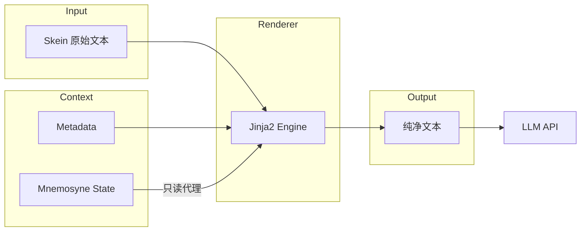

# Jinja2 宏系统 (Jinja2 Macro System)

**版本**: 2.3.0  
**日期**: 2025-12-28  
**状态**: Draft  
**作者**: 资深系统架构师 (Architect Mode)  
**关联文档**:

- 输入格式 [`filament-input-format.md`](filament-input-format.md)
- 输出格式 [`filament-output-format.md`](filament-output-format.md)
- 解析流程 [`filament-parsing-workflow.md`](filament-parsing-workflow.md)
- 宏系统规范 [`../../EvaluationDoc/macro_system_spec.md`](../../EvaluationDoc/macro_system_spec.md)

---

## 设计哲学：凯撒原则 (Design Philosophy: The Caesar Principle)

Clotho 的宏系统严格遵循 **凯撒原则 (The Caesar Principle)**，采用 **Jinja2 (Dart Port)** 作为标准模板引擎。

**核心差异：模板渲染 vs 脚本执行**

| 特性 | SillyTavern | Clotho (Jinja2) |
|------|-------------|----------------|
| 执行方式 | 正则替换 + JS `eval` | TemplateRenderer (模板渲染) |
| 逻辑控制 | 分散且不安全 | 由 Jinja2 接管 |
| 结构支撑 | 混合 | XML 作为结构骨架，Jinja2 处理逻辑 |
| 输出纯净度 | 可能残留标签 | 完全渲染为纯文本 |

### Filament 结构与 Jinja2 的分工

- **Filament XML (`<thought>`, `<content>`, `<variable_update>`)**: 作为 LLM 输出的结构骨架，用于解析意图和边界
- **Jinja2 逻辑 (``, `{{ var }}`)**: 完全接管输入端的逻辑控制，在发送给 LLM 前被渲染为纯文本

## 宏分类与规范 (Macro Categories & Specifications)

### 身份与上下文宏 (Context Variables)

直接作为 Jinja2 模板的上下文变量传入。

| 宏 (Clotho) | ST 对应 | 描述 |
|-------------|---------|------|
| `{{ user }}` | `{{user}}` | 当前用户名 |
| `{{ char }}` | `{{char}}` | 当前角色名 |

### 状态与记忆宏 (State Variables)

Mnemosyne 的状态树以只读字典形式注入 Jinja2 上下文。

**语法**: `{{ state.path }}`

| 宏示例 | ST 对应 | 描述 |
|---------|---------|------|
| `{{ state.hp }}` | `{{getvar::hp}}` | 获取数值 |
| `{{ state.inventory[0].name }}` | - | 列表访问 |
| `{{ state_desc.hp }}` | - | 获取语义描述 |

### 逻辑控制与结构化拼装 (Logic & Assembly)

使用标准的 Jinja2 控制流标签。

| 语法 (Jinja2) | ST 对应 | 描述 | 实现方式 |
|---------------|---------|------|----------|
| `...` | `<if>` | 条件渲染 | Jinja2 Native |
| `{{ random([a, b]) }}` | `{{random}}` | 随机选择 | Custom Filter / Function |
| `` | `{{setvar}}` | **定义临时变量** | Jinja2 Scoped Context |
| `{{ var }}` | `{{var}}` | **注入变量内容** | Jinja2 Variable Interpolation |

### 解决 Prompt 动态内容注入案例

**ST 写法**:

```
{{setvar::灰魂4::\n- 灰魂会在...}}
...
{{灰魂4}}
```

**Clotho (Jinja2) 写法**:

```jinja
{# 1. 定义复杂内容块 (Block Assignment) #}

- 灰魂会在任何用户需要的情况下合理的出现在用户所处场景，但不一定会帮助用户


{# ... 在后续文档位置 ... #}

{# 2. 注入内容 #}
{{ grey_soul_fragment }}
```

**优势**:

1. **Block Set**: `...` 语法原生支持多行文本和复杂结构
2. **Scope Safety**: 变量仅存在于模板渲染上下文中，**绝对不会** 写入 Mnemosyne 数据库

## 安全沙箱 (Security Sandbox)

为了维护安全性，Jinja2 环境受到严格限制：

1. **只读状态**: `state` 对象是不可变的 (Immutable) 或只读代理，模板无法执行 `state.hp = 0`
2. **禁用系统调用**: 无法访问文件系统 (`import 'io'`) 或网络
3. **函数白名单**: 仅暴露安全的辅助函数（如 `random`, `time`, `format`）

## 迁移映射表 (Migration Map)

### 基础宏映射

| SillyTavern Macro | Clotho (Jinja2) | 说明 |
|-------------------|-----------------|------|
| `{{user}}` / `<USER>` | `{{ user }}` | 当前用户名 |
| `{{char}}` / `<BOT>` / `<CHAR>` | `{{ char }}` | 当前角色名 |
| `{{getvar::x}}` | `{{ state.x }}` | 获取状态变量 |
| `{{setvar::x::y}}` (Temp) | `` | 定义临时变量 |
| `{{#if x}}...{{/if}}` | `...` | 条件渲染 |
| `{{random:a,b}}` | `{{ random(['a', 'b']) }}` | 随机选择 |
| `{{// comment}}` | `{# comment #}` | 注释 |

### 核心/身份宏 (Core/Identity)

| SillyTavern Macro | Clotho (Jinja2) | 说明 |
|-------------------|-----------------|------|
| `{{group}}` | `{{ group }}` | 群组成员列表 |
| `{{groupNotMuted}}` | `{{ group | filter_not_muted }}` | 排除静音成员 |
| `{{notChar}}` | `{{ not_char }}` | 除当前说话者外的参与者 |
| `{{description}}` | `{{ char.description }}` | 角色描述 |
| `{{personality}}` | `{{ char.personality }}` | 角色个性 |
| `{{persona}}` | `{{ user.persona }}` | 用户角色设定 |
| `{{scenario}}` | `{{ char.scenario }}` | 场景描述 |
| `{{charVersion}}` | `{{ char.version }}` | 角色版本号 |
| `{{charPrompt}}` | `{{ char.main_prompt }}` | 主提示词覆盖 |
| `{{charJailbreak}}` | `{{ char.jailbreak }}` | 越狱指令覆盖 |
| `{{charDepthPrompt}}` | `{{ char.depth_prompt }}` | 深度提示词 |
| `{{creatorNotes}}` | `{{ char.creator_notes }}` | 作者注释 |
| `{{model}}` | `{{ config.model }}` | 当前模型名称 |
| `{{mesExamples}}` | `{{ char.examples | format_examples }}` | 对话示例（已格式化） |
| `{{mesExamplesRaw}}` | `{{ char.examples_raw }}` | 对话示例（原始） |

### 消息/对话宏 (Message/Conversation)

| SillyTavern Macro | Clotho (Jinja2) | 说明 |
|-------------------|-----------------|------|
| `{{lastMessage}}` | `{{ history[-1].content }}` | 上一条消息内容 |
| `{{lastMessageId}}` | `{{ history[-1].id }}` | 上一条消息 ID |
| `{{lastUserMessage}}` | `{{ history | select('role', 'user') | last }}` | 上一条用户消息 |
| `{{lastCharMessage}}` | `{{ history | select('role', 'assistant') | last }}` | 上一条角色消息 |
| `{{firstIncludedMessageId}}` | `{{ context[0].id }}` | 上下文首条消息 ID |
| `{{firstDisplayedMessageId}}` | `{{ display_context[0].id }}` | 显示首条消息 ID |
| `{{lastSwipeId}}` | `{{ history[-1].swipe_count }}` | Swipe 数量 |
| `{{currentSwipeId}}` | `{{ history[-1].current_swipe }}` | 当前 Swipe ID |
| `{{lastGenerationType}}` | `{{ last_generation.type }}` | 上次生成类型 |
| `{{input}}` | `{{ user_input }}` | 用户输入内容 |

### 时间/日期宏 (Time/Date)

| SillyTavern Macro | Clotho (Jinja2) | 说明 |
|-------------------|-----------------|------|
| `{{time}}` | `{{ now | time_format('LT') }}` | 当前时间 |
| `{{date}}` | `{{ now | date_format('LL') }}` | 当前日期 |
| `{{weekday}}` | `{{ now | date_format('dddd') }}` | 当前星期 |
| `{{isotime}}` | `{{ now | time_format('HH:mm') }}` | ISO 时间 |
| `{{isodate}}` | `{{ now | date_format('YYYY-MM-DD') }}` | ISO 日期 |
| `{{datetimeformat format}}` | `{{ now | date_format(format) }}` | 自定义格式 |
| `{{time_UTC±X}}` | `{{ now | utc_offset(X) | time_format }}` | UTC 偏移时间 |
| `{{idle_duration}}` | `{{ idle_duration }}` | 空闲时长 |
| `{{timeDiff::time1::time2}}` | `{{ time_diff(time1, time2) }}` | 时间差计算 |

### 变量/逻辑宏 (Variables/Logic)

| SillyTavern Macro | Clotho (Jinja2) | 说明 |
|-------------------|-----------------|------|
| `{{getvar::name}}` | `{{ state.name }}` | 获取局部变量 |
| `{{setvar::name::value}}` | `` | 设置局部变量 |
| `{{addvar::name::value}}` | `` | 变量加法 |
| `{{incvar::name}}` | `` | 变量自增 |
| `{{decvar::name}}` | `` | 变量自减 |
| `{{getglobalvar::name}}` | `{{ global_state.name }}` | 获取全局变量 |
| `{{setglobalvar::name::value}}` | `` | 设置全局变量 |
| `{{addglobalvar::name::value}}` | `` | 全局变量加法 |
| `{{incglobalvar::name}}` | `` | 全局变量自增 |
| `{{decglobalvar::name}}` | `` | 全局变量自减 |
| `{{var_name}}` | `{{ state.var_name }}` | 动态变量访问 |

### 格式化/实用工具宏 (Formatting/Utility)

| SillyTavern Macro | Clotho (Jinja2) | 说明 |
|-------------------|-----------------|------|
| `{{newline}}` | `{{ '\n' }}` | 插入换行符 |
| `{{trim}}` | `{{ content | trim }}` | 移除空白 |
| `{{noop}}` | `{# no-op #}` | 无操作 |
| `{{random:arg1,arg2,...}}` | `{{ random(['arg1', 'arg2']) }}` | 随机选择（逗号分隔） |
| `{{random::arg1::arg2...}}` | `{{ random(['arg1', 'arg2']) }}` | 随机选择（双冒号分隔） |
| `{{pick::arg1::arg2...}}` | `{{ pick(['arg1', 'arg2']) }}` | 一致选择（基于 hash） |
| `{{roll:formula}}` | `{{ roll('formula') }}` | 掷骰子 |
| `{{reverse:content}}` | `{{ content | reverse }}` | 反转字符串 |
| `{{banned "word"}}` | `{# 安全过滤 #}` | 词汇过滤（安全机制） |
| `{{isMobile}}` | `{{ is_mobile }}` | 是否移动设备 |

### 扩展/系统宏 (Extension/System)

| SillyTavern Macro | Clotho (Jinja2) | 说明 |
|-------------------|-----------------|------|
| `{{outlet::name}}` | `{{ outlet(name) }}` | World Info Outlet |
| `{{maxPrompt}}` | `{{ config.max_context }}` | 最大 Context Size |
| `{{pipe}}` | `{{ pipe_result }}` | Slash Command 管道 |
| `{{anchorBefore}}` | `{{ anchor_before }}` | WI 插入锚点（前） |
| `{{anchorAfter}}` | `{{ anchor_after }}` | WI 插入锚点（后） |
| `{{wiBefore}}` / `{{loreBefore}}` | `{{ lore_before }}` | WI 插入位置（前） |
| `{{wiAfter}}` / `{{loreAfter}}` | `{{ lore_after }}` | WI 插入位置（后） |

### 指令/上下文模板宏 (Instruct/Context Template)

| SillyTavern Macro | Clotho (Jinja2) | 说明 |
|-------------------|-----------------|------|
| `{{system}}` | `{{ system_prompt }}` | 系统提示词位置 |
| `{{instructSystemPrompt}}` | `{{ instruct.system_prompt }}` | 指令模式系统提示词 |
| `{{instructUserPrefix}}` | `{{ instruct.user_prefix }}` | 用户指令前缀 |
| `{{instructUserSuffix}}` | `{{ instruct.user_suffix }}` | 用户指令后缀 |
| `{{instructAssistantPrefix}}` | `{{ instruct.assistant_prefix }}` | 助手回复前缀 |
| `{{instructAssistantSuffix}}` | `{{ instruct.assistant_suffix }}` | 助手回复后缀 |

### 酒馆助手扩展宏 (Tavern-Helper Extension Macros)

| SillyTavern Macro | Clotho (Jinja2) | 说明 |
|-------------------|-----------------|------|
| `{{get_message_variable::path}}` | `{{ state.message.path }}` | 获取消息变量 |
| `{{get_chat_variable::path}}` | `{{ state.chat.path }}` | 获取聊天变量 |
| `{{get_character_variable::path}}` | `{{ state.character.path }}` | 获取角色变量 |
| `{{get_preset_variable::path}}` | `{{ state.preset.path }}` | 获取预设变量 |
| `{{get_global_variable::path}}` | `{{ state.global.path }}` | 获取全局变量 |
| `{{format_message_variable::path}}` | `{{ state.message.path | to_yaml }}` | 格式化为 YAML |
| `{{format_chat_variable::path}}` | `{{ state.chat.path | to_yaml }}` | 格式化为 YAML |
| `{{format_character_variable::path}}` | `{{ state.character.path | to_yaml }}` | 格式化为 YAML |
| `{{format_preset_variable::path}}` | `{{ state.preset.path | to_yaml }}` | 格式化为 YAML |
| `{{format_global_variable::path}}` | `{{ state.global.path | to_yaml }}` | 格式化为 YAML |
| `{{userAvatar}}` | `{{ user.avatar_path }}` | 用户头像路径 |

**注意**：部分宏（如 `banned`、`pipe`、`outlet`）需要 Clotho 提供特定的安全机制或替代方案实现。

## 实现架构 (Architectural Integration)

**组件重命名**: `PromptASTExecutor` → **`TemplateRenderer`**

**Pipeline 流程**:

1. **Input**: `Skein` (包含 `systemPrompt`, `lore` 等原始文本，可能包含 Jinja2 标签)
2. **Context Build**: 将 `Skein.metadata`, `Mnemosyne.state` 包装为 `Map<String, dynamic>` 上下文
3. **Render**: 调用 `jinja.render(template, context)`
4. **Output**: 纯净字符串，送往 LLM



## 迁移指南 (Migration Guide)

### 从 SillyTavern 迁移

1. **识别宏**: 使用分析引擎扫描 EJS 代码，识别宏使用模式
2. **分类映射**: 根据上表将宏映射到 Jinja2 语法
3. **测试验证**: 在 Clotho 沙箱中测试渲染结果，确保逻辑一致性
4. **性能优化**: 利用 Jinja2 的缓存机制优化高频模板

### 常见陷阱

- **变量作用域**: Jinja2 的 `` 是局部变量，不会写入全局状态
- **数据类型**: 确保数值类型正确，避免字符串与数字的隐式转换问题
- **安全限制**: 某些宏（如文件访问）在沙箱中被禁用，需要寻找替代方案

## 相关阅读

- **[输入格式](filament-input-format.md)**: 了解 Filament 输入端的 XML+YAML 结构
- **[工作流与处理](../workflows/README.md)**: 查看模板渲染在整体工作流中的位置
- **[迁移指南](../migration/README.md)**: 获取从 SillyTavern 迁移的完整流程

---

**最后更新**: 2025-12-28  
**维护者**: Clotho 宏系统团队
