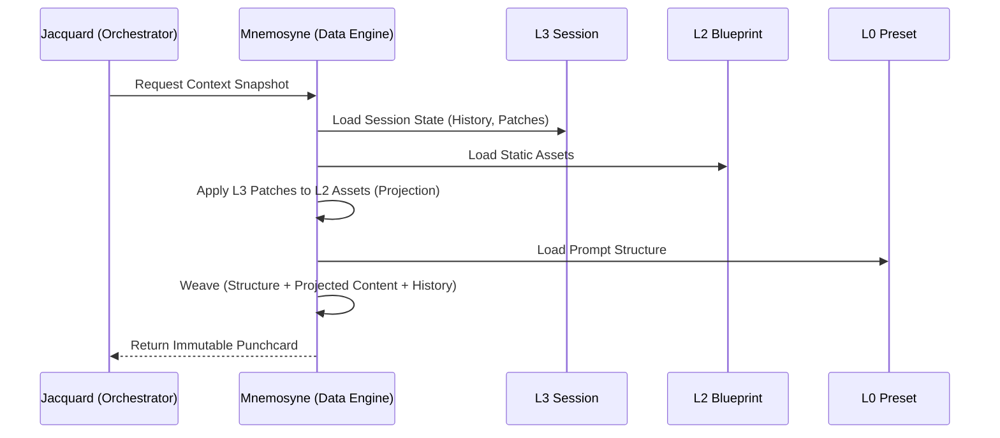

# 分层运行时环境架构 (Layered Runtime Architecture)

**版本**: 1.1.0
**日期**: 2025-12-30
**状态**: Draft
**作者**: 资深系统架构师 (Architect Mode)
**源文档**: `doc/architecture/00_architecture_panorama.md`

---

## 1. 核心设计哲学 (Core Philosophy)

为了解决传统 AI RPG 客户端（如 SillyTavern）中存在的状态混乱、设定成长与原始数据冲突、以及环境配置耦合严重的问题，Clotho 引入了 **"分层运行时环境 (Layered Runtime Architecture)"**。

这一架构借鉴了游戏引擎的 **"蓝图 (Blueprint) vs 实例 (Instance)"** 以及 Git 的 **"写时复制 (Copy-on-Write)"** 思想，将一个运行中的角色会话解构为四个物理隔离但逻辑叠加的层次。

**核心价值**:

* **动静分离**: 原始角色卡（蓝图）永远保持只读，确保可以随时重置。
* **成长性**: 角色可以在特定存档中经历性格突变，而不会污染原始设定。
* **模版独立**: Prompt 结构（如 ChatML/Alpaca）与角色内容彻底解耦。
* **平行宇宙**: 支持基于同一角色的无限分支存档。

---

## 2. 四层叠加模型 (The Layered Sandwich)

Clotho 的运行时上下文 (Runtime Context) 是由以下四层数据在内存中动态 **"编织 (Weaving)"** 而成的：

```mermaid
graph TD
    subgraph "Layer 0: Infrastructure (框架层)"
        Preset[Prompt Template / API Config]
        Note0[Read-Only: 定义对话协议与骨架]
    end

    subgraph "Layer 1: Global Context (环境层)"
        GlobalLore[通用世界书 / RPG规则]
        GlobalScript[通用正则 / UI插件]
        Persona[用户设 (Persona)]
        Note1[Read-Only: 跨角色共享，用户级配置]
    end

    subgraph "Layer 2: Character Assets (蓝图层)"
        CardMeta[CCv3 原始数据 (Name, Desc)]
        CharLore[角色专属 Lore]
        CharAssets[立绘 / 背景]
        Note2[Read-Only: 静态不可变，作为工厂蓝图]
    end

    subgraph "Layer 3: Session State (实例层)"
        History[历史记录链]
        StateTree[变量状态树 (VWD)]
        LoreStatus[世界书激活状态]
        Patches[Patch 对 L2 的动态修正]
        Note3[Read-Write: 动态可变，随存档独立]
    end

    Preset -->|Structure| Context
    GlobalLore -->|Inject| Context
    CardMeta -->|Content| Context
    History -->|State| Context
    Patches -.->|Override| CardMeta

    Context[Mnemosyne Context]
```

### 2.1 层级详解

| 层级 | 名称 | 职责 (Responsibility) | 读写权限 | 典型数据内容 |
| :--- | :--- | :--- | :--- | :--- |
| **L0** | **Infrastructure** | **骨架**：定义与 LLM 的通信协议和 Prompt 结构。 | Read-Only | Prompt Template (ChatML/Alpaca), API Settings, Tokenizer Config |
| **L1** | **Global Context** | **环境**：定义跨角色共享的世界规则与用户身份。 | Read-Only | User Persona, Global Lorebooks (D&D Rules), Global UI Scripts |
| **L2** | **Character Assets** | **蓝图**：定义角色的初始设定与固有特质。 | Read-Only | Character Card V3 Data (Name, Desc, First Mes), Base Lorebooks, Assets |
| **L3** | **Session State** | **灵魂**：记录角色的成长、记忆与状态变更。 | **Read-Write** | **Patches**, History Chain, VWD State Tree, Active Lore IDs |

---

## 3. Patching 机制 (The Patching Mechanism)

Patching 是 L3 层的核心特性，它允许运行时状态对 L2 的静态定义进行 **非破坏性修改**。这是实现“角色成长”与“平行宇宙”的核心技术基础，遵循 **"写时复制 (Copy-on-Write)"** 原则。

### 3.1 工作原理

Mnemosyne 在 **上下文加载 (Context Load)** 阶段执行一次性的 **Deep Merge (深度合并)** 操作，构建运行时的 `Projected Entity`：

1.  **Initialize (初始化)**: 加载 L2 的原始静态数据作为基底。
2.  **Hydrate (注水)**: 读取 L3 中的 `patches` 记录，将其重放应用到基底上，生成内存中的 `Projected State`。
3.  **Runtime Modification (运行时修改)**: 此后所有的属性变更（如脚本修改 `character.description`）直接作用于内存中的 `Projected State`，并同步 **Write-Back (回写)** 到 L3 的 `patches` 存储中，供下次加载使用。

`patches` 字典采用 **"路径-值"** 结构，例如：

```json
{
  "character.description": "A brave warrior who has seen many battles.",
  "character.lorebooks.town.enabled": false
}
```

### 3.2 Deep Merge 算法

Mnemosyne 的 Deep Merge 遵循以下优先级顺序：

1.  **L2 Base**: 加载 L2 的原始数据。
2.  **L3 Patches**: 遍历 L3 中的 `patches` 对象。
3.  **Merge**: 将 Patch 值覆盖到 Base 对象的对应路径上。
4.  **Conflict Resolution**: 如果同一路径存在多个 Patch（理论上不应发生，但作为防御性编程），后应用的 Patch 覆盖先前的。

```dart
// 伪代码：展示 Deep Merge 逻辑
Map<String, dynamic> applyPatches(Map<String, dynamic> base, Map<String, dynamic> patches) {
  // 1. 从 Base 创建副本 (Copy-on-Write)
  finalResult = Map<String, dynamic>.from(base);
  
  // 2. 遍历 Patches 并应用
  patches.forEach((path, value) {
    // 处理嵌套路径 "character.description"
    applyPathValue(finalResult, path.split('.'), value);
  });
  
  return finalResult;
}

void applyPathValue(Map target, List<String> pathSegments, dynamic value) {
    // 递归查找或创建路径，直到最后一个 segment，然后赋值
    // 此处省略具体递归实现细节
}
```

### 3.3 应用场景

*   **属性成长**: 角色从 level 1 升级到 level 99。L3 的 State Tree 更新，不影响 L2 的原始设定。
*   **设定重写**: 剧情导致角色从“修女”黑化为“魔女”。L3 存储一个针对 `description` 字段的 Patch，覆盖 L2 的原始描述。
*   **世界变迁**: 角色炸毁了“新手村”。L3 将 L2 中的“新手村”Lorebook 条目标记为 `enabled: false`，并新增一个 L3 独有的“废墟”条目。
*   **平行宇宙**: 基于同一 L2 创建多个 L3 实例（分支存档），每个实例拥有独立的 Patch 和 History，互不干扰。

---

## 4. 运行时数据流 (Runtime Data Flow)

当 Jacquard 发起推理请求时，数据流经各层并在 Mnemosyne 中聚合：



---

## 5. 聚合实体：Mnemosyne Context

最终传递给编排层 (Jacquard) 的是一个聚合后的上下文对象，我们称之为 **Mnemosyne Context**。

```typescript
interface MnemosyneContext {
  // Layer 0: 策略与骨架
  infrastructure: {
    preset: PromptTemplate;
    apiConfig: ApiConfiguration;
  };
  
  // Layer 1 & 2 (Projected): 静态引用的投影 (已应用 Patch)
  world: {
    character: ProjectedCharacterData; // L2 + L3 Patch
    globalLore: List<LorebookEntry>;   // L1 + L3 Status
    user: PersonaData;                 // L1
  };

  // Layer 3: 纯动态状态
  session: {
    history: List<Message>;
    stateTree: VWDStateTree;
    activeLoreIds: List<string>;
  };
}
```

---

## 6. 关联文档

* **核心架构**: [`../core/mnemosyne-data-engine.md`](../core/mnemosyne-data-engine.md)
* **工作流**: [`../workflows/character-import-migration.md`](../workflows/character-import-migration.md)
